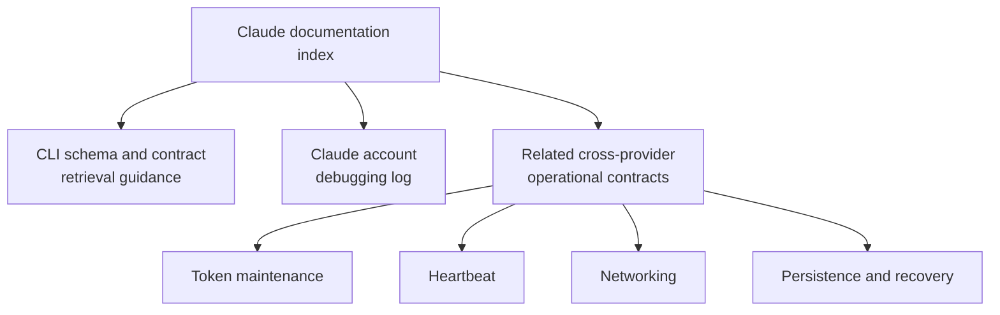

# Claude documentation

This directory contains durable Claude-specific provider research,
schema guidance, and operational debugging for Sidekick Usages.

A document belongs here when Claude Code behavior, provider contracts,
credentials, local activity data, or Claude-specific troubleshooting is its
primary subject. Cross-provider behavior remains with its owning guide and is
linked below rather than copied.

## Current documents

- [Claude Code schema and contract guide](./schema.md)
  - Status: active retrieval, validation, and ownership guidance.
  - Verified against the exact Claude Code 2.1.207 Linux x64 release on
    2026-07-12.
- [Claude account debugging](./debugging.md)
  - Status: active symptom-first operational log.
  - Covers isolated credential refresh, direct usage probes, response-header
    diagnosis, and identity-safe recovery.

## Related cross-provider documentation

- [Token maintenance](../token-maintenance.md)
- [Heartbeat](../heartbeat.md)
- [Networking](../networking.md)
- [Persistence and recovery](../persistence-and-recovery.md)

These guides remain outside this directory because their contracts apply to
multiple providers or shared infrastructure. A Claude mention alone does not
make a document Claude-owned.

## Document status

Schema and research records establish evidence, authority order, and safe
revalidation. They do not authorize runtime changes. An approved design or
implementation record must link the relevant evidence and must not silently
promote private Claude application data into a public stability contract.

Date-sensitive Claude claims require revalidation when the supported Claude
Code release changes, Anthropic publishes a new schema surface, or a consumed
provider-owned payload changes shape.

## Diagram validation

Mermaid source remains embedded in the Markdown; generated image artifacts are
not tracked. All current Claude diagrams rendered successfully with Mermaid
CLI 11.16.0 on 2026-07-12. Render every diagram after changing its source.
