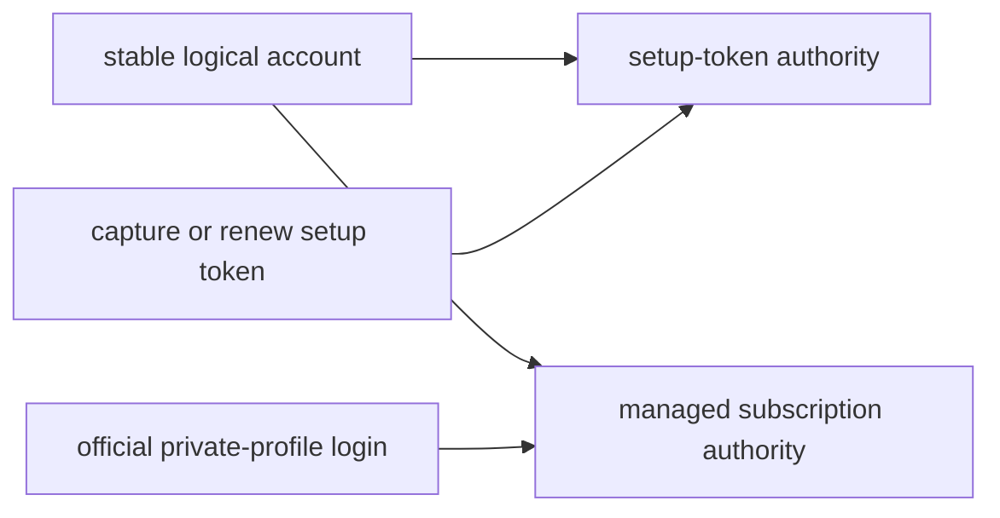

# Claude documentation

This directory owns Claude-specific credential, provider-contract, and
troubleshooting guidance. Shared scheduling, persistence, networking, and
heartbeat behavior remains in the cross-provider guides linked below.

## Credential authorities

One logical Claude account can hold two independent authorities. The
setup-token authority and subscription authority keep separate lifetimes and
usage routes; adding or renewing one never replaces the other.

| Mode | Saved contract | Usage route | Rotation |
| --- | --- | --- | --- |
| setup-token credential | One protected access credential captured from `claude setup-token` | Tiny `/v1/messages` request and rate-limit headers | Manual replacement only |
| subscription-login credential | Sanitized metadata for one official login in the account's stable private profile; legacy stored refresh authority is migration input only | `/api/oauth/usage` | Serialized official provider refresh |

A setup token is documented by Anthropic as a one-year automation credential,
but its value does not encode the creation time. Sidekick records the capture
or renewal time when it owns that event. A preexisting token lacking
trusted capture evidence keeps unknown expiry rather than receiving an
invented date.

Create, attach, or renew a setup-token authority explicitly:

```bash
sidekick-usages claude setup-token --label <label>
sidekick-usages claude setup-token --label <label> --force
```

Migrate an existing saved subscription label into its private profile:

```bash
sidekick-usages refresh <label>
```

`sidekick-usages refresh <label>` never imports or changes the native Claude
login. A setup-token-only account requires `--replace-identity` once to approve
its first subscription identity association; the setup token remains attached.
An established subscription identity must match on later repair.

## Lifetime model

Subscription logins have independent lifetimes:

- access-token expiry controls when Sidekick rotates the short-lived access
  credential; and
- login expiry describes the saved refresh credential's usable lifetime.

When a known login expiry is at or inside five days, `doctor` and maintenance
report a login-renewal action. The warning is derived from current credentials;
it is not persisted as a failed refresh. An expired login fails closed before
provider traffic. Unknown login expiry remains unknown, and setup tokens do
not receive a login-renewal warning.

## Current documents

- [Claude Code schema and contract guide](./schema.md) records exact release
  identity, observed credential fields, public authority, and reproducible
  revalidation.
- [Claude account debugging](./debugging.md) maps secret-safe symptoms to one
  cause and one credential-mode-appropriate recovery action.

## Related cross-provider documentation

- [Token maintenance](../token-maintenance.md)
- [Heartbeat](../heartbeat.md)
- [Networking](../networking.md)
- [Persistence and recovery](../persistence-and-recovery.md)

Date-sensitive Claude claims must be revalidated when the supported Claude
Code release or a consumed provider payload changes. Provider observations do
not authorize copying Claude implementation source, credentials, transcripts,
or local application state into the repository.


