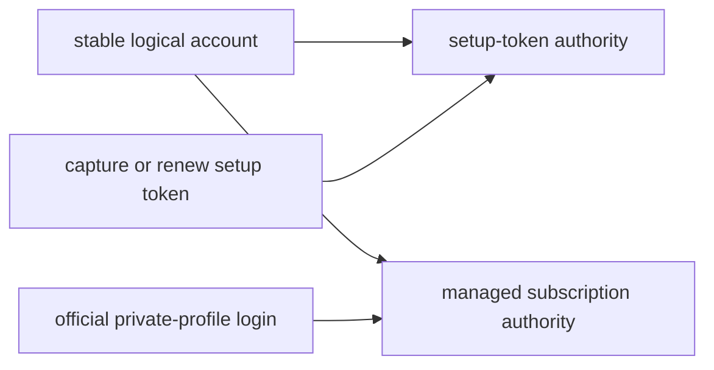

# Claude documentation

This directory owns Claude-specific credential, provider-contract, and
troubleshooting guidance. Shared scheduling, persistence, networking, and
heartbeat behavior remains in the cross-provider guides linked below.

## Credential authorities

One logical Claude account can hold two independent authorities. The
setup-token authority and subscription authority keep separate lifetimes and
usage routes; adding or renewing one never replaces the other.

| Mode | Saved contract | Usage route | Rotation |
| --- | --- | --- | --- |
| setup-token credential | One protected access credential captured from `claude setup-token` | Tiny `/v1/messages` request and rate-limit headers | Manual replacement only |
| subscription-login credential | Sanitized metadata for one official login in the account's stable private profile; legacy stored refresh authority is migration input only | `/api/oauth/usage` | Serialized official provider refresh |

Sidekick never calls Claude's OAuth refresh endpoint directly. Official Claude
owns every subscription credential write. Background maintenance keeps each
account's private profile fresh. For the selected account it independently
verifies and refreshes the same identity in native Claude without switching
accounts. Runtime usage and heartbeat open that verified native authority for
the selected account and a private authority for each inactive account.

A setup token is documented by Anthropic as a one-year automation credential,
but its value does not encode the creation time. Sidekick records the capture
or renewal time when it owns that event. A preexisting token lacking
trusted capture evidence keeps unknown expiry rather than receiving an
invented date.

Create, attach, or renew a setup-token authority explicitly:

```bash
sidekick-usages claude setup-token --label <label>
sidekick-usages claude setup-token --label <label> --force
```

Migrate an existing saved subscription label into its private profile:

```bash
sidekick-usages refresh <label>
```

`sidekick-usages refresh <label>` never imports or changes the native Claude
login. A setup-token-only account requires `--replace-identity` once to approve
its first subscription identity association; the setup token remains attached.
An established subscription identity must match on later repair.

## Runtime account selection

Refreshable Claude selection uses the official native login transaction.
Already-open native Claude sessions keep an in-flight request on its admitted
authority and reread the proven native authority for the next request. An
ordinary open Claude terminal is not a disconnect conflict, and Sidekick does
not restart or signal it.

The normal `sidekick-usages` dashboard cursor and Enter key are the canonical
selection surface. `sidekick-usages use` exposes the same coordinator only as
a secondary scripting command. A setup-only target requires at least one
Sidekick-owned structured Claude participant qualified for the exact installed
build. With no qualified participant, selection returns a visible typed
refusal and leaves the previous account usable.

Mixed refreshable selection first completes and proves the official native
activation. It then installs a bounded access lease from that exact committed
authority into each integrated participant. The coordinator waits for active
turns, retries, background work, tools, hooks, permission or dialog requests,
MCP operations, and terminal children to finish naturally. A prompt submitted
at the boundary remains queued and is sent once after readiness. The same
Claude engine PID and conversation continue throughout.

A setup token remains inference-only and is never presented as a refreshable
native login. Sidekick never restarts Claude, rewrites another process's
environment, or claims that an unmanaged process converged. Shell forwarding
enrolls only future launches from newly loaded shells after the exact
installed-release cutover; it never retrofits or kills an existing unmanaged
session. Use `sidekick-usages doctor --provider claude` for redacted
capability and participant state.

This is the current feature-branch target, not a claim about the installed
release. Current-user, current-machine enablement requires exact-build runtime
qualification. General public distribution remains gated by Anthropic product
and legal clarification.

## Lifetime model

Subscription logins have independent lifetimes:

- access-token expiry controls when Sidekick rotates the short-lived access
  credential; and
- login expiry describes the saved refresh credential's usable lifetime.

When a known login expiry is at or inside five days, `doctor` and maintenance
report a login-renewal action. The warning is derived from current credentials;
it is not persisted as a failed refresh. An expired login fails closed before
provider traffic. Unknown login expiry remains unknown, and setup tokens do
not receive a login-renewal warning.

## Current documents

- [Claude Code schema and contract guide](./schema.md) records exact release
  identity, observed credential fields, public authority, and reproducible
  revalidation.
- [Claude account debugging](./debugging.md) maps secret-safe symptoms to one
  cause and one credential-mode-appropriate recovery action.

## Related cross-provider documentation

- [Token maintenance](../token-maintenance.md)
- [Heartbeat](../heartbeat.md)
- [Networking](../networking.md)
- [Persistence and recovery](../persistence-and-recovery.md)

Date-sensitive Claude claims must be revalidated when the supported Claude
Code release or a consumed provider payload changes. Provider observations do
not authorize copying Claude implementation source, credentials, transcripts,
or local application state into the repository.


