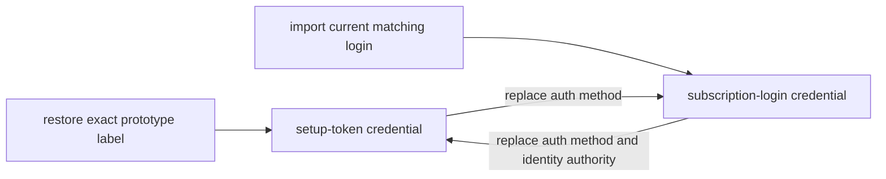

# Claude documentation

This directory owns Claude-specific credential, provider-contract, and
troubleshooting guidance. Shared scheduling, persistence, networking, and
heartbeat behavior remains in the cross-provider guides linked below.

## Credential modes

Sidekick stores two closed Claude credential variants. They are different
authentication methods, not one record whose meaning is inferred from missing
fields.

| Mode | Saved contract | Usage route | Rotation |
| --- | --- | --- | --- |
| setup-token credential | One access credential captured from `claude setup-token` | Tiny `/v1/messages` request and rate-limit headers | Manual replacement only |
| subscription-login credential | Access credential, refresh credential, known access expiry, login scopes, and provider metadata when available | `/api/oauth/usage` | Serialized saved-account refresh |

A setup token is documented by Anthropic as a one-year automation credential,
but its value does not encode the creation time.
The issue date cannot be recovered from the token. Sidekick therefore reports
its expiry as unknown
instead of inventing a date.

Create or replace a setup-token credential explicitly:

```bash
sidekick-usages claude setup-token --label <label>
sidekick-usages claude setup-token --label <label> --force
```

Import a current subscription login into a new label:

```bash
claude auth login
sidekick-usages add claude --label <label>
```

`sidekick-usages refresh <label>` is a local-login import command for a
subscription-login label. It is not a general repair command for every Claude
credential. Changing authentication method requires
`--replace-auth-method`; changing a known or unprovable identity requires
`--replace-identity`. When both change, both authorizations are required.

An import-only prototype may still contain an earlier setup token for one
label. Restore only that exact record through the transactional command:

```bash
sidekick-usages claude restore-setup-token <label>
sidekick-usages claude restore-setup-token <label> --yes
```

The restore reads but does not modify the prototype, replaces only the named
current Claude credential, preserves unrelated accounts, and makes no provider
request.

## Lifetime model

Subscription logins have independent lifetimes:

- access-token expiry controls when Sidekick rotates the short-lived access
  credential; and
- login expiry describes the saved refresh credential's usable lifetime.

When a known login expiry is at or inside five days, `doctor` and maintenance
report a login-renewal action. The warning is derived from current credentials;
it is not persisted as a failed refresh. An expired login fails closed before
provider traffic. Unknown login expiry remains unknown, and setup tokens do
not receive a login-renewal warning.

## Current documents

- [Claude Code schema and contract guide](./schema.md) records exact release
  identity, observed credential fields, public authority, and reproducible
  revalidation.
- [Claude account debugging](./debugging.md) maps secret-safe symptoms to one
  cause and one credential-mode-appropriate recovery action.

## Related cross-provider documentation

- [Token maintenance](../token-maintenance.md)
- [Heartbeat](../heartbeat.md)
- [Networking](../networking.md)
- [Persistence and recovery](../persistence-and-recovery.md)

Date-sensitive Claude claims must be revalidated when the supported Claude
Code release or a consumed provider payload changes. Provider observations do
not authorize copying Claude implementation source, credentials, transcripts,
or local application state into the repository.


