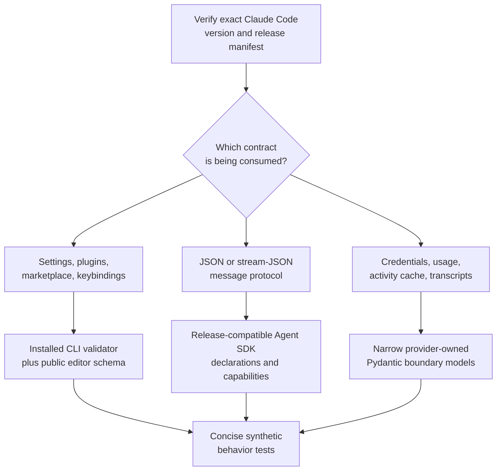

# Claude Code Schema and Contract Guide

- **Status:** Active schema retrieval and validation guidance
- **Last verified:** 2026-07-13
- **Claude Code release:** `2.1.207`
- **Release build commit:**
  `bc512d56332530b2be3f5079e29ec17aa20b8553`
- **Public release tag commit:**
  `d4d8fbbb333c627d8fe2c1c583a5ccc26fdb1aed`
- **Verified Linux x64 SHA-256:**
  `85e7e988a392d859f90802ca21fb26e89d3c9ab527f5ed0b08df3955e34d5c83`
- **Sidekick evidence commit:**
  `15cef27bf91029f911d87597efca9e410b3a67fd`
- **Production impact:** None; this guide adds no runtime dependency

This guide tells maintainers and AI agents where Claude Code's different
machine contracts live, how to verify an installed release, how to retrieve
public schemas without committing upstream payloads, and how to handle private
Claude application data that has no published schema.

Claude Code does not expose one universal, version-pinned schema generator.
Settings, plugins, keybindings, headless messages, hooks, credentials, usage
responses, and local activity files have different authorities. Treating them
as one schema would be inaccurate.

## Table of Contents

1. [Decision Summary](#decision-summary)
2. [What “Schema” Means Here](#what-schema-means-here)
3. [Authority Map](#authority-map)
4. [Exact Release Identity](#exact-release-identity)
5. [Verify an Installed Binary](#verify-an-installed-binary)
   1. [POSIX Shell](#posix-shell)
   2. [PowerShell](#powershell)
6. [Published JSON Schemas](#published-json-schemas)
   1. [Observed Manifest](#observed-manifest)
   2. [Retrieve on POSIX](#retrieve-on-posix)
   3. [Retrieve on PowerShell](#retrieve-on-powershell)
   4. [Pin the Schema Source](#pin-the-schema-source)
   5. [Compare Semantically](#compare-semantically)
7. [Installed Runtime Validators](#installed-runtime-validators)
8. [Caller-Supplied Structured Output](#caller-supplied-structured-output)
9. [Headless JSON and Stream Protocol](#headless-json-and-stream-protocol)
   1. [Retrieve Compatible Agent SDK Types](#retrieve-compatible-agent-sdk-types)
10. [Hook Event Contracts](#hook-event-contracts)
11. [Provider-Owned Local State](#provider-owned-local-state)
12. [Credential Fields Observed in 2.1.207](#credential-fields-observed-in-21207)
13. [Sidekick Production Boundary](#sidekick-production-boundary)
14. [Build-Versus-Adopt Decision](#build-versus-adopt-decision)
15. [Agent Instructions](#agent-instructions)
16. [When a Schema Subset May Be Tracked](#when-a-schema-subset-may-be-tracked)
17. [Revalidation Triggers](#revalidation-triggers)
18. [Primary Sources](#primary-sources)

## Decision Summary

Track this authority, retrieval, and validation guide. Do not currently track:

- the complete settings schema;
- the complete plugin or marketplace schemas;
- the complete keybindings schema;
- Agent SDK declaration packages;
- a Claude Code binary or npm distribution;
- extracted or reverse-engineered bundled implementation source;
- real credentials, transcripts, caches, or application state; or
- generated models for Claude formats Sidekick does not consume.

The intended workflow is:



The public schemas are authoring aids and reproducible evidence. Sidekick's
narrow Claude provider models remain the production boundary for private
payloads.

## What “Schema” Means Here

Claude Code exposes several different kinds of contract:

| Contract kind | Example | Representation |
| --- | --- | --- |
| Public file schema | `.claude/settings.json` | JSON Schema draft-07 |
| Runtime validator | `claude plugin validate --strict` | Installed executable behavior |
| Caller output schema | `--json-schema` | User-supplied JSON Schema |
| Headless message protocol | `--output-format stream-json` | Agent SDK TypeScript union |
| Hook event contract | `PreToolUse` input | Per-event documentation and SDK types |
| Private provider state | `stats-cache.json` | No complete published schema |

`--json-schema` is not a command for exporting Claude Code's own schema. It
asks the model workflow to return a final value matching a caller-provided
shape. The surrounding CLI result has its own fields.

Likewise, the release manifest's `sdkCompat.harnessSchema` value is not a full
JSON Schema for every CLI message or local file. It is one compatibility
marker in the Agent SDK harness metadata.

## Authority Map

Use the highest applicable authority for the exact surface:

| Surface | Primary authority | Secondary evidence |
| --- | --- | --- |
| Installed binary identity | Versioned Anthropic release manifest | `claude doctor`, local hash and size |
| Settings authoring | Anthropic settings docs and SchemaStore | Installed `doctor` diagnostics |
| Plugin and marketplace authoring | Anthropic references and SchemaStore | `plugin validate --strict` |
| Keybindings authoring | Anthropic keybindings docs and SchemaStore | Load-time warnings and debug log |
| Headless JSON messages | Exact compatible Agent SDK declarations | Headless docs and capability field |
| Hook JSON input/output | Anthropic hooks reference | Agent SDK hook types |
| Credentials and refresh payloads | Narrow Sidekick provider models | Isolated exact-runtime observations |
| Usage response and headers | Narrow Sidekick provider models | Provider response and official behavior docs |
| Activity cache and transcripts | Narrow Sidekick provider models | `.claude` application-data docs |

Do not use an unqualified “latest” schema to make a release-specific claim.
Record the CLI version, release-manifest URL, retrieval date, source commit,
and schema or type artifact selected.

## Exact Release Identity

The verified release has three related identifiers:

| Identifier | Value | Meaning |
| --- | --- | --- |
| Release version | `2.1.207` | User-facing CLI version |
| Build commit | `bc512d56332530b2be3f5079e29ec17aa20b8553` | Native build identity in the manifest |
| Public tag commit | `d4d8fbbb333c627d8fe2c1c583a5ccc26fdb1aed` | Public release repository state |

The public tag and build commit are intentionally recorded separately. The
public repository contains release materials, examples, plugins, and issue
automation, but not the native CLI's complete runtime source. Do not cite the
public tag as line-level source for private binary behavior.

Anthropic's versioned manifest records:

```text
version: 2.1.207
build date: 2026-07-10T21:39:38Z
platform: linux-x64
binary size: 259,402,552 bytes
binary SHA-256: 85e7e988a392d859f90802ca21fb26e89d3c9ab527f5ed0b08df3955e34d5c83
Agent SDK harness schema: 1
highest listed tested wrapper: 0.3.205
```

The platform-specific size and digest differ on macOS, Windows, ARM64, and
musl builds. Always compare the current machine against its own manifest entry.

## Verify an Installed Binary

Verification is read-only. It must not invoke login, copy credential files, or
run a model request.

### POSIX Shell

```bash
version="$(claude --version | awk '{print $1}')"
manifest_url="https://downloads.claude.ai/claude-code-releases/${version}/manifest.json"

claude --version
claude doctor
curl -fsSL "$manifest_url" | jq '{
  version,
  commit,
  buildDate,
  sdkCompat,
  platforms
}'
```

Use the executable path printed by `claude doctor`, not an assumed symlink
target. On Linux:

```bash
binary="<Path reported by claude doctor>"
stat --printf='size=%s bytes\n' "$binary"
sha256sum "$binary"
```

On macOS:

```bash
binary="<Path reported by claude doctor>"
stat -f 'size=%z bytes' "$binary"
shasum -a 256 "$binary"
```

Compare both values with the correct platform entry in the manifest.

### PowerShell

```powershell
$Version = ((claude --version) -split " ")[0]
$ManifestUrl = `
  "https://downloads.claude.ai/claude-code-releases/$Version/manifest.json"
$Manifest = Invoke-RestMethod -Uri $ManifestUrl

claude --version
claude doctor
$Manifest | ConvertTo-Json -Depth 8
```

Use the path reported by `claude doctor`:

```powershell
$Binary = "<Path reported by claude doctor>"
(Get-Item $Binary).Length
Get-FileHash -Path $Binary -Algorithm SHA256
```

Do not hash only a launcher script or PATH shim when `doctor` reports a
different native executable.

## Published JSON Schemas

SchemaStore currently registers four Claude Code file schemas:

- `https://json.schemastore.org/claude-code-settings.json`
- `https://json.schemastore.org/claude-code-plugin-manifest.json`
- `https://json.schemastore.org/claude-code-marketplace.json`
- `https://www.schemastore.org/claude-code-keybindings.json`

All four use JSON Schema draft-07. Anthropic's settings documentation calls
the settings URL the official schema, while explicitly warning that it is
updated periodically and can lag new CLI fields. Plugin and keybindings docs
also link their SchemaStore documents. The marketplace reference documents the
complete format, and SchemaStore registers its editor schema.

The accurate description is: Anthropic-endorsed public schemas distributed
through SchemaStore. They are not a release-pinned schema endpoint generated
by the installed binary.

### Observed Manifest

These raw values were captured on 2026-07-12:

| Schema | Bytes | Top properties | Required | SHA-256 |
| --- | ---: | ---: | --- | --- |
| Settings | 190,149 | 125 | None | `2b4004b2af619ce16bd6dafc0a8f1f03974f45740f4212a1f85f236364057d28` |
| Plugin manifest | 70,423 | 22 | `name` | `3f69938d71a47a72fa60050b2050dd620054708911defc1c1dcd7188dcb169f5` |
| Marketplace | 88,719 | 9 | `name`, `owner`, `plugins` | `42c3f80413638e93a420256d942f409104b651379b9ac2451cc636f581de2ffc` |
| Keybindings | 6,255 | 3 | `bindings` | `db32046cab25126331c6116ec790ab5944a8e4fba663dd0fd1e94cdceefa77b1` |

The settings and keybindings source was last synchronized to Claude Code
2.1.195 at SchemaStore commit
`cfd4af80100400941fdc66787e24e6a2eed7348a`. The plugin and marketplace
schemas were generated from canonical Zod definitions at commit
`d6c59e8a9b85aa0bd5f8cad136c68e81d267fd70`.

These digests describe floating responses at one date. They are not Claude
2.1.207 release digests.

### Retrieve on POSIX

Download into a new temporary directory, not this repository, Claude's config
directory, or Sidekick application data:

```bash
schema_root="$(mktemp -d)"
trap 'rm -rf "$schema_root"' EXIT

curl -fsSL \
  https://json.schemastore.org/claude-code-settings.json \
  -o "$schema_root/settings.json"
curl -fsSL \
  https://json.schemastore.org/claude-code-plugin-manifest.json \
  -o "$schema_root/plugin-manifest.json"
curl -fsSL \
  https://json.schemastore.org/claude-code-marketplace.json \
  -o "$schema_root/marketplace.json"
curl -fsSL \
  https://www.schemastore.org/claude-code-keybindings.json \
  -o "$schema_root/keybindings.json"

for schema in "$schema_root"/*.json; do
  jq -e 'type == "object" and ."$schema" != null' "$schema" >/dev/null
done

wc -c "$schema_root"/*.json
sha256sum "$schema_root"/*.json
```

### Retrieve on PowerShell

```powershell
$SchemaRoot = Join-Path `
  ([System.IO.Path]::GetTempPath()) `
  ([guid]::NewGuid().ToString())
New-Item -ItemType Directory -Path $SchemaRoot | Out-Null

$Schemas = @{
  "settings.json" =
    "https://json.schemastore.org/claude-code-settings.json"
  "plugin-manifest.json" =
    "https://json.schemastore.org/claude-code-plugin-manifest.json"
  "marketplace.json" =
    "https://json.schemastore.org/claude-code-marketplace.json"
  "keybindings.json" =
    "https://www.schemastore.org/claude-code-keybindings.json"
}

foreach ($Entry in $Schemas.GetEnumerator()) {
  $Destination = Join-Path $SchemaRoot $Entry.Key
  Invoke-WebRequest -Uri $Entry.Value -OutFile $Destination
}

Get-ChildItem $SchemaRoot -Filter *.json |
  ForEach-Object {
    Get-Content $_.FullName -Raw | ConvertFrom-Json | Out-Null
    Get-FileHash $_.FullName -Algorithm SHA256
  }
```

Remove the temporary directory after the comparison. Do not promote these
downloads into tracked project files without the approval gate below.

### Pin the Schema Source

For a reproducible investigation, resolve the floating schema to its latest
SchemaStore source commit:

```bash
for name in \
  claude-code-settings \
  claude-code-plugin-manifest \
  claude-code-marketplace \
  claude-code-keybindings
do
  path="src/schemas/json/${name}.json"
  curl -fsSL \
    "https://api.github.com/repos/SchemaStore/schemastore/commits?path=${path}&per_page=1" \
    | jq '.[0] | {sha, date: .commit.author.date, url: .html_url}'
done
```

Then inspect the immutable source at:

```text
https://github.com/SchemaStore/schemastore/blob/<commit>/src/schemas/json/<name>.json
```

Record:

```text
Claude Code version
Release-manifest URL and build commit
Schema retrieval date
Floating schema URL
SchemaStore source commit
Raw byte count and SHA-256
Semantic digest, if comparing two snapshots
```

### Compare Semantically

Raw schema hashes change with formatting and object-key order. When deciding
whether a contract changed, canonicalize JSON first:

```bash
jq -S . old-schema.json >old-schema.canonical.json
jq -S . new-schema.json >new-schema.canonical.json

sha256sum old-schema.canonical.json new-schema.canonical.json
diff -u old-schema.canonical.json new-schema.canonical.json
```

Keep raw and semantic comparisons distinct. A raw mismatch is not by itself a
protocol change, and a semantic match does not prove runtime parity.

## Installed Runtime Validators

### Settings

Run from the project whose settings should be inspected:

```bash
claude doctor
```

`doctor` is read-only and reports settings parse or validation errors with
field paths. An isolated 2.1.207 probe showed that it can return exit status 0
while reporting invalid settings. Do not treat its exit status alone as a CI
validation contract.

The need for runtime validation is concrete. The retrieved settings schema
lists `delegate` under `permissions.defaultMode`, but a normal isolated
2.1.207 `doctor` rejected that value and accepted only:

```text
acceptEdits
auto
bypassPermissions
default
dontAsk
plan
```

Do not infer why the mismatch exists. The supported conclusion is only that
the floating editor schema and exact runtime can diverge.

### Plugin and marketplace manifests

Use strict validation in CI or release preparation:

```bash
claude plugin validate --strict ./path/to/plugin
claude plugin validate --strict ./path/to/marketplace
```

The exact 2.1.207 validator:

- exits 1 on field type errors;
- reports unknown near-match fields as warnings with suggestions;
- makes warnings fatal under `--strict`; and
- exits 0 for complete synthetic plugin and marketplace fixtures.

This validator is stronger for installed-release compatibility than an editor
schema alone.

### Keybindings

Claude Code validates `keybindings.json` when it loads and reports parse,
context, reserved-shortcut, terminal-conflict, and duplicate-binding warnings.
Use the public schema for editor validation and `--debug` when investigating
runtime warnings. No dedicated non-interactive keybindings validation command
is documented in 2.1.207.

## Caller-Supplied Structured Output

This command asks Claude to return one caller-defined value:

```bash
claude -p \
  --output-format json \
  --json-schema '{
    "type": "object",
    "properties": {
      "functions": {
        "type": "array",
        "items": {"type": "string"}
      }
    },
    "required": ["functions"]
  }' \
  "Extract the main function names from auth.py"
```

The response still has Claude Code's normal metadata envelope. The requested
value appears in `structured_output`.

In 2.1.207, preflight rejects these cases before a model request:

| Input | Diagnostic class | Exit |
| --- | --- | ---: |
| Malformed JSON | Not valid JSON | 1 |
| JSON array | Must be a JSON object | 1 |
| Invalid schema object | Not a valid JSON Schema | 1 |

Since 2.1.205, invalid schemas fail instead of silently returning unstructured
text. The `format` keyword is accepted as an annotation and is not enforced by
the client.

Never describe `--json-schema` as a CLI schema-export mechanism.

## Headless JSON and Stream Protocol

Print mode supports:

- `text`: plain output;
- `json`: one final result envelope; and
- `stream-json`: newline-delimited protocol messages.

The public TypeScript Agent SDK declares the stream as an `SDKMessage` union.
The exact 0.3.205 declarations include:

- assistant and user messages;
- partial `stream_event` messages;
- success and error result messages;
- `structured_output` on successful results;
- `system/init` and protocol capabilities;
- API retry and rate-limit events;
- hook lifecycle events;
- plugin install events;
- background task and permission events; and
- an auto-generated `Settings` interface.

The union evolves. The initialization event's optional `capabilities` array is
an open set. Feature-detect exact capabilities and ignore unknown values.

### Retrieve Compatible Agent SDK Types

Do not assume the latest Agent SDK matches the installed CLI. Read the tested
wrapper list from that CLI release's manifest.

On POSIX:

```bash
version="$(claude --version | awk '{print $1}')"
manifest_url="https://downloads.claude.ai/claude-code-releases/${version}/manifest.json"
sdk_version="$(curl -fsSL "$manifest_url" | jq -r '
  .sdkCompat.testedWrapperVersions
  | map(split(".") | map(tonumber))
  | max
  | join(".")
')"
tarball="$(npm view \
  "@anthropic-ai/claude-agent-sdk@${sdk_version}" \
  dist.tarball)"

printf 'Claude %s tested Agent SDK %s\n' "$version" "$sdk_version"
curl -fsSL "$tarball" | tar -xOzf - package/sdk.d.ts | less
```

On PowerShell:

```powershell
$Version = ((claude --version) -split " ")[0]
$ManifestUrl = `
  "https://downloads.claude.ai/claude-code-releases/$Version/manifest.json"
$Manifest = Invoke-RestMethod -Uri $ManifestUrl
$SdkVersion = $Manifest.sdkCompat.testedWrapperVersions |
  Sort-Object { [version]$_ } |
  Select-Object -Last 1
$Tarball = npm view `
  "@anthropic-ai/claude-agent-sdk@$SdkVersion" `
  dist.tarball
$Archive = Join-Path `
  ([System.IO.Path]::GetTempPath()) `
  "claude-agent-sdk-$SdkVersion.tgz"

Invoke-WebRequest -Uri $Tarball -OutFile $Archive
tar -xOf $Archive package/sdk.d.ts | more
```

Inspect declarations from the package; do not copy the whole package or type
file into this repository unless an approved build consumes it.

If Sidekick later consumes this protocol, model only the message variants it
uses, bound every line and total stream size, and handle unknown discriminators
explicitly. That requires a separate architecture decision.

## Hook Event Contracts

The [hooks reference](https://code.claude.com/docs/en/hooks) is the public
contract for command and HTTP hook JSON. It documents:

- common input fields;
- every event's additional input fields;
- universal output fields;
- event-specific decision control;
- exit-code behavior;
- HTTP status and body behavior; and
- prompt and agent hook response shapes.

Hook configuration is represented inside the settings and plugin schemas, but
runtime event payloads are documented per event. No downloadable aggregate
hook-event JSON Schema was found in the current documentation index,
SchemaStore catalog, installed help, or binary schema-export surface.

Do not generate and publish an inferred aggregate schema from examples. If
Sidekick consumes one hook event, model that event's documented fields at the
owning boundary and test its actual behavior.

## Provider-Owned Local State

Anthropic documents the location and purpose of its application data, but does
not publish complete JSON Schemas for the secret-bearing or runtime-generated
files Sidekick reads.

| Surface | Public coverage | Sidekick handling |
| --- | --- | --- |
| Claude credential envelope | No complete schema | Strict narrow credential model; never log values |
| Official login result | No credential response schema | Re-read and verify the protected credential envelope |
| OAuth usage response | No Claude Code schema | Strict narrow usage-window model |
| Unified rate-limit headers | HTTP fields, not JSON Schema | Strict header parser |
| `stats-cache.json` | Purpose and retention documented | Read-only narrow activity-cache model |
| Transcript JSONL | Purpose and retention documented | Read-only assistant-usage record model |
| `~/.claude.json` | Purpose partially documented | Not an activity schema; do not adopt wholesale |

Official application-data documentation says:

- transcripts contain messages, tool calls, and tool results;
- `stats-cache.json` contains the aggregate shown by `/usage`;
- transcripts are plaintext and can contain sensitive data; and
- `CLAUDE_CONFIG_DIR` relocates the documented Claude directory.

Current read-only research observed `stats-cache.json` version 4. A sampled
transcript record was written by an older Claude release than the installed
binary, proving that one local corpus can span versions. These observations
are evidence for narrow compatibility handling, not a public schema promise.

Never:

- commit a real credential envelope;
- commit a real transcript or stats cache as a fixture;
- copy token values into research output;
- normalize or rewrite Claude-owned activity files;
- assume every transcript record came from the current CLI; or
- replace a validation failure with a plausible default.

Use synthetic records containing only the fields needed by the behavior under
test.

## Credential Fields Observed in 2.1.207

The exact installed Claude Code 2.1.207 credential envelope uses the root
member `claudeAiOauth`. The following field names are version-pinned runtime
observations, not a claim that Anthropic publishes a complete credential-file
schema:

| Field | Observed shape | Sidekick contract |
| --- | --- | --- |
| `accessToken` | Non-empty string | Required for a subscription-login credential; value remains secret |
| `refreshToken` | Non-empty string | Required for a subscription-login credential; value remains secret |
| `expiresAt` | Nonnegative integer milliseconds from the Unix epoch | Required and normalized to aware UTC access-token expiry |
| `refreshTokenExpiresAt` | Nonnegative integer milliseconds from the Unix epoch; field may be absent | Known login expiry when present; unknown when absent; explicit null is malformed |
| `scopes` | Nonempty unique string array containing `user:profile` | Required login capabilities; not used to infer setup-token mode |
| `subscriptionType` | Bounded string; field may be absent | Display plan when present |
| `rateLimitTier` | Bounded provider string; field may be absent | Observed but not consumed or persisted by Sidekick |
| `tokenAccount.accountUuid` | Bounded string; field may be absent | Stable identity only when both identity members are present |
| `tokenAccount.organizationUuid` | Bounded string; field may be absent | Stable identity only when both identity members are present |

The observed refresh response uses `access_token` and `expires_in`, and may
also return `refresh_token` and `refresh_token_expires_in`. The relative
durations are nonnegative integer seconds. When the response omits the refresh
credential or its lifetime, Sidekick preserves the previously proven value;
present null or malformed values fail closed.

`rateLimitTier` is intentionally listed even though production ignores it.
This separates the exact observed provider surface from the smaller set the
application consumes.

### Revalidate the credential field set

Revalidation is read-only unless an operator separately authorizes an isolated
login. Do not copy extracted provider source, a credential envelope, or raw
binary strings into the repository.

To revalidate the field set, verify the exact release before inspecting the
closed key-name list or running synthetic boundary tests.

On POSIX, reuse the exact doctor/manifest-qualified `binary` value verified
above, then perform a bounded key-name check against that exact executable:

```bash
# Reuse the exact `binary` value verified above.
test -x "$binary"
strings "$binary" \
  | rg -o 'accessToken|refreshToken|expiresAt|refreshTokenExpiresAt|scopes|subscriptionType|rateLimitTier|tokenAccount|accountUuid|organizationUuid|refresh_token_expires_in' \
  | sort -u
```

On PowerShell, use the verified executable path and an installed `strings`
equivalent, pipe only the same closed key-name expression to `rg -o`, and sort
the unique result. Treat this as corroboration, not schema authority.

Then run the synthetic provider-boundary contract:

```bash
uv run pytest \
  tests/test_claude_credential_modes.py \
  tests/test_claude_provider_boundaries.py \
  tests/test_claude_refresh.py -q
```

If an exact runtime shape must be confirmed, use a disposable isolated Claude
home only after explicit authorization. Record only the version, field names,
primitive types, and whether a field was absent. Destroy the temporary secret
state after review. Never print or persist values, never use the active Claude
home, and never promote private binary implementation details into a public
stability promise.

## Sidekick Production Boundary

The current implementation has two cohesive Claude schema owners:

- [`providers/claude/schema/credentials.py`](../../src/sidekick_usages/providers/claude/schema/credentials.py)
  owns strict credential-envelope, token-account, setup-token, and refresh
  response validation plus expiry normalization.
- [`providers/claude/schema/usage.py`](../../src/sidekick_usages/providers/claude/schema/usage.py)
  owns strict usage, header, activity-cache, and transcript-record validation.
- [`providers/claude/activity.py`](../../src/sidekick_usages/providers/claude/activity.py)
  owns read-only Claude config discovery, bounded file traversal, cache reads,
  live transcript aggregation, and typed failures.
- [`serialization/`](../../src/sidekick_usages/serialization/)
  owns bounded strict JSON decoding without knowing Claude fields.

Do not create a global schema registry or move Claude models into `core/`.
`core/` must remain infrastructure-free and provider-neutral.

When a private Claude shape changes:

1. Reproduce the failure against the exact release.
2. Confirm that no public contract covers the field.
3. Inspect only the necessary key names and primitive types.
4. Update the narrow model in the owning Claude schema module.
5. Preserve missing, malformed, incomplete, and unreadable distinctions.
6. Add the fewest load-bearing synthetic tests.
7. Never weaken validation merely to accept one local payload.

## Build-Versus-Adopt Decision

| Need | Decision | Reason |
| --- | --- | --- |
| Verify binary identity | Adopt Anthropic release manifest | Exact platform digest and size |
| Edit public Claude config | Adopt SchemaStore and official docs | Existing maintained authoring contract |
| Validate plugin releases | Adopt installed strict validator | Exact runtime behavior and exit status |
| Consume headless messages | Adopt exact compatible SDK types | Versioned official discriminated union |
| Parse private local state | Build narrow Pydantic models | No published complete schema exists |
| Validate JSON in Sidekick | Reuse Pydantic and serialization | Already approved and production-owned |
| Reverse engineer the native binary | Do not adopt | Private implementation is not a stability contract |
| Add another JSON Schema library | Do not adopt now | No production call site |

No new dependency is justified.

This is not reinvention of a published provider model. The local models cover
only undocumented fields Sidekick must consume and enforce Sidekick's bounds,
error vocabulary, and secret-safety requirements.

## Agent Instructions

Every future Claude schema investigation must follow these rules:

1. Read this guide before inspecting Claude files or adding a model.
2. Record the exact `claude --version` output.
3. Verify the native binary against its versioned official manifest.
4. Name the exact contract under investigation; never say only “Claude
   schema.”
5. Search the current official documentation index before relying on memory.
6. Check SchemaStore only for user-authored files it actually registers.
7. Use an installed runtime validator where one exists.
8. Select Agent SDK types only from a wrapper version listed as tested by the
   release manifest.
9. Treat public schema acceptance as editor evidence, not runtime proof.
10. Treat binary strings as corroboration, never public contract authority.
11. Use isolated synthetic homes and fixtures for probes.
12. Do not invoke an authenticated model request unless the test explicitly
    requires it and the operator approves the cost and state impact.
13. Never print, persist, or commit credentials, transcript content, account
    identities, or provider-owned caches.
14. Do not reference an ignored research path from tracked documentation;
    inline every durable command, finding, and decision.
15. Keep production models under Claude ownership and model only consumed
    fields.
16. Preserve unknown, malformed, missing, unreadable, rejected, and transient
    states explicitly.
17. Add no dependency without a concrete production consumer and a recorded
    build-versus-adopt decision.

## When a Schema Subset May Be Tracked

Track an upstream-derived schema or generated type subset only when all of
these are true:

1. An approved production build, offline validation gate, or compatibility
   test consumes it.
2. The exact upstream version and license are recorded.
3. Regeneration or retrieval is deterministic and documented for Linux,
   macOS, and Windows where relevant.
4. The subset contains only contracts Sidekick consumes.
5. Drift is checked semantically, not only through raw hashes.
6. Secret-bearing local data is not used as the source.
7. A maintainer owns updates when Claude releases change.
8. The copied artifact provides more value than a versioned link plus runtime
   validation.

Until those conditions exist, the retrieval guide is the durable artifact.

## Revalidation Triggers

Repeat this investigation when:

- Sidekick's supported Claude Code release changes;
- Anthropic changes the release manifest's `sdkCompat` or harness schema;
- SchemaStore advances any Claude schema source commit;
- Anthropic publishes a native schema generator or full protocol schema;
- Anthropic publishes the native CLI implementation source;
- `claude doctor` or `plugin validate` changes exit behavior;
- Sidekick rejects a previously accepted credential, usage, cache, or
  transcript shape;
- Sidekick begins consuming headless JSON, stream JSON, hooks, plugins,
  settings, or keybindings; or
- official documentation changes a stability or ownership statement.

Revalidation must update the version metadata, current manifest table, source
commits, runtime probes, observed credential-field table, and diagram
validation date together.

## Primary Sources

- [Claude Code 2.1.207 release manifest](https://downloads.claude.ai/claude-code-releases/2.1.207/manifest.json)
- [Claude Code 2.1.207 release](https://github.com/anthropics/claude-code/releases/tag/v2.1.207)
- [Claude Code 2.1.207 public tag](https://github.com/anthropics/claude-code/tree/v2.1.207)
- [Claude Code changelog](https://github.com/anthropics/claude-code/blob/main/CHANGELOG.md)
- [Claude Code CLI reference](https://code.claude.com/docs/en/cli-reference)
- [Run Claude Code programmatically](https://code.claude.com/docs/en/headless)
- [Claude Code settings](https://code.claude.com/docs/en/settings)
- [Hooks reference](https://code.claude.com/docs/en/hooks)
- [Plugins reference](https://code.claude.com/docs/en/plugins-reference)
- [Plugin marketplace reference](https://code.claude.com/docs/en/plugin-marketplaces)
- [Keybindings reference](https://code.claude.com/docs/en/keybindings)
- [Claude application data](https://code.claude.com/docs/en/claude-directory#application-data)
- [Agent SDK TypeScript reference](https://code.claude.com/docs/en/agent-sdk/typescript)
- [SchemaStore catalog](https://www.schemastore.org/api/json/catalog.json)
- [Settings and keybindings schema commit](https://github.com/SchemaStore/schemastore/commit/cfd4af80100400941fdc66787e24e6a2eed7348a)
- [Plugin and marketplace schema commit](https://github.com/SchemaStore/schemastore/commit/d6c59e8a9b85aa0bd5f8cad136c68e81d267fd70)
- [`@anthropic-ai/claude-agent-sdk` 0.3.205](https://www.npmjs.com/package/@anthropic-ai/claude-agent-sdk/v/0.3.205)

All web sources were accessed on 2026-07-12.
