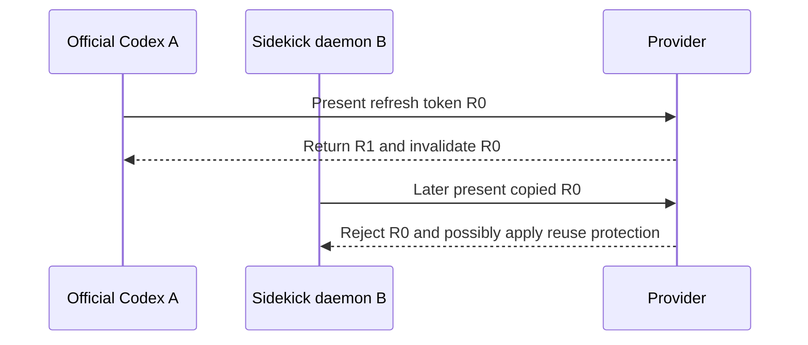
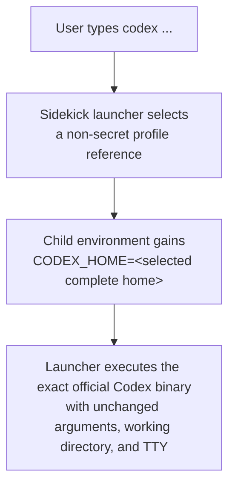
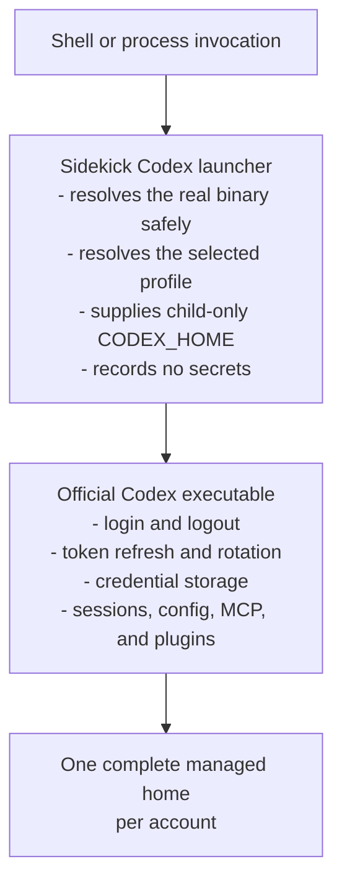
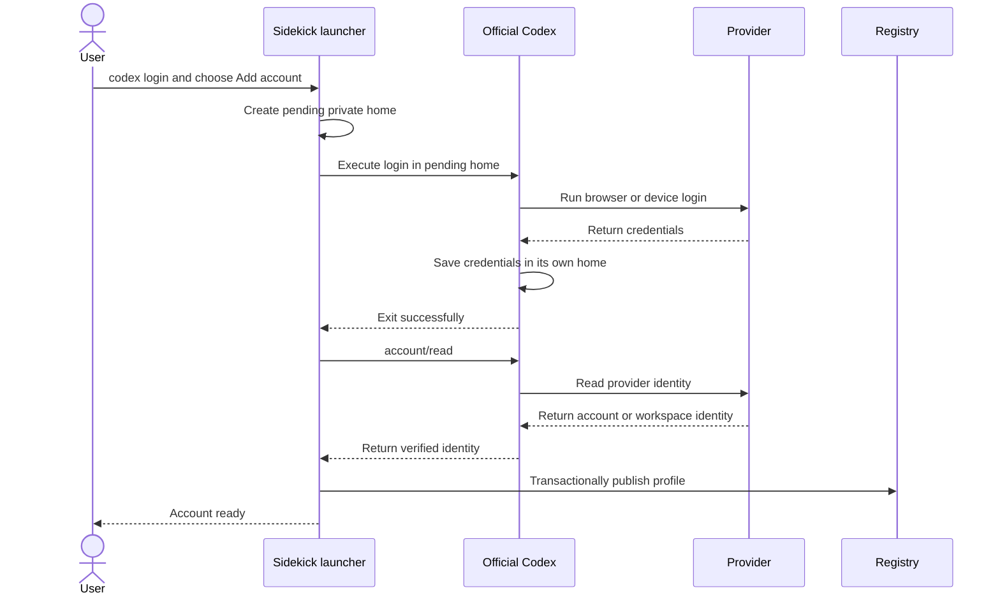
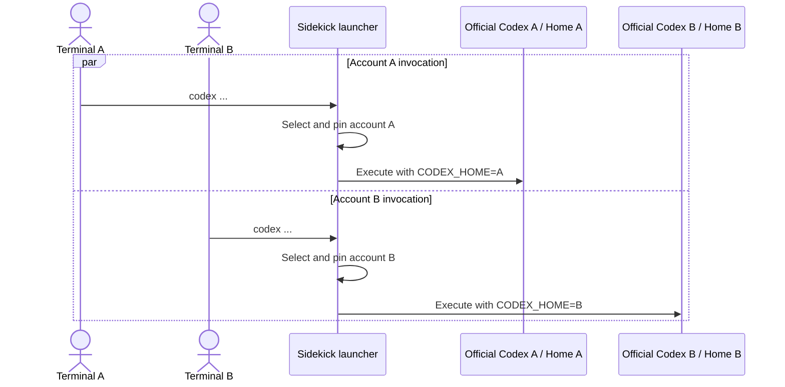
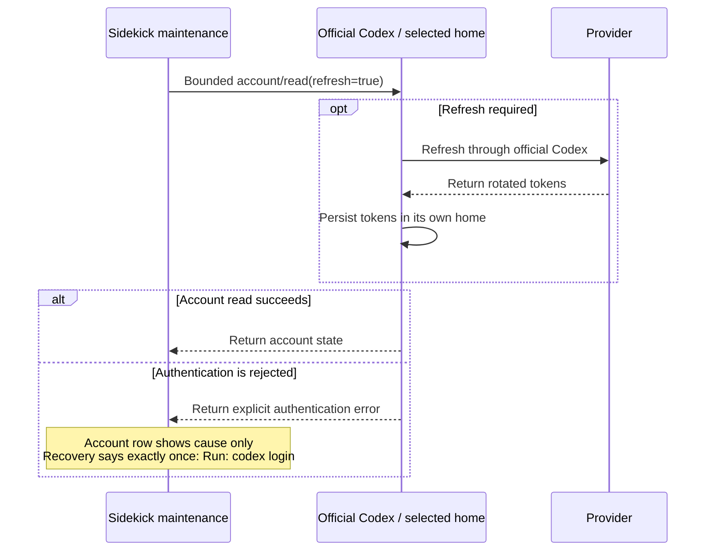

# Transparent Codex Multi-Account Authentication Research

- **Status:** Research complete; architecture proposed; not approved or
  implemented
- **Research date:** 2026-07-11
- **Last reviewed:** 2026-07-12
- **Sidekick evidence commit:**
  `15cef27bf91029f911d87597efca9e410b3a67fd`
- **Codex release:** `0.144.1`
- **Codex release tag:** `rust-v0.144.1`
- **Codex release date:** 2026-07-09
- **Codex source commit:**
  `44918ea10c0f99151c6710411b4322c2f5c96bea`
- **Upstream head inspected:**
  `5c19155cbd93bfa099016e7487259f61669823ff`
- **Diagram validation:** Mermaid CLI 11.16.0 on 2026-07-12
- **Production impact:** None; this document records research only

This is the self-contained tracked research authority for the proposed
transparent multi-account Codex integration. No ignored or temporary artifact
is required to understand, verify, approve, reject, or later implement the
recommendation.

## Table of Contents

1. [Executive Conclusion](#executive-conclusion)
2. [Research Scope and Method](#research-scope-and-method)
3. [Verified Installed Release](#verified-installed-release)
4. [Key Findings](#key-findings)
   1. [The Current Warning Repeats the Recovery Action](#the-current-warning-repeats-the-recovery-action)
   2. [Codex Is Single-Identity per Home](#codex-is-single-identity-per-home)
   3. [A Second Login in One Home Is Destructive](#a-second-login-in-one-home-is-destructive)
   4. [Configuration Profiles Are Not Authentication Profiles](#configuration-profiles-are-not-authentication-profiles)
   5. [Refresh Tokens Need One Durable Writer](#refresh-tokens-need-one-durable-writer)
   6. [Bare Codex Requires Launch Mediation](#bare-codex-requires-launch-mediation)
   7. [Experimental App-Server Authentication Is Not Yet a Foundation](#experimental-app-server-authentication-is-not-yet-a-foundation)
5. [Capability and Option Comparison](#capability-and-option-comparison)
6. [Build-Versus-Adopt Decision](#build-versus-adopt-decision)
7. [Recommended Architecture](#recommended-architecture)
   1. [Account Selection Contract](#account-selection-contract)
   2. [Login and Reauthentication Contract](#login-and-reauthentication-contract)
   3. [Refresh and Maintenance Contract](#refresh-and-maintenance-contract)
   4. [State Ownership](#state-ownership)
   5. [Long-Term Direction](#long-term-direction)
8. [Implementation Implications](#implementation-implications)
   1. [Process Sequences](#process-sequences)
   2. [Threat Model and Security Invariants](#threat-model-and-security-invariants)
   3. [Migration Strategy](#migration-strategy)
   4. [Rollback and Uninstall](#rollback-and-uninstall)
   5. [Cross-Platform Installation](#cross-platform-installation)
   6. [Smallest Meaningful Test Set](#smallest-meaningful-test-set)
9. [Risks and Open Questions](#risks-and-open-questions)
10. [Revalidation Triggers](#revalidation-triggers)
11. [Source Matrix](#source-matrix)

## Executive Conclusion

The current Codex recovery warning repeats the login action because the
provider adapter and usage renderer both prescribe recovery. Under the current
import workflow, the concise replacement is:

```text
Codex rejected the saved refresh token.
Log in to Codex CLI, then run:
sidekick-usages refresh <label>
```

The installed `codex-cli 0.144.1` does not natively keep or select multiple
ChatGPT identities in one home. Its file, keyring, encrypted-secret, and
ephemeral credential stores resolve to one active identity per canonical
`CODEX_HOME`. A normal browser or device login clears the existing
authentication with server-side revocation before saving the new login. Named
`--profile` configuration is not an authentication selector.

The proposed production architecture is a thin, reversible Sidekick launcher
on `PATH` plus one complete, provider-owned `CODEX_HOME` per Codex account. The
user continues to type ordinary commands such as `codex`, `codex login`,
`codex exec`, and `codex review`. Sidekick selects one account, supplies only
that non-secret home path to the child process, and replaces itself with the
exact official Codex binary.

Official Codex remains the sole owner of login, logout, access-token refresh,
refresh-token rotation, and credential persistence. Sidekick owns non-secret
profile metadata, selection bindings, health information, and references to
managed homes.

This is transparent to daily command invocation, but it is not native Codex
multi-account support. A one-time `PATH` integration is unavoidable because
the vendor executable has no plugin or discovery hook for an external account
pool. Account selection must also be explicit and explainable when two valid
accounts exist.

The current import-and-copy credential model must not remain the durable
authority for launcher-managed accounts. Official Codex and Sidekick can
otherwise hold writable copies from one rotating refresh-token family. Either
actor can advance or revoke the token lineage, leaving the other copy invalid.
The controlling invariant is one durable refresh-token writer per account,
and that writer must be official Codex.

No new dependency is justified. Reuse the official Codex executable and its
credential stores. Keep Sidekick's existing Portalocker-backed transaction
boundary for Sidekick-owned registry state. Do not add Python `keyring`,
Authlib, another lock library, a token-swapping utility, or a model-traffic
proxy.

In one sentence:

> Sidekick chooses the account and launches it transparently; official Codex
> owns that account's complete home and credentials; the user continues typing
> `codex`.

## Research Scope and Method

The investigation separated requirements that are often conflated:

1. Keep two durable Codex account authentications.
2. Invoke the CLI using the unqualified command `codex`.
3. Preserve the official browser or device login experience.
4. Select which account a new Codex process uses.
5. Run two accounts concurrently.
6. Refresh unattended without corrupting token rotation.

Evidence came from four layers:

- The installed executable and its package metadata.
- The immutable upstream source revision for that executable.
- Current official OpenAI documentation and upstream feature status.
- Sidekick's credential, rendering, persistence, and command code at the
  recorded evidence commit.

The investigation also compared maintained libraries and public account
manager designs before selecting a local implementation boundary. Third-party
projects were treated as design exemplars or dependency candidates, not as
authorities for Codex behavior.

No credential values, provider account identifiers, or private account labels
are included in this record. Runtime observations are summarized rather than
preserving raw system-call traces or machine-specific account state.

Claims in this document use these evidence levels:

- **Official contract:** current public OpenAI documentation.
- **Exact implementation:** immutable source for Codex 0.144.1.
- **Local observation:** read-only behavior of the installed executable.
- **Inference:** a conclusion derived from the above evidence and identified
  as such.
- **Experimental:** a documented or implemented surface without a stable
  production contract for this use.

## Verified Installed Release

The observed installation resolved as follows, with the user-specific home
replaced by `$HOME`:

```text
$HOME/.local/bin/codex
  -> $HOME/.codex/packages/standalone/releases/
     0.144.1-x86_64-unknown-linux-musl/bin/codex
```

The executable reported:

```text
codex-cli 0.144.1
```

The target was a stripped, static position-independent, 64-bit x86-64 ELF
executable with this SHA-256:

```text
a96f944d1a596dbfb7fdd84f482be5c50e34b04bb371126840d873e4ebf26902
```

That checksum records the observed Linux package artifact. It is historical
evidence, not a permanent executable allowlist.

The official release tag `rust-v0.144.1` resolves to immutable upstream commit
[`44918ea10c0f99151c6710411b4322c2f5c96bea`](https://github.com/openai/codex/commit/44918ea10c0f99151c6710411b4322c2f5c96bea).
Source-level claims about the installed behavior were checked against that
exact commit rather than a later approximation.

Upstream `main` at `5c19155cbd93bfa099016e7487259f61669823ff` was also
searched on 2026-07-11 for a subsequently completed multi-account
implementation. No account-session request processor, registered switch RPC,
or public account-list and account-switch command was present at the research
cutoff. That observation is date-sensitive and does not predict a future
release.

Read-only runtime tracing compared the default home with a new isolated home:

```text
Default home: existing ChatGPT login detected.
Fresh isolated home: not logged in.
Isolation result: the installed executable honored child CODEX_HOME and did
not fall through to the default home.
```

The meaningful observation can be reproduced without preserving a raw trace:

```bash
codex --version
readlink -f "$(command -v codex)"
sha256sum "$(readlink -f "$(command -v codex)")"

isolated_home="$(mktemp -d)"
CODEX_HOME="$isolated_home" codex login status
```

The isolated status command is read-only with respect to the normal Codex
home. A new verification must still inspect its chosen temporary directory
before cleanup rather than assuming that a future release creates no files.

## Key Findings

### The Current Warning Repeats the Recovery Action

The current three lines have these intended responsibilities:

| Line | Current owner | Intended meaning |
|---|---|---|
| `Codex rejected the saved refresh token; log in again.` | Codex provider adapter | Cause, plus an embedded action |
| `Log in to Codex CLI again, then run:` | Usage renderer | Recovery prerequisite |
| `sidekick-usages refresh <label>` | Usage renderer | Exact import command |

The second and third lines are not redundant with each other: one says which
provider state must exist first, and the other gives the exact Sidekick
action. The duplication is between “log in again” in the provider message and
“Log in ... again” in the renderer.

While Sidekick still uses import-and-copy, the correction should be:

```text
Codex rejected the saved refresh token.
Log in to Codex CLI, then run:
sidekick-usages refresh <label>
```

Provider adapters should supply cause-only diagnostics. The application or
presentation owner should compose one actionable recovery. Claude has the
same ownership defect, so the implementation should correct the
provider-neutral contract rather than only changing one Codex string.

After the proposed profile architecture exists, reauthentication no longer
requires importing a global login into Sidekick. When the profile is
unambiguous, recovery becomes:

```text
Codex rejected this account's sign-in.
Run: codex login
```

If selection is ambiguous, Sidekick must offer a profile choice rather than
claim that an unspecified `codex login` repairs the intended account.

### Codex Is Single-Identity per Home

Codex stores one current authentication payload in `$CODEX_HOME/auth.json`
when using file storage. Saving truncates and replaces that payload, and Unix
files are created privately. The exact
[`AuthDotJson` model and storage implementation](https://github.com/openai/codex/blob/44918ea10c0f99151c6710411b4322c2f5c96bea/codex-rs/login/src/auth/storage.rs#L38-L61)
do not model an account collection.

Moving credentials to the operating-system keyring does not add multiple
identities to one home. Codex uses service name `Codex Auth` and derives its
entry key from the canonical `CODEX_HOME`, not the provider account ID. One
canonical home maps to one keyring entry; distinct canonical homes map to
distinct entries. See the exact
[`CODEX_HOME`-scoped keyring implementation](https://github.com/openai/codex/blob/44918ea10c0f99151c6710411b4322c2f5c96bea/codex-rs/login/src/auth/storage.rs#L226-L319).

The same home-derived isolation applies to Codex's encrypted and ephemeral
stores. Storage mode changes the protection and persistence mechanism, not the
one-current-identity model.

Official documentation likewise describes one cached login shared by the CLI
and IDE and stores credentials in `auth.json` under `CODEX_HOME` or an
operating-system credential store. It documents `file`, `keyring`, and `auto`,
not a native named account collection. See
[login caching](https://learn.chatgpt.com/docs/auth#login-caching) and
[credential storage](https://learn.chatgpt.com/docs/auth#credential-storage).

`CODEX_HOME` is broader than authentication. It also scopes configuration,
sessions and rollouts, logs, caches, state databases, plugins and skills, MCP
state, and some runtime paths. Separate homes are the correct isolation
primitive, but they are complete profiles rather than secret files to swap
under a shared runtime.

### A Second Login in One Home Is Destructive

In Codex 0.144.1, ordinary browser login and device login clear existing
authentication before beginning a new flow. That path invokes logout with
server-side revocation, preferring the refresh token when available. It is not
merely a local replacement of `auth.json`:

- [Browser login sequence](https://github.com/openai/codex/blob/44918ea10c0f99151c6710411b4322c2f5c96bea/codex-rs/cli/src/login.rs#L119-L165)
- [Device login sequence](https://github.com/openai/codex/blob/44918ea10c0f99151c6710411b4322c2f5c96bea/codex-rs/cli/src/login.rs#L305-L347)
- [Logout and revocation selection](https://github.com/openai/codex/blob/44918ea10c0f99151c6710411b4322c2f5c96bea/codex-rs/login/src/auth/revoke.rs#L55-L85)

That explains why two identities cannot remain durable in the same home. It
also means copying an earlier refresh token into Sidekick does not preserve an
independent login if a later native login revokes that token family.

This architecture makes the observed saved-token rejection expected and
race-prone, but it does not prove the forensic cause of one rejected
credential. Provider revocation, policy changes, account changes, or another
server-side invalidation can produce the same response.

### Configuration Profiles Are Not Authentication Profiles

Codex `--profile` chooses configuration from profile-specific TOML under the
same `CODEX_HOME`. It controls settings such as model, provider, approvals,
sandboxing, reasoning, TUI behavior, and features. It does not select an auth
home or account. See the official
[`config.toml` reference](https://learn.chatgpt.com/docs/config-file/config-reference#configtoml).

Private account-session-shaped protocol structs exist in the source, but
Codex 0.144.1 has no corresponding registered RPC, request processor, or CLI
command. Current upstream source still did not expose a completed native
account list or switch operation at the research cutoff. Inert schemas are not
a supported feature.

### Refresh Tokens Need One Durable Writer

Sidekick's current Codex flow imports or copies the active native credential
into a Sidekick-owned bundle. Later `refresh --all` and maintenance can refresh
the Sidekick copy independently, while an ordinary Codex process can refresh
the provider-owned copy.

OAuth refresh-token rotation makes this a correctness boundary, not merely a
locking detail. [RFC 6749 section 6](https://www.rfc-editor.org/rfc/rfc6749.html#section-6)
requires a client to replace the old refresh token when a new one is returned.
[RFC 9700 section 4.14](https://www.rfc-editor.org/rfc/rfc9700.html#name-refresh-token-protection)
describes rotation, invalidated-token replay detection, and token-family
revocation. Two independent actors holding one lineage can race:



Locking Sidekick's files cannot coordinate with an official Codex process that
does not acquire the same lock. Codex has its own guarded reload and in-process
refresh serialization, but that is not a contract with an external refresher.
The sound invariant is:

> For each launcher-managed account, official Codex is the sole durable
> credential and refresh-token authority.

Sidekick may orchestrate an official Codex account read or refresh operation,
but it must not independently exchange and persist that account's refresh
token.

### Bare Codex Requires Launch Mediation

The vendor binary has no plugin, callback, or account-manager discovery hook
that lets another application choose among external account homes. If the user
must type the bare word `codex`, Sidekick must install an opt-in executable
earlier on `PATH`, or use an equivalent operating-system command-dispatch
mechanism.

The transparent path is:



The child receives `CODEX_HOME=<selected complete home>`; the launcher
preserves the official executable's arguments, working directory, and TTY.

The user never sets or remembers `CODEX_HOME`, but Sidekick still supplies it
to the child because it is Codex's official isolation boundary. This is launch
mediation supplied by Sidekick, not native Codex multi-account support.

### Experimental App-Server Authentication Is Not Yet a Foundation

Current official app-server documentation exposes external
`chatgptAuthTokens` experimentally. A host supplies access tokens and account
identity, owns refresh, and must answer a refresh request promptly after an
authentication failure. The TUI can connect to an app server through remote
mode. See the official
[app-server documentation](https://learn.chatgpt.com/docs/app-server).

This could support one supervised app-server process per identity and an
ordinary TUI as a remote client. It does not create one multi-account server:
each process still has one active identity. More importantly:

- The exact installed protocol labels the external-token surface unstable and
  internal.
- Sidekick would become the refresh-token authority and must answer refresh
  callbacks within the provider's deadline.
- Remote mode does not cover all normal CLI surfaces; `codex exec` and
  `codex review` do not accept equivalent remote-server behavior.
- Long-lived sockets, process supervision, authorization, crash recovery, and
  protocol-version compatibility materially expand the threat boundary.

This is a legitimate future experiment, not the current production answer for
ordinary Codex behavior.

## Capability and Option Comparison

All requested user behaviors are achievable together through Sidekick launch
mediation, but they are not all native Codex capabilities:

| Requirement | Codex alone | With proposed Sidekick launcher |
|---|---|---|
| Keep two durable account logins | No, not in one home | Yes, one complete home per account |
| Invoke plain `codex` | Yes, one active home | Yes, launcher selects the home |
| Use normal browser or device login | Yes | Yes, official login in selected home |
| Run two identities concurrently | No, not from one home | Yes, isolated pinned processes |
| Select an account automatically where safe | No external account pool | Yes, deterministic Sidekick policy |
| Refresh unattended | One active home | Yes, official Codex operates each home |

The architecture candidates compare as follows:

| Option | Bare `codex` | Concurrent accounts | Normal login | One refresh writer | Full CLI fidelity | Decision |
|---|---:|---:|---:|---:|---:|---|
| Copy credentials into Sidekick | With current vendor command | Fragile | Yes | No | Yes until rotation or revocation | Reject for managed profiles |
| Swap or symlink `auth.json` | Requires wrapper or switch | No safe running concurrency | Yes | Ambiguous | Running sessions can break on refresh | Reject |
| Separate homes with manual environment | No | Yes | Yes | Yes if Codex owns each home | Yes | Correct primitive, poor UX |
| Separate homes with Sidekick launcher | Yes | Yes | Yes | Yes | Yes | Recommend |
| Temporary token projection | With wrapper | Potentially | Not naturally | Usually no | Secret leakage and rotation races | Reject |
| One external-auth app server per account | Mediated TUI only | Yes | Host-dependent | Sidekick owns refresh | No for all commands | Experimental only |
| Model-traffic proxy or load balancer | Invasive replacement | Yes | Proxy-specific | Proxy owns secrets | Changes network and trust boundary | Reject |
| Private Codex fork | Yes | Potentially | Custom | Custom | High maintenance drift | Reject |
| Future native auth profiles | Yes | Expected | Expected | Provider-native | Expected | Preferred target |

## Build-Versus-Adopt Decision

The official Codex executable is the component to adopt as the sole provider
credential and runtime authority. Sidekick should build only the narrow
selection, launch, metadata, and lifecycle coordination it uniquely needs.

Third-party account switchers confirm demand but do not provide an acceptable
dependency boundary:

- [`Ducksss/codex-profiles`](https://github.com/Ducksss/codex-profiles)
  correctly isolates complete homes, but requires a Bash-oriented command or
  shell activation and does not provide Sidekick's cross-platform bare-command
  contract. It is useful pattern validation, not a dependency.
- [`Loongphy/codex-auth`](https://github.com/Loongphy/codex-auth) and
  [`Sls0n/codex-account-switcher`](https://github.com/Sls0n/codex-account-switcher)
  save and replace active authentication state. That conflicts with concurrent
  sessions and refresh ownership.
- [`Soju06/codex-lb`](https://github.com/Soju06/codex-lb) and
  [`ndycode/codex-multi-auth`](https://github.com/ndycode/codex-multi-auth)
  introduce a proxy or forwarding runtime. They become responsible for model
  traffic, credentials, protocol compatibility, networking, and availability,
  which is disproportionate to Sidekick's scope.

No new Python dependency fills the missing seam:

- Official Codex already owns file, keyring, automatic, encrypted, and
  ephemeral credential behavior. Python `keyring` would duplicate that owner.
- Authlib would encourage Sidekick to become a second OAuth client and refresh
  authority, which the design explicitly prohibits.
- `filelock` duplicates Sidekick's existing Portalocker dependency without
  coordinating official Codex writes.
- A token-swapping package retains the shared-auth race.
- A traffic proxy creates a substantially larger credential, network, and
  protocol trust boundary.

The approved implementation decision, if this architecture is later approved,
should therefore be:

- Adopt official Codex for login, storage, refresh, and execution.
- Keep Portalocker for Sidekick-owned registry transactions.
- Use Python standard-library process and filesystem primitives for the narrow
  launcher coordination.
- Add no OAuth, keyring, switching, proxy, or second locking dependency.

## Recommended Architecture

Build a small, provider-specific launch integration with these boundaries:



Required properties:

- Installation is explicit, opt-in, inspectable, reversible, and idempotent.
- The official executable is never patched or overwritten.
- The launcher stores or resolves the verified real-binary path and detects
  recursion, missing targets, unsupported versions, and path changes.
- It preserves arguments, current directory, standard streams, terminal
  behavior, signals, and exit status.
- On POSIX it uses process replacement. Windows receives an equivalent native
  console-launch contract rather than only shell aliases.
- It supplies only a non-secret `CODEX_HOME` to the child environment.
- The selected account is pinned for the complete process lifetime. It is
  never changed beneath a running TUI, `exec`, `review`, resume, or app-server.
- Different accounts can run simultaneously because their official homes and
  keyring namespaces are distinct.
- A documented emergency bypass invokes the real vendor executable directly.

Do not turn the current Sidekick private auth-bundle directory into a complete
Codex home. Its transaction, migration, and ownership contract is
credential-bundle-specific. Create a separate provider-profile root with
private permissions and an explicit lifecycle.

### Account Selection Contract

Selection must be deterministic, explainable, and fail closed. Recommended
precedence for each new process:

1. An explicit per-invocation selector intended for automation.
2. A trusted Sidekick-local workspace or repository binding.
3. The user's configured default Codex profile.
4. The only configured profile, when exactly one exists.
5. An interactive chooser when stdin and the terminal permit interaction.
6. An actionable error when a non-interactive invocation remains ambiguous.

Workspace bindings must live in trusted Sidekick user state, not in a
repository-controlled file that an untrusted checkout can modify to select a
privileged organizational account.

The launcher should explain its decision through a diagnostic command:
selected profile, selection source, provider identity status, and real-binary
path. It must never expose tokens.

Do not silently select another personal or organizational account because one
account approaches a quota. Account choice can affect retention, workspace
policy, billing, and data governance. Quota may inform an interactive choice
or warning, but automatic cross-account failover requires a separate explicit
policy decision.

### Login and Reauthentication Contract

`codex login` has two possible intents once multiple profiles exist:

- Reauthenticate the currently selected profile.
- Add a new profile.

For reauthentication, invoke the official executable with the existing
profile home. For a new account:

1. Allocate a pending, private, complete home.
2. Invoke the exact official `codex login` in that home.
3. Preserve the normal browser or device-code experience described by
   [RFC 8252](https://www.rfc-editor.org/rfc/rfc8252.html).
4. After success, ask official Codex account machinery for the stable provider
   workspace or account identity.
5. Reject an unexpected or duplicate identity before publication.
6. Atomically publish only non-secret profile metadata and the home reference.
7. Leave all previous profiles and bindings unchanged if login or validation
   fails.

Profile identity must be keyed by the stable provider account or workspace ID,
not email. Email is presentation metadata and can change or collide across
organizational contexts.

The bare `codex login` command cannot infer add-versus-reauthentication intent
when two valid profiles exist. An interactive call may present a concise
chooser. A non-interactive ambiguous login must fail with an explicit selector
instruction.

### Refresh and Maintenance Contract

For launcher-managed profiles:

- Ordinary official Codex processes refresh and persist their credentials.
- Sidekick does not copy refresh tokens into a second writable store.
- Sidekick's scheduler may start a bounded, version-gated official
  `codex app-server` using the selected home and issue the managed
  `account/read` operation with refresh enabled.
- Official Codex remains responsible for token exchange, rotation, guarded
  reload, identity validation, and storage.
- Sidekick may persist only the resulting non-secret health or activity
  snapshot and the time of observation.
- Failures remain explicit and are never replaced by a plausible local
  fallback.

Existing copied credentials may remain readable only during migration. Once
an account is profile-backed, direct Sidekick OAuth refresh must be prohibited
by the state model and service boundary, not merely avoided by convention.

### State Ownership

| State | Owner | Notes |
|---|---|---|
| OAuth access and refresh token | Official Codex profile home or store | Never copied into launcher metadata |
| Browser or device login and logout | Official Codex | Sidekick launches and validates only |
| Refresh rotation | Official Codex | Sole durable writer per account |
| Codex config, session, MCP, and plugin state | Complete profile home | Isolated by design; no blanket sync |
| Opaque Sidekick profile ID | Sidekick core | Domain identity contains no path |
| Profile ID to home resolution | Sidekick path and provider boundary | Resolve private absolute paths at the boundary |
| Default and workspace bindings | Sidekick persistence | Non-secret, transactional, and locked |
| Activity and health snapshot | Sidekick persistence | Non-secret with explicit freshness and provenance |
| PATH integration metadata | Sidekick launcher installer | Real binary, install version, and rollback target |

Avoid symlinking mutable authentication files, databases, session trees, or
MCP token stores across homes. If users need common non-secret settings, add a
narrow audited configuration-layer mechanism only after identifying which
official Codex files are immutable or read-only versus mutable. Full-home
copying or two-way synchronization creates drift and corruption hazards.

### Long-Term Direction

Monitor and prefer stable upstream native authentication profiles. The feature
request for native multiple accounts remained open at the research cutoff
([openai/codex#12029](https://github.com/openai/codex/issues/12029)), as did an
auth-profile request
([openai/codex#4432](https://github.com/openai/codex/issues/4432)). A proposed
`--auth-profile` implementation was closed unmerged
([openai/codex#4457](https://github.com/openai/codex/pull/4457)); that closure
did not create a stable supported interface.

Isolate Sidekick's selection contract behind one launcher or profile service
so a future official selector can replace home dispatch without changing
workspace bindings, CLI UX, or persisted non-secret identity metadata. When
OpenAI ships a stable multi-account contract across interactive, `exec`,
`review`, app-server, and maintenance surfaces, retire the launcher instead of
maintaining parallel behavior.

## Implementation Implications

This section records constraints implied by the research. It is not an
approved implementation plan.

### Process Sequences

#### Add an account



#### Normal concurrent invocations



No authentication file, keyring entry, database, or running-process identity
is swapped while either invocation is running.

#### Refresh and recovery



### Threat Model and Security Invariants

Threats considered:

- Credential disclosure through arguments, environment, logs, diagnostics,
  process listings, profile metadata, or world-readable homes.
- Token-family invalidation caused by duplicate refresh writers.
- Running-process corruption caused by replacing or symlinking active auth.
- A malicious repository selecting a privileged account.
- `PATH` recursion, binary substitution, or a stale launcher target.
- Cross-account session, MCP credential, history, or configuration leakage.
- Partial login or migration publishing a broken profile.
- Scheduler overlap and concurrent registry mutation.
- Experimental protocol drift or an unsupported vendor version.

Required invariants:

1. One provider identity maps to one complete canonical Codex home.
2. One Codex home maps to at most one durable active provider identity.
3. Official Codex is the only durable refresh-token writer for a managed
   profile.
4. No bearer or refresh token appears in launcher arguments, child overrides,
   Sidekick profile metadata, logs, or diagnostics.
5. Account selection completes before launch and never changes during the
   process lifetime.
6. Repository-controlled content cannot silently select a more privileged
   account.
7. Registry updates are locked and transactionally published. Codex-owned
   files are never represented as protected by Sidekick's lock.
8. Login, migration, and identity verification fail closed without replacing
   a working profile.
9. Launcher recursion, a missing real binary, identity mismatch, unsupported
   version, and ambiguous non-interactive selection are hard errors.
10. Uninstalling dispatch does not delete account data without separate,
    explicit confirmation.

The doctor surface should report launcher state, bypass state, real-binary path
and version, selection source, provider identity match, credential-store mode,
profile permissions, and legacy duplicate-credential state. It must never
read secrets into normal output.

### Migration Strategy

Migration must recognize that a current Sidekick bundle may be a copied
snapshot from the same token family as the active native login. Two refresh
histories cannot be merged safely.

Recommended migration constraints:

1. Inventory Codex records and classify each as legacy copied, external-home,
   or already provider-home-backed without exposing token values.
2. Install and verify the launcher independently of credential migration.
3. Preserve the current default native Codex home as one candidate profile
   when official Codex can verify its identity.
4. For every additional record, create a pending complete home and require one
   official login. Do not project a copied refresh token into the new profile.
5. Verify the returned provider account or workspace identity against the
   intended Sidekick record. Reject mismatches and duplicates.
6. Commit the profile registry entry transactionally, then run a bounded
   official account read from that home.
7. Mark the old Sidekick credential retired only after the new profile passes
   validation. Retain any rollback copy only for a bounded period under the
   approved private persistence policy.
8. Disable direct Sidekick refresh for migrated profiles.
9. Remove retired copied tokens after the rollback period through explicit,
   auditable behavior.

An already-rejected legacy refresh token cannot be recovered into a new
profile. The account still exists at the provider, but one successful official
login is required to establish a fresh authoritative token lineage.

### Rollback and Uninstall

Rollback must not depend on deleting credentials:

- The launcher installer records the previous command resolution and exact
  official-binary target.
- A diagnostic bypass runs that target directly.
- Disabling integration restores normal `PATH` resolution atomically.
- Managed profile homes remain private and intact by default.
- Deleting profiles, histories, MCP state, or credentials is a separate
  destructive operation requiring explicit confirmation.
- If migration fails, the Sidekick transaction journal restores registry and
  binding state; it does not rewrite provider-owned authentication.

### Cross-Platform Installation

The contract is platform-neutral even though dispatch mechanics differ:

- **Linux and macOS:** install a small executable or generated console entry
  before the vendor command on `PATH`; resolve and validate the real binary,
  then use process replacement so signals, TTY behavior, and exit status remain
  normal.
- **Windows:** install a real console launcher or packaging-supported command
  shim. Do not rely only on PowerShell functions, aliases, or a batch file if
  `codex` must work from PowerShell, Command Prompt, Windows Terminal, IDEs,
  schedulers, and subprocesses.
- **All platforms:** installation is opt-in and idempotent; doctor detects
  bypasses and recursion; upgrades re-resolve or validate the official target;
  uninstall restores resolution without deleting profiles.

The product must not promise complete transparency until packaging tests cover
the supported shells and process-launch environments.

### Smallest Meaningful Test Set

Keep the suite behavior-focused and compact. These are acceptance contracts,
not a request for one test per private helper:

1. **Diagnostic ownership:** parameterize Claude and Codex failures to prove
   the cause appears once, one recovery action appears, and the exact command
   remains safely quoted where the legacy import path exists.
2. **Transparent dispatch:** execute a fake vendor binary and prove arguments,
   current directory, selected child home, standard streams, signal behavior,
   and exit status are preserved for bare TUI, `exec`, `review`, and unknown
   future arguments.
3. **Selection safety:** prove precedence, trusted local workspace binding,
   interactive choice, and fail-closed non-TTY ambiguity; prove a repository
   file cannot choose a privileged profile.
4. **Concurrent isolation:** run two long-lived fake Codex processes and prove
   their homes and state never cross during overlapping registry reads.
5. **Transactional identity lifecycle:** prove add, reauthenticate, wrong
   identity, duplicate identity, failed login, logout, and rollback preserve
   unaffected profiles.
6. **Single refresh writer:** prove maintenance drives the official account
   boundary for profile-backed accounts and cannot call Sidekick's direct OAuth
   refresh path.
7. **Migration and launcher safety:** prove crash recovery, a rejected legacy
   token requiring login, recursion and moved-binary detection, emergency
   bypass, and uninstall preserving profile data.

Delete tests that exist only to validate retired copied-token behavior when
that implementation is removed. Do not retain low-level accessor or cache-shape
tests that no longer protect an observable contract.

## Risks and Open Questions

1. **Complete-home experience:** Separate homes isolate more than tokens.
   Product decisions are required for common non-secret configuration, skills,
   plugins, MCP configuration, history and resume behavior, and IDE
   integration. Sharing mutable state by symlink is not acceptable.
2. **IDE integration:** Official documentation says the CLI and IDE share a
   cached login in one home. The launcher controls CLI invocation; the Codex
   IDE extension may need a separate profile integration or remain bound to
   its configured home.
3. **Bare login intent:** With two accounts, `codex login` cannot infer whether
   the user wants a new account or reauthentication. Interactive selection is
   necessary unless a workspace or default resolves the intent.
4. **Organization policy:** Automatic routing can alter data-governance and
   billing context. Workspace and default bindings need clear visibility
   before any quota-aware behavior is considered.
5. **Official app-server stability:** Managed `account/read` is a useful
   provider-owned maintenance boundary, but Sidekick must version-gate the
   exact JSON-RPC contract and fail explicitly on incompatibility.
6. **Binary upgrades:** A standalone package can move its real executable.
   Doctor and installation maintenance must validate upgrades without ever
   selecting the launcher itself.
7. **Windows process fidelity:** A console launcher must preserve Ctrl+C,
   terminal handles, exit codes, quoting, and subprocess use across supported
   shells. This needs native testing rather than POSIX assumptions.
8. **Legacy token deletion:** Rollback retention must balance recoverability
   against the risk of keeping duplicate stale secrets.
9. **Upstream evolution:** Native auth profiles may supersede this design. The
   adapter must remain narrow enough to retire rather than entrench.
10. **Forensic diagnosis:** The architecture explains why copied refresh tokens
    are unstable, but provider evidence would be required to attribute one
    historical rejection specifically to rotation replay.

## Revalidation Triggers

Reopen this research before approval or implementation when any of these
conditions occurs:

- The supported Codex release changes materially from 0.144.1.
- Codex publishes native authentication-profile or multi-account support.
- Codex registers stable account-list, account-add, or account-switch RPCs.
- External app-server authentication becomes stable and supported for external
  products.
- Interactive TUI, `exec`, `review`, resume, and maintenance gain one complete
  remote-account contract.
- Credential storage stops being scoped by canonical `CODEX_HOME`.
- Normal login stops revoking the prior identity in the selected home.
- Provider refresh rotation or account identity semantics change.
- Sidekick no longer imports or directly refreshes copied Codex credentials.
- Sidekick's persistence, path, scheduler, or credential ownership boundaries
  change materially.

At revalidation, update the metadata and source matrix rather than silently
retaining a stale “current” claim. Preserve superseded research as historical
evidence and link the newer authority.

## Source Matrix

| Claim | Primary evidence | Confidence |
|---|---|---|
| Installed version maps to exact release source | [`rust-v0.144.1` commit](https://github.com/openai/codex/commit/44918ea10c0f99151c6710411b4322c2f5c96bea), package metadata, and executable output | High |
| One auth payload exists per home | [Auth storage model](https://github.com/openai/codex/blob/44918ea10c0f99151c6710411b4322c2f5c96bea/codex-rs/login/src/auth/storage.rs#L38-L61) | High |
| Keyring isolation derives from home, not account | [Keyring storage implementation](https://github.com/openai/codex/blob/44918ea10c0f99151c6710411b4322c2f5c96bea/codex-rs/login/src/auth/storage.rs#L226-L319) | High |
| Normal login revokes prior authentication | [Browser and device login](https://github.com/openai/codex/blob/44918ea10c0f99151c6710411b4322c2f5c96bea/codex-rs/cli/src/login.rs#L119-L165), [revocation path](https://github.com/openai/codex/blob/44918ea10c0f99151c6710411b4322c2f5c96bea/codex-rs/login/src/auth/revoke.rs#L55-L85) | High |
| Official auth cache and storage contract | [OpenAI authentication documentation](https://learn.chatgpt.com/docs/auth), [login caching](https://learn.chatgpt.com/docs/auth#login-caching), and [credential storage](https://learn.chatgpt.com/docs/auth#credential-storage) | High |
| Configuration profile is not auth identity | [OpenAI configuration reference](https://learn.chatgpt.com/docs/config-file/config-reference#configtoml) and exact release source | High |
| External host auth is experimental and incomplete for normal CLI | [OpenAI app-server documentation](https://learn.chatgpt.com/docs/app-server), exact release protocol, and command help | High for 0.144.1; may evolve |
| Duplicate refresh writers are unsafe | [RFC 6749 section 6](https://www.rfc-editor.org/rfc/rfc6749.html#section-6) and [RFC 9700 section 4.14](https://www.rfc-editor.org/rfc/rfc9700.html#name-refresh-token-protection) | High |
| Native-app login should preserve browser or device flow | [RFC 8252](https://www.rfc-editor.org/rfc/rfc8252.html) and official Codex login implementation | High |
| Swapping shared auth breaks refresh continuity | [OpenAI maintainer explanation](https://github.com/openai/codex/issues/9634#issuecomment-4016636369) and installed source | High |
| Native multi-account remained requested, not shipped | [Issue 12029](https://github.com/openai/codex/issues/12029), [issue 4432](https://github.com/openai/codex/issues/4432), and [closed PR 4457](https://github.com/openai/codex/pull/4457) | High as of 2026-07-11 |
| Current warning repeats recovery ownership | `src/sidekick_usages/providers/codex/provider.py`, `src/sidekick_usages/usage/render.py`, and related tests at the evidence commit | High |
| Sidekick imports copied credentials and directly refreshes them | `src/sidekick_usages/credentials/codex.py`, Codex provider auth and refresh modules, and CLI maintenance commands at the evidence commit | High |
| Existing Portalocker should be reused | Locked project dependencies, Sidekick persistence, and [Portalocker documentation](https://portalocker.readthedocs.io/) | High |
| Reviewed switchers and proxies do not fit | Public source and metadata for the compared projects | Medium-high; projects can change |

Date-sensitive project status and mutable official documentation were accessed
on 2026-07-11. Immutable implementation claims are pinned to the exact Codex
release commit above.
