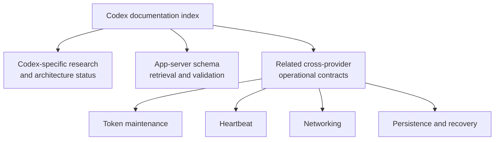

# Codex documentation

This directory contains durable Codex-specific provider research,
architecture, and operational guidance for Sidekick Usages.

A document belongs here when Codex-specific behavior, provider contracts,
authentication, or architecture is its primary subject. Cross-provider
behavior remains with its owning guide and is linked below rather than copied.

## Current documents

- [Transparent multi-account authentication research](./2026-07-11-transparent-multi-account-authentication-research.md)
  - Status: research complete; architecture proposed; not approved or
    implemented.
  - Verified against Codex CLI 0.144.1 and its exact release source on
    2026-07-11.
- [App-server schema guide](./schema.md)
  - Status: active schema retrieval and validation guidance.
  - Records version-pinned stable and experimental generation, semantic
    comparison, relevant contracts, and mandatory agent rules.

## Related cross-provider documentation

- [Token maintenance](../token-maintenance.md)
- [Heartbeat](../heartbeat.md)
- [Networking](../networking.md)
- [Persistence and recovery](../persistence-and-recovery.md)

These guides remain outside this directory because their contracts apply to
multiple providers or shared infrastructure. A Codex mention alone does not
make a document Codex-owned.

## Document status

Research records establish evidence and recommendations. They do not authorize
runtime changes. An approved design must state its approval date and link its
research authority. Implementation or completion records must link both and
must not silently redefine the underlying decision.

Date-sensitive Codex claims require revalidation when the supported Codex
release changes or when OpenAI publishes native multi-account authentication.

## Diagram validation

Mermaid source remains embedded in the Markdown; generated image artifacts are
not tracked. All current diagrams were rendered successfully with Mermaid CLI
11.16.0 on 2026-07-12. Render every diagram again after changing its source.
