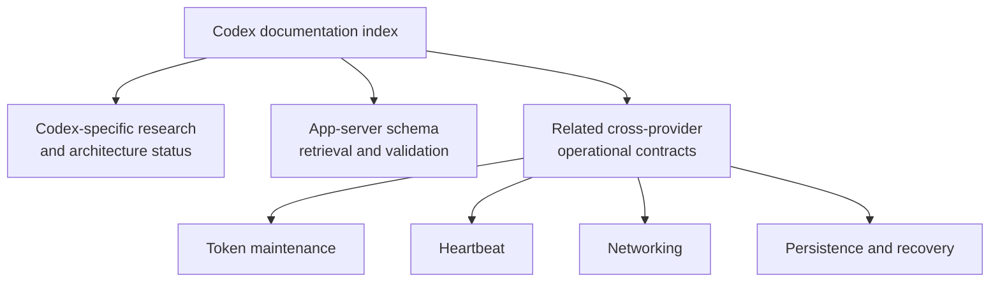

# Codex documentation

This directory contains durable Codex-specific provider research,
architecture, and operational guidance for Sidekick Usages.

A document belongs here when Codex-specific behavior, provider contracts,
authentication, or architecture is its primary subject. Cross-provider
behavior remains with its owning guide and is linked below rather than copied.

## Current documents

- [Transparent multi-account authentication research](./2026-07-11-transparent-multi-account-authentication-research.md)
  - Status: research complete; architecture proposed; not approved or
    implemented.
  - Verified against Codex CLI 0.144.1 and its exact release source on
    2026-07-11.
- [App-server schema guide](./schema.md)
  - Status: active schema retrieval and validation guidance.
  - Records version-pinned stable and experimental generation, semantic
    comparison, relevant contracts, and mandatory agent rules.

## Related cross-provider documentation

- [Token maintenance](../token-maintenance.md)
- [Heartbeat](../heartbeat.md)
- [Networking](../networking.md)
- [Persistence and recovery](../persistence-and-recovery.md)

These guides remain outside this directory because their contracts apply to
multiple providers or shared infrastructure. A Codex mention alone does not
make a document Codex-owned.

## Coordinated sessions

`sidekick-usages session codex -- <arguments>` may launch the stock Codex TUI
only after the installed Codex app-server and relay capabilities qualify. The
qualified contract keeps one neutral session home, one resident app server,
and one direct Responses transport with provider WebSockets disabled. A failed
capability or quiescence release gate refuses the coordinated path instead of
copying credentials, replacing the app server, or silently claiming an
unmanaged substitute is integrated.

During a qualified account boundary, an admitted turn and its retries finish
on their original authority. A later prompt stays queued in participant memory
until the new epoch opens. The same TUI, app server, thread, socket, terminal,
and conversation remain alive. The next admitted HTTP attempt must resolve the
new proven authority; old and new account attempts may never mix inside one
turn. These statements are release criteria, not provider-live qualification.

Shell forwarding installed by `sidekick-usages session shell install` is the
explicit enrollment boundary. An absolute Codex path, `command codex`, a
stale shell, `codex exec`, or a process started before enrollment bypasses the
relay. That process is unmanaged and alive. Sidekick reports it as session
status, never as another saved account, and never kills or restarts it.

Use `sidekick-usages doctor --provider codex`, `sidekick-usages daemon status`,
and `sidekick-usages session shell status` to distinguish capability refusal,
queued work, participant readiness, adoption, loss, reachability, and
enrollment. These are redacted coordination facts, not provider credentials.

## Document status

Research records establish evidence and recommendations. They do not authorize
runtime changes. An approved design must state its approval date and link its
research authority. Implementation or completion records must link both and
must not silently redefine the underlying decision.

Date-sensitive Codex claims require revalidation when the supported Codex
release changes or when OpenAI publishes native multi-account authentication.

## Diagram validation

Mermaid source remains embedded in the Markdown; generated image artifacts are
not tracked. All current diagrams were rendered successfully with Mermaid CLI
11.16.0 on 2026-07-12. Render every diagram again after changing its source.
