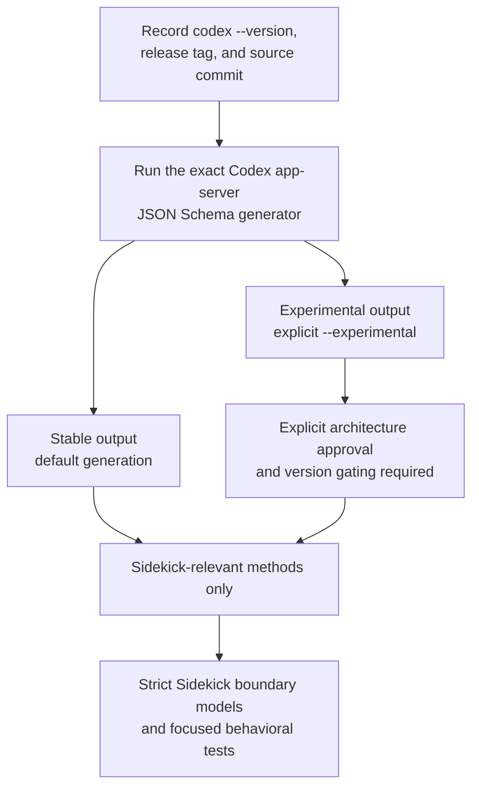

# Codex App-Server Schema Guide

- **Status:** Active schema retrieval and validation guidance
- **Last verified:** 2026-07-12
- **Codex release:** `0.144.1`
- **Codex release tag:** `rust-v0.144.1`
- **Codex source commit:**
  `44918ea10c0f99151c6710411b4322c2f5c96bea`
- **Sidekick evidence commit:**
  `15cef27bf91029f911d87597efca9e410b3a67fd`
- **Production impact:** None; this guide does not add a runtime dependency

This guide tells maintainers and AI agents where to obtain the authoritative
Codex app-server JSON Schema, how to pin it to a specific Codex release, how to
distinguish stable and experimental surfaces, and how to compare regenerated
output without treating JSON object ordering as a protocol change.

The complete generated schema bundle is an upstream-derived, version-specific
artifact. It is not tracked by Sidekick because no current build, runtime, or
offline compatibility gate consumes it. This guide is the durable authority;
ignored research artifacts and agent memory are not project contracts.

## Table of Contents

1. [Decision Summary](#decision-summary)
2. [Authority and Source Order](#authority-and-source-order)
3. [Generation Workflow](#generation-workflow)
   1. [POSIX Shell](#posix-shell)
   2. [PowerShell](#powershell)
4. [Stable and Experimental Surfaces](#stable-and-experimental-surfaces)
5. [Observed 0.144.1 Manifest](#observed-01441-manifest)
6. [Semantic Comparison](#semantic-comparison)
7. [Sidekick-Relevant Contract Map](#sidekick-relevant-contract-map)
8. [Verified Contract Details](#verified-contract-details)
9. [Agent Instructions](#agent-instructions)
10. [When a Schema Subset May Be Tracked](#when-a-schema-subset-may-be-tracked)
11. [Production Boundary](#production-boundary)
12. [Revalidation Triggers](#revalidation-triggers)
13. [Primary Sources](#primary-sources)

## Decision Summary

Track this retrieval and validation guide. Do not currently track:

- the complete stable schema bundle;
- the complete experimental schema bundle;
- raw schema-generation output;
- generated image or report artifacts;
- a checkout of the upstream Codex source; or
- raw directory hashes as the sole compatibility proof.

The observed output contains 604 JSON files and allocates approximately 7.5 MB
on disk. More importantly, it is generated, version-specific, substantially
larger than Sidekick's real contract surface, and reproducible from the exact
Codex executable or immutable release source.

The intended workflow is:



The full upstream schema is evidence and a compatibility source. Sidekick's
narrow typed provider models remain the production boundary.

## Authority and Source Order

Use this authority order:

1. Generate the schema with the exact Codex executable Sidekick supports.
2. Match that executable to its immutable official release tag and commit.
3. Inspect the immutable release's app-server schema and protocol source.
4. Use current official Codex documentation for public stability claims.
5. Implement only the request and response contracts Sidekick actually uses.

Never use an unqualified “latest” schema for a version-specific conclusion.
Always record:

```text
Codex CLI version
Release tag
Exact source commit
Generation date
Stable or experimental generation mode
```

For the currently researched release:

```text
Codex CLI version: 0.144.1
Release tag: rust-v0.144.1
Source commit: 44918ea10c0f99151c6710411b4322c2f5c96bea
```

The official Codex app-server documentation states that generated schema
output is specific to the Codex version that generated it and is guaranteed to
match that version. The generator should therefore come from the supported
binary, not a separately floating package or source branch.

## Generation Workflow

First confirm the executable version:

```bash
codex --version
codex app-server generate-json-schema --help
```

Generate into new empty directories. Do not generate into the repository,
provider-native homes, Sidekick application data, or a credential directory.
The generator does not require a Codex login.

### POSIX Shell

Use an isolated empty `CODEX_HOME` so generation cannot depend on the active
Codex login or configuration:

```bash
schema_root="$(mktemp -d)"
codex_home="$(mktemp -d)"

CODEX_HOME="$codex_home" \
  codex app-server generate-json-schema \
  --out "$schema_root/stable"

CODEX_HOME="$codex_home" \
  codex app-server generate-json-schema \
  --out "$schema_root/experimental" \
  --experimental

find "$schema_root" -type f | sort
```

Codex 0.144.1 may warn that it refuses to create helper aliases beneath a
temporary home. That warning did not prevent schema generation during the
recorded verification, and the isolated home remained empty.

Do not delete the generated directory until the intended comparison or review
is complete. Remove it afterward through the platform's ordinary temporary
file cleanup or an explicit command after verifying the resolved path.

### PowerShell

Use unique temporary directories and restore any pre-existing `CODEX_HOME`:

```powershell
$schemaRoot = Join-Path `
  ([IO.Path]::GetTempPath()) `
  ("codex-schema-" + [guid]::NewGuid())
$codexHome = Join-Path `
  ([IO.Path]::GetTempPath()) `
  ("codex-home-" + [guid]::NewGuid())

New-Item -ItemType Directory -Path $schemaRoot | Out-Null
New-Item -ItemType Directory -Path $codexHome | Out-Null

$previousCodexHome = $env:CODEX_HOME
try {
  $env:CODEX_HOME = $codexHome

  codex app-server generate-json-schema `
    --out (Join-Path $schemaRoot "stable")

  codex app-server generate-json-schema `
    --out (Join-Path $schemaRoot "experimental") `
    --experimental

  Get-ChildItem -Recurse -File $schemaRoot |
    Sort-Object FullName
}
finally {
  if ($null -eq $previousCodexHome) {
    Remove-Item Env:CODEX_HOME -ErrorAction SilentlyContinue
  }
  else {
    $env:CODEX_HOME = $previousCodexHome
  }
}
```

The same safety rules apply: inspect the output before cleanup and never point
generation at active provider or Sidekick credential state.

## Stable and Experimental Surfaces

Default generation produces the stable API surface:

```bash
codex app-server generate-json-schema --out "$schema_root/stable"
```

The `--experimental` flag includes experimental methods and fields:

```bash
codex app-server generate-json-schema \
  --out "$schema_root/experimental" \
  --experimental
```

The app-server and its schema-generation subcommand are currently labeled
experimental CLI tooling. Within the generated protocol, however, the default
output is the stable surface and `--experimental` explicitly expands it.

Sidekick must target stable methods by default. An experimental method or
field requires:

- a concrete Sidekick feature requirement;
- explicit architecture approval;
- exact Codex version gating;
- a typed unsupported-version failure;
- focused compatibility tests;
- a documented fallback or fail-closed behavior; and
- revalidation for every supported Codex upgrade.

Do not assume that every variant inside the default bundle is suitable for an
external product. In Codex 0.144.1, the default `LoginAccountParams` schema
contains a `chatgptAuthTokens` variant whose own description states that it is
unstable and for OpenAI internal use only.

Per-variant descriptions, protocol annotations, exact release source, and
official documentation take precedence over a conclusion inferred only from
the output directory name. In particular, the presence of
`chatgptAuthTokens` does not authorize a Sidekick-owned authentication broker.

## Observed 0.144.1 Manifest

Two isolated generations on the same installed Codex release produced the
same file sets and byte totals:

| Surface | Files | JSON bytes | Canonical semantic digest |
|---|---:|---:|---|
| Stable | 267 | 2,720,160 | `3a714ec86d7819145bc6fae745bf858231dc06afbff158ebdc5a13bc4eaacee0` |
| Experimental | 337 | 3,159,797 | `a971bd5e540560d2a6dfb5498ed8db861dd4968f5581426a2be667b96b6c3bc6` |

The total is 604 JSON files and 5,879,957 JSON bytes, with approximately
7.5 MB of filesystem allocation in the observed environment.

The semantic digests above are historical evidence for Codex 0.144.1, not a
permanent protocol allowlist. A supported-version change must produce a new
review rather than merely replacing these values.

## Semantic Comparison

Raw directory hashes are not sufficient. Fresh 0.144.1 generation produced
different raw digests even though every schema was semantically identical.

The only byte-level difference was definition ordering inside:

```text
codex_app_server_protocol.v2.schemas.json
```

in both stable and experimental output. Individual schema files and the other
combined bundle were byte-identical in the recorded comparison. Recursive JSON
object-key sorting eliminated every difference:

```text
Stable semantic mismatches: 0
Experimental semantic mismatches: 0
```

Use this comparison order:

1. Compare relative file sets.
2. Report added and removed schema files.
3. Parse every file as JSON and reject malformed output.
4. Recursively sort JSON object keys.
5. Compare the canonicalized documents.
6. Report method, field, required-property, type, enum, and description changes
   separately.
7. Review stability annotations and descriptions, not only structural changes.

For one file, `jq` can produce canonical key ordering:

```bash
jq -S . generated.json
```

A future recurring CI gate should use a focused cross-platform verifier under
`packaging/`, but only after an implementation or release process has a real
schema-compatibility consumer. Do not add a general schema framework solely to
compare a research artifact.

## Sidekick-Relevant Contract Map

New work should begin with the small contract subset Sidekick needs, not with a
scan of all 604 files:

| Sidekick concern | App-server method | Primary schema files |
|---|---|---|
| Read identity and optionally refresh | `account/read` | `ClientRequest.json`, `v2/GetAccountParams.json`, `v2/GetAccountResponse.json` |
| Read lifetime token activity | `account/usage/read` | `ClientRequest.json`, `v2/GetAccountTokenUsageResponse.json` |
| Start browser login | `account/login/start` | `v2/LoginAccountParams.json`, `v2/LoginAccountResponse.json` |
| Start device login | `account/login/start` | `v2/LoginAccountParams.json`, `v2/LoginAccountResponse.json` |
| Cancel a login | `account/login/cancel` | `v2/CancelLoginAccountParams.json`, `v2/CancelLoginAccountResponse.json` |
| Log out the selected home | `account/logout` | `ClientRequest.json`, `v2/LogoutAccountResponse.json` |
| Observe account changes | `account/updated` | `ServerNotification.json`, `v2/AccountUpdatedNotification.json` |
| Observe completed login | `account/login/completed` | `ServerNotification.json`, `v2/AccountLoginCompletedNotification.json` |

The combined `ClientRequest.json` and `ServerNotification.json` files map
method names to request, response, and notification types. The focused `v2`
files are easier starting points for inspecting individual payloads.

## Verified Contract Details

### Account read and managed refresh

`v2/GetAccountParams.json` defines an optional Boolean `refreshToken` field:

```json
{
  "refreshToken": true
}
```

When `true`, Codex requests a proactive token refresh before returning. In
managed authentication mode this uses the normal Codex refresh-token flow. In
external authentication mode the flag is ignored because the external client
owns refresh.

`v2/GetAccountResponse.json` requires `requiresOpenaiAuth` and returns an
account object or `null`.

### Account token activity

`account/usage/read` has no request parameters. Its response requires a
`summary` and may return `dailyUsageBuckets` as an array or `null`:

```text
summary: required account token-usage summary
dailyUsageBuckets: array or null
```

This is the official app-server contract corresponding to the lifetime token
activity used in the multi-account research.

### Browser and device login

For ChatGPT browser login, `LoginAccountResponse` contains:

```text
type: chatgpt
authUrl: browser authorization URL
loginId: login operation identifier
```

For device-code login, it contains:

```text
type: chatgptDeviceCode
loginId: login operation identifier
userCode: one-time user code
verificationUrl: browser completion URL
```

Sidekick must allow official Codex to own both flows and must verify the
resulting provider account or workspace identity before publishing a profile.

## Agent Instructions

Every new human or AI session working with the app-server schema must follow
these rules:

1. Never rely on an ignored schema directory as a project authority.
2. Never answer from memory when the installed or supported Codex version can
   be inspected.
3. Record `codex --version` before generating a schema.
4. Match the binary to its immutable release tag and source commit.
5. Generate the stable surface by default.
6. Generate experimental output separately and label it explicitly.
7. Do not infer that every variant in the stable bundle is externally stable.
8. Read stability descriptions and exact release source before selecting a
   method or variant.
9. Do not copy the complete upstream schema into Sidekick without a concrete
   build, runtime, packaging, or offline-CI consumer.
10. Model only the app-server messages Sidekick actually sends or receives.
11. Validate every provider payload at Sidekick's typed provider boundary.
12. Compare JSON semantically rather than relying only on raw directory hashes.
13. Revalidate the contract on every supported Codex version change.
14. Never place credentials, auth-file contents, account identifiers, or active
    Codex state in schema fixtures or documentation.
15. Fail closed when a required method, field, type, or stability contract is
    missing or incompatible.

## When a Schema Subset May Be Tracked

A small pinned subset becomes reasonable only if at least one concrete
consumer requires it:

- Sidekick generates typed code from upstream schemas.
- Offline CI must verify a protocol without downloading or installing Codex.
- Packaging must prove compatibility with a supported Codex release.
- A release gate compares the supported contract with a newer Codex release.
- A schema-driven compatibility adapter becomes approved production behavior.
- An exact required schema is no longer available from immutable upstream
  release source.

Even then, do not commit all 604 files by default. Commit only the schemas for
methods Sidekick consumes, with:

```text
Codex version
Release tag
Source commit
Generation command
Generation date
Stable or experimental classification
Upstream license and provenance
Canonical semantic digest
Regeneration and comparison instructions
```

A justified packaging-owned subset could live under a versioned
`packaging/fixtures/codex-app-server/` directory. Do not create that directory
until packaging or compatibility code genuinely consumes it. Do not place
passive schemas under test fixtures merely to increase apparent coverage.

## Production Boundary

The upstream schema bundle must not become a runtime dependency merely because
it exists. A production app-server integration should use:

- strict Pydantic models for the few request and response objects Sidekick
  sends or receives;
- explicit provider and protocol incompatibility errors;
- concise synthetic behavioral fixtures;
- exact method and identity validation;
- version-gated experimental behavior, if separately approved; and
- no dynamic fallback that masks an unsupported protocol change.

The schema is an evidence and compatibility source. Sidekick's narrow typed
models and provider adapters remain the executable contract.

## Revalidation Triggers

Regenerate and review the schema when:

- the supported Codex version changes;
- an app-server method Sidekick uses changes stability classification;
- native Codex multi-account support is released;
- `account/read`, `account/usage/read`, login, logout, or account notifications
  change shape;
- experimental external authentication becomes a stable public contract;
- Sidekick adds a new app-server method;
- code generation or offline compatibility checking becomes a real consumer;
  or
- immutable upstream release schemas become unavailable.

Update this guide's metadata and observed manifest after revalidation. Preserve
the older values as historical evidence when their release remains supported.

## Primary Sources

- [Codex 0.144.1 app-server message schema documentation](https://github.com/openai/codex/blob/44918ea10c0f99151c6710411b4322c2f5c96bea/codex-rs/app-server/README.md#L57-L63)
- [Stable and experimental schema generation](https://github.com/openai/codex/blob/44918ea10c0f99151c6710411b4322c2f5c96bea/codex-rs/app-server/README.md#L2132-L2137)
- [JSON Schema CLI arguments](https://github.com/openai/codex/blob/44918ea10c0f99151c6710411b4322c2f5c96bea/codex-rs/cli/src/main.rs#L674-L685)
- [JSON Schema generator dispatch](https://github.com/openai/codex/blob/44918ea10c0f99151c6710411b4322c2f5c96bea/codex-rs/cli/src/main.rs#L1209-L1215)
- [App-server authentication and account methods](https://github.com/openai/codex/blob/44918ea10c0f99151c6710411b4322c2f5c96bea/codex-rs/app-server/README.md#L1920-L1950)
- [Account request registration](https://github.com/openai/codex/blob/44918ea10c0f99151c6710411b4322c2f5c96bea/codex-rs/app-server-protocol/src/protocol/common.rs#L1028-L1037)
- [Account-read request registration](https://github.com/openai/codex/blob/44918ea10c0f99151c6710411b4322c2f5c96bea/codex-rs/app-server-protocol/src/protocol/common.rs#L1145-L1153)
- [Account token-usage and account-read response models](https://github.com/openai/codex/blob/44918ea10c0f99151c6710411b4322c2f5c96bea/codex-rs/app-server-protocol/src/protocol/v2/account.rs#L387-L490)

These immutable source links establish the 0.144.1 behavior. Current official
documentation must be checked again before extending the integration to a
newer release.
