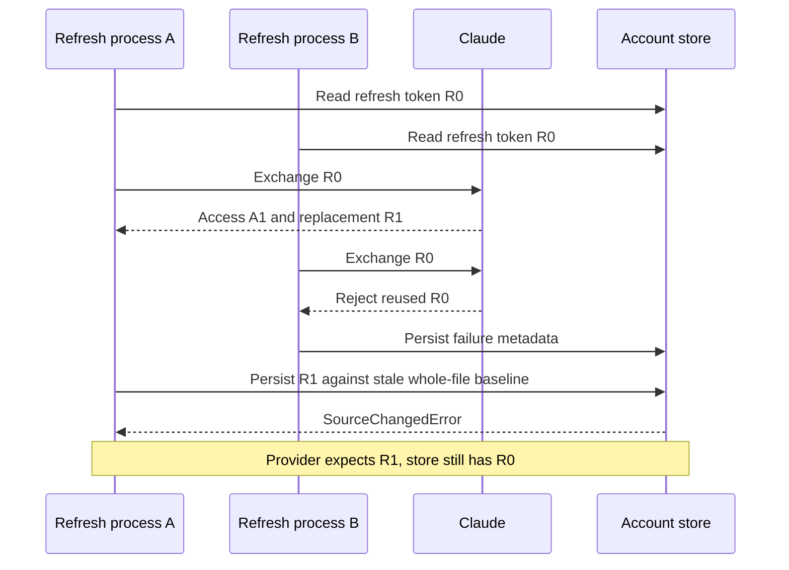

# Claude Credential Modes and Refresh Safety Implementation Plan

> **For agentic workers:** REQUIRED SUB-SKILL: Use
> superpowers:subagent-driven-development (recommended) or
> superpowers:executing-plans to implement this plan task-by-task. Steps use
> checkbox (`- [ ]`) syntax for tracking.

**Goal:** Preserve long-lived Claude setup tokens as a distinct credential
mode while making subscription-login refresh serialized, recoverable,
identity-safe, and explicit from provider boundary through TUI recovery.

**Architecture:** Replace optional-field credential inference with two closed
Claude credential variants and a discriminated account schema. Route all
rotating refreshes through one provider-neutral coordinator backed by a
credential-derived operation lock, private staging, targeted persistence
merge, and crash recovery while the official Claude CLI remains the preferred
refresh authority.

**Tech Stack:** Python 3.14, Typer, Rich, Pydantic 2.13.4, Portalocker 3.2.0,
pytest 9, Ruff, `ty`, `uv`, and the official Claude Code 2.1.207 CLI.

## Global Constraints

- Do not read, write, replace, or adopt the user's active Claude login during
  scheduled maintenance or usage recovery.
- Never persist or print raw access tokens, refresh tokens, provider payloads,
  emails, stable provider identities, or unredacted Claude output.
- Preserve exact released Sidekick 0.6.0 rollback compatibility.
- Add no runtime dependency; reuse Pydantic, Portalocker, `http/`, and existing
  qualified persistence primitives.
- Use Python 3.14 native types, no `Any`, unjustified cast, implicit optional,
  blanket suppression, or deprecated future annotations.
- Keep every changed module below 1000 lines and split cohesive owners near
  the 800-line review threshold before extending them.
- Write only the fewest load-bearing behavior tests; delete tests that exist
  solely for retired optional-field or stale whole-document behavior.
- No live provider mutation occurs in automated tests. Controlled live QA
  requires separate operator authorization.
- No implementation commit or push occurs without explicit operator
  authorization.

---

- **Status:** Tasks 1-7 implemented and verified after corrective live
  recovery. Scheduler restoration, editable/global installation parity, and
  final gates are complete. Commit and push remain pending explicit operator
  authorization
- **Date:** 2026-07-12
- **Repository:** `<REPOSITORY_ROOT>`
- **Branch:** `develop`
- **Baseline commit:**
  `cf3c366c355aef54479e94f4f884e383ecf581eb`
- **Upstream:** `origin/develop`
- **Provider baseline:** Claude Code `2.1.207`
- **Persistence compatibility baseline:** released Sidekick `0.6.0`
- **Implementation authority:** This plan, the tracked provider schema guide,
  and the primary sources linked in section 2

## 1. Outcome

Sidekick must preserve the user's intended Claude authentication method and
must never confuse these two provider contracts:

1. a one-year, inference-only token created by `claude setup-token`; and
2. a full-scope subscription login created by `claude auth login`.

The completed implementation must provide all of the following:

- represent setup-token and subscription-login credentials as different
  domain variants rather than interpreting optional fields after the fact;
- persist the credential kind explicitly and reject internally inconsistent
  combinations;
- distinguish access-token expiry from refresh/login expiry;
- parse and retain Claude Code's `refreshTokenExpiresAt` metadata when present;
- capture stable Claude account and organization identifiers when the provider
  exposes them, without persisting email addresses;
- select the usage route from the credential variant, not an inferred scope
  heuristic;
- prohibit silent setup-token-to-login or login-to-setup-token conversion;
- keep importing a current local login explicit and identity-safe;
- provide a targeted, transactional way to restore one setup token from the
  import-only legacy prototype without replacing unrelated accounts;
- serialize saved-account refreshes across daemon, usage, CLI, and export call
  sites;
- reject duplicate saved access or refresh credential ownership before two
  labels can become independent writers for one provider credential;
- preserve a rotated credential through unrelated concurrent account writes
  and recover safely from an interrupted refresh transaction;
- retain bounded, redacted refresh failure detail instead of collapsing every
  provider rejection into the same generic sentence;
- render exactly one cause and one mode-appropriate recovery action;
- preserve the active `~/.claude` login and provider-owned files;
- retain a verified rollback path readable by released Sidekick `0.6.0`;
- add no runtime dependency; and
- replace redundant or obsolete tests rather than padding the suite.

The intended visible states are:

```text
Claude setup token
  authentication: setup token
  usage route: /v1/messages headers
  auto-refresh: no
  expiry: provider does not expose the token's issued-at timestamp

Claude subscription login
  authentication: subscription login
  usage route: /api/oauth/usage
  access token expires: <time>
  login expires: <time when provider metadata is present>
  auto-refresh: yes while the refresh credential remains usable
```

An expired setup token must not tell the user to import whichever Claude login
is currently active. A rejected subscription refresh must not tell the user to
run `setup-token` unless they explicitly choose to change authentication
method.

## 2. Ground truth and corrected diagnosis

### 2.1 Provider contracts

Anthropic documents `claude setup-token` as producing a one-year OAuth token
for automation. The token is inference-only, is printed rather than installed
as the normal login, and is supplied to Claude Code through
`CLAUDE_CODE_OAUTH_TOKEN`:
[Claude authentication][claude-auth].

Anthropic documents the authentication precedence separately. An explicitly
configured `CLAUDE_CODE_OAUTH_TOKEN` takes precedence over subscription OAuth
credentials stored by `/login`. That precedence belongs to Claude Code. It
does not cause Sidekick to overlay an import-only prototype token onto an
already selected Sidekick account authority.

Anthropic documents `CLAUDE_CODE_OAUTH_REFRESH_TOKEN` and
`CLAUDE_CODE_OAUTH_SCOPES` as the supported non-browser input to
`claude auth login`:
[Claude environment variables][claude-env].

Anthropic also distinguishes a revoked or expired saved login from a valid
access token and instructs users to renew the login when the saved login is no
longer valid:
[Claude authentication errors][claude-errors].

The exact installed `2.1.207` credential envelope contains these relevant
fields:

```text
accessToken
refreshToken
expiresAt
refreshTokenExpiresAt
scopes
subscriptionType
rateLimitTier
```

The installed implementation can additionally write a `tokenAccount` object
containing stable account and organization UUIDs. Those fields are
version-pinned provider observations, not an assertion that Anthropic has
published a complete credential-file schema. Sidekick must continue to use
narrow strict models for only the fields it consumes.

### 2.2 Reproduced Sidekick state transition

The sanitized incident evidence established this transition sequence without
retaining account-specific timestamps:

| Phase | Evidence |
| --- | --- |
| Import-only prototype | The source contained setup-token-shaped records: `token`, no refresh token, and no expiry. |
| Earliest retained Sidekick authority | The affected label already represented a different full-scope login credential with a refresh token, access expiry, and `user:profile`. |
| Saved-login maintenance | Refresh support renewed that login credential for a period of time. |
| Account schema migration | Migration preserved the credential already selected by Sidekick; it did not reimport the prototype. |
| Location conflict replacement | Explicit replacement later selected an older compatibility authority and rolled the Gmail label back from newer canonical rotating credentials. |
| Terminal observation | Claude rejected the rolled-back Gmail refresh credential and the restored historical organization setup token. |

No real label, token, account UUID, organization UUID, email address, or raw
provider payload belongs in tests or tracked implementation evidence.

The corrected conclusion is:

> The nominally one-year setup token did not become an eight-hour token. The
> Gmail label had already become a subscription-login credential, and location
> replacement later rolled it back to an older rotating credential. The
> organization label was restored from the prototype, but Claude independently
> rejected that historical setup token. Credential modes must remain explicit,
> and migration must not replace a provably newer credential with an older one.

### 2.3 Confirmed implementation defects

The baseline has five distinct defects.

1. `core/models.py` had one `ClaudeCredentials` dataclass whose refresh,
   expiry, and scope members could be absent independently. Illegal
   combinations were representable.
2. `CredentialService.refresh_from_source()` imports the current local login
   into an existing label, while the public command name suggests a generic
   renewal operation.
3. `_apply_detected()` merges optional Claude fields and can change the
   effective authentication method without an explicit method transition.
4. Claude credential parsing ignores `refreshTokenExpiresAt`, so doctor and
   maintenance can only report access-token expiry.
5. saved refresh performs the provider exchange before the account authority
   lock. Whole-document optimistic persistence can then reject the successful
   rotated result after another process changes the authority.

### 2.4 Refresh race and crash window

OAuth refresh rotation requires the client to discard an old refresh token
when the authorization server issues a replacement. The OAuth 2.0 Security
Best Current Practice describes rotation and replay detection:
[RFC 9700 refresh-token protection][oauth-security].

The baseline permits this ordering:



The account-file lock is correct for filesystem atomicity but is too late to
serialize the provider mutation. Holding the global account-file lock for an
unbounded browser or network operation would protect correctness but would
block every account and make the five-second store lock contract misleading.
The implementation therefore needs both:

- a bounded provider/refresh-credential operation lock acquired before the
  refresh; and
- a target-account optimistic merge that rebases over unrelated account and
  heartbeat changes under the normal account-store lock.

The provider response and local commit can never be made globally atomic.
The implementation must minimize the remaining crash window and retain
recoverable private staging whenever the official CLI writes replacement
credentials before exiting.

The existing `CredentialSourceGuard` is not this concurrency primitive. Its
current contract detects changes to a distinct import authority while an
operation is running. Keep that guard for its current callers; implement the
refresh operation lock and targeted account merge under the owners named in
section 8 instead of stretching the source guard across unrelated state.

## 3. Non-goals and safety boundaries

This plan does not:

- make Sidekick the owner of the active Claude login;
- write to `~/.claude/.credentials.json`;
- infer a setup token's issue date from its import time;
- claim a setup token is valid merely because one year has not elapsed;
- assign Claude installation token activity to one saved account;
- change Codex's planned complete-home ownership architecture;
- automatically switch accounts based on quota;
- silently reimport the entire legacy prototype;
- persist raw Claude process output, provider responses, email addresses, or
  token-account display metadata;
- hold the global account-store lock while waiting for Claude or the network;
- add a generic lock framework for hypothetical future operations; or
- commit, push, or mutate live credentials without operator authorization.

The implementation may apply the refresh-operation coordinator to Codex
because `refresh_saved()` is provider-neutral and the same rotating-token race
exists there. It must not otherwise broaden into the separate transparent
Codex launcher project.

## 4. Build-versus-adopt decision

No new dependency is justified.

| Need | Decision | Reason |
| --- | --- | --- |
| Cross-platform hard locks | Reuse Portalocker | It is already locked, shipped, qualified by the persistence layer, and exercised on Linux, macOS, and Windows. |
| Provider refresh semantics | Adopt official Claude Code first | The installed CLI owns the supported refresh-token exchange behavior on non-macOS systems. |
| Direct HTTPS fallback | Reuse `http/` | The existing boundary already owns TLS, bounded responses, timeouts, retry safety, and redaction. |
| Strict boundary validation | Reuse Pydantic | It is already the repository standard for untrusted provider and persistence data. |
| Retry policy | Reuse `http/` | Tenacity or another retry package would duplicate the existing policy and would not solve refresh-token operation ownership. |
| OAuth client framework | Do not add Authlib | Sidekick is orchestrating provider credentials already issued to Claude Code; a second OAuth framework would enlarge ownership without fixing mode identity or filesystem durability. |
| Durable refresh state | Extend existing persistence primitives | The repository already owns qualified files, locks, canonical encoding, atomic replacement, immutable lineage, and recovery journals. |

Before adding any helper or type during execution, search its owning package by
the exact proposed concept name and read at least two neighboring files. Reuse
an existing primitive when its contract actually matches; do not force the
Codex private-bundle journal or the account migration journal to represent a
different lifecycle.

## 5. Domain design

### 5.1 Explicit Claude variants

Replace the single optional-field dataclass with two frozen, slotted domain
models in `core/models.py`:

```python
@dataclass(frozen=True, slots=True, kw_only=True)
class ClaudeSetupTokenCredentials:
    provider_id: ClassVar[ProviderId] = ProviderId.CLAUDE
    access_token: str = field(repr=False)


@dataclass(frozen=True, slots=True, kw_only=True)
class ClaudeLoginIdentity:
    account_id: str = field(repr=False)
    organization_id: str = field(repr=False)


@dataclass(frozen=True, slots=True, kw_only=True)
class ClaudeLoginCredentials:
    provider_id: ClassVar[ProviderId] = ProviderId.CLAUDE
    access_token: str = field(repr=False)
    refresh_token: str = field(repr=False)
    access_expiry: KnownExpiry
    refresh_expiry: KnownExpiry | UnknownExpiry
    scopes: tuple[str, ...]
    identity: ClaudeLoginIdentity | None = field(default=None, repr=False)


type ClaudeCredentials = (
    ClaudeSetupTokenCredentials | ClaudeLoginCredentials
)
type Credentials = ClaudeCredentials | CodexCredentials
```

The exact final field types may reuse a narrower existing expiry alias if the
owning package already contains one. They must preserve these invariants:

- setup-token credentials cannot carry refresh state, login scopes, login
  identity, or an access expiry;
- login credentials require a nonempty refresh token, a valid access expiry,
  a unique nonempty scope tuple containing `user:profile`, and explicit
  refresh-expiry state;
- provider identity values are nonempty, bounded, and excluded from
  representations;
- email addresses and display names are never domain identity;
- `Account.provider_id`, access-token access, and provider-neutral operations
  work for both variants without `Any` or casts; and
- pattern matching or small typed helpers replace scattered optional-field
  inference.

`ClaudeCredentialKind(StrEnum)` belongs in `core/types.py` only if it is needed
by doctor, persistence, CLI, and tests. The domain variants remain the source
of truth; the enum is serialization and presentation vocabulary, not a second
state machine.

### 5.2 Access expiry versus login expiry

Rename ambiguous provider-neutral access where necessary:

```text
expiry                  -> access_expiry
expires_at              -> access_expires_at
refreshTokenExpiresAt   -> refresh_expires_at
```

Compatibility properties may remain only at a narrow provider-neutral
boundary when multiple callers still require `account.expiry`. Do not expose
one field called `expiry` in doctor output after two different lifetimes are
known.

Maintenance policy is:

- access expiry determines when a saved login needs an ordinary refresh;
- refresh expiry determines whether automatic refresh is still possible;
- an expired refresh credential fails closed without another provider call;
- a refresh credential within five days of expiry produces a login-renewal
  warning consistent with Claude Code `2.1.203+` behavior;
- a successful provider refresh updates `refresh_expires_at` only when the
  provider supplies replacement lifetime metadata, otherwise it preserves the
  previously proven value; and
- setup tokens never enter saved-login refresh maintenance.

### 5.3 Identity policy

Claude identity comparison uses provider-owned stable IDs only:

1. account UUID plus organization UUID when both sides expose them;
2. no email comparison;
3. no label comparison; and
4. no plan-name comparison.

For an existing login with proven identity:

- matching incoming identity may update the credential;
- mismatching incoming identity requires `--replace-identity`; and
- missing incoming identity fails closed for a different access token unless
  the operator explicitly replaces identity.

For a historical login without identity, a differing local login cannot be
proven equivalent. The command must state that limitation and require the
existing explicit identity-replacement authorization. A normal saved refresh
of the same token lineage does not require local-login identity adoption.

Changing setup-token to login or login to setup-token separately requires
explicit authentication-method replacement. Identity replacement must not be
silently treated as authentication-method replacement, or vice versa.

## 6. Claude provider boundary

### 6.1 Cohesive schema split

`providers/claude/schemas.py` is already 764 lines. Before adding credential
variants, move only credential-envelope, refresh-response, token-account, and
setup-token validation into:

```text
providers/claude/credential_schemas.py
```

Keep usage, header, and activity schemas in `providers/claude/schemas.py`.
Do not create a generic provider schema framework. Update imports and tests in
the same task; no compatibility alias for an internal module is needed.

The credential boundary must consume:

- `accessToken`;
- `refreshToken`;
- `expiresAt`;
- `refreshTokenExpiresAt`;
- `scopes`;
- `subscriptionType`;
- stable `tokenAccount` account and organization IDs when present; and
- refresh-response `refresh_token_expires_in` when present in the exact
  installed response contract.

Unknown provider fields remain ignored at the provider boundary. Every field
Sidekick consumes is strict, bounded, and validated. Boolean timestamps,
negative values, malformed identifiers, duplicate scopes, missing login
requirements, and inconsistent token-account identity are rejected as typed
provider failures.

### 6.2 Detection contract

Detection returns one of these states:

- complete setup-token credentials from an explicitly supplied setup token;
- complete subscription-login credentials from provider-owned login state;
- missing;
- incomplete;
- malformed;
- expired access token with usable refresh credentials;
- expired refresh/login credential; or
- unsupported provider shape.

Do not classify a native credential file as a setup token merely because its
refresh token is missing. Native login state missing required login fields is
incomplete or malformed. `credentials_from_token()` remains the explicit
setup-token input boundary.

### 6.3 Usage and heartbeat routing

Replace scope-derived authentication-method inference with variant routing:

```python
match credentials:
    case ClaudeSetupTokenCredentials():
        return fetch_via_headers(account, http)
    case ClaudeLoginCredentials():
        return fetch_via_oauth_endpoint(account, http)
```

Scopes are still validated for login capability, but they no longer decide
whether a token is a setup token. Heartbeat supports both variants through its
existing provider-specific operations and never changes their credential
kind.

### 6.4 Refresh result and diagnostic contract

The provider emits cause-only typed results. It does not embed a duplicate
recovery instruction.

Required causes include:

```text
missing refresh credential
access credential expired
login credential expired
provider rejected refresh
refresh timed out
refresh process unavailable
refresh output incomplete
refresh output malformed
refreshed identity mismatch
refresh temporarily unavailable
```

Capture Claude CLI output with a bounded byte limit. Redact setup-token,
access-token, refresh-token, email, account-ID, and organization-ID patterns
before a safe excerpt can enter a typed diagnostic. Never persist raw stdout,
stderr, environment values, or the temporary credential envelope.

Reuse the existing bounded process-capture approach where its contract fits.
Do not restore the old behavior of storing arbitrary CLI error text.

## 7. Account schema and migration

### 7.1 New current schema generation

The account authority needs a new explicit schema generation. It must not add
an optional `credential_kind` field to generation one and continue accepting
ambiguous combinations.

The new Claude records are a strict discriminated union. These are synthetic
schema sketches with no credential or account data:

```json
{
  "provider_id": "claude",
  "credential_kind": "setup_token",
  "access_token": "<secret>",
  "plan": "team"
}
```

or:

```json
{
  "provider_id": "claude",
  "credential_kind": "subscription_login",
  "access_token": "<secret>",
  "refresh_token": "<secret>",
  "access_expires_at": "<ACCESS_EXPIRY_UTC>",
  "refresh_expires_at": "<LOGIN_EXPIRY_UTC>",
  "scopes": ["user:inference", "user:profile"],
  "claude_identity": {
    "account_id": "<stable-provider-account-id>",
    "organization_id": "<stable-provider-organization-id>"
  },
  "plan": "team"
}
```

The canonical Claude record uses this nested identity shape. Pydantic must
discriminate both provider and Claude credential kind and forbid fields that
do not belong to the selected variant. Released rollback transforms explicitly
remove the advisory identity object because generation zero cannot represent
it.

If identity is present, persist it as one optional provider-qualified object
whose account and organization members are both required. Do not represent it
as two independently nullable fields; that would admit a half-identity that
the domain cannot safely compare. The whole identity object is absent when
either stable provider ID is unavailable.

Codex records retain their current credential fields and receive the new
document schema version without a behavior change. Heartbeat and refresh
diagnostic fields remain account state outside the credential variant.

### 7.2 Generation-one classification

Migration from the current account schema uses a total, explicit classifier:

| Generation-one Claude shape | New kind | Action |
| --- | --- | --- |
| No refresh token, no expiry, and no `user:profile` scope | Setup token | Migrate deterministically. Normalize known inference-only scopes to the setup variant. |
| Nonempty refresh token, valid access expiry, and scopes containing `user:profile` | Subscription login | Migrate deterministically. Preserve unknown refresh expiry when old data cannot provide it. |
| Refresh token without access expiry | Ambiguous | Block migration and name the affected label without printing fields. |
| Access expiry without refresh token | Ambiguous | Block migration. |
| `user:profile` without complete login refresh state | Ambiguous | Block migration. |
| Setup-shaped record with login-only identity metadata | Ambiguous | Block migration. |
| Invalid expiry or malformed scope data | Invalid | Preserve the existing typed schema failure. |

Do not inspect token text beyond the existing strict Claude token pattern to
guess the credential kind. Setup and login access tokens share a namespace.

Migration preflight reports:

- number of setup-token records;
- number of subscription-login records;
- labels requiring explicit repair;
- whether a refresh-expiry value is unavailable because the old schema never
  stored it; and
- exact next commands.

Migration also rejects exact duplicate provider access tokens or refresh
tokens across labels. A duplicate means Sidekick cannot prove one durable
owner for provider mutation. The diagnostic names the conflicting labels but
never prints, hashes, masks, or otherwise exposes the shared credential.

No token, provider identity, email, scope list, or expiry value is printed in
the migration summary unless it is already part of the secret-safe doctor
contract.

### 7.3 Atomic migration and lineage

Extend the existing account migration state machine rather than bypassing it.
The migration must:

1. require scheduler quiescence;
2. validate canonical, compatibility, prototype, private Codex, and
   interrupted-transaction evidence;
3. publish an immutable exact snapshot of the prior current authority;
4. transform every account in memory;
5. encode and strictly re-decode the complete new document;
6. preserve account order and all unrelated account metadata;
7. commit through the existing qualified atomic authority replacement;
8. prove the reopened bytes and postcondition;
9. leave the import-only prototype untouched; and
10. recover or fail closed after interruption.

`persistence/migrations/account.py` is already over the 800-line cohesion
target. Add the generation-specific classifier and transforms in:

```text
persistence/migrations/credential_kinds.py
```

The existing account migration service orchestrates it. Do not grow the
current module toward the 1000-line hard limit.

If `persistence/schemas.py` or a changed test module would cross the 800-line
review threshold, move one existing cohesive responsibility before adding new
logic. Do not hide growth by compressing code or merging unrelated tests.

### 7.4 Released rollback

`sidekick-usages migrate prepare-rollback --target v0.6.0` must continue to
produce an authority that the bundled exact Sidekick `0.6.0` reader can load
and mutate.

Rollback encoding is:

- setup token: generation-zero Claude record with no refresh token, no access
  expiry, and an explicit inference-only scope list so released routing does
  not mistake it for a full login;
- subscription login: current released access token, refresh token, access
  expiry, scopes, plan, heartbeat state, and refresh diagnostics; and
- Codex: unchanged current rollback contract.

Generation zero cannot represent `refresh_expires_at` or stable Claude
identity. Preparing rollback may omit only those advisory provider metadata
fields. It must never omit or change access tokens, refresh tokens, labels,
plans, account order, Codex private-bundle references, heartbeat state, or
refresh diagnostics. The immutable new-generation snapshot remains available
for an explicit forward migration after rollback.

Update the exact released-reader oracle tests to prove:

1. current -> released rollback -> released read;
2. one released writer mutation;
3. released -> current forward migration;
4. credential-kind reconstruction remains deterministic; and
5. the only permitted round-trip loss is the documented advisory Claude login
   identity and refresh-expiry metadata unavailable to release `0.6.0`.

If broader credential or account state would be lost, stop; rollback is not
production-valid.

## 8. Refresh serialization and recovery

### 8.1 Ownership and modules

Add two cohesive owners:

```text
credentials/refresh.py
    provider-neutral refresh reasons, coordinator, and result policy

persistence/credential_refresh.py
    qualified operation lock, private stage, journal, and recovery
```

`credentials/service.py` is already 769 lines. Move its existing saved-refresh
coordination into `credentials/refresh.py` before adding behavior. Keep source
save/import and Codex login/export workflows in their existing owner.

The persistence module is not a generic job framework. It exists for the
concrete credential-refresh lifecycle shared by scheduled maintenance, usage
401 recovery, and credential-dependent export.

### 8.2 Operation identity and lock

`paths.py` is the sole owner of the private refresh-state root beneath the
native application data directory. A login refresh operation uses a filename
derived from:

```text
SHA-256(
    "sidekick-usages credential refresh lock" + NUL
    + provider_id + NUL
    + refresh_token
)
```

The refresh token is high-entropy secret input and is never written to the
lock file, filename, journal, or diagnostic. Domain separation prevents the
digest from being reused as a general token fingerprint. Two labels holding
the same exact refresh credential therefore contend on the same lock even
before migration rejects that invalid ownership. The account-label digest
remains separate journal routing metadata.

Requirements:

- no raw label or provider identity appears in a basename;
- parent directories are `0700` and private files are `0600` on POSIX;
- Windows ownership and ACL checks reuse the existing qualified platform
  boundary;
- symlinks, reparse points, hard links, unsafe owners, and unsupported
  filesystems fail closed;
- lock acquisition is bounded;
- process termination releases the hard lock;
- recursion or reentrant refresh of the same account is rejected; and
- accounts with different refresh credentials may refresh concurrently.

Setup-token credentials never create a refresh-operation lock because they do
not perform a refresh-token exchange. If a provider refresh token changes, the
next operation intentionally derives a new lock identity from the new durable
credential. A waiter must not continue under a lock derived from stale state.
Lock acquisition therefore uses this stabilization loop:

1. read the target account and derive the operation identity from its current
   refresh token;
2. acquire that operation lock within the bounded wait policy;
3. reload the complete authority;
4. if the target credential was removed, replaced, or changed, release the
   stale lock and either return the newer terminal state or restart from step
   1 with the new credential; and
5. contact the provider only when the reloaded target credential still
   derives the lock currently held.

The restart count and total wait are bounded. Exhaustion returns a typed busy
or concurrently-changing state; it never falls through to an unlocked
provider exchange. This prevents an old-token waiter from refreshing a new
token while another process holds the new-token lock.

Every Sidekick call site that can exchange a saved refresh token must use this
coordinator. A raw provider refresh method remains inaccessible to CLI,
maintenance, usage, heartbeat, export, and daemon composition.

### 8.3 Refresh reasons and fresh-state resampling

Use an explicit small enum for the concrete callers:

```text
scheduled_due
access_rejected
credential_required
operator_forced
```

After the lock-stabilization loop proves the operation lock matches the
current target credential, the coordinator resamples the target account:

- scheduled work skips when another process already refreshed it;
- an access-rejected retry uses the current credential immediately when it no
  longer matches the credential that received the 401;
- a forced operator refresh remains forced but uses the newest saved refresh
  credential;
- expired refresh/login credentials fail without contacting the provider; and
- setup-token credentials return the typed manual-replacement state without
  entering the refresh adapter.

These reasons serve existing call sites. Do not add hooks or future-provider
parameters.

### 8.4 Private staging and journal

Before starting an external refresh, write a non-secret intent journal under
the private refresh root containing:

- schema version;
- provider ID;
- account-label digest;
- expected credential-kind value;
- SHA-256 digest of the expected secret-bearing credential record;
- operation start time;
- refresh reason; and
- stage state.

The journal never contains a label, token, provider account ID, organization
ID, email, scope list, command output, or raw path outside the managed root.

For the official Claude CLI path:

1. create a private stage directory;
2. set child-only `HOME`, `USERPROFILE`, `APPDATA`, `LOCALAPPDATA`,
   `XDG_CONFIG_HOME`, and `CLAUDE_CONFIG_DIR` to that directory;
3. pass only the saved refresh token and scopes through child environment;
4. remove conflicting credential environment variables;
5. run the exact official login command with bounded time and output;
6. reopen and strictly validate the staged credential file;
7. update the journal with a digest of the complete validated target; and
8. commit the target account before deleting the only staged replacement.

For the direct HTTPS fallback, validate the response and immediately create
the same private staged target before attempting the account commit.

The unavoidable crash interval between the provider returning a rotated
credential and Sidekick durably staging it must be documented and minimized.
Do not falsely claim distributed atomicity with the provider.

### 8.5 Targeted optimistic merge

The final account commit must not use the stale whole-document baseline loaded
before the provider call.

Under the ordinary account-store lock:

1. recover any existing credential transaction;
2. read and strictly validate the newest complete account authority;
3. find the exact provider and label;
4. require its credential kind and secret-bearing credential digest to match
   the refresh intent;
5. preserve all unrelated accounts and their order;
6. preserve concurrent heartbeat and non-credential metadata changes on the
   target account;
7. replace only credentials, plan fields proven by the provider, and refresh
   diagnostics;
8. encode and commit against the freshly observed authority fingerprint;
9. prove exact reopened bytes;
10. mark the refresh journal committed; and
11. remove the private stage and journal.

If the target account was removed, renamed, or had its credentials explicitly
replaced, do not resurrect or overwrite it. Delete the stale staged result
after recording a secret-safe terminal recovery decision. A changed unrelated
account is not a conflict.

### 8.6 Recovery matrix

Startup and pre-refresh recovery must implement this complete matrix:

| Journal/stage/account state | Recovery |
| --- | --- |
| Intent exists, no complete stage | Delete incomplete private state; leave account unchanged. |
| Complete stage, base credential still current | Finish the targeted account commit, prove it, then clean up. |
| Account already equals staged target | Treat as committed and clean up idempotently. |
| Complete stage, unrelated accounts changed | Rebase and finish the targeted commit. |
| Complete stage, target credentials changed | Do not overwrite the newer credentials; clean up the stale stage. |
| Complete stage, target removed or renamed | Do not recreate it; clean up the stale stage. |
| Journal malformed, unsafe, oversized, or linked | Fail closed and surface an explicit recovery command. |
| Commit durability uncertain | Retain recoverable evidence and block further refreshes. |

Recovery never sends another provider request automatically. It resolves only
local evidence from an exchange that already happened.

Doctor, account migration, rollback preparation, and full reset must include
the private refresh root in their state machine:

- doctor reports a clean, recoverable, or blocked refresh transaction without
  printing its digest or managed path;
- account migration and rollback require the scheduler and refresh-operation
  set to be quiescent;
- a recoverable completed stage is resolved before schema or location
  migration;
- an unsafe or durability-uncertain stage blocks migration and normal
  refresh;
- full reset removes staged refresh credentials and journals before removing
  the final account authority, then proves both are absent; and
- uninstalling the daemon never deletes account or refresh recovery state.

### 8.7 Failure diagnostics

Failure persistence also uses a targeted merge guarded by the exact current
credential digest. A late failure may not overwrite a newer successful
credential or its success state. If another process already updated the
credential, discard the stale failure and return the newest account state to
the caller.

## 9. Credential workflows and product UX

### 9.1 `refresh <label>`

Retain the public command for compatibility, but make its real behavior clear:

```text
Import the current provider login into one saved label.
```

For Claude:

- setup token -> subscription login requires `--replace-auth-method`;
- login -> a different proven identity requires `--replace-identity`;
- login with unproven identity and a different token requires
  `--replace-identity`;
- changing both method and identity requires both explicit authorizations;
- noninteractive ambiguity fails closed; and
- no incoming `None` field preserves incompatible state from the old
  credential variant.

The success output names the resulting authentication method without printing
identity:

```text
Updated '<label>' as a Claude subscription login.
```

### 9.2 `claude setup-token`

The command always yields `ClaudeSetupTokenCredentials`. Replacing an existing
login still requires its existing explicit `--force` overwrite plus a clear
method-change preview. The operation must:

- replace the entire credential variant;
- clear access-refresh and login-expiry diagnostics;
- preserve label, plan unless explicitly overridden, heartbeat enablement,
  and heartbeat history;
- validate the provider token pattern without logging output; and
- never retain the old refresh token, expiry, scopes, or identity.

### 9.3 Targeted legacy restore

Add:

```text
sidekick-usages claude restore-setup-token <label> [--yes]
```

This command exists for the concrete imported-prototype recovery case. It:

1. reads the exact import-only prototype through qualified bounded
   persistence;
2. requires a valid setup-token-shaped source record for the exact label;
3. requires a current Claude account with the same label;
4. previews that only the credential authentication method will change;
5. asks for confirmation unless `--yes` is explicitly supplied;
6. verifies the exact candidate through the existing bounded Claude usage
   boundary before persistence;
7. snapshots the current authority;
8. replaces only that account's credential variant;
9. preserves the current label, plan, heartbeat configuration, and unrelated
   accounts;
10. clears stale login refresh errors;
11. commits transactionally and proves the result; and
12. leaves the prototype unchanged.

The verification is a real, quota-bearing provider request. Authentication,
transport, rate-limit, or malformed-response failures leave both the current
authority and prototype byte-for-byte unchanged. This prevents a historical
token that Claude already rejects from replacing a currently saved
credential.

Do not implement this by calling whole-store `--reimport-prototype`. Do not
copy the token through command arguments, logs, stdout, environment variables,
or temporary plaintext outside the managed transaction.

### 9.4 Doctor and list output

Doctor JSON adds stable fields:

```text
credential_kind
access_expires_at
access_expiry_state
refresh_expires_at
refresh_expiry_state
identity_state
can_auto_refresh
```

`identity_state` is the closed value `known` or `unavailable`. Doctor never
prints or hashes the provider identity itself.

Human doctor output uses product language:

```text
authentication: setup token
authentication: subscription login
access token expires: in 6h 42m
login expires: Dec 1, 2026
```

The account list remains concise and secret-safe. It may add authentication
method only if the existing row has an intentional metadata column; do not
crowd the primary dashboard to expose an implementation detail.

### 9.5 Recovery copy ownership

Provider adapters own causes. CLI/render owners own actions. Each failed row
contains one cause and one recovery action.

Setup-token rejection:

```text
Claude rejected the saved setup token.
Run: sidekick-usages claude setup-token --label <quoted-label> --force
```

Subscription-login refresh rejection:

```text
Claude rejected the saved subscription login.
Sign in to that Claude account, then run:
sidekick-usages refresh <quoted-label>
```

If the active local Claude identity is known to differ, the action must warn
before suggesting import. All labels are shell-quoted through the existing
`shlex.join` convention. No line repeats “log in again.”

## 10. Production-valid migration rule

Local TDD may temporarily have red tests or incomplete imports. No runtime
commit may contain any of these states:

- domain variants without a readable current persistence schema;
- a new schema without migration and released rollback;
- provider parsing that still constructs the old optional-field model;
- usage routing that still infers setup-token identity from scopes;
- a public refresh command that silently changes authentication method;
- a provider exchange that bypasses the operation coordinator;
- a refresh stage that can contain secrets without recovery and cleanup;
- whole-document stale-baseline persistence after a rotated provider result;
- mode-specific provider causes paired with generic duplicate actions;
- a targeted restore command that can replace more than one account;
- active documentation describing the old optional-field behavior; or
- changed modules or tests over the 1000-line hard limit.

The domain, provider parser, new schema, migration, rollback, refresh
coordinator, call-site composition, and core regression tests land as one
production-valid runtime commit. CLI recovery and documentation may be
separate commits only after the runtime commit is independently safe and all
public commands still fail closed.

## 11. Implementation sequence

### Task 1: Baseline and behavior-contract map

**Files:**

- Modify: no production or test file
- Durable evidence: the inlined implementation record below

**Interfaces:**

- Consumes: current Claude credential, provider, credential-service,
  persistence, doctor, and CLI public boundaries.
- Produces: a verified clean baseline and an assertion-level map assigning each
  new RED test to the task that defines the interface it exercises.

**Steps:**

- [x] Confirm branch, baseline, upstream, worktree, Python 3.14, Claude Code
  2.1.207, and installed Sidekick versions using the commands in section 14.1.
- [x] Run the current focused provider, credential, persistence, and CLI
  suites and record the exact collected/pass count before changing tests.
- [x] Search the owning packages for `credential_kind`, `access_expiry`,
  `refresh_expiry`, `refreshTokenExpiresAt`, `operation lock`, `refresh
  journal`, `targeted merge`, and `CredentialSourceGuard` before declaring
  names.
- [x] Assign these credential-mode RED cases to Task 2 and Task 5, immediately
  before their corresponding production changes:

  - `test_setup_token_cannot_carry_login_state` constructs the setup variant
    and proves no refresh, scope, expiry, or identity member exists.
  - `test_login_requires_complete_refresh_state` parameterizes missing refresh
    token, access expiry, `user:profile`, and half-identity and asserts the
    strict boundary rejects each.
  - `test_usage_route_depends_on_credential_variant` proves a setup variant
    with no scope member uses headers, while login variants with reordered
    valid scopes and missing optional identity still use `/api/oauth/usage`.
    Scope order or identity availability cannot make a login impersonate a
    setup token.
  - `test_import_requires_explicit_auth_method_replacement` attempts a public
    setup-to-login import without authorization and asserts no persisted byte
    changes.
  - `test_refresh_expiry_is_distinct_from_access_expiry` parses two different
    synthetic timestamps and asserts both survive domain and persistence
    round trips independently.

- [x] Assign these transaction RED cases to Task 4, after its public
  coordinator and persistence ports are named but before their production
  implementation:

  - `test_same_refresh_credential_has_one_provider_exchange` blocks two callers
    at the fake provider and asserts one request plus one durable replacement.
  - `test_rotated_waiter_reacquires_the_new_credential_lock` pauses the waiter
    on the old lock, persists rotation, and asserts the waiter acquires the new
    lock before the fake provider observes a request.
  - `test_rotated_result_rebases_over_an_unrelated_write` changes another
    account and target heartbeat while the provider is paused, then asserts
    all concurrent fields and the rotation survive.
  - `test_complete_stage_recovers_without_another_provider_call` interrupts
    after a complete stage and asserts restart commits locally with zero new
    provider requests.
  - `test_late_failure_cannot_overwrite_a_newer_success` releases a stale
    rejection after a success and asserts success state remains unchanged.

- [x] Record which existing cases will move or be deleted only after their
  replacement RED test has failed and passed in its owning task.

**Stop/go gate:** Existing focused and full tests pass. No speculative test,
future-type import, fixture format, production code, or tracked file change is
introduced by this characterization task.

**Implementation record (complete):** The baseline was captured on `develop`
at `cf3c366c355aef54479e94f4f884e383ecf581eb`, aligned with
`origin/develop` in the primary checkout. The project interpreter was Python
3.14.6, Claude Code was 2.1.207, and both the working-tree and installed
Sidekick versions were 0.6.0. The focused baseline collected and passed 251
tests; the full baseline collected 808 tests, with 804 passing and four
expected platform skips. The required concept search found no conflicting
owner for the planned credential-kind, lifetime, operation-lock, refresh-stage,
or targeted-merge vocabulary. The RED assignments and test replacement map
above were recorded before production changes; Task 1 itself changed no
tracked source or test.

### Task 2: Domain variants and Claude provider boundary

**Files:**

- `src/sidekick_usages/core/models.py`
- `src/sidekick_usages/core/types.py`
- `src/sidekick_usages/providers/claude/credential_schemas.py` (new)
- `src/sidekick_usages/providers/claude/schemas.py`
- `src/sidekick_usages/providers/claude/credentials.py`
- `src/sidekick_usages/providers/claude/provider.py`
- `src/sidekick_usages/providers/claude/usage.py`
- `src/sidekick_usages/providers/claude/heartbeat.py`
- focused provider and domain tests

**Interfaces:**

- Consumes: existing `KnownExpiry`, `UnknownExpiry`, `ProviderId`, strict
  Pydantic provider conventions, HTTP/CLI adapters, and provider result types.
- Produces: the exact credential and identity types in section 5.1, strict
  credential-envelope parsing from section 6.1, and exhaustive variant-based
  usage, heartbeat, and refresh routing.

**Steps:**

- [x] Write the Task 2 credential invariant, refresh-expiry parsing, and
  variant-routing tests against the exact interfaces above; run them and
  observe assertion failures caused by the old optional-field behavior before
  changing production code.
- [x] Move only credential-envelope, token-account, refresh-response,
  setup-token, and credential timestamp models into
  `providers/claude/credential_schemas.py`; update imports and run existing
  Claude tests to prove the split has no behavior change.
- [x] Implement `ClaudeSetupTokenCredentials`, `ClaudeLoginIdentity`,
  `ClaudeLoginCredentials`, and the `ClaudeCredentials` union exactly as
  specified in section 5.1.
- [x] Make `credentials_from_token()` construct only the setup variant and
  make native login detection construct only a complete login variant.
- [x] Parse `expiresAt` into access expiry and `refreshTokenExpiresAt` or
  `refresh_token_expires_in` into refresh expiry; reject Boolean, negative,
  malformed, and inconsistent values.
- [x] Construct the optional login identity only when both stable IDs exist;
  reject partial identity and verify equality when old and refreshed identities
  are both known.
- [x] Route usage and heartbeat with exhaustive variant matching as shown in
  section 6.3; scopes remain capability validation, not kind inference.
- [x] Replace every old `isinstance(..., ClaudeCredentials)` and optional-field
  kind check with exhaustive handling of the two variants.
- [x] Remove dead optional-field paths and stale comments, then run the focused
  gate below and confirm the Task 2 credential-mode tests are green.

**Focused gate:**

```bash
uv run pytest \
  tests/test_core_models.py \
  tests/test_scope_gate.py \
  tests/test_header_path.py \
  tests/test_claude_refresh.py \
  tests/test_claude_credential_modes.py -q
uv run ruff check src/sidekick_usages/core \
  src/sidekick_usages/providers/claude tests/test_claude_credential_modes.py
uv run ty check src/sidekick_usages/core \
  src/sidekick_usages/providers/claude tests/test_claude_credential_modes.py
```

**Implementation record (complete):** The domain now has closed setup-token
and subscription-login credential variants, complete-or-absent stable Claude
identity, and independent access/login expiry. The Claude provider boundary
strictly decodes the credential envelope and refresh response, while usage and
heartbeat route by credential variant. Focused invariant, malformed-boundary,
route, refresh, and round-trip tests cover the implemented surface and are
included in the verified Task 2-6 matrix.

### Task 3: Explicit schema, migration, and released rollback

**Files:**

- `src/sidekick_usages/persistence/_schema_models.py`
- `src/sidekick_usages/persistence/schemas.py`
- `src/sidekick_usages/persistence/transforms.py`
- `src/sidekick_usages/persistence/observations.py`
- `src/sidekick_usages/persistence/artifacts.py`
- `src/sidekick_usages/persistence/assessment.py`
- `src/sidekick_usages/persistence/inventory.py`
- `src/sidekick_usages/persistence/migrations/account.py`
- `src/sidekick_usages/persistence/migrations/credential_kinds.py` (new)
- `src/sidekick_usages/persistence/migrations/location.py`
- `src/sidekick_usages/persistence/v060.py`
- `src/sidekick_usages/cli/commands/migrate.py`
- `packaging/verify_v060_compat.py`
- focused persistence, migration, and release-compatibility tests

**Interfaces:**

- Consumes: Task 2 credential variants, the existing canonical account
  authority, qualified atomic replacement, migration lineage, and the bundled
  exact Sidekick 0.6.0 reader/writer oracle.
- Produces: a strict new current schema generation, total generation-one
  classifier, duplicate credential rejection, atomic forward migration, and
  deterministic released rollback/forward reconstruction.

**Steps:**

- [x] Write failing strict-schema cases for both section 7.1 records and for
  every forbidden mixed/partial state before adding the new generation.
- [x] Add the strict discriminated Claude record union and nested optional
  `claude_identity`; both identity members are required together and
  `extra="forbid"` applies at every persistence boundary.
- [x] Implement the total setup/login/ambiguous/invalid classifier from section
  7.2 in `persistence/migrations/credential_kinds.py`.
- [x] Reject exact duplicate provider access or refresh credential ownership
  during persistence and migration preflight without printing or hashing the
  shared value.
- [x] Block ambiguous records before mutation with typed issues, affected
  labels, and exact secret-safe next actions.
- [x] Extend the existing migration state machine to snapshot prior bytes,
  transform and strict re-decode the complete document, atomically commit,
  reopen/prove, and recover or fail closed after interruption.
- [x] Make runtime loading accept only the new current generation or true
  absence; valid old state reports `sidekick-usages migrate accounts` and does
  not auto-migrate.
- [x] Implement new-current -> released rollback using the exact command
  `sidekick-usages migrate prepare-rollback --target v0.6.0` and verify it with
  the bundled released reader and writer.
- [x] Implement deterministic released -> new-current reconstruction and prove
  the only permitted round-trip loss is the documented advisory identity and
  refresh-expiry metadata.
- [x] Prove prototype and compatibility authorities remain unchanged unless
  the selected migration operation explicitly owns them.
- [x] Split cohesive schema or migration owners before any changed production
  or test module reaches the repository line limits, then run the focused gate.

**Focused gate:**

```bash
uv run pytest \
  tests/test_persistence_schemas.py \
  tests/test_persistence_migrations.py \
  tests/test_persistence_migration_transactions.py \
  tests/test_persistence_coordinator.py \
  tests/test_persistence_assessment.py \
  tests/test_v060_runtime.py -q
uv run python packaging/check_architecture.py
```

**Stop/go gate:** Do not continue if any real current account shape cannot be
classified without guessing, or if released rollback loses secret-bearing or
operational account state.

**Implementation record (complete):** Persistence now writes and loads strict
schema version two, classifies historical generation-zero/version-one input
without guessing, rejects ambiguous or duplicate credential ownership, and
uses immutable v0/v1/v2 lineage artifacts. Migration and rollback are
transactional and restart-assessable; downgrade preparation snapshots current
v2 bytes, emits generation zero, and is verified by the bundled released
reader. Focused schema, migration, recovery, assessment, and released-runtime
tests are included in the verified Task 2-6 matrix.

### Task 4: Serialized and recoverable credential refresh

**Files:**

- `src/sidekick_usages/paths.py`
- `src/sidekick_usages/credentials/refresh.py` (new)
- `src/sidekick_usages/credentials/service.py`
- `src/sidekick_usages/persistence/credential_refresh.py` (new)
- `src/sidekick_usages/persistence/account_store.py`
- qualified POSIX, macOS, and Windows persistence owners as required
- `src/sidekick_usages/maintenance.py`
- `src/sidekick_usages/usage/service.py`
- Codex export/refresh composition only where it calls shared refresh
- `packaging/check_architecture.py`
- `packaging/smoke_wheel.py` if its package/file allowlist is explicit
- `tests/test_architecture.py`
- `tests/test_packaging.py` if distribution contents change
- focused refresh, persistence, usage, and maintenance tests

**Interfaces:**

- Consumes: Task 2 login variants, Task 3 current schema, `AccountStore`,
  `SidekickPaths`, qualified private files, Portalocker, provider adapters,
  injected clock/process/HTTP boundaries, and typed refresh results.
- Produces: `CredentialRefreshReason`, one
  `CredentialRefreshCoordinator`, the private refresh transaction owner, and a
  targeted account merge. CLI, usage, maintenance, heartbeat, daemon, and
  export cannot invoke a raw rotating refresh outside that coordinator.

  The coordinator's public application interface is:

  ```text
  CredentialRefreshCoordinator.refresh(
      *,
      label: AccountLabel,
      reason: CredentialRefreshReason,
  ) -> CredentialRefreshResult
  ```

  Persistence remains behind a constructor-injected typed port; callers do not
  receive lock, journal, stage, digest, or filesystem handles.

**Steps:**

- [x] Name the coordinator and persistence ports above, then write the Task 4
  serialization, lock-stabilization, targeted-merge, crash-recovery, and
  stale-failure tests against those public contracts. Run them and observe
  assertion failures for the missing behavior before implementing the ports.
- [x] Move existing provider-neutral saved-refresh orchestration out of the
  near-threshold credential service before adding behavior; run existing tests
  to prove the move alone is behavior-preserving.
- [x] Add the private refresh root through `paths.py` and qualify it with the
  existing POSIX, macOS, and Windows private-tree security contracts.
- [x] Add the four-value `CredentialRefreshReason` enum from section 8.3 and a
  coordinator method accepting exact label plus reason and returning the
  existing typed `CredentialRefreshResult` vocabulary.
- [x] Implement the domain-separated provider/refresh-credential operation
  lock with existing Portalocker, bounded acquisition, no raw token/digest
  output, and reentrant-operation rejection.
- [x] Implement the bounded read -> derive -> lock -> reload stabilization loop
  from section 8.2; changed credentials release the stale lock and reacquire
  before any provider request.
- [x] Add the private intent/stage journal with exactly the non-secret fields
  in section 8.4 and every recovery branch in section 8.6.
- [x] Make official Claude CLI refresh use only the managed private stage,
  child-only home/config environment, bounded output, strict staged-file
  validation, and cleanup only after the target account commit is proven.
- [x] Stage a validated direct-HTTPS result immediately through the same
  private transaction owner and document the unavoidable response-to-stage
  crash interval.
- [x] Add the account-store targeted merge against the freshly observed
  authority, preserving unrelated account/order and concurrent target metadata
  while replacing only allowed credential, plan, and diagnostic fields.
- [x] Resample current state after stable lock acquisition for every refresh
  reason; setup tokens return typed manual replacement without entering the
  provider refresh adapter.
- [x] Route maintenance, usage auth recovery, operator force, and export
  through the coordinator and make raw provider rotation inaccessible to those
  composition owners.
- [x] Make late failure persistence conditional on the unchanged target
  credential so it cannot overwrite a newer successful rotation.
- [x] Integrate private refresh state with doctor, migration, rollback, full
  reset, and daemon-uninstall behavior exactly as section 8.6 requires.
- [x] Make the transaction tests prove different credentials progress
  concurrently, duplicate-label same credentials have one exchange, and a
  rotated waiter acquires the new lock before provider access.

**Focused gate:**

```bash
uv run pytest \
  tests/test_credential_refresh_transactions.py \
  tests/test_claude_refresh.py \
  tests/test_credential_service.py \
  tests/test_usage_service.py \
  tests/test_cli_refresh.py \
  tests/test_persistence_account_store.py \
  tests/test_persistence_credential_transactions.py -q
uv run python packaging/check_architecture.py
```

**Stop/go gate:** A simulated rotated replacement must remain recoverable after
every injected crash point. No test may make a real provider or network call.

**Implementation record (complete):** All rotating saved-credential paths now
enter one reason-bearing coordinator. Operations sharing a provider refresh
credential serialize through the credential-derived identity, reload after
lock acquisition, persist a private intent and complete stage, and merge only
the targeted credential over current durable state. Recovery completes a valid
stage without a second provider exchange; stale failures cannot overwrite a
newer success. Deterministic fake-provider and injected-filesystem tests cover
serialization, rotated-lock reacquisition, rebasing, interruption, cleanup,
doctor, migration, rollback, and reset behavior.

### Task 5: Explicit transitions, targeted restore, and recovery copy

**Files:**

- `src/sidekick_usages/cli/commands/credentials.py`
- `src/sidekick_usages/cli/commands/claude.py`
- `src/sidekick_usages/cli/context.py`
- `src/sidekick_usages/doctor.py`
- `src/sidekick_usages/usage/models.py`
- `src/sidekick_usages/usage/render.py`
- `src/sidekick_usages/usage/narrow_render.py`
- existing CLI, doctor, render, and help tests

**Interfaces:**

- Consumes: Task 2 variants/identity, Task 3 migration vocabulary, Task 4
  coordinator/results, existing Typer context, `shlex.join`, and Rich render
  boundaries.
- Produces: independent authentication-method and identity authorizations,
  exact-label legacy setup-token restoration, separate access/login expiry in
  doctor, and one provider cause plus one mode-appropriate recovery action.

**Steps:**

- [x] Add failing public service/CLI cases for setup -> login, login -> setup,
  identity match, identity mismatch, unknown identity, and both changes at
  once; assert failed transitions leave persisted bytes unchanged.
- [x] Add `--replace-auth-method` and compose it independently from
  `--replace-identity`; require both when both method and identity change and
  fail closed on noninteractive ambiguity.
- [x] Make setup-token overwrite replace the complete credential variant so no
  old refresh token, expiry, scopes, or identity survive.
- [x] Add the exact command
  `sidekick-usages claude restore-setup-token <label> [--yes]` using qualified
  prototype reads, one exact setup-shaped source record, transactional target
  replacement, reopen/proof, and unchanged unrelated authorities.
- [x] Add doctor's separate credential kind, access expiry, login expiry, and
  auto-refresh values without exposing identity or inventing a setup-token
  issue date.
- [x] Replace generic authentication failures with the cause-only typed states
  in section 6.4; persist only bounded redacted detail.
- [x] Make renderer/CLI own one recovery action selected from credential kind
  and available safe source; delete the provider's duplicate “log in again”
  action text.
- [x] Preserve narrow and normal TUI fit, `shlex.join` label quoting, and
  noninteractive failure behavior with exact product-contract assertions only.
- [x] Update and run `-h` and `--help` at every affected command level, then
  run the focused gate below.

**Focused gate:**

```bash
uv run pytest \
  tests/test_cli_refresh.py \
  tests/test_help.py \
  tests/test_doctor.py \
  tests/test_render.py \
  tests/test_check_errors.py \
  tests/test_cli_persistence.py -q
```

**Implementation record (complete):** Authentication-method replacement and
stable-identity replacement are independent public authorizations, including
the case where both are required. Setup-token replacement clears all login
state. The exact-label `claude restore-setup-token` path uses qualified,
import-only prototype evidence, verifies the exact candidate through the
existing Claude usage boundary before persistence, and leaves unrelated
authorities unchanged on success or verification failure.
Doctor reports credential kind plus separate access/login lifetime, and CLI or
renderer output pairs one provider cause with at most one safely quoted,
mode-appropriate action. Public service, CLI, doctor, render, help, and
non-mutation tests are included in the verified Task 2-6 matrix.

### Task 6: Documentation and architecture contracts

**Files:**

- `AGENTS.md`
- `README.md`
- `docs/claude/README.md`
- `docs/claude/debugging.md`
- `docs/claude/schema.md`
- `docs/token-maintenance.md`
- `docs/persistence-and-recovery.md`
- `docs/heartbeat.md`
- `docs/superpowers/specs/2026-07-09-maintainable-application-architecture-design.md`
- this plan's status and implementation record after completion
- architecture and documentation tests

**Interfaces:**

- Consumes: Tasks 2-5 final public behavior, command help, schema generation,
  recovery lifecycle, and concrete module ownership.
- Produces: current tracked operator guidance and enforceable architecture and
  package contracts with no ignored-source dependency.

**Steps:**

- [x] Update ownership only where the new concrete modules materially change
  it; enforce core/provider/credentials/persistence boundaries in the
  architecture checker and tests.
- [x] Document setup-token versus login semantics, command transitions, and
  the fact that a setup-token issue date cannot be recovered from its token.
- [x] Document access versus login expiry and the five-day login-renewal
  warning without describing access expiry as the credential lifetime.
- [x] Document refresh serialization, private staging, recovery, reset, and
  the residual provider/local atomicity limit.
- [x] Update the Claude schema guide with public contracts and exact 2.1.207
  observed fields plus revalidation instructions; do not commit extracted
  provider source.
- [x] Remove stale advice that treats `refresh <label>` as safe for every
  Claude credential kind.
- [x] Scan all changed documentation for real labels, identities, timestamps,
  token values, ignored paths, or obsolete optional-field terminology and
  remove every hit that is not an explicit synthetic contract.
- [x] Run link, anchor, Mermaid, Markdown, docs, and architecture validation.

#### Task 6 implementation record — 2026-07-13

Task 6 is implemented. Active operator documentation now describes the closed
setup-token and subscription-login variants, independent transition
authorizations, exact-label restore, separate access/login lifetimes, safe
refresh recovery, full-reset behavior, and the residual provider/local
atomicity limit. The Claude schema guide records the exact 2.1.207 observed
field names and a reproducible key-name and synthetic-test revalidation flow
without copied provider source.

Implementation review exposed one prerequisite defect: maintenance had no
five-day login-renewal state. The completed correction derives that advisory
from current credentials, warns at the exact five-day boundary, leaves refresh
history unchanged, and fails an expired login before provider traffic. A final
rendering correction preserves the provider failure cause while also showing
the independent, non-persisted five-day warning and exactly one quoted manual
action after a failed access refresh.

The architecture gate now enforces directed core, persistence, provider, and
credential owners. Source, sdist, and wheel checks require the exact package
namespace and include the restore help surface. Documentation tests validate
required contracts, secret/stale-language exclusions, local links, anchors,
Mermaid fence closure, and concrete module ownership. Markdown and all three
changed Mermaid diagrams were validated successfully. Task 7's global
installation and controlled live QA were not performed by Task 6.

Fresh final Task 6 verification passed the 86-test correction matrix and the
278-test focused Task 2-6 matrix. The complete tree passed 974 tests with four
expected platform skips; the matching branch-coverage run passed the same
tests at 74% diagnostic coverage. Ruff reported 232 formatted files and no
lint findings, `ty` passed, and the architecture gate reported zero cohesion
warnings with every Python module below 800 lines. The 31-test documentation,
architecture, and package gate passed; Markdown lint reported zero errors; all
three Mermaid diagrams rendered with Mermaid CLI 11.16.0; released-v0.6.0
compatibility, the offline build, and exact-wheel smoke verification passed.
Every offline pre-commit hook passed; only the network-dependent `uv-secure`
hook was explicitly skipped. Dependency reinstall/audit, global-tool
installation, and live-provider QA remain pending under Task 7 because Task 6
prohibited network, dependency, global-installation, and live-credential
operations.

### Task 7: Complete verification, installation, and controlled QA

**Files:**

- Modify: no production file unless a preceding gate exposes a real defect
- Update: this plan's status and implementation record after completion

**Interfaces:**

- Consumes: the complete production-valid Tasks 1-6 implementation.
- Produces: fresh automated/distribution evidence, repository/global executable
  parity, authorized live-QA results or an explicit waiver, and exact
  worktree/upstream status.

- [x] Execute sections 14.1 through 14.7 in order and require every command to
  exit zero; fix root causes and rerun the complete affected gate rather than
  suppressing it.
- [x] Execute section 14.8 to rebuild and verify both the editable working-tree
  entry point and the global uv tool from the same checkout.
- [x] Stop and present the exact section 14.9 migration/probe actions before
  any live credential mutation or quota-bearing inference request.
- [x] Run the separately authorized live QA or record that it was explicitly
  waived; never infer live success from mocked tests.
- [x] Inspect `git status --short --branch`, `git diff --stat`,
  `git diff --check`, local HEAD, and `origin/develop` before any completion
  claim.
- [ ] If and only if the operator authorizes commits, use section 15's
  Conventional Commit sequence. Do not push until the operator explicitly
  requests a push.

Task 7 automated verification and installation record (2026-07-13):

- The environment rerun used Python 3.14.6 and Claude Code 2.1.207 from local
  HEAD `cf3c366c355aef54479e94f4f884e383ecf581eb`, which exactly matched
  `origin/develop`. The first literal `python --version` attempt exposed that
  the non-interactive shell omitted the existing project virtual environment;
  after activating that environment, section 14.1 was rerun from its first
  command and passed. Dependency synchronization changed no lock or project
  file, and the npm install and moderate audit reported zero vulnerabilities.
- The exact focused matrix passed 278 tests before the live correction. The
  final full suite passed 986 tests with seven expected platform skips, and
  the matching branch-coverage run passed at 74% diagnostic coverage. Ruff
  reported all 235 Python files formatted and no lint findings, and `ty`
  passed. The architecture gate passed with five reviewed cohesion warnings;
  every warned module remains below the hard 1000-line limit and was reviewed
  as a cohesive owner rather than split merely to remove an advisory.
- Markdown lint checked 29 files with zero errors. Every network-backed
  pre-commit hook passed, including `uv-secure`; `git diff --check` passed.
  Mermaid CLI 11.16.0 rendered this plan and both changed Claude diagrams.
- The exact stale-concept and safety sweeps found only intentional legacy
  migration aliases and synthetic test fixtures. Manual review exposed one
  machine-specific negative test literal; it was replaced by the portable
  `/home/` boundary, and the affected documentation suite passed all seven
  tests. No token, real identity, raw provider output, suppression, dead
  import, or remaining local absolute path was found.
- `uv build` produced the exact 0.6.0 source and wheel distributions, and the
  exact-wheel smoke program verified
  `sidekick_usages-0.6.0-py3-none-any.whl`.
- The global uv tool was force-installed as an editable 0.6.0 package from
  `<REPOSITORY_ROOT>`. Repository and global Python both resolved
  `sidekick_usages` to the checkout's `src/` package. Version, root help,
  doctor help, targeted setup-token restore help, and account migration help
  had identical exit codes and byte-for-byte output.
- After live QA was separately authorized, repository and global Claude doctor
  JSON matched byte for byte. Root help also matched, and both Python
  environments resolved `sidekick_usages` to the checkout's `src/` package.
- After separate explicit authorization, the exact read-only Phase A discovery
  passed. The public all-backend assessor reported `systemd` absent, `cron`
  absent, `task-scheduler` installed, and no unassessable backend. The retained
  private evidence met the mode-700 directory and mode-600 file contract.
  Phase B did not run under that approval. Controlled live QA therefore remains
  incomplete and unwaived pending a separate authorization naming the exact
  credential transition and all-account subgate decisions.
- The exact Phase B request was subsequently authorized. Its first attempt
  stopped at the pre-migration doctor review before any scheduler, persistence,
  credential, provider, inference, heartbeat, or network mutation. The live
  version-one authorities correctly made doctor return a blocked migration
  result with no account diagnostics or credential-refresh assessment. The QA
  harness incorrectly required those post-migration ready fields before the
  authorized migration, so the private confirmation was declined and evidence
  retained.
- The corrected Phase B recovery run was then authorized and proceeded under
  scheduler quiescence. Explicit location migration and setup-token restore
  completed. Live provider QA correctly classified the restored setup token,
  which the provider rejected, and separately exposed a refresh-cleanup defect:
  provider-created read-broad stage output could not pass Sidekick's strict
  private-tree cleanup contract. The working-tree correction applies a
  child-local restrictive creation mask and safely hardens only the locked
  provider-stage subtree before read, recovery, or cleanup; writable or
  otherwise unsafe output still fails closed. Focused correction tests pass.
  Complete Linux correction tests pass; native macOS and Windows cases remain
  explicitly gated for their CI operating systems.
- A later credential-lineage audit disproved the initial completion claim.
  Explicit location conflict replacement had selected older compatibility
  state and rolled the Gmail label back from newer canonical rotating
  credentials. The historical organization setup token was also restored
  without proving that Claude still accepted it. Scheduled maintenance was
  quiesced again before corrective work.
- The correction blocks a location replacement that would substitute a
  provably older credential for the same provider and label. Targeted legacy
  restoration now verifies the exact candidate through the existing Claude
  usage boundary before any persistence operation. Replacing a Claude
  credential also clears failure diagnostics belonging to the previous token.
- The Gmail label was recovered from the verified active Gmail login through
  the public `refresh` command with explicit identity replacement. The
  organization label received a fresh token through the official
  `claude setup-token` browser flow. A working-tree dashboard then loaded live
  usage for all three Claude accounts with exit status zero.
- The corrected working-tree and global dashboards produced the same live
  Claude output and both exited zero. Claude doctor exited zero with canonical
  version-two persistence, a clean credential-refresh state, and no account
  requiring manual action. The global uv tool resolves the editable checkout,
  and root help is byte-for-byte identical. The scheduled Task Scheduler job
  was restored through the public CLI and reports `Ready`.
- The 107-test migration and credential regression matrix and 53-test
  credential/doctor/usage matrix passed. The final complete and coverage runs
  each reported 992 passes with seven expected platform skips; branch coverage
  remained 74 percent. All seven documentation contracts passed. Ruff
  formatting and lint, `ty`, the architecture gate, Markdown lint, npm audit,
  source build, exact-wheel smoke, released-v0.6.0 compatibility, and
  `git diff --check` passed. The full pre-commit gate also passed, including
  Bandit, `uv-secure`, codespell, and repository architecture enforcement.

## 12. Smallest meaningful test suite

Retain the fewest tests that pin these acceptance boundaries.

1. **Credential variant invariants**

   Construct each valid variant and prove impossible mixed states cannot be
   decoded or migrated. This is one parameterized domain/persistence contract,
   not a test for every field getter.

2. **Provider credential parsing**

   A complete synthetic login envelope maps access expiry, refresh expiry,
   scopes, plan, and stable identity into a login variant. A supplied setup
   token maps only to the setup variant. Malformed, Boolean, negative, missing,
   and inconsistent required values fail through the typed provider boundary.

3. **Usage route ownership**

   One setup credential uses the header probe and one login credential uses
   `/api/oauth/usage`. Scope ordering or missing optional identity cannot
   change the route.

4. **Explicit method and identity transitions**

   Setup -> login, login -> setup, identity match, identity mismatch, and
   unknown identity exercise the public credential service/CLI boundary.
   Incompatible old fields are never retained.

5. **Schema migration and released rollback**

   One mixed synthetic account document containing setup Claude, login Claude,
   and Codex records migrates atomically, rolls back through the exact released
   reader, receives a released writer mutation, and migrates forward again.
   A small parameterized set proves ambiguous Claude shapes block preflight.
   A public location-migration case proves an older compatibility credential
   cannot replace a newer canonical credential for the same provider and
   label, and that rejection leaves both authorities unchanged.

6. **Refresh-credential serialization and lock stabilization**

   Two concurrent refresh callers for one credential result in one provider
   exchange. A waiting caller that observes rotation releases its stale lock,
   reacquires the new credential's lock, and resamples again before any
   provider request. Different credentials can refresh independently. A
   synthetic duplicate-label case still produces only one exchange.

7. **Rotated result versus unrelated write**

   A provider returns a replacement refresh token while another process changes
   an unrelated account and heartbeat metadata. The targeted commit retains all
   concurrent changes and persists the rotated credential exactly once.

8. **Crash recovery matrix**

   One parameterized transaction test injects interruption before staging,
   after staging, after account commit, and before cleanup. Recovery either
   finishes the exact target or cleans stale evidence without another provider
   call.

9. **No stale failure overwrite**

   A late rejected result cannot overwrite newer successful credentials or
   success diagnostics.

10. **Targeted legacy restore**

    Restore one setup-token label from a synthetic prototype and prove every
    other Claude/Codex account, order, private bundle, plan, heartbeat setting,
    and the source prototype remains unchanged. Provider rejection and
    transient verification failure must occur before persistence and preserve
    both the current authority and prototype byte for byte.

11. **Recovery presentation**

    One parameterized normal/narrow output test proves setup and login failures
    each contain one cause, one correctly quoted action, no duplicate login
    phrase, and no secret or identity.

Tests that merely assert a class exists, a field returns itself, an enum has a
spelling, or a private helper was called are not warranted. Delete old tests
whose only purpose was to preserve optional-field inference or whole-document
stale refresh behavior.

## 13. Acceptance criteria

- **AC-01:** Setup-token and subscription-login credentials are different
  immutable domain variants.
- **AC-02:** A setup variant cannot contain refresh, login-expiry, full-scope,
  or stable-login-identity fields.
- **AC-03:** A login variant cannot omit its refresh token, valid access
  expiry, or `user:profile` scope.
- **AC-04:** `refreshTokenExpiresAt` is parsed, persisted when available,
  refreshed correctly, and visible in secret-safe doctor output.
- **AC-05:** Setup credentials always use the header route; login credentials
  always use `/api/oauth/usage`.
- **AC-06:** Normal refresh and heartbeat never change credential kind.
- **AC-07:** Importing a local login cannot silently replace a setup token.
- **AC-08:** Identity mismatch and unknown identity fail closed unless the
  operator explicitly authorizes identity replacement.
- **AC-09:** Authentication-method and identity replacement are separate
  authorizations.
- **AC-10:** Generation-one migration is deterministic for valid shapes and
  blocks ambiguous shapes before mutation.
- **AC-11:** Current migration preserves account order, Codex state, plans,
  heartbeat state, diagnostics, and the import-only prototype.
- **AC-12:** Released rollback is verified by the exact bundled Sidekick
  `0.6.0` reader and writer.
- **AC-13:** Refreshes for the same refresh credential are serialized before
  any provider exchange, including invalid duplicate-label state.
- **AC-14:** Accounts with different refresh credentials may refresh
  concurrently.
- **AC-15:** A successful rotated result rebases over unrelated account and
  heartbeat writes.
- **AC-16:** An interrupted refresh with a complete private stage is locally
  recoverable without another provider request.
- **AC-17:** A changed or removed target account is never resurrected by
  refresh recovery.
- **AC-18:** A late failure cannot overwrite a newer success.
- **AC-19:** Raw refresh methods cannot be reached by CLI, usage, maintenance,
  heartbeat, daemon, or export outside the coordinator.
- **AC-20:** Active Claude login files and environment are never adopted or
  mutated by scheduled refresh.
- **AC-21:** The legacy restore command replaces exactly one selected Claude
  credential and leaves its source unchanged.
- **AC-22:** Setup and login failures each render one cause and one
  method-appropriate action.
- **AC-23:** Doctor distinguishes access expiry, login expiry, credential kind,
  auto-refresh capability, and the five-day login-renewal action without
  exposing identity.
- **AC-24:** No real credential, label, email, account ID, organization ID,
  provider payload, or local-only ignored file enters tracked changes.
- **AC-25:** No new runtime dependency is added.
- **AC-26:** No changed production or test module exceeds 1000 lines; modules
  near 800 receive and pass a cohesion review.
- **AC-27:** Focused tests, full branch-coverage tests, Ruff, `ty`, architecture,
  pre-commit, security, Markdown, dependency audit, build, and exact-wheel
  verification pass.
- **AC-28:** Repository and global uv-tool entry points run the verified code.
- **AC-29:** Controlled live QA either passes or is explicitly waived; no
  provider mutation is hidden inside automated tests.
- **AC-30:** Commit and push occur only after explicit operator authorization.
- **AC-31:** Exact duplicate provider access or refresh credentials cannot be
  assigned to multiple saved labels, including through migration.
- **AC-32:** Doctor, migration, rollback, and full reset classify and safely
  handle every private refresh-transaction state.
- **AC-33:** A waiter that observes credential rotation reacquires the lock
  derived from the new credential before it can contact the provider.

## 14. Verification sequence

Run focused checks after each task, then run this complete sequence from the
repository root.

### 14.1 Environment and dependency gate

```bash
git status --short --branch
git rev-parse HEAD
git rev-parse origin/develop
python --version
claude --version
uv sync --all-groups
npm ci
npm audit --audit-level=moderate
```

Expected: Python remains 3.14, the implementation records the exact Claude
version, and dependency lockfiles do not change because this feature adds no
dependency.

### 14.2 Focused behavior gate

```bash
uv run pytest \
  tests/test_claude_credential_modes.py \
  tests/test_claude_refresh.py \
  tests/test_scope_gate.py \
  tests/test_header_path.py \
  tests/test_credential_refresh_transactions.py \
  tests/test_credential_identity.py \
  tests/test_credential_service.py \
  tests/test_usage_service.py \
  tests/test_cli_refresh.py \
  tests/test_doctor.py \
  tests/test_render.py \
  tests/test_persistence_schemas.py \
  tests/test_persistence_migrations.py \
  tests/test_persistence_account_store.py \
  tests/test_v060_runtime.py -q
```

### 14.3 Static and architecture gate

```bash
uv run ruff format --check src tests packaging
uv run ruff check src tests packaging
uv run ty check src tests
uv run python packaging/check_architecture.py
```

Only previously accepted cohesion warnings may remain. No changed module may
add a warning without an explicit split or reviewed justification.

### 14.4 Full behavior gate

```bash
uv run pytest -q
uv run pytest --cov=sidekick_usages
```

Coverage is diagnostic. Do not add tests merely to alter a percentage.

### 14.5 Documentation, security, and repository gate

```bash
npm run lint:markdown
uv run pre-commit run --all-files
git diff --check
```

Render every changed Mermaid block with the installed Mermaid CLI and record
its exact version in the completion report. For this plan's single block:

```bash
mmdc --version
sed -n '/^```mermaid$/,/^```$/p' \
  docs/superpowers/plans/2026-07-12-claude-credential-modes-and-refresh-safety.md \
  | sed '1d;$d' \
  | mmdc -i - -o - -e svg > /dev/null
```

The diagram is rendered to standard output and discarded after validation;
no untracked validation artifact is referenced by tracked documentation.

### 14.6 Secret and stale-concept sweep

```bash
rg -n "class ClaudeCredentials|refresh_token: str \| None|scopes: tuple\[str, \.\.\.\] \| None" \
  src tests
rg -n "Claude rejected.*Log in again|Log in to Claude Code again" \
  src tests README.md docs
rg -n "Any|cast\(|# noqa|# type: ignore|# nosec|from __future__ import annotations" \
  src/sidekick_usages/core \
  src/sidekick_usages/providers/claude \
  src/sidekick_usages/credentials \
  src/sidekick_usages/persistence
```

Review the complete diff manually for token-shaped strings outside explicitly
synthetic test values, account labels that resemble real identities, local
absolute paths outside the repository metadata header, raw provider output,
dead imports, and comment drift.

### 14.7 Distribution gate

```bash
uv build
uv run python packaging/smoke_wheel.py --build
```

Expected: both new runtime modules and the Claude credential schema module ship
in the exact wheel. No refresh stage, journal, account file, prototype,
credential, provider state, cache, or local test artifact ships.

### 14.8 Editable and global installation proof

```bash
uv sync --all-groups
uv tool install --force --editable .
uv run sidekick-usages -h
sidekick-usages -h
uv run sidekick-usages doctor --provider claude --json
sidekick-usages doctor --provider claude --json
```

The two doctor outputs must agree on schema, credential kinds, and expiry
states. Redact real labels before retaining a capture.

### 14.9 Controlled live QA

Live QA is a separate, operator-authorized gate because it can rotate provider
credentials and the setup-token usage path sends a real one-token inference
probe.

The first authorized attempt exposed a procedure-ordering defect before any
scheduler or application-state mutation. A schema-blocked doctor result cannot
contain account diagnostics or credential-refresh recovery state. The
corrected procedure must therefore distinguish a pre-migration
persistence-only doctor result from post-migration account health. It must
never label unavailable credential diagnostics as clean.

Before scheduler mutation:

1. rerun read-only all-backend discovery and proceed only when the exact
   authorized installed set is unchanged and no backend is unassessable;
2. capture secret-safe doctor JSON and accept only either a runtime-ready
   result or an exact migration-actionable blocked result;
3. for the blocked result, require `candidate_blocked`, `write_blocked=true`,
   no accounts, no `credential_refresh` field, a nonempty candidate set whose
   schemas all report `migration_required`, and the exact next command
   `sidekick-usages migrate accounts`;
4. reject partial, conflicting, future, malformed, unreadable, unsafe,
   unsupported, or otherwise unknown persistence states;
5. capture byte-and-metadata manifests for the exact active Claude credential
   candidates `$HOME/.claude/.credentials.json` and
   `$HOME/.config/claude/.credentials.json` plus the separate import-only
   prototype `$HOME/.config/cc-usage/accounts.json`; and
6. confirm the operator-selected account, intended authentication method,
   exact transition row, all-account dashboard scope, and all-account
   maintenance scope.

After disabling exactly the authorized scheduler set and proving all
applicable backends absent:

1. run `sidekick-usages migrate accounts --yes` without
   `--reimport-prototype`;
2. immediately run all-account doctor before any credential or provider action
   and require runtime-ready persistence, clean credential-refresh recovery,
   and loaded account diagnostics;
3. if that doctor exits with the typed manual-action result, require private
   review and one exact confirmation before proceeding; reject every system or
   scheduler error;
4. run exactly one authorized credential transition—targeted setup-token
   restore or exact-account login import—and never add flags or select an
   alternate transition after refusal;
5. require selected-account doctor to exit zero, report the intended
   credential kind, require no manual action, and contain no refresh or
   heartbeat failure;
6. run the normal all-Claude dashboard once and require success, acknowledging
   that every saved setup token performs one real minimal inference request;
7. run one all-account scheduled maintenance pass across every saved Claude
   and Codex account plus opted-in quota-bearing heartbeats;
8. treat maintenance exit zero as globally clean, accept exit one only as an
   explicit manual-action outcome, and reject every system or scheduler error;
9. run final all-account doctor and accept exit zero or the typed manual-action
   exit one only when persistence and credential-refresh recovery remain
   clean, account diagnostics remain available, and the selected account still
   passes every selected-account invariant;
10. report unrelated manual-action accounts honestly rather than describing
    the all-account state as globally healthy;
11. prove both active Claude credential candidates and the import-only
    prototype are byte-and-metadata identical to their preflight manifests;
12. prove the selected account remains in the intended authentication mode and
    no interrupted credential-refresh state remains; and
13. restore and verify the exact original scheduler assessment before normal
    evidence cleanup.

Failure handling must distinguish persistence safety from provider health. If
migration has completed and a post-migration doctor proves runtime-ready
persistence with clean credential-refresh recovery, any later credential or QA
failure must make one exact scheduler-restoration attempt. It must retain all
private evidence and must not retry credentials, add flags, choose another
transition, roll back persistence, or claim the failed subgate passed. If
migration fails or persistence readiness is uncertain, leave schedulers
disabled and retain evidence for separately authorized recovery. Cleanup of
current and retained failed-run evidence requires the existing exact
interactive confirmation after the redacted conclusions are recorded.

The corrected live attempt then passed its fresh installed-scheduler
assessment, persistence-only doctor validation, and private-source manifest
capture. It uninstalled the one authorized Task Scheduler entry and proved
that direct status no longer reported it installed. The subsequent
all-backend migration preview stopped before migration because the Windows
Task Scheduler probe inherited the preview process's standard input and
consumed the piped negative confirmation. The actual Rich confirmation then
received end-of-file and emitted `Aborted.` instead of the required
`Cancelled.` marker. The fail-closed harness retained evidence and left
schedulers disabled because post-migration persistence readiness had not been
proven. No account migration, credential transition, provider call, inference,
dashboard, maintenance, or cleanup ran. Fresh comparison against the retained
before-manifests proved both active Claude credential candidates and the
separate prototype remained byte-and-metadata identical.

The scheduler subprocess boundary now sends `subprocess.DEVNULL` to every
daemon command without explicit input while preserving the existing
`subprocess.run(input=...)` behavior for commands such as crontab writes. A
focused two-branch contract pins both behaviors. The installed editable CLI
now makes the same read-only migration preview consume the operator's negative
confirmation itself and emit `Cancelled.`. Recovery from the intentionally
quiesced state remains a separately authorized operation: it must first prove
the exact retained failure class, unchanged private-source manifests, and the
current all-backend-absent assessment. Recovery must restore exactly the
pre-attempt Task Scheduler baseline and immediately reuse the already reviewed
procedure. That procedure revalidates the exact installed-backend assessment
and removes the scheduler before migration. This avoids a second copy of the
security-sensitive migration, doctor, credential, dashboard, maintenance, and
restoration workflow. The installed task's first trigger is five minutes after
registration, so baseline restoration and runner dispatch must occur in one
protected command chain with no intervening operator pause. A failure before
the runner removes the scheduler leaves the original installed baseline; a
later failure follows the runner's existing stage-aware restoration policy.
Recovery must not infer permission to migrate, retry credentials, delete
evidence, or change the selected transition from the exhausted attempt.

## 15. Recommended commit sequence

Commit and push only when requested by the operator.

1. `docs(plan): harden Claude credential lifecycle`

   Include this plan only.

2. `feat(auth): model and persist Claude credential methods`

   Include the production-valid domain, provider, schema, migration, rollback,
   refresh coordinator, persistence recovery, and concise tests from
   CS-CR-01 through CS-CR-04.

3. `feat(cli): add explicit Claude credential recovery`

   Include method/identity transition guards, targeted legacy restore, doctor,
   renderer, help, and their focused tests.

4. `docs(auth): document Claude credential ownership and recovery`

   Include active documentation and architecture-contract updates after the
   runtime behavior exists.

Before each commit:

```bash
git status --short
git diff --check
git diff --cached --stat
git diff --cached
```

Confirm the staged set contains no generated distribution, credential, local
state, real identity, provider output, ignored path dependency, or unrelated
user change.

## 16. Definition of complete

The work is complete only when:

- all 33 acceptance criteria pass;
- every old `ClaudeCredentials` optional-field inference site is removed;
- setup-token and subscription-login transitions are explicit and tested;
- access and login expiry are independently modeled and reported;
- the new current schema, atomic migration, recovery, and released rollback
  are verified;
- every saved refresh caller goes through one serialized coordinator;
- the rotated-result race and crash-recovery tests pass;
- targeted legacy restoration changes exactly one credential;
- provider causes and CLI actions are no longer duplicated;
- active docs and architecture match implementation;
- all automated gates and exact-wheel verification pass;
- repository and global uv installations run the same code;
- controlled live QA passes or is explicitly waived;
- no secret, identity, local-only source, suppression, dead code, or stale
  comment is present;
- the final worktree and upstream relationship are reported exactly; and
- no commit or push occurs without authorization.

There is no acceptable partial completion in which the UI says “setup token”
while persistence still infers it, migration has no rollback, refreshes remain
concurrent, a provider rotation can be lost to an unrelated write, or recovery
requires manually copying a token from an ignored or legacy file.

## 17. Plan review record

This plan was reviewed against the baseline implementation and corrected these
gaps from the initial diagnosis:

1. Added the provider's separate `refreshTokenExpiresAt` contract and avoided
   calling access expiry the lifetime of the login.
2. Added optional stable account and organization identity without persisting
   email.
3. Replaced the incomplete “per-account lock only” recommendation with a
   complete operation lock, fresh-state resampling, targeted optimistic merge,
   private staging, and recovery design.
4. Accounted for unrelated whole-document writes and same-account heartbeat
   changes during a provider refresh.
5. Added the provider/local crash window and avoided claiming impossible
   distributed atomicity.
6. Added a new strict account schema generation instead of another optional
   discriminator.
7. Added deterministic classification of old records and explicit blocking of
   ambiguous hybrids.
8. Preserved exact released `0.6.0` rollback, including its documented
   metadata limitation.
9. Made authentication-method replacement independent from identity
   replacement.
10. Added a targeted legacy-label restore rather than unsafe whole-prototype
    reimport or manual token copying.
11. Added mode-specific cause/action ownership and removed duplicate login
    wording.
12. Added module-cohesion splits before extending files already near 800 or
    1000 lines.
13. Added controlled live-QA boundaries for token rotation and quota-bearing
    setup-token probes.
14. Added a build-versus-adopt decision and confirmed no new dependency is
    justified.
15. Corrected the released rollback command to the live CLI hierarchy.
16. Derived the operation lock from the refresh credential rather than the
    label and rejected duplicate credential ownership.
17. Added doctor, migration, rollback, and full-reset handling for private
    refresh recovery state.
18. Added a bounded lock-stabilization loop so a stale waiter cannot refresh a
    rotated credential while holding the obsolete credential's lock.
19. Replaced independently nullable persisted identity fields with one
    optional, internally complete Claude identity object.
20. Removed the unnecessary linkable identity fingerprint from doctor output
    and retained only a non-identifying identity availability state.
21. Converted the implementation sequence to the Superpowers writing-plans
    contract with the required header, explicit task interfaces, trackable
    checkboxes, red/green gates, exact commands, and controlled handoff.

[claude-auth]: https://code.claude.com/docs/en/team
[claude-env]: https://code.claude.com/docs/en/env-vars
[claude-errors]: https://code.claude.com/docs/en/errors
[oauth-security]: https://www.rfc-editor.org/rfc/rfc9700.html#section-4.14
