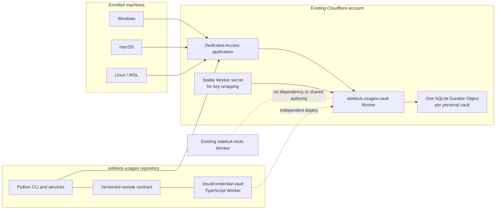
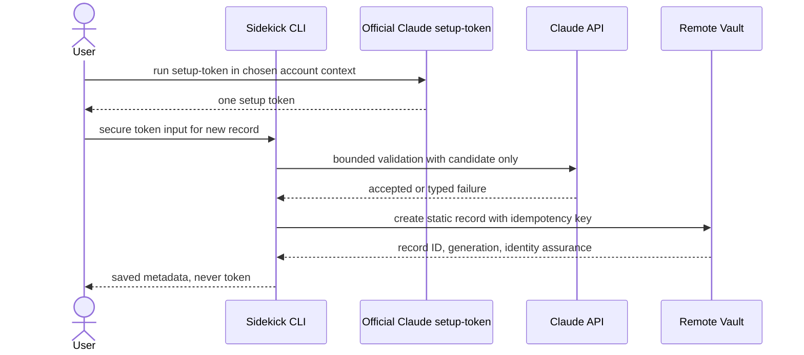
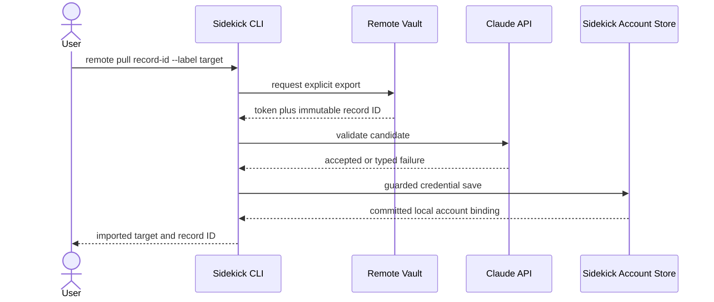

# Design Spec — Remote Credential Vault and Cross-Machine State

- **Status:** Proposed; researched and QA-corrected; not implemented
- **Date:** 2026-07-21
- **Repository:** `sidekick-usages`
- **Repository decision:** All product and deployable source remains in this
  repository
- **Cloud repository decision:** No new repository and no dependency on
  `sidekick-tools`
- **Evidence commit:** `790d73b300d184a4074d45967e6e99e3d0c172cb`
- **Related checkout:** `sidekick-tools` at
  `7320fe38c19689671c21753426ced3f8c81c0533`
- **Research date:** 2026-07-21
- **Evidence status:** Primary web sources and repository evidence are inlined;
  this tracked specification does not depend on ignored research artifacts
- **Production impact:** None; this document authorizes no deployment,
  credential upload, provider mutation, or Cloudflare mutation

---

This specification is the durable architecture authority for adding remote,
cross-machine state to Sidekick Usages. It incorporates the security findings
from the earlier credential-storage research and the subsequent QA audit. It
also resolves repository ownership under the explicit constraint that the
feature must live in `sidekick-usages` or reuse `sidekick-tools`, with no third
repository.

## Table of Contents

1. [Executive Decision](#1-executive-decision)
2. [Problem and Incident Context](#2-problem-and-incident-context)
3. [Evidence and Source Order](#3-evidence-and-source-order)
4. [Brainstormed Architecture Options](#4-brainstormed-architecture-options)
5. [Goals and Non-Goals](#5-goals-and-non-goals)
6. [Credential and State Classification](#6-credential-and-state-classification)
7. [Chosen System Architecture](#7-chosen-system-architecture)
8. [Repository and Module Ownership](#8-repository-and-module-ownership)
9. [Remote Data Model](#9-remote-data-model)
10. [Identity and Account-Mixup Prevention](#10-identity-and-account-mixup-prevention)
11. [Authentication and Device Enrollment](#11-authentication-and-device-enrollment)
12. [Encryption and Secret Handling](#12-encryption-and-secret-handling)
13. [Versioned HTTP Contract](#13-versioned-http-contract)
14. [Mutation, Conflict, and Idempotency Rules](#14-mutation-conflict-and-idempotency-rules)
15. [Claude Workflows](#15-claude-workflows)
16. [Codex Workflows](#16-codex-workflows)
17. [Snapshot Semantics](#17-snapshot-semantics)
18. [Failure, Recovery, and Deletion](#18-failure-recovery-and-deletion)
19. [Observability and Redaction](#19-observability-and-redaction)
20. [Cloudflare Deployment Design](#20-cloudflare-deployment-design)
21. [Testing and Verification](#21-testing-and-verification)
22. [Delivery Phases](#22-delivery-phases)
23. [Acceptance Gates](#23-acceptance-gates)
24. [Rejected Designs](#24-rejected-designs)
25. [Risks and Open Questions](#25-risks-and-open-questions)
26. [Revalidation Triggers](#26-revalidation-triggers)
27. [Source Matrix](#27-source-matrix)

## 1. Executive Decision

The complete feature will live in the `sidekick-usages` repository.

The repository will contain both:

1. the existing Python CLI, credential workflows, provider adapters, local
   persistence, and cross-platform behavior; and
2. a new, separately rooted TypeScript Cloudflare Worker package at
   `cloud/credential-vault/`.

There will be:

- no new repository;
- no source import from `sidekick-tools`;
- no runtime call to the `sidekick-tools` Worker;
- no shared Worker, KV namespace, bearer token, Access application, Durable
  Object namespace, secret, or deployment workflow; and
- no requirement that `sidekick-tools` be installed, deployed, or healthy.

The existing Cloudflare account may be reused after a user-controlled,
read-only metadata check. Existing Cloudflare deployment knowledge and CI
patterns are useful operational evidence, but `sidekick-tools` is not in the
new trust chain.

The first release is deliberately a **remote credential vault**, not a remote
OAuth refresh broker:

- provider-accepted Claude setup tokens may be stored and explicitly imported
  on enrolled machines, without treating validity as account identity;
- non-secret, timestamped usage and health snapshots may be shared for Claude
  and Codex;
- Claude subscription-login credentials remain local;
- Codex access tokens, refresh tokens, ID tokens, `auth.json`, keyring entries,
  and complete `CODEX_HOME` directories remain local and provider-owned;
- the Worker makes no Claude or OpenAI provider request;
- the Worker does not proxy model traffic; and
- the Worker does not refresh any provider credential.

This narrowing removes the irreducible provider-success/storage-failure gap
from version one. It also aligns with current provider contracts. Anthropic
documents `claude setup-token` as a one-year, inference-only automation token
that is explicitly copied to other environments.[^claude-auth] Current Codex
documentation makes the official CLI responsible for cached credential
storage and automatic ChatGPT token refresh.[^codex-auth]

In one sentence:

> Sidekick Usages owns one personal remote vault for explicitly portable
> Claude setup tokens and safe snapshots; provider login sessions remain on
> the machines and with the official provider clients that created them.

## 2. Problem and Incident Context

The motivating incident exposed two different classes of failure:

1. a Claude token was associated with the wrong friendly label or
   organization context; and
2. copied Codex refresh state was rejected even though another live Codex
   session remained usable.

Those are not display-only defects. They arise when a system treats a label,
active provider login, browser account, static token, and rotating login
session as interchangeable authority.

The design must prevent these failure patterns:

- a browser or CLI currently logged into account B must not determine where a
  token captured for account A is stored;
- a friendly label must not prove account identity;
- a setup token must not silently replace a subscription login;
- a subscription login must not silently replace a setup token;
- the active Claude login must not be adopted by scheduled maintenance;
- the active Codex home must not be overwritten to select another account;
- two machines must not independently rotate the same refresh-token family;
- an older cloud value must not overwrite newer local provider authority;
- cloud restore must not make a historical provider credential current; and
- a remote outage must not be rendered as healthy zero usage.

The solution is not generic file synchronization. It is a strict data-class
decision followed by narrowly owned workflows for the classes that are safe to
move.

## 3. Evidence and Source Order

Consequential claims use this source order:

1. current source, tests, configuration, and tracked design in this repository;
2. current official provider documentation;
3. immutable provider source when a public contract does not exist;
4. current Cloudflare documentation and API references;
5. IETF security standards; and
6. local observations, explicitly labeled and never promoted to public
   provider guarantees.

The important current external findings are:

- Anthropic documents setup tokens as one-year, inference-only credentials
  generated for CI, scripts, and non-interactive environments.[^claude-auth]
- Anthropic says `CLAUDE_CODE_OAUTH_TOKEN` takes precedence over stored
  subscription login credentials.[^claude-auth]
- Anthropic limits subscription OAuth to ordinary Claude Code and native-app
  usage and prohibits third-party services from routing Free, Pro, or Max
  credentials on behalf of users.[^claude-legal]
- Codex supports ChatGPT and API-key login; the CLI caches credentials locally
  and refreshes ChatGPT tokens automatically during use.[^codex-auth]
- `CODEX_HOME` is the official root for Codex authentication and other local
  state.[^codex-env]
- OAuth refresh tokens are high-value mutable authority. RFC 9700 requires
  public clients to use sender constraint or rotation to detect replay.[^rfc9700]
- Workers KV is eventually consistent and is unsuitable for atomic read/write
  authority.[^workers-kv]
- SQLite Durable Objects are available on Workers Free and provide private,
  strongly consistent transactional storage.[^durable-objects]
- Cloudflare supports multiple independently rooted Workers in one
  repository.[^workers-monorepo]
- A Worker protected by Access must still validate the signed application JWT;
  trusting a header alone permits identity spoofing.[^access-validation]

Repository evidence was read at the commits in this document's metadata:

| Repository | Evidence path | Design implication |
| --- | --- | --- |
| `sidekick-usages` | `src/sidekick_usages/credentials/claude_transitions.py` | Claude credential-kind changes already have an owning transition boundary |
| `sidekick-usages` | `src/sidekick_usages/persistence/credential_transactions.py` | Credential writes already have a transactional persistence owner |
| `sidekick-usages` | `src/sidekick_usages/credentials/codex.py` | Private Codex bundle coordination belongs to this repository |
| `sidekick-tools` | `src/index.ts` | MCP bearer, KV authorization state, and cron refresh share one broad Worker |
| `sidekick-tools` | `src/core/auth/token-source.ts` | Rotating Microsoft refresh material is unconditionally written to KV |
| `sidekick-tools` | `wrangler.toml` | KV, scheduled refresh, and the existing Worker deployment are coupled |

No remembered API, provider-private endpoint, or previously observed token
shape becomes a production contract merely because it worked once.

## 4. Brainstormed Architecture Options

### 4.1 Option comparison

| Option | Ownership | Security | Operations | Decision |
| --- | --- | --- | --- | --- |
| Worker inside `sidekick-usages` | Credential domain stays cohesive | Separate vault boundary | Mixed Python/TypeScript repo | **Select** |
| Separate package in `sidekick-tools` | Contract split across repos | Separate deployment possible | Reuses Worker toolchain | Reject |
| Routes in current MCP Worker | Wrong domain owner | Combines action and credential authority | Short initial path | Reject |
| Third repository | Clean cloud-only tree | Separate boundary | Extra lifecycle and forbidden | Reject |
| Encrypted Git/SOPS synchronization | User-owned files | No online authorization or atomic catalog | Manual conflict handling | Backup only |
| Direct Bitwarden client on every machine | Strong static-secret fit | Every device gains vault scope | External client and secret zero | Optional export only |
| Central provider refresh broker | One writer in theory | Owns undocumented OAuth behavior | Complex recovery | Reject for v1 |
| No cloud state | Safest local boundary | No cross-machine value | No new operations | Incomplete |

### 4.2 Why not `sidekick-tools`

`sidekick-tools` provides useful Cloudflare experience, but it is the wrong
source owner.

Its product is a broad personal MCP action server. The developed branch can
act on Gmail, Google Calendar, Outlook, Microsoft Calendar, OneDrive, Teams,
and Resend. Its current authentication centers on a shared MCP bearer. Its
rotating token path reads and unconditionally writes refresh material through
Workers KV, while ordinary requests, 401 recovery, and cron may all cause a
refresh.

Cloudflare documents that KV reads may remain stale across locations and that
KV should not be used when a value must be read and written atomically in one
transaction.[^workers-kv] The current `sidekick-tools` design is therefore
evidence against reusing its credential algorithm.

Even a new package in that repository would create these costs:

- the Sidekick credential domain and HTTP contract would be released in
  different repositories;
- a local CLI change and its server contract could drift independently;
- security review would need two repository histories;
- cloud deployment availability would depend on another product's release
  process; and
- an implementer could mistakenly reuse the MCP bearer, KV namespace, or
  provider refresh abstractions.

Cloudflare's monorepo guidance confirms that a Worker can have its own root,
configuration, and deploy command inside an existing repository.[^workers-monorepo]
There is no infrastructure requirement to place it in `sidekick-tools`.

### 4.3 Accepted reuse from `sidekick-tools`

The following knowledge may be reused without a dependency:

- the existing Cloudflare account, if live metadata confirms it;
- known GitHub secret names for account ID and deployment token;
- Wrangler and Vitest operational experience;
- Analytics Engine and Worker observability lessons;
- separate deployment and health-smoke-test patterns;
- typed HTTP error-classification ideas; and
- the demonstrated need to keep cron, request, cache, and 401 paths from
  creating independent credential writers.

No source is copied merely because it exists. Any reused concept must be
re-evaluated against this repository's stricter credential and error
vocabulary.

## 5. Goals and Non-Goals

### 5.1 Goals

The complete feature must:

1. store eligible Sidekick-owned state at zero recurring cost for expected
   personal usage;
2. support Windows, macOS, Linux, and WSL clients;
3. let each machine be revoked independently;
4. preserve the active Claude and Codex login byte-for-byte;
5. make credential kind explicit and closed;
6. make identity assurance explicit rather than inferred from a label;
7. import remote setup tokens only through Sidekick's credential workflow;
8. reject stale and conflicting writes;
9. make retries idempotent;
10. distinguish remote snapshots from live provider observations;
11. exclude secret material from arguments, logs, telemetry, exceptions, and
    tracked artifacts;
12. fail closed when authentication, schema, storage, or identity cannot be
    trusted;
13. provide explicit enrollment, revocation, export, deletion, and recovery;
14. keep cloud and local source in this repository;
15. keep the cloud deployment independent from `sidekick-tools`; and
16. support a complete uninstall that leaves provider-owned login state
    untouched.

### 5.2 Non-goals

Version one does not:

- synchronize arbitrary token or session files;
- upload Claude subscription-login credentials;
- upload any Codex login credential;
- copy a Codex keyring entry;
- copy or rewrite `auth.json`;
- synchronize browser cookies, browser storage, or provider profiles;
- expose a generic secret-management API;
- refresh a provider token remotely;
- call Claude or OpenAI from the Worker;
- proxy Claude or Codex model traffic;
- offer multi-user SaaS;
- provide organization administration;
- infer provider identity from a friendly label;
- promise offline cloud access;
- use Workers KV as authoritative state;
- automatically restore an old secret through PITR;
- automatically pull raw credentials during scheduled maintenance;
- add a plugin system or generic backend framework; or
- implement OCI, OpenBao, Bitwarden, or SOPS as live interchangeable backends.

## 6. Credential and State Classification

The remote schema is a positive allowlist. An unlisted field or data class is
ineligible.

| Data class | Remote policy | Authority | Reason |
| --- | --- | --- | --- |
| Claude setup token | Allowed, encrypted | Sidekick vault record | Officially portable static credential |
| Setup-token fingerprint | Allowed, keyed | Vault | Exact deduplication without disclosure |
| Setup-token issue time | Allowed only if observed | Local capture | Token value does not encode it |
| Setup-token provider identity | Allowed only when proven | Provider contract | No label inference |
| Operator-confirmed display label | Allowed, encrypted | User metadata | Convenience, never identity |
| Claude login access token | Forbidden | Local Claude/Sidekick login record | Short-lived session state |
| Claude login refresh token | Forbidden | Local credential owner | Rotating mutable authority |
| Claude login file/keychain | Forbidden | Claude Code | Provider-owned state |
| Codex access token | Forbidden | Official Codex home | Short-lived provider state |
| Codex refresh token | Forbidden | Official Codex home | Rotating mutable authority |
| Codex ID token | Forbidden | Official Codex home | Broad identity credential |
| Codex `auth.json` | Forbidden | Official Codex home | Complete provider auth state |
| Codex keyring entry | Forbidden | Official Codex | OS/provider-owned secret |
| Complete `CODEX_HOME` | Forbidden | Official Codex | Auth, logs, sessions, config |
| Browser cookies or storage | Forbidden | Browser/provider | Broad undocumented session |
| Usage windows | Allowed, non-secret | Timestamped observation | Cross-machine dashboard value |
| Account health | Allowed, non-secret | Timestamped observation | Explicitly stale-capable |
| Provider account ID | Allowed encrypted when proven | Provider | Stable account binding |
| Friendly email label | Allowed encrypted when chosen | User | PII and non-authoritative |
| Machine Access client secret | Forbidden remotely | Enrolled local machine | Secret zero |
| Machine Access client ID | Allowed | Access principal registry | Authorization identity |
| Audit metadata | Allowed, secret-free | Vault | Incident and mutation history |

The distinction between a portable setup token and a provider login is
normative. Both being strings beginning with a token prefix does not make them
the same credential kind.

## 7. Chosen System Architecture

### 7.1 Topology



### 7.2 Why one Durable Object per personal vault

The expected product is single-user and contains only a few account records.
The logical consistency atom is the user's entire vault:

- account catalog;
- setup-token records;
- device authorization registry;
- idempotency outcomes;
- audit metadata; and
- non-secret snapshots.

Using one object per secret would require a second catalog object and would
make an account create/delete operation a cross-object transaction. Durable
Objects do not provide a transaction across objects. One personal-vault object
keeps catalog and records in one SQLite transaction and remains orders of
magnitude below current free limits.[^do-pricing]

The object name must not contain an email, provider account ID, token
fingerprint, or friendly label. The Worker derives the object from a stable,
random `VAULT_ID` created by the local provisioning flow before bootstrap. The
non-secret ID is deployed as configuration and persisted in local remote-vault
configuration. Bootstrap stores the same ID as immutable vault metadata.
Changing the deployment to a different ID selects a different object; it can
never reopen or overwrite the original vault.

### 7.3 No Workers KV in version one

The expected personal traffic does not need an edge cache. Direct Durable
Object access is simpler and avoids two sources of truth.

Version one uses no KV binding. If a future public, non-secret cache is proven
necessary, it remains disposable and must never determine credential health,
generation, authorization, or mutation outcome.

### 7.4 No Worker provider traffic

The Worker stores and returns eligible records. It does not present a Claude or
OpenAI credential to a provider.

This boundary:

- avoids making the Worker a model-traffic proxy;
- avoids provider refresh behavior;
- avoids cron and alarm credential mutations;
- keeps provider parsing in provider adapters;
- reduces terms-of-service risk;
- makes provider outages independent from vault writes; and
- makes automated Worker tests fully synthetic.

## 8. Repository and Module Ownership

### 8.1 Target repository layout

```text
sidekick-usages/
|-- cloud/
|   `-- credential-vault/
|       |-- package.json
|       |-- package-lock.json
|       |-- tsconfig.json
|       |-- wrangler.jsonc
|       |-- src/
|       |   |-- index.ts
|       |   |-- access/
|       |   |-- api/
|       |   |-- crypto/
|       |   |-- durable/
|       |   |-- schemas/
|       |   `-- telemetry/
|       `-- tests/
|-- contracts/
|   `-- remote-vault-v1.openapi.yaml
|-- src/sidekick_usages/
|   |-- remote/
|   |-- credentials/
|   |-- persistence/
|   |-- usage/
|   `-- cli/commands/
|-- tests/
`-- docs/superpowers/
```

The cloud package has its own `package.json` and lockfile. The root Node
package remains documentation tooling. This prevents Worker production
dependencies from silently entering the root documentation gate and avoids
Wrangler workspace auto-detection ambiguity.[^workers-auto-config]

### 8.2 Python ownership

The existing boundaries remain authoritative:

- `providers/claude/` validates setup-token shape and provider observations;
- `providers/codex/` reads only supported Codex usage and identity contracts;
- `credentials/` owns setup-token push, pull, replacement, and local transition
  policy;
- `persistence/` owns the local Access service-token bundle, remote binding,
  atomic import, permissions, and recovery;
- `http/` owns HTTPS transport, bounds, and safe retry policy;
- `remote/` owns only versioned remote request/response models, the client, and
  provider-neutral remote outcomes;
- `usage/` owns snapshot publication, retrieval, aggregation, and staleness;
- `cli/commands/remote.py` renders the user workflow; and
- `paths.py` remains the sole application-path owner.

`core/` receives no HTTP, Cloudflare, filesystem, CLI, or provider dependency.

### 8.3 Worker ownership

The cloud package uses focused modules:

- `access/` validates the Access JWT and resolves one machine principal;
- `api/` maps HTTP routes to typed commands and responses;
- `crypto/` owns key wrapping and record envelopes;
- `durable/` owns SQLite schema, transactions, generation, idempotency, and
  audit events;
- `schemas/` validates all untrusted JSON and configuration;
- `telemetry/` emits redacted metrics; and
- `index.ts` performs registration and composition only.

No module imports from `sidekick-tools`. Shared logic is not extracted into a
third package without three concrete consumers and a separately approved
design.

### 8.4 Contract ownership

`contracts/remote-vault-v1.openapi.yaml` is the canonical transport contract.
It defines:

- routes and methods;
- maximum request and response shapes;
- closed enums;
- error codes;
- idempotency and generation headers;
- secret-bearing versus non-secret responses; and
- compatibility rules.

Python Pydantic models and TypeScript Zod models remain runtime validators.
Contract tests prove both agree with canonical synthetic fixtures. Generated
code is not required initially; adding a generator requires a separate
build-versus-adopt decision.

## 9. Remote Data Model

### 9.1 Vault record

The conceptual static record is:

```text
VaultCredentialRecord
  record_id: random immutable UUID
  schema_version: integer
  provider: claude
  credential_kind: setup_token
  generation: monotonically increasing integer
  token_fingerprint: keyed, non-reversible digest
  identity_assurance: unverified | provider_verified
  provider_account_id: encrypted optional value
  provider_organization_id: encrypted optional value
  display_label: encrypted user metadata
  plan_hint: encrypted optional user/provider metadata
  credential_envelope: encrypted setup token
  observed_valid_at: optional UTC timestamp
  created_at: UTC timestamp
  updated_at: UTC timestamp
  replaced_at: optional UTC timestamp
  status: active | rejected | revoked | deleted
```

`provider` and `credential_kind` are closed in version one. A record cannot
contain a refresh token, ID token, provider login file, or unclassified JSON.

### 9.2 Token fingerprint

Deduplication uses a keyed digest calculated inside the Worker. It is not a
plain hash of a low-entropy or recognizable token and is never returned in
full.

The fingerprint proves only that two uploads contain the exact same token. It
does not prove account identity. Logs may contain at most a short correlation
prefix that cannot be used as an account label.

### 9.3 Identity assurance

`identity_assurance` is mandatory:

- `unverified`: provider accepted a functional probe or the user captured the
  token through the supported command, but no supported token-scoped route
  returned stable account and organization identity;
- `provider_verified`: a version-pinned supported provider contract returned
  the complete immutable identity and the result passed strict validation.

No `operator_asserted` state is treated as identity. The encrypted display
label records what the user calls the record, not who the provider says owns
it.

### 9.4 Device principal

```text
DevicePrincipal
  access_client_id: validated Access common_name
  device_id: random Sidekick UUID
  display_name: encrypted optional value
  scopes: closed set
  enrolled_at: UTC timestamp
  expires_at: UTC timestamp
  revoked_at: optional UTC timestamp
  last_seen_at: optional UTC timestamp
```

Allowed scopes are initially:

- `snapshot:read`;
- `snapshot:write`;
- `credential:list`;
- `credential:import`;
- `credential:export`;
- `credential:replace`;
- `credential:delete`; and
- `device:admin`.

The default dashboard device receives snapshot read/write and credential-list
only. Raw-secret operations require explicit enrollment scopes.

### 9.5 Snapshot

Snapshots contain normalized, non-secret state:

```text
RemoteUsageSnapshot
  snapshot_id: random UUID
  record_id: vault record or local profile binding
  provider: claude | codex
  account_key: pseudonymous stable key
  usage_windows: strict normalized windows
  activity: strict optional activity summary
  health: typed non-secret state
  observed_at: UTC timestamp
  published_at: UTC timestamp
  source_device_id: pseudonymous device ID
  expires_at: UTC timestamp
```

Snapshots never contain token material, refresh responses, raw provider
payloads, email addresses, account IDs, stack traces, or provider request
headers.

### 9.6 Immutable vault metadata

The personal-vault object stores one metadata row:

```text
VaultMetadata
  vault_id: random immutable ID matching deployment configuration
  schema_version: integer
  bootstrap_completed: boolean, false to true only
  bootstrap_completed_at: optional UTC timestamp
  created_at: UTC timestamp
```

`bootstrap_completed` is monotonic during ordinary application operation. No
API, migration, or code rollback may set it from true to false. After first
enrollment, the bootstrap service token is revoked and the bootstrap Client ID
binding is removed before the vault accepts real credentials. Therefore a PITR
restore that predates the flag still has no bootstrap credential or configured
Client ID with which to reopen enrollment. PITR remains an administratively
locked reconciliation event, not an ordinary application transition.

## 10. Identity and Account-Mixup Prevention

### 10.1 Labels are never identity

The following values cannot authorize an overwrite:

- Sidekick label;
- email address;
- plan name;
- provider panel position;
- active Claude account;
- active browser account;
- active Codex home;
- similar usage percentages; or
- user recollection without explicit replacement approval.

The stable local-to-remote binding is `record_id`, not label.

### 10.2 Setup-token identity limitation

Anthropic documents how to create and use a setup token but does not document a
setup-token introspection or profile endpoint that returns immutable account
and organization IDs.[^claude-auth]

Therefore a new setup token is stored as a new `unverified` record unless a
supported, version-pinned provider route proves identity. A successful model
probe proves validity and scope at that moment; it does not prove stable
identity.

An unverified record:

- may be idempotently recognized by exact keyed token fingerprint;
- may receive an encrypted friendly label;
- may be explicitly imported into a new local label;
- cannot overwrite an existing different local token by label;
- cannot merge with another remote record by email or plan;
- cannot claim an organization context; and
- requires both credential-replacement and identity-replacement authorization
  to replace a known local login.

### 10.3 Safe local import

Remote pull is a two-stage operation:

1. fetch and validate a candidate into memory through the secret-bearing
   transport; and
2. invoke the existing credential transition and persistence service.

The remote client cannot write `accounts.json`, provider files, or private
bundles directly. The credential service checks:

- provider and credential kind;
- exact remote record binding;
- duplicate token ownership;
- existing label collision;
- authentication-method change;
- identity-assurance change;
- explicit replacement flags; and
- final provider validation before commit when permitted.

Failure before final persistence leaves current local authority unchanged.

### 10.4 Active login isolation

No remote operation runs `claude setup-token`, `claude auth login`,
`codex login`, or a browser flow automatically.

No remote operation writes:

- Claude Keychain or credential files;
- `~/.claude`;
- `~/.codex`;
- an isolated `CODEX_HOME`;
- Windows Credential Manager; or
- a provider-owned OS keyring entry.

The only local raw-secret write is Sidekick's own saved-account persistence,
under its existing transaction and permission invariants.

## 11. Authentication and Device Enrollment

### 11.1 Front-door authentication

The Worker is protected by a dedicated Cloudflare Access application. Each
machine receives its own Access service token. Cloudflare currently permits 50
service tokens per account by default, which is ample for personal
installations.[^access-limits]

The Worker validates `Cf-Access-Jwt-Assertion` with:

- RS256 signature verification against the team JWKS;
- exact issuer;
- exact application audience;
- `type = app`;
- `exp`, `iat`, and `nbf` checks with bounded clock tolerance;
- a recognized `common_name`, which is the service-token Client ID; and
- an active application-level `DevicePrincipal`.

Cloudflare explicitly requires the Worker to validate the JWT even when Access
is in front of the Worker.[^access-validation] The implementation should adopt
the maintained `jose` package used by Cloudflare's own example rather than
implementing JWT verification.[^access-validation]

### 11.2 Service Auth policy

The Access application uses a Service Auth policy that selects only the
vault's service tokens. It must not use:

- `Bypass`;
- `Include Everyone`;
- `Any Access Service Token` when named tokens are practical;
- the current MCP bearer; or
- a shared Cloudflare control-plane API token.

### 11.3 Bootstrap

Initial enrollment is intentionally administrative and one-time:

1. the user creates the dedicated Access application;
2. the user creates one bootstrap service token in Cloudflare;
3. the one-time Client ID and secret are captured without shell arguments;
4. Sidekick stores them in a private local bundle;
5. the non-secret Client ID is deployed as
   `BOOTSTRAP_ACCESS_CLIENT_ID` configuration;
6. `POST /v1/bootstrap` validates an Access JWT whose `common_name` exactly
   equals that Client ID;[^access-token]
7. one SQLite transaction proves the vault is empty, creates the first
   `device:admin`, and permanently records `bootstrap_completed`; and
8. the bootstrap service token is revoked after a normally enrolled admin
   device is verified.

The bootstrap route is operative only while `bootstrap_completed` is false.
After completion it returns a non-secret `bootstrap_closed` response and can
never create or replace a principal, even if the original service token is
later presented. The Client ID is not secret and may be removed from
configuration in the next deployment. The Client Secret is never a Worker
binding.

Concurrent bootstrap attempts are serialized by the personal-vault Durable
Object. Exactly one matching request may change an empty vault. A failed or
partial attempt leaves `bootstrap_completed` false and creates no principal.
Changing the configured Client ID after completion does not reopen bootstrap.

The Worker never receives a Cloudflare token capable of creating or deleting
Access service tokens. Control-plane mutation remains with the user, Wrangler,
or a separately authorized local setup process.

### 11.4 Subsequent machine enrollment

For each new machine:

1. the user creates a distinct Access service token;
2. an existing admin registers its Client ID, device ID, expiry, and scopes;
3. the new machine receives the one-time Client ID and secret through a
   user-controlled secure channel;
4. Sidekick validates the Access-protected health endpoint;
5. Sidekick stores the pair in its local private namespace; and
6. the admin verifies the device appears with the intended scopes.

The client secret must never be written to:

- command history;
- process arguments;
- environment diagnostics;
- stdout or stderr;
- logs;
- JSON command output;
- crash reports; or
- account exports.

### 11.5 Local secret zero

The Access Client ID and secret remain local and are protected by the existing
private-persistence mechanisms:

- owner-only modes and path checks on POSIX;
- extended-ACL rejection on macOS where applicable;
- protected current-user DACL validation on Windows; and
- atomic writes with qualified path ownership.

Compromise of a machine token grants only its application scopes. Deleting
that service token in Cloudflare and marking its device principal revoked must
disable future access without rotating other machines or provider tokens.

## 12. Encryption and Secret Handling

### 12.1 Trust boundary

Cloudflare encrypts all Durable Object data and metadata at rest with
Cloudflare-managed keys and protects internal transfer with TLS.[^do-security]
That is provider-managed encryption, not end-to-end or zero-knowledge
encryption.

The application adds a record envelope to reduce exposure from a raw storage
export or accidental database inspection. The Worker still receives plaintext
for an authorized import or export. The design must never describe the system
as Cloudflare-blind.

### 12.2 Envelope design

Each credential generation uses:

- a fresh random 256-bit data-encryption key;
- AES-256-GCM;
- a fresh 96-bit random nonce;
- additional authenticated data containing schema version, vault ID, record
  ID, provider, credential kind, and generation;
- a stable key-encryption key bound as a Worker secret; and
- an explicit key version.

Token fingerprints and idempotency request digests use dedicated HMAC keys
bound as Worker Secrets. They are distinct from each other and from the
key-encryption key. A plain hash of a token or secret-bearing request is never
persisted.

Cloudflare Workers supports standards-based Web Crypto, cryptographic random
values, and AES-GCM.[^web-crypto]

Stored secret fields are:

```text
encrypted_secret
secret_nonce
wrapped_data_key
wrap_nonce
key_version
aad_version
```

Nonce reuse under the same key is forbidden. Decryption failure is a terminal
corrupt-record state, never a missing token.

### 12.3 KEK storage

The stable key-encryption key may be stored as a Worker Secret or bound from
Secrets Store after live availability is verified.

It is not stored:

- in Wrangler configuration;
- in repository secrets as plaintext output;
- in Durable Object rows;
- in Workers KV;
- in account exports; or
- in the Worker source.

`wrangler secret put` creates and deploys a Worker version, which makes Worker
Secrets suitable for stable bootstrap material but not per-record
mutation.[^worker-secrets]

### 12.4 Key rotation

Key rotation is explicit and resumable:

1. bind a new KEK version without deleting the old version;
2. mark the vault as rotating;
3. rewrap one record DEK per transaction;
4. verify every record references the new version;
5. retain the old KEK for a bounded rollback window; and
6. remove the old KEK only after a verified inventory and recovery checkpoint.

The setup token itself is not re-encrypted under one global data key. A failed
rotation cannot make all records undecryptable in one partial write.

### 12.5 HMAC-key rotation

Request-digest HMAC records have a bounded lifetime. Rotation deploys a new
key version, accepts the old version only for the maximum idempotency window,
then removes it after every old outcome expires.

Token-fingerprint rotation is a versioned migration because fingerprints are
long-lived deduplication authority. The Worker keeps old and new keyed
fingerprints during the migration, decrypts and re-fingerprints one credential
per transaction, verifies full coverage, and only then retires the old key.
The old key is never removed merely because a new deployment succeeded.

## 13. Versioned HTTP Contract

### 13.1 General rules

All routes are below `/v1`. Requests and responses use strict JSON except for
the health endpoint. Unknown fields are rejected on credential-bearing
mutations.

Every response includes:

- a request correlation ID;
- `Cache-Control: no-store` on authenticated routes;
- `Content-Type: application/json` where applicable;
- a bounded response body; and
- no reflected secret value.

Credential-bearing requests additionally require:

- `Content-Type: application/json`;
- a body below the documented limit;
- `Idempotency-Key` on mutations;
- `If-Match` or an exact expected generation on replacement/deletion; and
- a device scope appropriate to the operation.

### 13.2 Route surface

| Method | Route | Scope | Secret-bearing |
| --- | --- | --- | --- |
| `GET` | `/v1/health` | Access only | No |
| `POST` | `/v1/bootstrap` | Exact bootstrap Client ID, once | No |
| `GET` | `/v1/devices/self` | Any enrolled | No |
| `GET` | `/v1/devices` | `device:admin` | No |
| `POST` | `/v1/devices` | `device:admin` | No |
| `DELETE` | `/v1/devices/{id}` | `device:admin` | No |
| `GET` | `/v1/credentials` | `credential:list` | No |
| `POST` | `/v1/credentials/claude/setup-token` | `credential:import` | Yes |
| `GET` | `/v1/credentials/{id}` | `credential:list` | No |
| `POST` | `/v1/credentials/{id}/export` | `credential:export` | Yes |
| `PUT` | `/v1/credentials/{id}` | `credential:replace` | Yes |
| `DELETE` | `/v1/credentials/{id}` | `credential:delete` | No |
| `GET` | `/v1/snapshots` | `snapshot:read` | No |
| `PUT` | `/v1/snapshots/{account-key}` | `snapshot:write` | No |
| `GET` | `/v1/audit` | `device:admin` | No |

No route accepts a provider refresh token, ID token, auth file, cookie, or
arbitrary secret kind.

### 13.3 Raw export response

Raw setup-token export is a separate `POST`, not the normal record `GET`. This
prevents ordinary list/read clients from receiving credentials.

The export response:

- requires `credential:export`;
- records one secret-free audit event;
- has `Cache-Control: no-store`;
- returns exactly one token and its immutable remote record ID;
- never returns ciphertext, KEK metadata, or provider payloads; and
- is consumed directly by the local credential workflow.

The CLI never prints the token. An optional human-directed disaster-recovery
export is a distinct future feature and requires a separately approved output
contract.

### 13.4 Error vocabulary

The contract distinguishes:

- unauthenticated;
- unauthorized;
- unknown device;
- revoked device;
- missing record;
- malformed request;
- unsupported schema;
- unsupported credential kind;
- identity unverified;
- identity mismatch;
- generation conflict;
- idempotency conflict;
- corrupt encrypted record;
- capacity exhausted;
- transient storage failure; and
- service unavailable.

The client maps these to existing typed provider-neutral outcomes. It does not
replace them with an empty account list or zero usage.

## 14. Mutation, Conflict, and Idempotency Rules

### 14.1 Serialized actor plus expected generation

The Durable Object is a globally addressed serialized actor, but external
awaits can yield the event loop. Web Crypto is asynchronous, whereas SQLite
Durable Object transactions are synchronous. Version one therefore separates
fallible asynchronous preparation from one final synchronous commit. It never
pretends encryption occurred inside the database transaction.[^do-state]

Before the transaction, the Worker:

1. validates the Access JWT, body bounds, and closed wire schema;
2. assigns a candidate immutable record ID for a create;
3. derives the intended generation (`1` for create or expected generation
   plus one for replacement);
4. computes the token HMAC fingerprint and keyed HMAC request digest;
5. creates a fresh data key and nonces and encrypts the candidate with AAD
   containing its intended generation; and
6. retains the prepared envelope only in request memory.

The synchronous transaction then:

1. validates the application-level device principal and scope;
2. checks the idempotency key and keyed request digest;
3. reads the current record and token-fingerprint state;
4. compares the current generation with the expected generation;
5. rejects any conflict without writing;
6. writes the already prepared envelope, or marks the delete state;
7. increments generation exactly once;
8. writes audit metadata;
9. stores the idempotency outcome; and
10. commits catalog, record, audit, and outcome atomically.

If another request wins while preparation awaits, the transaction discards
the prepared ciphertext and returns the typed conflict. A discarded envelope
and data key never enter storage. Deletes perform no encryption but follow the
same expected-generation and commit rules. Version one performs no provider
call inside the Durable Object.

The later read returns the committed generation. A client never assumes a lost
HTTP response means the write failed.

### 14.2 Idempotency

The client creates a random idempotency key for each intended mutation. The
Worker stores:

- device principal;
- route and target record;
- keyed HMAC of the canonical request, including secret-bearing fields;
- final status;
- resulting generation; and
- bounded expiry.

The HMAC key is a dedicated Worker Secret, not the encryption key, and the
digest is never logged or returned. Repeating the same key and digest returns
the original outcome. Reusing the key with a different digest returns
`idempotency_conflict` and performs no write.

The local HTTP layer may retry a mutation only when:

- it reuses the exact idempotency key and body;
- no provider mutation is involved;
- retry count and total time are bounded; and
- TLS and Access authentication remain valid.

### 14.3 Create and exact-token deduplication

An upload with a token fingerprint already present returns the existing record
ID and generation if the token is identical and the operation is authorized.
It does not create another owner.

An upload with the same label but a different token creates neither an update
nor a new implicit replacement. The client must choose a new label or execute
an explicit record replacement with the exact expected generation.

### 14.4 No automatic merge

There is no field-level last-write-wins merge for credential records. A stale
client must read the new record metadata and restart its explicit operation.

Snapshots may replace an older snapshot only when `observed_at` is newer and
the source binding is valid. Snapshot ordering never changes credential
authority.

## 15. Claude Workflows

### 15.1 Capture and push a setup token



Rules:

- Sidekick does not invoke `claude setup-token`, sign out Claude, open a
  browser, select a browser profile, or claim to control provider account
  selection;
- the browser flow is user initiated outside the Sidekick process;
- the token enters Sidekick through the existing non-echoing token-input
  boundary, never a command argument or environment diagnostic;
- the active Claude credential file is not read as identity authority;
- the captured token remains in memory until local/remote commit completes;
- provider validation uses the candidate explicitly;
- provider rejection prevents upload;
- transient validation failure does not become successful verification;
- a successful inference probe establishes current token validity only;
- absent stable provider identity always produces a new `unverified` record;
- the user-entered label is displayed as an assertion, not a verified owner;
- the remote friendly label cannot overwrite another record; and
- command output never includes the token.

There is no version-one command that promises “capture the setup token for
account X.” That promise cannot be implemented from documented provider
evidence. The user may use an isolated or signed-out browser profile to reduce
selection ambiguity, but Sidekick still records the resulting account identity
as unverified. It never signs out or mutates the user's active Claude login to
manufacture certainty.

### 15.2 Push an existing saved setup token

An existing Sidekick setup-token account can be pushed only when:

- its credential variant is exactly `ClaudeSetupTokenCredentials`;
- local persistence is healthy;
- no duplicate local owner exists;
- the user selects the exact label;
- validation succeeds or the user chooses a clearly labeled backup-only future
  workflow; and
- remote deduplication confirms one owner.

Claude subscription-login labels are rejected as an unsupported remote
credential kind.

### 15.3 Pull to a new machine



The pull fails before persistence if:

- the device lacks export scope;
- the record is rejected, revoked, deleted, or corrupt;
- provider validation rejects the candidate;
- the requested label belongs to another provider;
- a different credential already owns the label without explicit replacement;
- the exact token belongs to another local label and cannot be moved safely;
- authentication method would change without approval; or
- identity is known to mismatch.

The active Claude login remains untouched.

### 15.4 Replace a rejected setup token

Replacement is not a label-based push. It requires:

- the immutable remote record ID;
- the current remote generation;
- a newly captured candidate;
- candidate validation;
- explicit user confirmation;
- `credential:replace`; and
- an idempotent conditional update.

If the remote generation changed, the operation stops. It does not overwrite
the newer record or retry with the stale expected generation.

### 15.5 Subscription-login handling

Claude subscription-login credentials remain local. Each machine may create
or import its own supported login deliberately. Remote state may contain only
the non-secret health/usage snapshot and an encrypted display association.

Version one does not upload:

- access token;
- refresh token;
- expiry values coupled to the secret;
- scopes;
- token-account payload;
- keychain item; or
- credential-file envelope.

## 16. Codex Workflows

### 16.1 Provider ownership

Official Codex is the sole owner of login, credential storage, access-token
refresh, refresh-token rotation, logout, and provider auth-file format.

Current official documentation says Codex stores cached credentials in
`auth.json` or the OS credential store and refreshes ChatGPT tokens
automatically.[^codex-auth] Sidekick must not create another writable copy.

### 16.2 Per-account local homes

The durable multi-account primitive is one complete, isolated `CODEX_HOME` per
account, as already proposed by the tracked Codex research.

Each machine that needs to use an account logs in through official Codex in
that account's home. Sidekick stores only a non-secret reference and selection
metadata. Separate machines may have separate provider login grants; they do
not share one refresh token through the vault.

### 16.3 Remote state

The remote vault may store:

- pseudonymous local profile binding;
- encrypted friendly label;
- plan hint;
- last successful usage snapshot;
- last health classification;
- observation time; and
- source-device pseudonym.

It may not store:

- raw access token;
- raw refresh token;
- ID token;
- auth-file JSON;
- keyring bytes;
- ChatGPT cookies;
- complete `CODEX_HOME` archive; or
- experimental app-server auth payloads.

### 16.4 New-machine behavior

On a new machine, the user must authenticate the intended Codex account through
official Codex. A remote snapshot can show that an account exists and when it
was last observed, but it cannot authenticate Codex.

This is deliberate. A green remote snapshot is not evidence that local Codex
has a usable credential.

### 16.5 Future enterprise access tokens

Current Codex documentation describes access tokens for trusted automation in
ChatGPT Enterprise workspaces.[^codex-auth] Those are a separate managed
contract, not authorization to upload consumer ChatGPT refresh state.

Supporting an enterprise access token would require:

- an explicit user requirement;
- current workspace permission evidence;
- separate credential kind;
- provider and organization policy review;
- scope and revocation design; and
- a new approved specification.

It is out of scope for version one.

## 17. Snapshot Semantics

### 17.1 Snapshots are observations

A remote snapshot records what one enrolled machine successfully observed at a
specific time. It is never substituted for live provider authority.

The UI must distinguish:

- live local provider result;
- retained local authoritative activity snapshot;
- remote snapshot with age and source;
- remote snapshot expired;
- remote service unavailable; and
- no observation.

### 17.2 Precedence

The display precedence is:

1. successful live local provider result;
2. valid retained local provider snapshot;
3. valid remote snapshot, visibly marked with its observation age;
4. explicit unavailable state.

A remote snapshot never replaces a valid newer local observation. A remote
failure never erases a valid retained local snapshot.

### 17.3 Publication

Snapshot publication occurs only after a successful, strictly parsed provider
result. The client sends normalized fields, not the raw provider response.

Publication is safe to retry idempotently. Failure to publish does not turn the
local provider check into failure; it produces a separate remote-publication
status.

### 17.4 Staleness

Every snapshot has `observed_at` and `expires_at`. The UI never renders an
expired snapshot as current. Provider-specific freshness limits belong to the
snapshot policy owner and are covered by tests.

The remote service does not fabricate reset times by advancing an old
countdown. It displays the recorded absolute time and current staleness.

## 18. Failure, Recovery, and Deletion

### 18.1 Failure matrix

| Failure | Required behavior |
| --- | --- |
| Access JWT missing/invalid | Reject before Durable Object call |
| Unknown or revoked device | Reject without record existence leak |
| Request malformed | Typed bounded error; no write |
| Unsupported credential kind | Reject; no generic secret fallback |
| Generation mismatch | Conflict; no write |
| Reused idempotency key with new body | Conflict; no write |
| Durable transaction fails | No partial mutation |
| Lost response after commit | Same idempotency key returns prior outcome |
| Decryption fails | Corrupt state; no empty-token substitution |
| Provider rejects pulled setup token | Preserve current local authority |
| Local persistence fails | Preserve current local authority and report failure |
| Snapshot upload fails | Keep successful local result; report publication failure |
| Cloudflare unavailable | Preserve local behavior; remote state unavailable |
| Free capacity exhausted | Fail closed with actionable capacity state |
| PITR restores old state | Require administrative reconciliation before service |

### 18.2 Recovery scope

Because version one stores no rotating provider credential, it does not promise
recovery from provider-success/storage-failure. That failure class belongs to
OAuth mutation and has been removed from the Worker.

Static token upload recovery means:

- retrying the same request returns the same committed result;
- local persistence remains unchanged until the remote candidate is validated;
- the previous remote generation remains intact on conflict; and
- manual replacement can be repeated without token-family corruption.

### 18.3 PITR

SQLite Durable Objects support restoring their complete database to a point in
the previous 30 days.[^do-pitr] Worker deployments do not version or roll back
storage automatically.[^worker-deployments]

PITR is an administrative disaster-recovery tool, not credential rollback.

Before restoring:

1. disable normal vault traffic;
2. record the current bookmark;
3. identify records that could become historical;
4. restore only with explicit user approval;
5. mark every secret record `reconciliation_required` after restore;
6. validate current provider usability locally before export; and
7. allow undo to the pre-restore bookmark.

No alarm or startup path marks restored credentials active automatically.

### 18.4 Deletion

Vault deletion and provider revocation are separate:

- deleting a record prevents future normal export;
- deleting a record does not revoke the provider credential;
- provider revocation is the incident-response authority;
- Cloudflare PITR may retain older encrypted state during its documented
  recovery window; and
- audit metadata retains only the minimum secret-free tombstone required to
  prevent accidental record resurrection.

The user-facing deletion flow must say whether provider revocation has been
performed or remains manual.

### 18.5 Uninstall

Local uninstall removes:

- the remote endpoint configuration;
- local vault ID binding;
- the local Access service-token bundle; and
- optional local remote snapshots.

It does not delete:

- provider logins;
- Sidekick saved accounts unless separately requested;
- remote vault records;
- the Access service token in Cloudflare; or
- the Worker deployment.

The CLI provides explicit instructions for remote device revocation and vault
decommissioning.

## 19. Observability and Redaction

### 19.1 Allowed telemetry

Metrics may include:

- route identifier;
- HTTP status class;
- typed error code;
- duration bucket;
- request and response size bucket;
- Durable Object transaction outcome;
- operation kind;
- schema version;
- device pseudonym;
- record pseudonym; and
- deployment version.

### 19.2 Forbidden telemetry

Logs, metrics, traces, errors, and audit events must not contain:

- setup token;
- ciphertext or wrapped key;
- Access client secret;
- full Access JWT;
- request Authorization headers;
- provider account ID;
- provider organization ID;
- email address;
- friendly account label;
- provider payload;
- full request or response body;
- idempotency request body; or
- stack trace containing secret-bearing local variables.

### 19.3 Audit events

Audit events record:

- timestamp;
- operation;
- authenticated device ID;
- record ID pseudonym;
- old and new generation where relevant;
- result code; and
- request correlation ID.

They do not record the secret, label, identity, or credential payload.

### 19.4 Health

`/v1/health` proves only:

- Worker is reachable through Access;
- required bindings exist;
- Durable Object schema is supported; and
- the current deployment can complete a non-secret transaction.

It does not decrypt a credential, call a provider, or report that accounts are
healthy.

## 20. Cloudflare Deployment Design

### 20.1 Dedicated resources

The deployment uses:

- Worker name `sidekick-usages-vault`;
- a dedicated production `workers.dev` hostname or custom hostname;
- one dedicated Access application;
- named vault service tokens;
- one SQLite Durable Object namespace;
- dedicated key-encryption, token-fingerprint, and request-digest secrets;
- one non-secret, one-time bootstrap Client ID binding;
- separate Analytics Engine dataset if adopted;
- separate GitHub environment; and
- separate deployment workflow.

It does not reuse the current `sidekick-tools` Worker name, route, KV namespace,
MCP bearer, Analytics dataset, cron trigger, secrets, or health URL.

### 20.2 Wrangler configuration

The cloud package owns one `wrangler.jsonc`. New Durable Object classes use a
SQLite migration as required by current Cloudflare guidance.[^durable-objects]

There is no cron trigger and no alarm in version one. Scheduled local
maintenance may publish snapshots, but no remote scheduler touches provider
credentials.

### 20.3 CI

A path-filtered Worker CI job runs when these change:

- `cloud/credential-vault/**`;
- `contracts/remote-vault-v1.openapi.yaml`;
- shared synthetic contract fixtures; or
- the tracked vault design/plan when verification metadata changes.

It runs:

- frozen `npm ci` in the cloud package;
- dependency audit;
- TypeScript checking;
- formatting/linting;
- Vitest Worker tests;
- contract fixture tests;
- Wrangler dry-run/bundle validation;
- secret-pattern scan; and
- artifact-content inspection.

The normal Python/packaging gates continue unchanged.

### 20.4 Deployment

Production deployment is not automatic from an ordinary `develop` push.

The deploy workflow requires:

- successful Python and Worker CI for the exact commit;
- a protected GitHub environment;
- manual approval;
- least-privilege Cloudflare deployment token;
- required secret-name validation;
- version upload before traffic activation;
- Access-protected synthetic smoke test;
- deployment metadata capture; and
- a documented code rollback path.

Storage rollback is never coupled to code rollback. Cloudflare documents Worker
versions and storage as separate lifecycles.[^worker-deployments]

### 20.5 Free-tier gate

Current Workers Free SQLite Durable Object limits are ample for a personal
vault: 5 million rows read per day, 100,000 rows written per day, and 5 GB
stored data.[^do-pricing]

The design does not rely on silently upgrading to paid usage. Capacity
exhaustion must fail closed. Pricing and limits are revalidated before the
first deployment and each release that materially changes request cadence.

## 21. Testing and Verification

### 21.1 No real credentials in automated tests

All tests use synthetic token shapes, identities, JWT keys, record IDs, and
snapshots. Tests never:

- call Claude, OpenAI, or Cloudflare public APIs;
- use a real Access service token;
- inspect the user's credential files;
- mutate an active provider login;
- read production Worker secrets; or
- deploy a Worker.

### 21.2 Python tests

Load-bearing Python tests prove:

- strict remote response decoding;
- unknown fields and schema versions fail closed;
- Claude login credentials are ineligible for push;
- Codex credentials are ineligible for push;
- setup-token push never invokes Claude or a browser subprocess;
- candidate validity never upgrades account-identity assurance;
- remote pull cannot bypass credential transitions;
- unverified identity cannot overwrite by label;
- exact remote record binding is persisted atomically;
- duplicate token ownership is rejected;
- Access bootstrap secret uses private permissions;
- GET retry differs from idempotent mutation retry;
- secret-bearing responses are never rendered;
- snapshots retain source and observation age;
- stale remote snapshots do not replace newer local state;
- remote outage is explicit; and
- active provider login files remain byte-for-byte unchanged.

### 21.3 Worker tests

Load-bearing Worker tests prove:

- missing, malformed, wrong-issuer, wrong-audience, expired, and bad-signature
  Access JWTs are rejected;
- unknown and revoked Client IDs are rejected;
- route scopes are enforced;
- request bodies and unknown fields are bounded/rejected;
- 100 concurrent valid bootstrap attempts create exactly one first admin;
- bootstrap cannot reopen after completion or a configuration change;
- 100 concurrent creates with one idempotency key produce one record;
- 100 conditional replacements from one generation produce one winner;
- a stale expected generation never writes;
- an idempotency key reused with a new body never writes;
- request digests and token fingerprints are keyed and never logged;
- catalog, credential, audit, and idempotency outcome commit atomically;
- a conflict after asynchronous encryption persists no candidate envelope;
- encryption nonces are unique;
- wrong AAD, wrapped key, or ciphertext fails closed;
- record list never returns secret material;
- raw export requires the explicit route and scope;
- logs contain none of the injected canary secrets; and
- no KV, provider fetch, cron, or alarm path exists.

### 21.4 Contract tests

Canonical synthetic fixtures cover every request, success, and failure shape.
Python and TypeScript decoders must accept the same valid fixtures and reject
the same invalid fixtures.

The contract test also asserts that forbidden fields such as `refresh_token`,
`id_token`, `auth_json`, `cookie`, and arbitrary `secret_type` are absent from
the schema.

### 21.5 Cross-platform tests

Windows, macOS, and Linux CI prove:

- endpoint configuration;
- private bootstrap storage;
- atomic binding persistence;
- remote pull into Sidekick accounts;
- uninstall behavior;
- command output redaction; and
- no provider-login mutation.

WSL receives focused path and Windows-interoperability coverage consistent with
the current persistence architecture.

### 21.6 Synthetic deployed spike

Before real credentials are allowed, an isolated synthetic deployment proves:

- current Cloudflare plan and resources;
- Access JWT verification;
- named per-device service-token revocation;
- Durable Object migrations;
- idempotent concurrent mutation;
- code deployment and rollback;
- PITR rehearsal with only synthetic records;
- KEK rotation with synthetic records;
- free-limit observability; and
- zero secret canaries in logs and deployment artifacts.

## 22. Delivery Phases

### Phase 0 — Approve this design

- Approve the repository verdict.
- Approve the remote data allowlist.
- Approve that version one excludes all provider login and refresh state.
- Approve the personal, single-operator, non-proxy product boundary.
- Resolve corporate-policy eligibility for organization credentials.

No dependencies, cloud resources, or source directories are added before this
gate.

### Phase 1 — Contract and synthetic domain

- Add the OpenAPI contract and synthetic fixtures.
- Add closed Python remote models and outcomes.
- Add Worker schema models without deployment.
- Prove forbidden credential fields are unrepresentable.
- Add the account-binding and identity-assurance model.

### Phase 2 — Synthetic Worker

- Add the separately rooted cloud package.
- Implement Access JWT verification.
- Implement the personal-vault Durable Object.
- Implement encryption, generation, idempotency, and audit metadata.
- Run all Worker tests locally with synthetic values.

### Phase 3 — Python client and local persistence

- Add endpoint and bootstrap configuration.
- Store per-machine Access credentials privately.
- Close and remove bootstrap configuration after first-admin enrollment.
- Add remote client and typed errors.
- Add snapshot pull/push.
- Preserve all existing offline behavior.

### Phase 4 — Claude setup-token portability

- Add explicit setup-token push.
- Add explicit secret-scoped pull.
- Bind local account to immutable remote record ID.
- Add explicit conditional replacement and delete.
- Keep all subscription-login credentials local.

### Phase 5 — Isolated synthetic cloud deployment

- Restore Wrangler authentication interactively.
- Read back plan and metadata without secret values.
- Create dedicated synthetic resources.
- Run concurrency, revocation, rollback, PITR, and redaction tests.
- Record verified deployment evidence.

### Phase 6 — Real-credential opt-in

This phase requires separate explicit user authorization after every acceptance
gate passes.

- enroll one narrowly scoped machine;
- upload one newly generated personal setup token;
- pull it to one isolated test machine/account label;
- prove active Claude login files are unchanged;
- revoke the machine and prove access stops; and
- document manual provider revocation and full decommissioning.

No organization credential enters the system without policy approval.

## 23. Acceptance Gates

The feature is not complete until all of the following are proven:

### Repository and deployment

- all source and durable design live in `sidekick-usages`;
- no new repository exists;
- no runtime/build/deploy dependency on `sidekick-tools` exists;
- the vault has distinct Cloudflare resources and principal boundaries;
- Python and Worker CI pass for the exact commit; and
- deploy and storage rollback are documented separately.

### Data boundary

- only Claude setup tokens can enter the credential schema;
- Claude subscription-login and all Codex secret fields are structurally
  rejected;
- browser and provider profile state are structurally rejected;
- friendly labels cannot determine record identity; and
- no automatic raw-secret pull exists.

### Identity and account safety

- an unverified setup token cannot overwrite another account by label;
- exact-token deduplication produces one owner;
- known provider identity mismatch fails closed;
- setup-token validity is never rendered as verified account ownership;
- setup-token capture never invokes or signs out Claude or a browser;
- authentication-method changes require explicit authorization;
- active Claude and Codex login state remains byte-for-byte unchanged; and
- the three-account Claude mixup scenario is covered by a public-boundary test.

### Authentication and authorization

- every request validates Access JWT signature and claims;
- exactly one matching bootstrap request can create the first admin;
- bootstrap cannot reopen after completion, configuration change, or PITR;
- bootstrap credentials and configuration are removed before real secrets;
- each machine has an independently revocable principal;
- ordinary snapshot clients cannot export credentials;
- unknown and revoked devices learn no record existence;
- the Worker holds no Cloudflare control-plane mutation token; and
- deleting one service token revokes only that machine.

### Storage and crypto

- stale generations cannot commit;
- idempotent retries cannot duplicate mutations;
- partial catalog/record/audit writes are impossible;
- envelope encryption uses unique nonces and authenticated context;
- corrupt ciphertext fails closed;
- KEK rotation is resumable and verified;
- HMAC-key rotation preserves deduplication and idempotency authority;
- PITR never marks historical credentials current automatically; and
- capacity exhaustion is actionable and fail-closed.

### Diagnostics

- no secret appears in arguments, process lists, output, logs, traces,
  exceptions, telemetry, fixtures, or artifacts;
- remote snapshot age and source are visible;
- cloud outage is distinct from provider rejection;
- remote publication failure does not erase local success; and
- every terminal failure renders one cause and one action.

## 24. Rejected Designs

| Rejected design | Reason |
| --- | --- |
| New cloud-only repository | Explicitly forbidden and unnecessary |
| Vault package in `sidekick-tools` | Splits credential contract ownership |
| Vault routes in MCP Worker | Combines broad action and credential authority |
| Reuse MCP bearer | Cannot identify or revoke one vault machine |
| Reuse current KV namespace | Eventual consistency and wrong trust boundary |
| Copy current refresh-token source | Unconditional rotating-token writes |
| Cloud-sync Codex `auth.json` | Multiple provider credential owners |
| Cloud-sync Codex keyring | Provider/OS state is not an interchange format |
| Central Codex refresh broker | Undocumented provider contract and recovery gap |
| Cloud-sync Claude login refresh token | Multiple rotating authority risk |
| Sync entire Claude home | Mixes accounts and provider-owned state |
| Sync browser session | Broad, device-bound, undocumented authority |
| Label-based record merge | Recreates the account-stomping bug |
| Usage similarity as identity | Coincidence is not provider identity |
| Workers KV authority | Eventual, non-atomic reads and writes |
| Secrets Store as record database | Control-plane scope and no record CAS contract |
| Worker Secret per token | Every update deploys a Worker version |
| Git/SOPS live vault | File conflict has no online authorization semantics |
| Bitwarden as concurrent live authority | Static backup fit, no proven conditional update |
| Automatic PITR credential restore | Can resurrect revoked or stale authority |
| `blockConcurrencyWhile` around provider refresh | No provider call exists; 30-second reset risk |
| Remote model proxy | Provider-policy, traffic, and blast-radius expansion |

## 25. Risks and Open Questions

### 25.1 Provider policy

- Does Anthropic permit this exact personal storage and local-import workflow
  for subscription setup tokens?
- Does the user's employer permit organization credentials in a personal
  Cloudflare account?
- Are additional contractual or data-residency controls required for Team or
  Enterprise tokens?

Anthropic's current restriction against third-party credential routing is why
the Worker never calls the provider or offers multi-user service.[^claude-legal]

### 25.2 Setup-token identity

- Will Anthropic document a token-scoped identity endpoint?
- Can a setup token expose personal and organization contexts without a unique
  account identity?
- Which evidence can safely upgrade `unverified` to `provider_verified`?

Until answered, unverified identity remains a first-class state and blocks
automatic replacement.

### 25.3 Cloudflare account

- Which Workers and Zero Trust plan is active?
- Does the account already have a wildcard Access application for
  `workers.dev`?
- Should the vault use a dedicated custom hostname instead?
- Is Secrets Store enabled, and is its beta status acceptable?
- Is a no-SLA free service acceptable for optional remote state?

### 25.4 Bootstrap and recovery

- Which machine retains `device:admin`?
- How is a new machine enrolled when all existing machines are unavailable?
- Where is the offline recovery procedure stored?
- How frequently are Access service tokens renewed?
- Who receives expiry notifications?

### 25.5 Privacy and deletion

- Which display metadata is worth storing remotely?
- What is the retention period for audit events and snapshots?
- Is Cloudflare's 30-day PITR retention acceptable for encrypted deleted
  records?
- Which provider revocation instructions apply to setup tokens?

### 25.6 Mixed-language maintenance

- Who approves Worker dependency upgrades?
- Which TypeScript module-size and suppression rules mirror Python policy?
- How is OpenAPI drift enforced without a fragile generator?
- Which Worker compatibility date is the support baseline?

## 26. Revalidation Triggers

Re-run provider and platform research when any of these occur:

- Anthropic changes setup-token duration, scopes, precedence, or permitted use;
- Anthropic documents a setup-token identity/introspection contract;
- Claude Code changes the setup-token command or token format;
- OpenAI changes Codex credential storage or exposes supported auth profiles;
- Codex adds a supported cross-machine or external-auth contract;
- Cloudflare changes Durable Object Free limits or consistency;
- Secrets Store leaves beta or changes its API/security contract;
- Access changes service-token application claims or JWT validation guidance;
- the Cloudflare account plan or hostname policy changes;
- the system becomes multi-user or organization-operated;
- remote model/provider traffic is proposed;
- a rotating provider credential is proposed for remote storage;
- another remote backend is proposed; or
- a real incident exposes identity, rollback, redaction, or revocation gaps.

A revalidation records exact versions, dates, URLs, and the resulting design
amendment. It does not silently rewrite this authority.

## 27. Source Matrix

| Topic | Source | Used for |
| --- | --- | --- |
| Claude authentication | [Claude Code authentication][claude-auth] | Setup-token duration, scope, portability, precedence |
| Claude credential policy | [Claude legal and compliance][claude-legal] | Personal/native OAuth and no proxy boundary |
| Codex authentication | [Codex authentication][codex-auth] | Local caching, refresh ownership, credential stores |
| Codex environment | [Codex environment variables][codex-env] | `CODEX_HOME` state boundary |
| OAuth security | [RFC 9700][rfc9700] | Refresh confidentiality, rotation, replay risk |
| Workers monorepos | [Advanced setups][workers-monorepo] | Worker source inside this repository |
| Wrangler roots | [Automatic configuration][workers-auto-config] | Separate cloud package root and dependencies |
| Durable Objects | [Durable Objects overview][durable-objects] | Strong transactional state and Free availability |
| Durable Object pricing | [DO pricing][do-pricing] | Free personal-vault capacity |
| Durable Object security | [DO data security][do-security] | Cloudflare-managed encryption trust boundary |
| Durable Object state | [DO state API][do-state] | External-await concurrency semantics |
| SQLite storage/PITR | [SQLite storage API][do-pitr] | Transactions and 30-day restore behavior |
| Workers KV | [KV consistency][workers-kv] | Rejection as authority |
| Access service tokens | [Service tokens][access-service-tokens] | Per-machine bootstrap and revocation |
| Access limits | [Account limits][access-limits] | Default 50 service-token limit |
| Access application claims | [Application token][access-token] | `common_name`, audience, issuer, times |
| Access JWT validation | [Validate JWTs][access-validation] | Signature and claim validation in Worker |
| Worker secrets | [Workers Secrets][worker-secrets] | Stable KEK binding and deploy semantics |
| Web Crypto | [Workers Web Crypto][web-crypto] | AES-GCM and secure randomness |
| Worker versions | [Versions and deployments][worker-deployments] | Code/storage lifecycle separation |
| Sidekick Claude contract | [Claude documentation][local-claude] | Existing credential variants and import safety |
| Sidekick Codex design | [Codex multi-account research][local-codex] | Official Codex as sole credential owner |
| Sidekick persistence | [Persistence and recovery][local-persistence] | Local transaction and permission invariants |

[claude-auth]: https://code.claude.com/docs/en/authentication
[claude-legal]: https://code.claude.com/docs/en/legal-and-compliance
[codex-auth]: https://learn.chatgpt.com/docs/auth
[codex-env]: https://learn.chatgpt.com/docs/config-file/environment-variables
[rfc9700]: https://www.rfc-editor.org/rfc/rfc9700.html
[workers-monorepo]: https://developers.cloudflare.com/workers/ci-cd/builds/advanced-setups/
[workers-auto-config]: https://developers.cloudflare.com/workers/framework-guides/automatic-configuration/
[durable-objects]: https://developers.cloudflare.com/durable-objects/
[do-pricing]: https://developers.cloudflare.com/durable-objects/platform/pricing/
[do-security]: https://developers.cloudflare.com/durable-objects/reference/data-security/
[do-state]: https://developers.cloudflare.com/durable-objects/api/state/
[do-pitr]: https://developers.cloudflare.com/durable-objects/api/sqlite-storage-api/
[workers-kv]: https://developers.cloudflare.com/kv/concepts/how-kv-works/
[access-service-tokens]: https://developers.cloudflare.com/cloudflare-one/access-controls/service-credentials/service-tokens/
[access-limits]: https://developers.cloudflare.com/cloudflare-one/account-limits/
[access-token]: https://developers.cloudflare.com/cloudflare-one/access-controls/applications/http-apps/authorization-cookie/application-token/
[access-validation]: https://developers.cloudflare.com/cloudflare-one/access-controls/applications/http-apps/authorization-cookie/validating-json/
[worker-secrets]: https://developers.cloudflare.com/workers/configuration/secrets/
[web-crypto]: https://developers.cloudflare.com/workers/runtime-apis/web-crypto/
[worker-deployments]: https://developers.cloudflare.com/workers/versions-and-deployments/
[local-claude]: ../../claude/README.md
[local-codex]: ../../codex/2026-07-11-transparent-multi-account-authentication-research.md
[local-persistence]: ../../persistence-and-recovery.md

[^claude-auth]: Anthropic, [Authentication][claude-auth], accessed
    2026-07-21. The page documents a one-year inference-only token, its
    environment variable, and authentication precedence.
[^claude-legal]: Anthropic, [Legal and compliance][claude-legal], accessed
    2026-07-21. The page restricts subscription OAuth to ordinary native use
    and prohibits third-party credential routing on behalf of users.
[^codex-auth]: OpenAI, [Authentication][codex-auth], accessed through the
    current Codex manual on 2026-07-21. The page documents cached local
    credential stores and automatic ChatGPT token refresh.
[^codex-env]: OpenAI, [Environment variables][codex-env], accessed through the
    current Codex manual on 2026-07-21. The page defines `CODEX_HOME` as the
    root for authentication and other Codex state.
[^rfc9700]: IETF, [OAuth 2.0 Security Best Current Practice][rfc9700], January
    2025, accessed 2026-07-21.
[^workers-kv]: Cloudflare, [How Workers KV works][workers-kv], accessed
    2026-07-21.
[^durable-objects]: Cloudflare, [Durable Objects][durable-objects], accessed
    2026-07-21.
[^workers-monorepo]: Cloudflare, [Advanced Workers build setups][workers-monorepo],
    accessed 2026-07-21.
[^do-pricing]: Cloudflare, [Durable Object pricing][do-pricing], accessed
    2026-07-21.
[^access-limits]: Cloudflare, [Cloudflare One account limits][access-limits],
    accessed 2026-07-21.
[^access-validation]: Cloudflare, [Validate Access JWTs][access-validation],
    accessed 2026-07-21.
[^access-token]: Cloudflare, [Access application token][access-token], accessed
    2026-07-21. The service-token JWT example defines `common_name` as the
    service token Client ID.
[^do-security]: Cloudflare, [Durable Object data security][do-security],
    accessed 2026-07-21.
[^do-state]: Cloudflare, [Durable Object State][do-state], accessed
    2026-07-21.
[^web-crypto]: Cloudflare, [Workers Web Crypto][web-crypto], accessed
    2026-07-21.
[^worker-secrets]: Cloudflare, [Workers Secrets][worker-secrets], accessed
    2026-07-21.
[^workers-auto-config]: Cloudflare, [Deploy an existing project][workers-auto-config],
    accessed 2026-07-21.
[^do-pitr]: Cloudflare, [SQLite Durable Object storage][do-pitr], accessed
    2026-07-21.
[^worker-deployments]: Cloudflare, [Versions and deployments][worker-deployments],
    accessed 2026-07-21.
