# Hardened Global Account Selection and Responsive Dashboard Design

- **Status:** Approved; amended Claude release gates control implementation
- **Date:** 2026-08-01; Claude evidence amendment 2026-08-03
- **Repository:** `sidekick-usages`
- **Branch:** `feat/hardened-global-account-selection`
- **Evidence commit:** `04ffd2de7b7503b16e9b59b012d24221115ea8df`
- **Required providers:** Claude Code and Codex CLI
- **Required platforms:** Linux, WSL, and macOS
- **Security class:** Secret-free control plane; protected provider data plane
- **Production impact:** None. This document changes no credential, provider
  login, daemon, scheduler, session, or runtime behavior.

This specification is the review authority for repairing the current
dashboard and implementing global account selection without interrupting any
provider session. It turns the 2026-08-01 QA, installed-runtime inspection,
official documentation review, exact Codex source review, and pinned-project
research into one self-contained design.

This document supersedes the incompatible parts of the
[2026-07-23 interactive selection design][old-design], especially its:

- external pseudo-account rows;
- launch/new-terminal-only account semantics;
- generic foreground-Claude disconnect guard;
- incomplete Claude setup-token treatment;
- Codex `account/updated`-only convergence proof; and
- height-blind, two-painter terminal architecture.

The older design remains historical evidence. Its completion report is not
proof that the current behavior satisfies this specification. Where the two
documents conflict, this approved document controls.

The separate tracked implementation plan owns file-by-file execution. This
design owns behavior, trust boundaries, and release gates. In particular,
implementation approval for the Claude protected plane does not authorize
setup/mixed product enablement or controlled provider-live work.

## Table of Contents

1. [Decision Summary](#1-decision-summary)
2. [Evidence, Confidence, and Scope](#2-evidence-confidence-and-scope)
3. [Validated Current Failures](#3-validated-current-failures)
4. [Goals, Non-Goals, and Invariants](#4-goals-non-goals-and-invariants)
5. [Chosen System Architecture](#5-chosen-system-architecture)
6. [Authority and State Model](#6-authority-and-state-model)
7. [Responsive Dashboard and Interaction](#7-responsive-dashboard-and-interaction)
8. [No-Interruption Selection Protocol](#8-no-interruption-selection-protocol)
9. [Claude Provider Design](#9-claude-provider-design)
10. [Codex Provider Design](#10-codex-provider-design)
11. [Freshness, Usage, and Reconciliation](#11-freshness-usage-and-reconciliation)
12. [Persistence and Crash Recovery](#12-persistence-and-crash-recovery)
13. [Security and Trust Boundaries](#13-security-and-trust-boundaries)
14. [Failures, Diagnostics, and Platform Lifecycle](#14-failures-diagnostics-and-platform-lifecycle)
15. [Repository Ownership](#15-repository-ownership)
16. [Verification and Acceptance Gates](#16-verification-and-acceptance-gates)
17. [Delivery Dependencies and Migration](#17-delivery-dependencies-and-migration)
18. [Build-versus-Adopt Decisions](#18-build-versus-adopt-decisions)
19. [Rejected Designs](#19-rejected-designs)
20. [Risks and Revalidation Triggers](#20-risks-and-revalidation-triggers)
21. [Source Matrix](#21-source-matrix)
22. [Design Review Checklist](#22-design-review-checklist)

## 1. Decision Summary

Sidekick will expose exactly the persisted saved accounts as selectable rows.
An unmatched ambient provider login is status, not an account. It cannot be
counted, focused, navigated to, marked selected, or activated.

The interactive dashboard will have one terminal owner: prompt-toolkit. The
bootstrap route will select interactive or one-shot execution but will never
paint an interactive frame. The prompt-toolkit layout will use terminal width
and height, render a height-dependent masthead, scroll the account body, and
keep status and key help fixed at the bottom.

Global selection will use one non-secret provider epoch protocol:

```text
PREVALIDATE -> PREPARE -> WAIT_OLD_TURNS -> COMMIT_AUTHORITY
            -> READY_ACK -> FINALIZE_READY -> OPEN_ADMISSION
            -> asynchronous NEXT_TURN_PROOF per participant
```

`FINALIZE_READY` means that every required live integrated participant can
bind its next admitted request to the new epoch; it does not pretend that an
idle participant has already sent that request. `NEXT_TURN_PROOF` is later
adoption evidence and never spends quota merely to close selection.

Claude and Codex implement that protocol differently. Claude has three
separate decisions that must not be collapsed:

- Refreshable/native Claude selection is approved. It reuses Sidekick's
  official native-login transaction and never blocks merely because an
  ordinary foreground Claude process exists. Open native sessions may observe
  the changed authority at their normal request boundary, but Sidekick claims
  convergence only after exact-build, next-real-turn identity proof.
- The Claude protected lease plane and structured-host prototype are approved
  for implementation behind a disabled capability. They keep credentials out
  of generic control IPC, CLI types, persistence, logs, and receipts.
- Setup-token and mixed-account switching remain release-blocked. They cannot
  ship until the private update, complete exposed-host parity, account and
  generation adoption, security, forward recovery, and Anthropic product and
  legal gates all pass together.
- Codex keeps one resident shared app-server and the existing external-auth
  installation. Its model provider is configured for direct HTTP Responses
  with current OpenAI auth and WebSockets disabled. This prevents an
  account-A authenticated Responses WebSocket from surviving into account B,
  while preserving the same app server, TUI, thread, conversation, tools, and
  background terminals.

The canonical enrollment commands are `sidekick-usages session claude -- ...`
and `sidekick-usages session codex -- ...`. Optional, explicit, reversible
shell integration makes ordinary `claude` and `codex` commands enter those
launchers. Sidekick never replaces either provider binary. A direct absolute-
path launch or a process that predates enrollment remains alive and is
reported as unmanaged; it is never counted as globally converged.

Selection never controls whether an account is maintained. All saved accounts
remain independently fresh and reportable. The official provider process is
the sole durable credential writer for every refreshable authority. Sidekick
owns only the selected stable account identifier, the monotonic epoch, safe
turn admission, and secret-free proof.

The hard continuity contract is:

> No terminal, provider client, app server, conversation, active turn, retry,
> active tool, hook, MCP operation, or child context is killed, stopped,
> restarted, relaunched, disconnected, interrupted, cancelled, replayed, or
> crashed by account selection.

An in-flight turn completes under the epoch that admitted it. A prompt
submitted during selection is queued. The next real turn uses the new
authority. An unmanaged process remains alive and is reported honestly; it is
never silently counted as converged.

## 2. Evidence, Confidence, and Scope

### 2.1 Evidence baseline

The design is based on:

- current `develop` source at the evidence commit above;
- installed Sidekick 0.7.0 working-tree behavior;
- installed Claude Code 2.1.220 behavior and static control-flow inspection;
- installed and exact-tag Codex CLI 0.146.0 source inspection at release
  commit `e363b08c9175ac1cbe5893615dd2cb9ddf95043b`;
- redacted classification of four saved Claude authorities and two saved
  Codex private authorities;
- synthetic PTY, terminal-height, and tmux reproduction;
- official Anthropic and OpenAI documentation; and
- pinned source from relevant multi-account projects.

The local evidence was collected without reading or printing credential
values, running provider login, changing a live account, refreshing a saved
credential, stopping a provider process, or changing daemon state.

The exact Claude artifact inspected was:

| Field | Value |
| --- | --- |
| Stable launcher | `/home/sabossedgh/.local/bin/claude` |
| Resolved executable | `/home/sabossedgh/.local/share/claude/versions/2.1.220` |
| Format | x86-64 ELF |
| Size | `275,012,592` bytes |
| SHA-256 | `674f61f20ff306f3100cf9200e4c36c4b70278b5bef2884549819b942a89c863` |
| Embedded build time | `2026-07-24T22:17:45Z` |
| Embedded Git SHA | `4073f59596e272f39393db4f96abc5f4b10eff21` |

Static inspection was bounded to help text, constants, authentication/control
strings, and local control flow. It did not read provider credentials or dump
the process environment. These exact identifiers are a compatibility input,
not a general claim about other Claude builds.

The complete scratch evidence available when this design was written is:

- `.agents/tmp/current-develop-dashboard-qa-2026-08-01.md`;
- `.agents/tmp/research/claude-code-and-codex-cli-setup-token-usage-reporting-and-saved/final-report.md`;
- `live-global-selection-addendum.md` in that research directory;
- `reports/official-claude.md`;
- `reports/official-codex.md`;
- `reports/local-runtime-integration.md`;
- `reports/protocol-security-limits.md`;
- `reports/github-exemplars.md`; and
- `manifest.md`.

Those scratch artifacts total 10,455 persisted lines, are mode `0600`, and
were structurally and secret-pattern checked. This tracked specification does
not require those ignored files to remain present: all controlling decisions,
contracts, risks, and primary sources are reproduced here.

For provenance, the two primary ignored artifacts were:

- `current-develop-dashboard-qa-2026-08-01.md`: SHA-256
  `d1d9742215f746bb35f64211057f15c44dd518ecee81e497c0b0760b5f979068`;
- `final-report.md`: SHA-256
  `e28ed55f226afd79bf748c8d4dfb628882bf1da308f734bf2e3e3f99c45f2897`.

A read-only documentation audit froze the first complete draft at commit
`a0feba1122c3ab622688caa211ba1ded40ba0fef`. It found and this revision
corrects: readiness/adoption phase ordering, Codex proof wording, repository
ownership, participant-loss recovery, integrated-session enrollment, Codex
realtime behavior, and exact evidence metadata. The corrected normative text
below supersedes any shorter protocol shorthand in the scratch corpus.

### 2.2 Evidence classes

Claims use four evidence classes:

| Class | Meaning | Permitted design use |
| --- | --- | --- |
| Confirmed | Official documentation or exact provider source | Normative contract, subject to version gate |
| Observed | Controlled local reproduction or user-observed runtime behavior | Normative acceptance target |
| Source-derived | Static installed-binary/source behavior | Prototype basis with exact-build gate |
| Community corroboration | Pinned third-party source | Pattern evidence, never provider authority |

The structured Claude update is source-derived and private. It is not
documented as a public stable interface. It therefore cannot ship on an
unknown Claude build and cannot be described as generally supported by
Anthropic.

The user-observed Claude `/login` convergence is decisive product evidence:
changing the native login in one terminal causes other already-open Claude
sessions to use the new account on their next request. The installed runtime
contains the native credential modification-time and reread behavior that
corroborates this observation. The provider-live experiment was not repeated
against the user's accounts during QA.

### 2.3 Scope

This design covers:

- dashboard rendering, resizing, scrolling, focus, and input;
- saved-account projection and ambient-runtime status;
- provider-global selection and cross-terminal convergence;
- refreshable and setup-token Claude authorities;
- Codex private homes and shared interactive auth;
- selected and unselected account freshness and usage;
- persistence, concurrency, security, crash recovery, and diagnostics;
- Linux, WSL, and macOS behavior; and
- synthetic and controlled provider-live release acceptance.

It does not implement the design, mutate current credentials, or promise
support for an unqualified provider build.

## 3. Validated Current Failures

### 3.1 The accounts and authorities are not missing

The current redacted state contains four saved Claude authorities and two
saved Codex authorities/private homes. Claude setup tokens retain their
inference and usage capability. Codex private homes retain the provider-owned
authority structure used for refresh and usage.

The regression is caused by collapsed state models, not lost configuration.
Saved-account storage, credential freshness, runtime selection, session
adoption, and dashboard presentation are separate state machines.

### 3.2 Why the logo appears twice

The current interactive route has two output owners:

- `src/sidekick_usages/cli/runtime/bootstrap.py` requests a cached startup
  paint;
- `src/sidekick_usages/cli/dashboard/launch.py` writes a complete cached frame
  and moves the cursor up by the frame line count; and
- `src/sidekick_usages/cli/dashboard/application.py` starts prompt-toolkit,
  which paints the complete dashboard again.

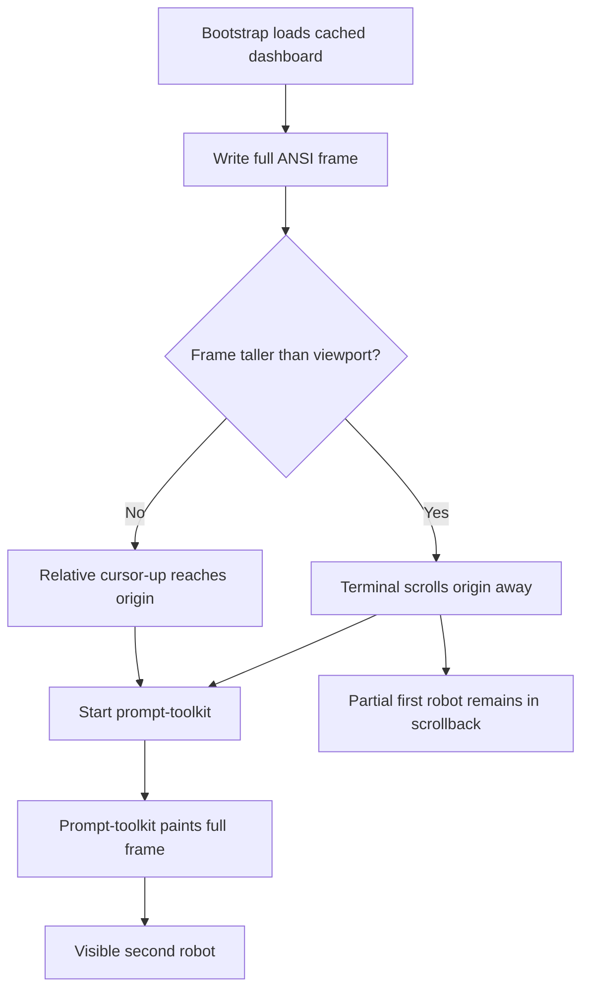

A relative cursor-up sequence cannot restore a cursor origin that has already
scrolled outside the viewport. Zooming out increases the row count and lets
the first frame fit; it does not make the two-painter design correct.

### 3.3 Why the footer disappears

The current renderer reacts to width but not terminal height. It places the
complete dashboard in one non-wrapping prompt-toolkit `Window`. At the
observed 80-column state, the frame reaches 49 lines and the first key line is
line 48. A shorter terminal clips the bottom. There is no scrolling body and
no fixed footer.

Removing the external pseudo-rows shortens the observed frame to 43 lines,
which reduces the symptom but does not repair it. More saved accounts or a
smaller terminal would reproduce the clipping.

### 3.4 Why the external rows are invalid

Current source explicitly manufactures `DashboardExternalRow` when a
provider is classified as externally active. That proves only that the code
contains the behavior. It does not prove product approval, user authorship, or
requirements authority.

The rows violate the product account model because they:

- are not backed by persisted saved accounts;
- increase the apparent account set;
- receive account-row styling and a selection marker;
- participate in focus and navigation; and
- expose a silent no-op activation path.

An unmatched ambient login is relevant status. It is not a saved account.

### 3.5 Why selection appears completely dead

The exact current chain is:

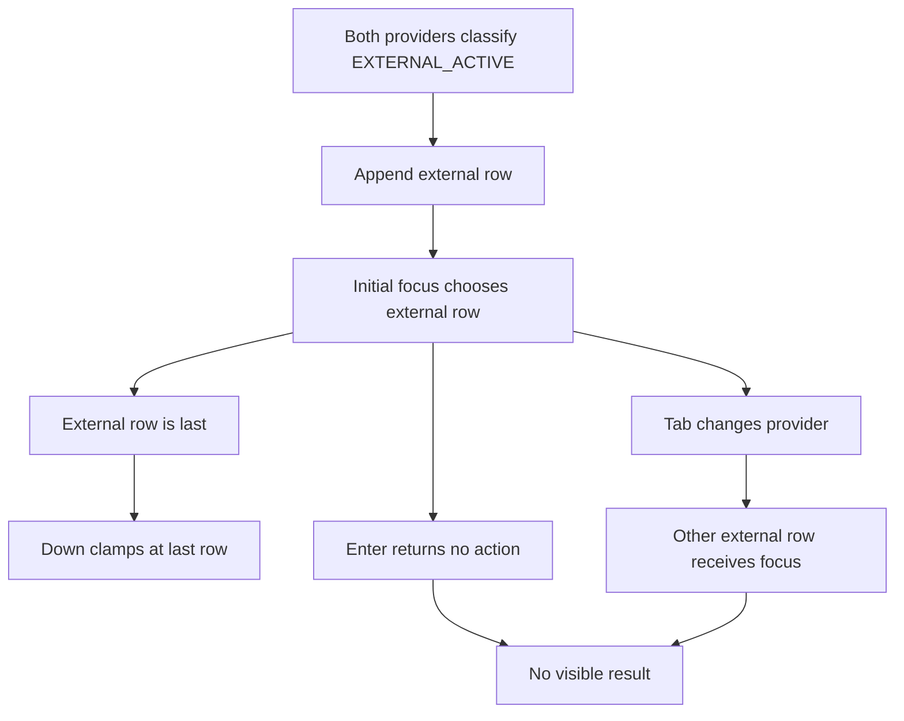

The key decoder, cursor movement, invalidation, and repaint machinery can
operate. The invalid default focus, clamped movement, visually identical Tab
target, silent Enter result, and hidden footer combine to make the entire
interaction appear broken.

### 3.6 The foreground-Claude guard blocks valid behavior

The current Claude foreground probe can establish that an exact same-user
foreground Claude executable exists. It cannot establish that Claude Remote
Control is active. The activation service nevertheless translates ordinary
foreground presence into `REMOTE_CONTROL_DISCONNECT_REQUIRED` unless a
disconnect override is allowed.

Ordinary open Claude terminals are the required seamless-switch case. A guard
that rejects them is both overbroad and contrary to the observed provider
behavior.

### 3.7 Codex auth state can change while transport auth remains stale

The current Codex broker can install external auth, observe
`account/login/completed` and `account/updated`, and read back the account. In
Codex 0.146.0, loaded threads share a process-wide `AuthManager`, but a model
client can retain an authenticated Responses WebSocket across turns. Socket
reuse checks whether it remains open, not whether account identity,
credential generation, or selection epoch changed.

An account notification therefore proves app-server auth state, not the
authority of the next reused WebSocket turn.

### 3.8 WSL has a separate control-plane failure

A read-only daemon-status call in the QA environment returned:

```text
WSL requires Linux and an explicit distribution.
```

This does not cause the initial Enter no-op; the external-row path returns
before dispatch. It can become the next blocker after dashboard actions are
repaired. WSL platform/distribution detection is a separate acceptance gate.

## 4. Goals, Non-Goals, and Invariants

### 4.1 Goals

The completed product must:

- render once and remain usable without a font-zoom workaround;
- display and navigate exactly the persisted saved accounts;
- preserve focus by stable account ID across refresh and resize;
- switch each provider independently;
- converge every integrated open session on the next real request;
- preserve an in-flight turn under the authority that admitted it;
- preserve the same process, conversation, tools, hooks, and child context;
- support refreshable and setup-token Claude accounts;
- support every saved Codex private authority;
- maintain selected and unselected accounts independently;
- expose honest unmanaged, unreachable, dead, rejected, and unsupported
  states;
- keep credentials out of control and presentation state; and
- fail closed without making a working old session unusable.

### 4.2 Non-goals

The design does not:

- switch an already in-flight upstream request to another account;
- claim that setup-token inference authority creates profile-only state;
- retrofit the environment of an arbitrary already-running process;
- auto-import or delete an unmatched ambient provider login;
- implement Anthropic or OpenAI refresh-token exchanges in Sidekick;
- copy or hand-edit provider credential files to activate an account;
- use a universal provider proxy where a narrower provider mechanism exists;
- restart/resume sessions as an account-switching mechanism;
- synchronize selections across machines or operating-system users;
- support native Windows in the initial release; or
- claim compatibility for a provider version that has not passed its gate.

### 4.3 Non-negotiable invariants

1. Selectable rows are exactly persisted saved accounts.
2. Stable account identity and credential generation are distinct.
3. Selection, maintenance, usage, and session adoption are distinct state.
4. Every saved account is maintained independently of selection.
5. The provider's official process is the sole durable credential writer.
6. Sidekick persists no token in selection, journals, status, or IPC.
7. A turn is bound to exactly one provider, account, generation, and epoch.
8. An admitted turn and all its provider retries finish under that binding.
9. A prompt arriving during commit is queued and sent at most once.
10. A selection does not cancel, replay, or retarget an admitted turn.
11. A failed preparation leaves every participant alive on the old epoch.
12. Success requires every live integrated participant to be ready.
13. Idle readiness proof consumes no provider quota.
14. Actual adoption is proven by the first later real turn.
15. Live-unreachable or unmanaged sessions produce visible degraded status;
    confirmed-dead participants follow the phase-specific recovery contract.
16. Every focused visible row has a typed Enter result.
17. Prompt-toolkit is the sole interactive terminal output owner.
18. Width and height both participate in layout.
19. Unsupported private provider capabilities fail closed on the old epoch.
20. Rollback moves a selection pointer; it never rolls credentials backward.

## 5. Chosen System Architecture

### 5.1 Provider-specific data planes behind one control plane

The design uses one provider-neutral coordinator and two deliberately
provider-specific authority adapters.

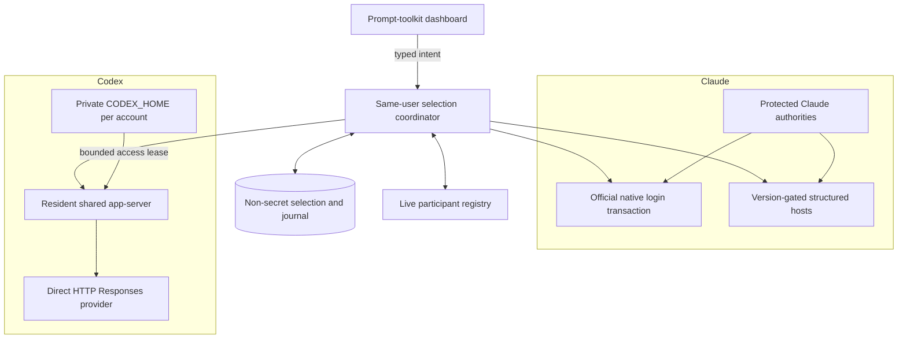

The provider-neutral protocol answers:

- which saved account is desired;
- which epoch admits each turn;
- which participants are busy, ready, adopted, unreachable, confirmed dead,
  or unmanaged;
- whether a switch can finalize; and
- what non-secret result the dashboard renders.

The provider adapters answer:

- how a target authority is prevalidated;
- how the provider observes a selected authority;
- which exact runtime boundary can change safely;
- what provider-specific acknowledgement proves readiness;
- what next-turn evidence proves adoption; and
- whether the installed version supports the mechanism.

There is no universal token file, refresh implementation, provider proxy, or
weak common-denominator switch.

### 5.2 Ownership: one terminal owner, separated auth owners

The phrase “two owners” must not collapse two unrelated issues.

For terminal output, two owners are a defect:

| Component | Correct responsibility |
| --- | --- |
| Bootstrap | Choose interactive or one-shot mode and execute; never paint an interactive frame |
| Dashboard entrypoint | Compose state and services; never manipulate the cursor |
| Prompt-toolkit application | Own terminal lifecycle, first paint, resize, focus, scrolling, redraw, and restoration |
| Renderer | Produce semantic header, body, status, and footer fragments without writing to the terminal |

For authentication, separated ownership is a security requirement:

| Owner | Authority |
| --- | --- |
| Official Claude process | Durable refreshable-Claude credential writes and native login |
| Official Codex process | Durable refresh-token rotation inside each private `CODEX_HOME` |
| Sidekick credential layer | Protected leases, validation, serialized official operations, and restore policy |
| Sidekick coordinator | Stable selected account ID, epoch, turn admission, participant readiness, and proof |
| Provider session | Its in-flight turn and provider-owned conversation/runtime state |

Sidekick choosing the next-turn authority does not make it the OAuth refresh
owner. The provider rotating a credential does not make it the product
selection owner.

### 5.3 Runtime topology

One lean per-user supervisor remains the durable control-plane home. It owns:

- the owner-only local control endpoint;
- serialized provider selection transactions;
- the live integrated-participant registry;
- durable non-secret selection/journal recovery;
- the resident shared Codex app-server relationship;
- bounded maintenance scheduling; and
- typed status projection.

Provider-heavy refresh and usage tasks remain bounded workers or provider
adapters. The supervisor does not become a credential database, prompt log,
or model-response proxy.

`SelectionWorkerGateway` creates each durable child operation ID before
enqueue. For an exchange-bearing selection child, it calls one injected
provider exchange owner with the exact child operation ID, parent selection
operation ID, provider, and kind before publishing the child to the queue.
One composite dispatcher selects the provider owner by provider and kind. It
delegates only explicit Codex operations to
`CodexRuntimeBroker.prepare_operation()` and never sends Claude work through
`CodexRuntimeBroker`; Claude commit, recovery-forward, and participant-bind
work belongs to `ClaudeProtectedCommitRelay`.

`DurableScheduler` and its existing `WorkerPool` remain the only scheduler and
executor. Scheduler completion, cancellation, or failure closes the exchange
for that exact child ID. The gateway also aborts the same exchange if enqueue,
wakeup, relay, or waiter handling fails. No second executor, thread, polling
loop, or provider-generic broker is added.

Claude adds one provider-owned protected data plane beside the secret-free
control plane. The isolated worker opens one operation-scoped lease, sends it
through the existing bounded worker exchange, and releases all credential
locks. A resident Claude relay then delivers a separately encoded mutable copy
to each exact registered structured participant over its peer-bound capability
socket. The relay does not resolve, persist, interpret, or log the credential.
The generic coordinator, control protocol, worker result, and CLI composition
remain credential-free.

Every Sidekick-integrated interactive client registers through the stable
same-user boundary. A participant joining during a transition receives the
pending epoch and begins behind the same admission gate. It cannot sneak a new
turn through the old epoch.

A Claude structured host creates one AF_UNIX socketpair before registration.
It transfers the supervisor endpoint as one ancillary descriptor during the
kernel-proven attachment transaction. The host endpoint stays in the same
event loop that owns terminal input and structured-engine I/O. There is no
filesystem listener, provider thread, executor, or polling loop.

`SelectionCoordinator.register()` owns one composite attachment transaction
across `ParticipantRegistry` and `ClaudeParticipantChannelRegistry`. Both
registries validate first; then membership and the exact peer-bound channel
commit together or neither commits. The received descriptor is transaction-
owned after handoff and closes on every registry, persistence, or commit
failure. `ControlConnection` or its dedicated attachment reader owns the
descriptor through peer verification and strict decode, closes it on every
pre-handoff failure, and transfers it exactly once to `SelectionCoordinator`
with the verified attachment request. The serialized control request remains
credential-free.

Disconnect and proved reconnect use the same coordinator-owned transaction.
They remove or replace the exact live membership and channel together and
close only the displaced endpoint. A disconnected obligation continues to
block selection until reconnect or proved death, but it is not represented as
a required live participant without a protected channel. Thus no orphan
channel survives and no live required Claude participant exists without its
exact connection-generation and process-identity binding.

### 5.4 Session enrollment and command resolution

The seamless guarantee needs a real process-launch boundary. The normative
public entrypoints are:

```text
sidekick-usages session claude -- [CLAUDE_ARGUMENTS...]
sidekick-usages session codex -- [CODEX_ARGUMENTS...]
sidekick-usages session shell install
sidekick-usages session shell uninstall
sidekick-usages session shell status
```

The first two commands are registered and require no shell-file change. An
unqualified Claude structured host fails closed before provider execution with
a visible typed capability refusal. It never silently no-ops or launches a
release-disabled setup/mixed mechanism.

`session shell install` is an explicit, idempotent opt-in that adds a bounded,
marked source block for the detected supported shell. The sourced Sidekick
file defines forwarding functions so ordinary `claude` and `codex` invocations
enter the corresponding `session` command with the original argument vector.
It does not put a fake provider binary on `PATH`, replace a provider launcher,
or modify Claude/Codex credential or settings files. Uninstall removes only
the exact Sidekick-owned source block and generated integration file; a changed
or ambiguous shell file fails closed and prints the manual removal range.

Initial automatic shell integration supports Bash, Zsh, and Fish on Linux,
WSL, and macOS. Bash and Zsh use one marked source line in the exact resolved
interactive startup file; Fish uses one owner-only file beneath its `conf.d`
directory. `--shell bash|zsh|fish` resolves ambiguity, and `--dry-run` prints
the exact files and edits. Other shells and IDEs use the explicit provider
session commands until a separately qualified adapter exists. Native Windows
PowerShell remains outside the initial platform scope.

Each launcher:

1. resolves the real official provider executable from the filesystem without
   consulting the calling shell function, rejects recursion into Sidekick, and
   resolves the stable provider launcher to the exact build being qualified;
2. preserves the argument vector, current directory, terminal file
   descriptors, terminal size, signal semantics, and final exit status;
3. rejects, with a typed explanation, user arguments or environment/config
   layers that would override selection, auth, endpoint, or transport
   correctness; it never silently drops or reorders an unsafe argument;
4. authenticates to the same-user supervisor, registers the process-start
   identity and exact capability manifest, and begins behind any pending
   provider gate; and
5. releases the provider process only after the finalized account, generation,
   epoch, and launch policy are proven.

For Claude, every integrated launch uses the exact-version structured host,
even when the selected authority is refreshable. That common host is what
makes later mixed refreshable/setup-token transitions deterministic without
restarting the Claude engine. The host invokes only the official resolved
engine, reproduces the complete interactive terminal contract, and obtains a
protected inference lease only at the process boundary that consumes it.
Higher-precedence Claude auth sources, a conflicting base URL, `--bare`, or a
user credential helper cause a prelaunch refusal unless a separately designed
mode has explicitly qualified them. Sidekick does not edit native Claude
credentials as a side effect of launching a session.

For Codex, the launcher uses a Sidekick-owned neutral session `CODEX_HOME`
that contains no refresh token and starts or attaches to the one resident
shared app-server. It starts the official stock TUI once with Codex 0.146.0's
`--remote` mode against a stable, owner-only per-participant control relay.
The relay forwards the app-server protocol to the same resident server for the
entire TUI lifetime; it gates only new account-bearing requests and observes
terminal events needed for turn leases. It never replaces the backend, acts as
a Responses/model proxy, logs protocol bodies, or persists queued prompts.
The relay exists because an unmediated stock TUI can issue `turn/start` during
the auth boundary and offers Sidekick no participant-ready acknowledgement.
Those are its only product responsibilities, plus refusing uncoordinated auth
mutation. If a qualified future Codex release provides a native global
admission/revision gate, Sidekick adopts that maintained surface and removes
the relay rather than preserving duplicate machinery.

The detached Codex daemon does not inherit lifecycle-client `-c` overrides.
Exact 0.146.0 source shows that its lifecycle backend launches only
`app-server --listen unix://`, and resolves the executable beneath the daemon
home at `packages/standalone/current/codex`
([daemon launch][codex-daemon-launch],
[managed install][codex-daemon-install]). Sidekick therefore owns two
credential-free resources in the neutral home before daemon startup:

- an owner-only `config.toml` containing the protected direct-HTTP provider;
  and
- a validated symlink to the provider-owned native `packages` tree.

The config transaction preserves valid unrelated settings, refuses malformed
TOML and protected-key collisions, and never projects `auth.json`. Effective
`config/read` must attribute every protected key to the exact neutral-home
user file. A project, alternate user file, CLI flag, or other origin that
defines a protected key fails closed. Exact 0.146.0 tests prove the effective
result; documentation or planned arguments are not substituted for resident
readback.

The neutral session home is the canonical interactive state/config home for
integrated Codex sessions and contains no provider refresh token. Existing
unrelated settings already in that home, plus allowed project config, remain
effective. Moving native/default-home settings into it is a separate explicit,
user-reviewed preparation operation, not account selection. This feature does
not build a generic config copier, duplicate inline secrets, or silently import
native auth. Until preparation succeeds, the launcher returns a typed
`SESSION_CONFIGURATION_REQUIRED` result and leaves the ordinary Codex command
available as an unmanaged bypass. Launch fails before provider execution when
effective-config proof does not match the protected definition.

These three transports are distinct:

| Transport | Lifetime and selection rule |
| --- | --- |
| TUI to participant relay to app-server | Remains connected for the complete Codex TUI; selection never closes it |
| App-server Responses model transport | Direct HTTP only; a new attempt resolves current shared auth |
| Codex realtime model transport | May remain on its admitted epoch until it ends naturally; it is never migrated or closed by selection |

Shell installation affects new launches in already-open shells after their
configured source file has been loaded; it cannot retroactively wrap a
provider process that already exists. Supported IDE terminal profiles use the
same explicit launcher command. `session shell status` reports each shell/IDE
path as integrated, not loaded, bypassed, ambiguous, or unsupported without
reading provider credentials.

An already-open idle terminal that has loaded the integration reads the newest
finalized selection when its next `claude` or `codex` command begins. No parent
shell environment rewrite is required. A provider session already running
through the launcher participates in the live epoch transition and adopts at
its next real request.

Provider-local credential commands cannot bypass the global transaction. In a
Sidekick-integrated Claude host, `/login` opens the saved-Claude-account chooser
and submits the same typed epoch selection as the dashboard; selecting a
refreshable row then uses the official native login transaction and the proven
next-request reread. Creating or renewing an authority remains an explicit
`sidekick-usages claude setup-token` or managed-login/migration operation.
`/logout` and unsaved-login requests show the applicable explicit credential
command, such as `sidekick-usages migrate managed-auth`, instead of mutating
native auth behind the coordinator.

The Codex participant relay rejects account login/logout mutation methods from
an interactive session with typed guidance to `sidekick-usages codex login`
or the saved-account chooser. The neutral session never becomes a durable
refresh authority. Unmanaged provider binaries retain their ordinary native
login commands, but any resulting auth is ambient status until an explicit
Sidekick save/reconciliation operation relates it.

### 5.5 Integrated and unmanaged sessions

The product distinguishes these session classes:

| Class | Claude refreshable | Claude setup token | Codex |
| --- | --- | --- | --- |
| Integrated | Registered structured host plus native/epoch proof | Registered structured host with correlated updates | Registered stock TUI through participant relay to resident shared app-server |
| Ambient but provider-observable | Native reread may converge, but readiness is not claimed without registration | Cannot be retrofitted externally | Cannot be proven coordinated without shared runtime enrollment |
| Unmanaged | Kept alive; visible degraded status | Kept alive; visible degraded status | Kept alive; visible degraded status |

The seamless product guarantee applies to every registered integrated
session. Provider-observed native Claude behavior may additionally update an
ambient refreshable session, but Sidekick must not count an unregistered
process in the all-participant proof.

An invocation of an official provider binary by absolute path, a shell
`command` bypass, a shell that has not loaded the opt-in integration, another
user/container/host, or a process that predates enrollment is unmanaged. This
is an explicit escape hatch, not an account-selection mechanism. Sidekick does
not block, attach to, signal, or replace it.

An unmanaged session is not an “external account.” It is session status. The
dashboard may report, for example, “1 unmanaged Claude session may not follow
setup-token changes,” but that message is outside account navigation.

### 5.6 Chosen alternatives

Three architecture families were compared:

| Alternative | Advantages | Fatal or material cost | Decision |
| --- | --- | --- | --- |
| Native file/profile pointer only | Simple; works for later launches | Cannot update setup-token environment or cached Codex transport; risks credential writers | Rejected |
| Universal local model proxy | One request boundary for all clients | Reimplements streaming/protocol state and handles subscription credentials; unnecessary for Codex | Rejected as default |
| Provider-specific adapters plus epoch coordinator | Uses provider-native strengths and one continuity contract | Requires two qualified adapters | Chosen |

Within Claude setup-token support, the structured host is the preferred
prototype because the official Claude engine retains upstream transport. A
stock-TTY stable Messages route remains a researched fallback, not a parallel
release mechanism. It may ship only if the structured host cannot meet full
interactive parity and the routing/legal/security gates are independently
satisfied.

Within Codex, direct HTTP Responses with external auth is chosen over a local
Responses proxy or app-server replacement because exact 0.146.0 source
provides the required per-attempt current-auth resolution.

## 6. Authority and State Model

### 6.1 Four separate state layers

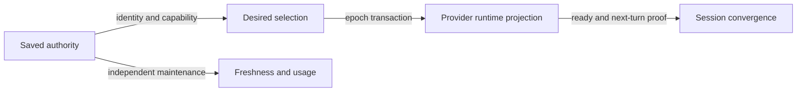

**Saved authority** contains the stable Sidekick account ID, provider,
provider identity when available, display metadata, credential capability,
health, and deterministic saved order.

**Desired/finalized selection** contains provider ID, stable saved-account ID,
monotonic epoch, proven credential generation, completion status, and
timestamps. It contains no credential, provider home, email, or display label.

**Provider runtime projection** describes provider-observed identity,
credential generation, native/shared-runtime health, and drift. It is not a
source of new saved rows.

**Session convergence** describes each registered participant's capability,
admitted turn epoch, readiness epoch, first adopted epoch, and liveness.

### 6.2 Identity versus generation

Provider identity determines which logical saved account a runtime belongs
to. Credential generation determines freshness, compare-and-swap safety, and
whether the exact installed lease was observed.

A saved Codex account with the same unique provider identity and a newer
access-token generation remains that saved account in a reconciliation state.
It must not become an anonymous external row. Conversely, matching only a
display label or plan is never enough to relate an authority.

For setup-token Claude accounts that do not expose full profile identity, the
stable saved ID remains authoritative inside Sidekick. The credential
capability and validated token fingerprint/generation relate its protected
authority. The UI does not invent missing email, organization, or profile
scope.

### 6.3 Conceptual persisted records

Names may be refined to match existing schemas during planning, but these
fields and exclusions are normative.

```text
ProviderSelection
  provider_id
  selected_account_id
  finalized_epoch
  authority_generation
  finalized_at

SelectionJournalEntry
  operation_id
  provider_id
  baseline_account_id
  baseline_epoch
  target_account_id
  target_generation
  required_participant_ids
  ready_participant_ids
  lost_after_commit_participant_ids
  phase
  outcome_code
  started_at
  updated_at
```

Neither record may include:

- access, refresh, setup, or ID token;
- authorization header or cookie;
- provider response body;
- credential/profile/home path;
- prompt, response, tool input, or tool output;
- environment contents;
- account email or user-supplied label; or
- PID as a durable identity.

### 6.4 Ephemeral coordination records

```text
Participant
  opaque_participant_id
  provider_id
  client_kind
  process_start_identity
  capability_version
  connection_generation
  registered_epoch
  ready_epoch
  adopted_epoch
  active_turn_count
  last_seen_monotonic

TurnLease
  opaque_turn_id
  participant_id
  provider_id
  account_id
  authority_generation
  epoch
  phase
```

Process ID alone is unsafe because it can be reused. A live participant is
bound to its authenticated IPC connection plus process-start identity.
Ephemeral records live only as long as the authenticated participant or its
bounded recovery window. An open durable journal may store bounded opaque
participant IDs so crash recovery knows which registrations must return; it
never stores their PID, process-start value, connection credential, socket, or
secrets. Closed journal history retains only aggregate participant results.

### 6.5 Typed transition outcomes

The coordinator exposes typed results instead of `None`, truthy flags, or
free-form provider errors. At minimum it distinguishes:

- `ALREADY_SELECTED`;
- `SELECTION_SUCCEEDED`;
- `SELECTION_READY_ADOPTION_PENDING`;
- `TARGET_REFRESH_REQUIRED`;
- `TARGET_EXPIRED`;
- `TARGET_REJECTED`;
- `TARGET_MALFORMED`;
- `TARGET_UNREADABLE`;
- `PROVIDER_UNAVAILABLE`;
- `UNSUPPORTED_PROVIDER_VERSION`;
- `UNSUPPORTED_SESSION_CAPABILITY`;
- `SESSION_CONFIGURATION_REQUIRED`;
- `UNCOORDINATED_AUTH_MUTATION`;
- `REMOTE_CONTROL_STATE_INCOMPATIBLE`;
- `PARTICIPANT_UNREACHABLE`;
- `PARTICIPANT_CONFIRMED_DEAD`;
- `PARTICIPANT_LOST_AFTER_COMMIT`;
- `REALTIME_SESSION_ACTIVE`;
- `ACTIVE_OPERATION_TIMEOUT`;
- `AUTHORITY_PROOF_FAILED`;
- `SELECTION_ROLLED_BACK`; and
- `SELECTION_RECOVERY_REQUIRED`.

Provider errors are redacted at their adapter boundary before they enter
journals, IPC, dashboard state, or logs.

## 7. Responsive Dashboard and Interaction

### 7.1 One-painter lifecycle

The public TTY route becomes:

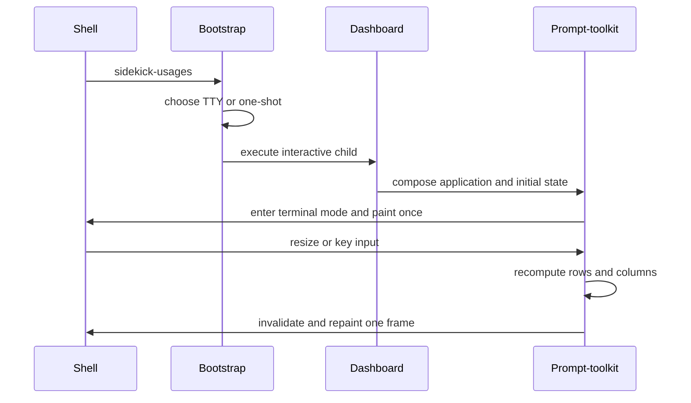

Bootstrap may load small routing metadata, but it cannot render branding,
provider panels, cached account data, a footer, or cursor movement before the
interactive owner starts. One-shot/non-TTY output remains an ordinary finite
render and does not instantiate prompt-toolkit.

### 7.2 Height-aware layout

The interactive root is a prompt-toolkit container hierarchy, not one
pre-rendered non-wrapping `Window`:

```text
+--------------------------------------------------------------+
| full masthead OR compact one-line brand                      |
+--------------------------------------------------------------+
| scrollable provider/account body                             |
|                                                              |
|   CLAUDE · 4 accounts                                        |
|   > saved row                                                |
|     saved row                                                |
|                                                              |
|   CODEX · 2 accounts                                         |
|     saved row                                                |
|                                                              |
+--------------------------------------------------------------+
| operation/status line                                        |
| Up/Down move  Tab provider  Enter select  R refresh  Q quit  |
+--------------------------------------------------------------+
```

The application reads both `columns` and `rows` on the first paint and every
resize. It selects:

- full masthead when the remaining account viewport meets the minimum useful
  body height;
- compact masthead when the full brand would crowd the body or footer;
- one body viewport consuming the remaining rows; and
- a fixed operation/status and key-help footer.

The body scrolls automatically to keep the focused saved row visible. Provider
headings and panel decoration may compact at low height; account content and
the key footer do not disappear. At a height below the supported minimum, the
body still scrolls and the footer shows a typed “terminal too short” status
rather than silently clipping.

### 7.3 Saved-account-only projection

The dashboard read model contains:

```text
DashboardProvider
  provider_id
  saved_account_count
  rows: tuple[DashboardSavedAccount, ...]
  ambient_status: ProviderAmbientStatus | None
  session_status: ProviderSessionStatus
```

`DashboardExternalRow` is removed from the account union, focus model,
controller, renderer, and count. Ambient status may say that native/provider
state is unmatched, but it is rendered outside the focusable list.

The count after `CLAUDE` or `CODEX` is `len(persisted_saved_accounts)` and is
never derived from rendered status components.

### 7.4 Focus model

Focus is a pair of provider ID and stable saved-account ID. It is never an
array index, external sentinel, or visual row number.

On initial load:

1. focus the provider-verified selected saved account when it exists;
2. otherwise focus the first selectable saved account in persisted order;
3. if the provider has no saved accounts, focus the next provider that does;
4. if neither provider has a saved account, expose only global commands and a
   typed empty-state explanation.

On data refresh or resize:

1. preserve the same stable account ID when still present;
2. if it was removed by an explicit completed account operation, choose the
   next saved row in deterministic order;
3. keep the focused row within the body viewport; and
4. invalidate exactly one prompt-toolkit frame.

### 7.5 Input contract

- Up/Down move among saved rows inside the focused provider.
- Tab/Shift-Tab move among providers that have saved rows.
- Enter always emits a typed selection intent or typed visible refusal.
- Escape cancels preview and returns to the finalized selected saved account.
- Refresh reloads all accounts without changing selection.
- Quit restores terminal state exactly once.

No focused row can return silent `None`. An already-selected Enter shows an
explicit healthy/already-selected status. An unavailable target shows the
typed reason and recovery action. The status line includes operation ID only
when useful and never includes credential-derived data.

### 7.6 Refresh and concurrency

Dashboard collection remains cached-first. Provider/account loads run with a
bounded concurrency limit and return typed per-account results. Final rows are
sorted by persisted saved order, not completion order.

An account refresh may update usage, health, identity relation, or generation
without stealing focus. If the focused stable account disappears only from a
transient failed read, the row remains with a typed stale/error state; it is
not silently removed.

## 8. No-Interruption Selection Protocol

### 8.1 State machine

```mermaid
stateDiagram-v2
    [*] --> Idle
    Idle --> Prevalidating: select target
    Prevalidating --> Preparing: target proven
    Prevalidating --> FailedOldEpoch: validation fails
    Preparing --> WaitingOldTurns: gates installed
    WaitingOldTurns --> Committing: old work drained
    WaitingOldTurns --> FailedOldEpoch: bounded wait fails
    Committing --> AwaitingReady: authority committed
    Committing --> Recovering: proof ambiguous
    AwaitingReady --> ReadyFinalized: all required live participants ack
    AwaitingReady --> Recovering: live participant unreachable
    AwaitingReady --> DegradedTarget: participant confirmed dead after commit
    ReadyFinalized --> Idle: open admission
    DegradedTarget --> Idle: target proven; degraded outcome persisted
    Recovering --> AwaitingReady: target and participants reconciled forward
    Recovering --> FailedOldEpoch: baseline proven; no observer saw target
    FailedOldEpoch --> Idle
```

The state names are semantic contracts. Planning may align exact enum names
with current repository vocabulary without weakening a transition.

First-real-turn adoption is participant state, not a phase that keeps the
selection transaction open. After `ReadyFinalized` opens admission, each
participant independently advances `ready_epoch` to `adopted_epoch` on its
next real request. A later selection may supersede an unconsumed ready epoch;
the participant must bind to the newest finalized epoch and never send a stale
queued request.

### 8.2 Phase contract

#### PREVALIDATE

The provider adapter validates or officially refreshes the target in its
private authority. It proves:

- the stable saved account still exists;
- provider identity is related to that saved account;
- credential generation is stable across required reads;
- required scopes/capability are present;
- a bounded access lease can be acquired; and
- the installed provider version supports the transition.

No participant gate or global selection changes on prevalidation failure.

#### PREPARE

The coordinator reserves epoch `N+1`, records baseline finalized epoch `N`,
and sends a prepare notice to every live registered participant. New-turn
admission closes before any provider authority changes.

A participant may finish local editing, rendering, or tool-independent work,
but cannot transmit a newly admitted provider request under N. A late
participant authenticates, learns about N+1, and starts behind the gate.

Before provider commit, the coordinator seals the final required membership
snapshot through protected distribution and provider-proof binding. A Claude
participant that arrives before that seal joins the snapshot or causes an
old-epoch refusal. One that arrives after target proof binds forward through
the protected participant-bind operation before it may send READY or a turn.

#### WAIT_OLD_TURNS

Every turn, retry, active tool/hook, and account-scoped MCP operation admitted
under N finishes naturally. A retry is part of the original turn lease and
cannot cross epochs.

New prompts are queued in participant memory with their original order. They
are not persisted, duplicated, replayed, or acknowledged upstream. Queue
bounds are explicit; exceeding them produces local backpressure, not silent
loss.

#### COMMIT_AUTHORITY

The provider adapter performs the narrow provider-specific transition. It
does not open admission yet. A lease is exposed only at the last responsible
boundary and remains memory-only.

For a structured Claude target, the isolated worker releases every provider
and account authority before the resident relay waits for participant install
receipts. Each receipt proves one correlated local installation only. It does
not itself advance the provider-neutral readiness gate.

The commit point is not merely “an API call returned success.” It requires the
applicable provider-specific identity, generation, ordered-notification or
serialized-operation, and native-propagation evidence defined below.

#### READY_ACK

Each live integrated participant proves that its next admitted turn will bind
to N+1. Claude structured readiness requires provider proof and an exact
protected install receipt to agree on participant, connection, operation,
account, generation, epoch, nonce, and structured request ID. Only then may
the participant send the separate secret-free READY acknowledgement. A local
private-control response alone is not readiness. Codex readiness uses resident
shared-auth readback plus the HTTP-only transport capability.

No synthetic inference request is sent. Idle sessions consume no quota.

#### FINALIZE_READY

“Selected and ready” is atomically persisted only after every required live
participant acknowledges N+1. The target becomes the crash-recovery baseline,
the journal closes with a typed success or degraded result, and admission may
then open. The in-memory readiness snapshot records full participant state.
The open journal records only bounded opaque IDs; its closed result retains
only counts and contains no process identity or secret.

A participant confirmed dead after provider commit cannot be silently deleted
from the operation to manufacture success. After target readback and readiness
from every remaining live participant, the target may become the safe active
baseline with `PARTICIPANT_LOST_AFTER_COMMIT`; the dashboard must call that
result degraded, not `SELECTION_SUCCEEDED`.

#### OPEN_ADMISSION

The coordinator releases N+1 to all ready participants as one logical barrier.
Participant relays drain locally queued prompts in original order. A prompt is
checked against the current finalized epoch again immediately before its first
provider transmission, so an intervening N+2 selection cannot release stale
N+1 work.

#### asynchronous NEXT_TURN_PROOF

After the gate opens, each participant binds its first real turn to the target
stable account, target generation, and N+1 before provider transmission. It
emits a secret-free local adoption receipt. The receipt proves routing metadata
and correlation, not the token value. A qualified provider-live journey must
also prove the exact account and generation used by that genuine request
before Sidekick claims Claude convergence.

Actual adoption remains a separately visible count because idle participants
may not send a turn for hours. Adoption proof never controls whether the ready
selection is durable and never triggers a synthetic model request.

### 8.3 Sequence during an active turn

```mermaid
sequenceDiagram
    participant U as User
    participant P as Participant
    participant C as Coordinator
    participant A as Provider adapter
    participant R as Provider runtime

    P->>R: turn under account A, epoch N
    U->>C: select account B
    C->>A: prevalidate B
    A-->>C: B identity and generation proven
    C->>P: prepare N+1; close admission
    U->>P: submit another prompt
    P->>P: queue prompt locally
    R-->>P: finish A turn normally
    P-->>C: old turn and operations drained
    C->>A: commit B authority
    A-->>C: B provider proof and required installs complete
    C->>P: ready N+1
    P-->>C: next turn will bind N+1
    C->>C: finalize ready N+1
    C->>P: open admission N+1
    P->>R: queued prompt under B, epoch N+1
    P-->>C: first-real-turn adoption proof
```

### 8.4 Concurrent selection requests

Selections serialize per provider. Claude and Codex may switch concurrently
only when their credential/provider locks and shared resources are disjoint.
Two requests for the same provider use compare-and-swap against the baseline
epoch:

- an exact duplicate target joins or observes the in-progress operation;
- a different target receives a typed conflict and does not supersede the
  active transaction; and
- stale callers cannot finalize over a newer epoch.

The dashboard remains responsive and displays the current operation. It does
not launch overlapping activation workers for repeated Enter presses.

### 8.5 Failure and rollback

Before provider commit, failure simply reopens admission on N.

After a provider mutation but before proof, the adapter returns a provider-
owned composite decision: `baseline_proven`, `target_proven`, or `unresolved`.
Claude combines reclassified authority mode, isolated native readback, safe
durable worker proof, and exact secret-free structured binding queries. Native
A is not baseline proof for a setup-token target because native state is
deliberately unchanged. Any target native state or target participant binding
forces forward recovery. Ambiguity keeps prompts gated and displays
`SELECTION_RECOVERY_REQUIRED`; Sidekick never guesses, kills sessions, or
copies older credentials over newer provider state.

Rollback changes only the selection pointer and gate. Refresh-token rotation
or provider credential generations never move backward. A previously issued
but unused access lease is released/zeroized according to its owner; it is not
persisted for retry.

Participant loss is phase-sensitive:

| Observation | Before provider commit | During or after provider commit |
| --- | --- | --- |
| Confirmed dead by authenticated peer/process-start proof | Remove from the required set, journal the reason, and continue only if no replacement is registering | Do not erase it from the operation; prove provider state forward and finish at best with `PARTICIPANT_LOST_AFTER_COMMIT` |
| Live but unreachable | Keep it required; bounded timeout aborts and reopens N | Keep prompts gated and selection pending; no success or baseline rollback while its observation is unknown |
| Same process reconnects | Require the same participant ID, process-start identity, and a newer authenticated connection generation | Restore the same pending epoch and require its readiness proof |
| Different/new process registers | Treat it as a late participant behind the current gate | Add it to the target-ready set; it cannot impersonate the lost participant |

If failure occurs before provider commit, the operation aborts and all
participants reopen on N. If a disconnect occurs during or after commit, the
coordinator reads the provider and every reachable participant. When any
provider or participant has observed B, recovery is forward-only toward B;
credentials are never rolled backward. Setup baseline can reopen only when
every required live binding is proven old epoch, no target acknowledgement or
safe commit proof exists, and any absent participant reconnects or is kernel-
proven dead. Ambiguity keeps admission gated and exposes
`SELECTION_RECOVERY_REQUIRED`.

An unmanaged process never enters the required set and never supplies a
convergence acknowledgement. An externally killed/crashed participant is
reported truthfully; Sidekick selection itself emits no kill, signal, EOF,
close, cancel, or stop action.

### 8.6 Liveness bounds

Every phase has a typed bounded timeout. A timeout does not imply process
termination:

- a legitimately active old turn remains alive and selection reports waiting
  or degraded;
- a live unreachable registered participant remains required after heartbeat
  failure; only exact process-start/peer proof can classify it as dead;
- a user can continue using epoch N when failure occurred before commit; and
- after ambiguous commit, recovery protects against mixed routing by keeping
  new prompts gated until exact readback resolves the state.

## 9. Claude Provider Design

### 9.1 Credential capabilities

Claude saved accounts are classified by authority, not by whether the
dashboard can display an email:

| Capability | Refreshable/native authority | Setup-token authority |
| --- | --- | --- |
| Access token | Yes | Yes |
| Refresh token | Yes | No |
| Official native login exchange | Yes | No |
| Inference | Yes | Yes |
| Current Sidekick usage probe | Yes | Yes |
| Full profile identity/state | Provider-defined | Not guaranteed |
| Automatic renewal | Official provider process | No; regenerate explicitly |

Anthropic documents `claude setup-token` as a long-lived token used through
`CLAUDE_CODE_OAUTH_TOKEN`, and documents that variable's precedence relative
to native `/login` credentials in [Claude Code authentication][claude-auth].
The [environment-variable reference][claude-env] identifies the same token as
an alternative to `/login` and documents isolated configuration through
`CLAUDE_CONFIG_DIR`.

A setup token is therefore a real saved inference authority, not a broken or
temporary account. It is also not a refreshable login bundle. The design
preserves both facts.

### 9.2 Refreshable/native selection

The refreshable path reuses the current official transaction rather than
adding a second credential writer:

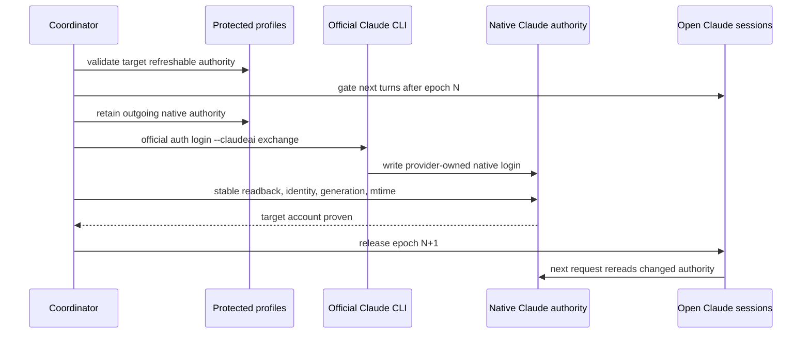

The adapter must retain the current protections:

1. lock the qualified native and target authorities in established order;
2. preserve the outgoing native authority through the current transaction;
3. acquire a bounded lease from the protected target;
4. invoke the official Claude `auth login --claudeai` exchange;
5. run official login/status verification;
6. obtain two stable protected reads;
7. prove provider identity, plan, scopes, expiry, and generation;
8. on Linux/WSL, prove native credential modification time advanced; and
9. commit Sidekick selection only after all provider proof succeeds.

No Sidekick code hand-edits the native credential JSON or Keychain record.
The provider's process remains the writer.

Installed Claude 2.1.220 checks the native credential modification time at
relevant request boundaries on Linux/WSL and rereads a changed record. This
matches the observed behavior that already-open sessions use the new native
account at their next request. An in-flight request retains the authority with
which it began. The evidence does not establish an atomic different-account
broadcast across independent sessions. Exact supported builds must prove each
session's selected identity on its next genuine request before Sidekick claims
global convergence.

### 9.3 Remote Control guard correction

Foreground TTY presence is not Remote Control evidence. The generic
`PRESENT -> REMOTE_CONTROL_DISCONNECT_REQUIRED` mapping is removed.

The replacement contract is:

- ordinary open Claude TTY sessions never block native selection;
- only a positively identified, currently incompatible Remote Control state
  may produce `REMOTE_CONTROL_STATE_INCOMPATIBLE`;
- the proof must come from a provider-supported status or an exact,
  version-gated runtime capability, not a process-name heuristic;
- absence of such proof means the special guard is disabled, not inferred;
- Sidekick never offers “approve disconnection” as a fallback; and
- any later provider support for seamless Remote Control must remove the
  restriction after its own acceptance test.

Selection is not allowed to stop, signal, disconnect, or replace a Claude
process to resolve this state.

### 9.4 Setup-token structured host

This mechanism is an implementation-approved, release-disabled prototype. It
launches and retains Anthropic's official Claude engine through its structured
transport. Sidekick provides the local interactive terminal host around that
one long-lived process, but does not call that host the stock Claude TUI.

At a safe between-turn boundary, the installed 2.1.220 runtime accepts a
private, correlated `update_environment_variables` control frame. Its
allowlist includes `CLAUDE_CODE_OAUTH_TOKEN`. Updating that variable clears
the runtime's OAuth memo and returns an acknowledgement. This is the only
inspected in-process mechanism that may change a setup-token authority without
replacing the Claude engine. Its response proves local mutation only. It does
not prove saved-account identity, provider acceptance, generation, or next-
turn adoption, and it is not a public SDK contract.

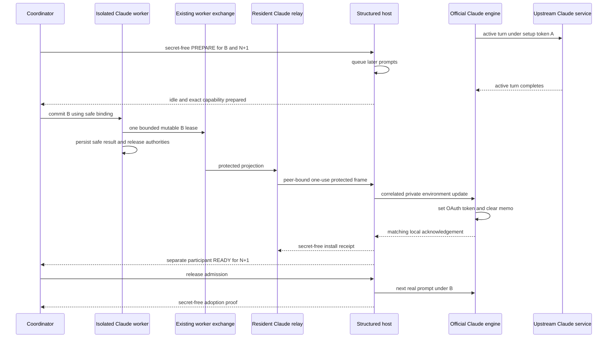

The lease is acquired only after every required participant is idle. It moves
from the worker through the existing exchange and Claude-only participant
capability sockets. It never enters generic control JSON, CLI composition,
persistence, worker results, logs, or diagnostics. The host's provider-owned
decoder passes a mutable lease directly to the protected child encoder and
clears every mutable copy after write or failure.

The worker-exchange lifecycle is ordered and child-specific:

1. `SelectionWorkerGateway._operation()` allocates the durable child ID;
2. the composite exchange owner prepares the provider exchange for the exact
   child ID, parent selection operation ID, and operation kind;
3. `SelectionWorkerGateway._submit()` enqueues and wakes the existing
   `DurableScheduler`;
4. the Claude relay reads the one-way protected reply but does not fan out;
5. `WorkerPool.complete_exchange()` publishes successful durable worker
   completion after provider authority release;
6. only then does `ClaudeProtectedCommitRelay` fan out and clear its reply; and
7. completion, cancellation, or failure closes the exact exchange once.

The existing `operation_requires_provider_preparation()` predicate remains
explicit for Codex-owned preparation. Exchange presence alone never routes an
operation to `CodexRuntimeBroker`, and Claude never reaches that broker.

Each install receipt binds the participant and connection generation,
operation, selected stable account, authority generation, epoch, nonce, and
structured request ID. That receipt remains distinct from Task 4 READY and
from later first-real-turn adoption.

The private control cannot be sent to an arbitrary stock TTY's stdin. It is a
structured-protocol message, not a slash command or terminal escape sequence.
Sidekick must own the structured transport from process launch.

A newly launched or late structured host cannot read credentials itself. It
uses the same protected route for a bounded participant-bind operation against
the finalized or pending target. Until protected bind and normal admission
agree, the engine cannot receive a real prompt.

### 9.5 Complete interactive-host parity

The structured path cannot ship merely because a prompt and response work.
The Sidekick host must preserve the official interactive product's required
behavior in the same process and conversation:

- streaming assistant content and reasoning/status events;
- multiline editing, history, interrupts that are user-requested rather than
  selection-requested, and terminal resize;
- permission requests, choices, confirmations, and denials;
- tool calls, tool results, progress, and ordering;
- hooks and their error/timeout behavior;
- MCP requests, notifications, resource updates, and authentication prompts;
- background terminals, tasks, and child-process lifecycle;
- dialogs, notices, plan-mode transitions, and provider errors;
- slash-command parity, with credential lifecycle commands deliberately routed
  through the global saved-account/credential workflows in Section 5.4;
- session identity, continuation, compaction, and context;
- terminal restoration after normal exit and failure;
- current working directory and environment policy; and
- credential scrubbing from Bash, hooks, and MCP stdio children.

Anthropic documents `CLAUDE_CODE_SUBPROCESS_ENV_SCRUB=1` in its
[environment-variable reference][claude-env]. The host enables the qualified
scrubbing behavior and verifies that provider credentials do not propagate to
untrusted child environments. It does not claim Linux environment variables
are invisible to every same-user privileged inspection path.

The structured host is release-blocked unless parity tests show that switching
does not change the engine PID, session/conversation identity, tool state,
hook behavior, or child context.

Maintained Agent SDKs provide structured host primitives, not an embeddable
stock TUI or a documented auth-specific runtime setter. Sidekick does not add
an SDK merely to create a second wrapper around the same CLI. It adopts one
only if a bounded qualification proves that it removes existing owned
machinery while preserving this auth and continuity contract.

### 9.6 Exact-version capability gate

Because the update control is private, the Claude adapter qualifies an exact
manifest of:

- resolved official executable path;
- provider version;
- supported executable/package fingerprint;
- structured protocol schema;
- update request type and correlation behavior;
- allowlisted variable name;
- OAuth memo invalidation behavior;
- acknowledgement shape; and
- full host-parity test result.

Qualification also requires positive and negative private probes, the exact
install binding, safe handling of an ambiguous response, and genuine next-turn
account and generation proof. A correlated local response is never promoted
to provider or adoption proof.

An unknown or mismatched build leaves the running session alive on its current
account and returns `UNSUPPORTED_PROVIDER_VERSION`. It does not attempt a
best-effort frame, restart, native-file write, or hidden fallback.

Provider upgrades trigger requalification before setup-token live switching
is enabled. Usage collection and saved-account maintenance may remain
available when their independent capabilities still pass.

### 9.7 Mixed setup-token and refreshable transitions

Removing an environment setting does not reliably unset an already-resolved
value in a running process. In addition,
`CLAUDE_CODE_OAUTH_TOKEN` takes precedence over native `/login`. Mixed
populations therefore require an explicit two-part transition.

When selecting a refreshable account:

1. run and prove the official native-login transaction so native identity,
   profile state, and refresh lineage are correct;
2. for each integrated structured participant that has carried a setup-token
   override, acquire a bounded access lease from that exact refreshable
   authority;
3. update that participant at the same safe epoch and require its correlated
   OAuth memo-clear acknowledgement; and
4. release prompts only after native and structured readiness agree on the
   same stable account, generation, and epoch.

When selecting a setup-token account:

1. do not manufacture a native refreshable login record;
2. update every integrated structured participant to the protected setup-token
   lease at the same epoch;
3. leave unrelated native profile state intact; and
4. report that inference switched while profile-only capabilities are not
   supplied by this account.

This avoids mixed authority where native sessions use B but a lingering
setup-token override keeps an integrated process on A.

The private update has no qualified unset contract. Empty string, omission,
or null cannot be assumed to restore native lookup. The prototype therefore
installs a bounded access lease from the exact committed refreshable authority
instead of inferring unset. The complete mixed path stays release-disabled
until that replacement and its next real request prove the exact target.

### 9.8 Ambient setup-token sessions

The operating system cannot rewrite another running process's inherited
environment. The [POSIX `exec` contract][posix-exec] defines the environment
supplied at process-image creation; it supplies no mechanism for another
ordinary process to mutate that environment later. A pre-existing setup-token
Claude process launched outside the Sidekick structured boundary cannot be
retrofitted without replacement, which the requirements prohibit.

Sidekick therefore makes its launch/shell integration the enrollment boundary
for setup-token seamless switching. An unmanaged legacy process:

- stays alive and usable;
- is never signalled, restarted, or resumed;
- is shown as unmanaged session status;
- is excluded from the all-integrated-participants success count; and
- is never claimed to have converged.

This limitation does not apply in the same way to refreshable native Claude
sessions because those sessions already observe the provider-owned shared
native authority at request boundaries.

### 9.9 Researched stock-TTY route and provider-contract boundary

Installed Claude also exposes an `ANTHROPIC_UNIX_SOCKET` route, and Anthropic
documents LLM gateway configuration and request routing in the
[Claude gateway guide][claude-gateway]. A stable local Messages route could
retain the stock TTY while selecting auth per request.

That alternative would make Sidekick responsible for:

- stripping inbound `Authorization` and `x-api-key` credentials;
- injecting only the selected protected lease;
- preserving Anthropic version and beta headers;
- complete streaming and error semantics;
- binding an entire stream and its retries to one epoch;
- backpressure, cancellation, body limits, and connection lifetime; and
- ensuring credentials never reach logs, diagnostics, child processes, or
  untrusted clients.

Anthropic's [legal and compliance guidance][claude-legal] places restrictions
on third parties offering Claude.ai login or routing Free, Pro, or Max
credentials on a user's behalf. A local user-owned route is technically
researchable, but it is not the preferred design and cannot ship without
explicit provider-contract and security approval.

The structured host is narrower because the official Claude engine remains
the upstream request owner. If it fails full interactive parity, the design
returns for review; it does not silently adopt the route.

### 9.10 Claude readiness and adoption proof

For a refreshable native participant, readiness requires target native
identity, target generation, and platform propagation proof. A registered
participant may acknowledge that the next request boundary will perform the
provider-native reread. Its first real later request supplies adoption proof.

For a structured participant, readiness requires a matching correlated
environment-update install receipt after its old turn drained, agreement with
the worker's exact provider proof, and a separate secret-free READY message.
Adoption binds the first later real prompt to the same account, epoch, and
generation before it enters the engine. Provider-live proof must then establish
that the genuine request used that exact authority.

No readiness check sends a model request. Usage quota is not spent to prove an
idle session.

## 10. Codex Provider Design

### 10.1 Existing foundation to preserve

Current Sidekick already has most of the correct Codex authority plane:

- one canonical private managed `CODEX_HOME` per saved account;
- official Codex ownership of refresh-token rotation;
- provider account, quota, usage, and token-activity reads;
- a resident shared interactive app-server;
- experimental external `chatgptAuthTokens` installation;
- strictly ordered `account/login/completed` and `account/updated`
  notifications;
- `account/read` readback;
- refresh-callback routing to the corresponding private authority; and
- secret-free projection receipts.

The design extends those boundaries. It does not replace them with copied auth
files, a Sidekick OAuth client, or one app server per selected account.
The current broker/authority foundation does not mean existing ordinary Codex
TUIs are already enrolled in the target neutral session plane. The launcher,
participant control relay, new-turn gate, and effective-config proof in this
design are required target work.

OpenAI documents the app-server authentication endpoints, including external
auth and its experimental status, in the
[Codex app-server guide][codex-app-server].

### 10.2 Exact stale-WebSocket risk

Exact Codex 0.146.0 source shows that loaded threads share the app-server's
process-wide `AuthManager` ([thread manager source][codex-thread-manager]).
Installing external auth updates that manager and emits account
notifications.

The same source also shows a session-scoped model client can reuse an open
Responses WebSocket without comparing account identity, token generation, or
selection epoch ([WebSocket client path][codex-websocket]). A socket
authenticated under account A may therefore remain the transport for a later
turn after the manager reports B.

`account/updated` plus `account/read` is necessary but insufficient proof for
next-turn inference when provider WebSockets are enabled.

### 10.3 Direct HTTP-only Responses provider

Codex 0.146.0 model-provider configuration supports a custom Responses
provider with a base URL, current OpenAI authentication, and an explicit
WebSocket capability. The exact provider definition to qualify is:

```toml
model_provider = "sidekick-chatgpt-http"

[model_providers.sidekick-chatgpt-http]
name = "OpenAI"
base_url = "https://chatgpt.com/backend-api/codex"
wire_api = "responses"
requires_openai_auth = true
supports_websockets = false
```

This shape is supported by the
[official Codex configuration reference][codex-config] and exact
[0.146.0 provider source][codex-provider-source]. The configuration contains no
token. `requires_openai_auth = true` instructs Codex to use its current shared
OpenAI authentication. `supports_websockets = false` prevents creation of the
stale account-authenticated Responses socket.

The exact 0.146.0 HTTP path calls `current_client_setup()` for each request
attempt and therefore resolves the current shared `AuthManager`
([HTTP client path][codex-http-client]). Each retry belonging to an admitted
turn remains under that turn's epoch gate; it cannot be released across an
account commit.

### 10.4 Resident-runtime topology

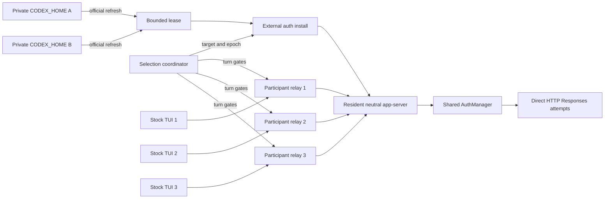

The app-server endpoint, process, connections, thread store, loaded threads,
rollout, approvals, tools, background terminals, and local state remain
resident. No TUI reconnect, app-server replacement, thread resume, or local
Responses proxy is required.

### 10.5 Codex selection transaction

At the provider commit boundary:

1. close admission of new `turn/start` requests for every integrated client;
2. let every account-A turn, retry, tool call, approval flow, and account-
   scoped MCP operation finish naturally;
3. validate or officially refresh account B in its exact private
   `CODEX_HOME`;
4. prove B's provider identity and stable credential generation;
5. acquire a bounded B access lease in memory;
6. install B through the same resident app-server's external-auth flow;
7. verify the combined external-auth installation proof defined below;
8. prove the resident model provider is the qualified HTTP-only definition;
9. collect every required participant readiness acknowledgement, finalize
   readiness for epoch N+1, and release queued turns; and
10. bind the first post-switch HTTP attempt to B/N+1 and record secret-free
    adoption proof.

The external-auth source and notification behavior are visible in exact
[0.146.0 account-processor source][codex-account-processor]. External auth
remains experimental, so schema/capability mismatch fails closed while keeping
the old runtime alive.

The exact installation proof is deliberately narrower than “the provider read
back account B.” Codex 0.146.0 external auth sends
`account/login/completed` with `loginId: null`, and current `account/read`
provides a non-null ChatGPT account and plan but does not echo the provider's
`chatgptAccountId`. Sidekick therefore requires all of this evidence inside
one serialized outer selection operation:

1. the protected projection is already bound to target saved account B,
   provider identity, credential generation, plan, and pending epoch;
2. Sidekick locally decodes the bounded access token's provider-identity claim
   and requires exact equality with B's stored provider identity before the
   secret enters the request;
3. the one in-flight `account/login/start` request returns exactly external
   `chatgptAuthTokens` mode;
4. a strict successful null-`loginId` completion is observed before an
   `account/updated` notification with external-auth mode and B's expected
   plan;
5. `account/read` returns a non-null ChatGPT account with the expected plan;
   and
6. the resulting secret-free receipt carries B's locally proven saved ID,
   provider identity, generation, and qualified resident socket identity.

The operation/epoch correlation comes from Sidekick's serialized transaction
and authenticated resident connection, not from Codex's null `loginId`.
The resident mutation lock excludes another login or external-auth install
until this operation reaches readback or failure; an unexpected extra login
event is a protocol failure.
Notification order plus readback proves that the resident manager accepted a
usable external-auth projection; the locally validated lease proves which
target was supplied. No component may describe plan or email readback as an
independent provider-account-ID proof.

### 10.6 Plugin, skill, and MCP invalidation

Exact runtime inspection shows that a successful account update clears
plugin/skill caches, reloads MCP configuration, and asynchronously invalidates
account-scoped MCP runtimes. This is adjacent to, but not equivalent to,
killing a user session.

The hardened contract is:

- selection waits for active tool, approval, hook-equivalent, and MCP
  operations to finish before installing B;
- idle account-scoped caches may be invalidated only through Codex's own
  normal account-update behavior;
- participant readiness remains closed until account-update invalidation is
  observably quiescent through an exact-version-qualified signal;
- if the exact build exposes no safe readiness signal, selection stays blocked
  before admission release rather than inferring readiness from elapsed time;
- the app server, client connection, thread, and conversation remain alive;
- idle runtime reinitialization must be transparent on next use;
- an account-scoped runtime refresh failure produces typed degraded status;
  and
- selection is not called seamless until controlled tests prove subsequent
  tool/MCP use works without reconnect or lost protocol state.

### 10.7 Realtime and other long-lived transports

Disabling the Responses model WebSocket solves ordinary Responses-turn auth
reuse. It does not migrate Codex 0.146.0 realtime conversations, whose audio/
text channels, tasks, active state, and cancellation state live inside the
resident process and have no resume/reattach operation.

An active realtime session is a turn lease under the epoch that admitted it.
It remains connected to that authority until it reaches its natural terminal
event. New realtime starts and ordinary turns queue behind the provider gate.
Selection never sends `realtime/conversation/stop`, cancellation, EOF, a
socket close, or a process signal. If the session does not finish within the
bounded wait policy, the dashboard remains visibly waiting/degraded on A; it
does not commit B and does not call selection successful.

The exact-version capability manifest must prove that every realtime start and
terminal event is observable by the participant gate. Until that controlled
test passes, a participant with realtime enabled advertises
`UNSUPPORTED_SESSION_CAPABILITY`; prevalidation fails before any provider
mutation. Background terminals are not model transports and remain alive in
the unchanged resident app-server throughout the switch.

### 10.8 Refresh callbacks

A callback is correlated to the current selected saved account, authority
generation, and epoch. It is routed only to that account's qualified private
home. The private official Codex authority performs any required refresh and
returns a bounded access lease after exact identity and generation checks.

A stale callback from epoch N cannot install authority after N+1. A callback
for an unrelated account cannot read or mutate another private home. Sidekick
never performs the OpenAI refresh-token exchange directly.

### 10.9 Codex version gate

The qualified manifest includes:

- Codex version and supported build/source tag;
- app-server external-auth request and notification schemas;
- account readback shape;
- custom-provider schema;
- `supports_websockets = false` behavior;
- per-attempt `current_client_setup()` behavior;
- participant-relay handling of every account-bearing request and terminal
  event;
- participant-relay refusal of uncoordinated account login/logout mutation;
- realtime admission and natural-terminal detection;
- refresh-callback correlation; and
- transparent account-scoped cache/MCP invalidation behavior.

If a Codex upgrade caches auth across HTTP attempts, ignores the WebSocket
flag, changes external auth, or changes account-update invalidation, seamless
selection is disabled until requalified. Existing sessions stay alive on the
last proven authority.

### 10.10 Daemon launch and process ownership

Codex 0.146.0's official PID backend starts a detached app server but service
managers still retain descendants in the caller's cgroup. Live cutover proved
that systemd `KillMode=mixed` kills that detached app server when the Sidekick
supervisor restarts. It also killed the connected Codex conversation, while
the unrelated Claude process and native Claude credentials remained intact.

The Linux/WSL Sidekick unit therefore uses `KillMode=process`. The supervisor
is the unit's main process; the official Codex daemon is deliberately not a
supervisor-owned child for service-stop purposes. Sidekick's scheduler already
owns and reaps its bounded workers during graceful shutdown. The official
daemon remains alive and retains its socket, threads, terminals, and external
auth across a supervisor replacement. Account selection never invokes service
lifecycle commands.

A disposable systemd user-service proof on the target systemd 249 host showed
that `KillMode=process` replaced the main process while retaining the exact
synthetic child PID in the service cgroup. The fixture processes were then
validated by command identity and removed. The shipped service artifact pins
this property and excludes `KillMode=mixed`. This is an explicit ownership
contract, not reliance on daemonization escaping a cgroup
([systemd kill semantics][systemd-kill-mode]).

## 11. Freshness, Usage, and Reconciliation

### 11.1 Selection never controls maintenance

| Account kind | Durable authority and freshness |
| --- | --- |
| Claude refreshable/native | One protected profile per saved account; official Claude is the only credential writer; selected and unselected accounts are maintained |
| Claude setup token | Immutable access-only credential; validate and collect usage; never claim refresh; require explicit regeneration after expiry or rejection |
| Codex ChatGPT account | One canonical private `CODEX_HOME`; official Codex owns refresh rotation; account, rate-limit, usage, and token activity use that exact home |
| All accounts | Cached-first bounded concurrent loading, deterministic persisted order, typed independent failures |

The scheduler operates on due account work, not on the selected account alone.
A rejected account does not cancel later accounts. A selection failure does
not stop usage loading. A usage failure does not silently invalidate a proven
selection.

### 11.2 Claude setup-token usage

Setup tokens remain eligible for the existing bounded Anthropic Messages
probe and unified usage-header parsing. The request is a real model request
and consumes provider resources; maintenance scheduling must preserve the
existing bounded/cached policy and must not use it merely to prove session
readiness.

Provider rejection, known expiry, malformed response, unavailable rate-limit
headers, and transient network failure remain distinct typed states. Sidekick
never displays “refreshed” for an immutable setup token.

Anthropic's [status-line documentation][claude-statusline] documents 5-hour
and 7-day rate-limit data after an API response. Pinned community projects
corroborate per-account Messages/header probes, but official documentation and
current Sidekick boundary behavior remain the controlling sources.

### 11.3 Refreshable Claude maintenance

Each saved refreshable account retains one stable protected profile. Refresh
is serialized by account/profile and executed through the official Claude
process. After each provider write, Sidekick verifies stable identity,
generation, expiry, and capability before publishing health.

The native profile is a runtime projection for the selected account, not the
only durable copy. Switching does not sacrifice maintenance of the outgoing
account.

### 11.4 Codex maintenance

Each Codex saved account retains one canonical private home. Provider account
reads, rate limits, usage, token activity, and official refresh run against
that exact authority. No refresh worker adopts or overwrites the user's active
shared runtime as a side effect of maintaining an unselected account.

Those homes also contain ordinary provider-owned runtime state such as SQLite
databases, logs, caches, and subdirectories. Credential migration validates
and updates only the exact owned `config.toml` or `auth.json` transaction. It
preserves unrelated provider runtime entries and their modes. Whole-home
credential-bundle validation is invalid for a provider-owned `CODEX_HOME`.

A healthy, unexpired managed authority whose provider identity already matches
the saved account refreshes and verifies in place. It does not force a browser
login merely because the saved authority is already managed.

The resident session receives only a bounded access lease after target
validation. Durable refresh state remains in the private provider-owned home.

### 11.5 Reconciliation rules

Reconciliation uses this priority:

1. stable saved account ID inside Sidekick;
2. unique strong provider identity when present;
3. credential generation/fingerprint for freshness and exact proof;
4. explicit capability and authority provenance; and
5. display metadata only for presentation.

A unique identity match with generation drift updates the same saved row to a
typed reconciling/stale state. It does not create a row. An unmatched ambient
identity becomes provider status. It is never auto-imported, auto-selected, or
silently related by label.

### 11.6 Display collection

The dashboard first renders the last valid cached result, including the cache
timestamp. It then collects accounts concurrently within provider and global
bounds. Each result occupies the original persisted-order slot.

Malformed or unreadable authority state fails closed for that account while
leaving the row and other accounts visible. A global cancellation occurs only
for application shutdown, never because one account fails.

## 12. Persistence and Crash Recovery

### 12.1 Persistence boundaries

The existing strict persistence layer remains the sole application-data file
owner. New records use strict versioned schemas, qualified paths, owner-only
permissions, atomic write/replace, directory durability, and current recovery
transactions. The filesystem contract is grounded in POSIX
[`rename()`][posix-rename] atomic name replacement and [`fsync()`][posix-fsync]
synchronization; the implementation must retain the repository's stricter
platform-qualified transaction instead of assuming `rename()` alone proves
durability.

Persisted data contains only:

- finalized selected provider/account/epoch/generation;
- one bounded in-progress selection journal;
- typed redacted transition outcome;
- migration/schema version; and
- timestamps needed for recovery and diagnosis.

Protected credentials remain in their established provider/private stores.
The selection journal never contains a credential lease, provider payload,
environment value, prompt, response, tool data, participant PID, or socket
address.

### 12.2 Write ordering

The safe ordering is:

1. durably record the non-secret baseline and target operation intent;
2. prevalidate target authority without changing finalized selection;
3. install participant gates and record `PREPARE`;
4. wait for old turn leases to drain;
5. record provider commit intent;
6. perform the provider-owned authority transition;
7. read back provider state and collect exact protected install receipts;
8. bind provider proof, install receipts, and required participant readiness;
9. atomically replace the finalized selection with epoch N+1;
10. durably close the journal with the typed ready/degraded result;
11. release admission; and
12. track actual next-real-turn adoption ephemerally.

The provider transition and filesystem write cannot be one atomic operation.
Recovery therefore trusts the provider-owned composite decision rather than
journal phase or native account equality alone.

### 12.3 Recovery decision table

| Durable journal | Provider decision | Recovery |
| --- | --- | --- |
| No open journal | Matches finalized selection | Start normally |
| No open journal | Same saved identity, newer generation | Reconcile generation; do not create external row |
| Pre-commit phase | Baseline proven | Close failed operation and reopen baseline |
| Commit-intent phase | Target proven | Resume readiness/finalization forward |
| Commit-intent phase | Baseline proven | Mark rolled back and reopen baseline |
| Commit-intent phase | Neither proven | Gate new turns; expose recovery-required |
| Target proven; required live participant absent | Reconnect/readiness unknown | Keep admission gated; do not finalize success |
| Target proven; participant proven dead after commit | Remaining live participants ready | Finalize target only with degraded lost-participant outcome |
| Finalized target | Target proven | Rebuild live registry and serve target epoch |
| Finalized target | Unmatched ambient identity | Show runtime drift; do not change saved rows |

For Claude, `baseline_proven` and `target_proven` are provider-owned composite
decisions. They combine authority mode, native readback, safe worker proof, and
secret-free structured binding queries. Native baseline is expected for a
setup target and cannot by itself prove rollback. Any target participant
binding forces forward repair. Conflicting or incomplete evidence is
`unresolved` and keeps admission closed.

On supervisor restart, clients reauthenticate and register against the
finalized epoch. A client holding an old connection generation cannot submit a
turn. For an open journal, bounded opaque required-participant IDs tell
recovery which clients must return; authenticated reconnection reconstructs
their process/capability state. A missing ID is not assumed dead. For a closed
journal, readiness is reconstructed from live connections, never stale durable
process records.

Claude hosts reconnect control and capability sockets with a new connection
generation and re-prove the same live engine binding. This transport
reattachment does not restart, reconnect, resume, or replace the provider
engine or conversation. Recovery uses a fresh target-scoped lease and never
replays an old protected frame.

### 12.4 Optimistic concurrency and locks

Existing qualified provider/account locks remain the final cross-process
authority for credential work. The provider selection transaction adds a
provider-scoped serialized lock and epoch compare-and-swap.

Lock order is fixed from broad to narrow:

1. provider selection transaction;
2. target/outgoing authority transaction in deterministic account-ID order;
3. provider-native or shared-runtime mutation lock; and
4. persistence commit lock.

No lock is held while waiting for user input. Active provider turns hold turn
leases, not credential filesystem locks. Timeouts release only locks whose
invariants are known; they never delete an unknown lock owner or provider
state.

### 12.5 Schema migration

Migration is forward-only and idempotent:

- preserve every existing stable saved-account ID and persisted order;
- preserve all protected Claude and Codex authorities without rewriting them;
- translate the last provider-proven saved selection when it relates uniquely;
- omit legacy external pseudo-row presentation state because it is not an
  account;
- initialize epoch monotonically from existing selected state;
- refuse ambiguous provider/account relations with a typed recovery state;
- retain a recoverable pre-migration snapshot under current persistence
  policy; and
- never invoke provider login or refresh merely to migrate schema.

The implementation rollout must first back up and schema-validate current
non-secret state through the Sidekick CLI. It must not manually copy or edit
account/private-auth files.

## 13. Security and Trust Boundaries

### 13.1 Trust diagram

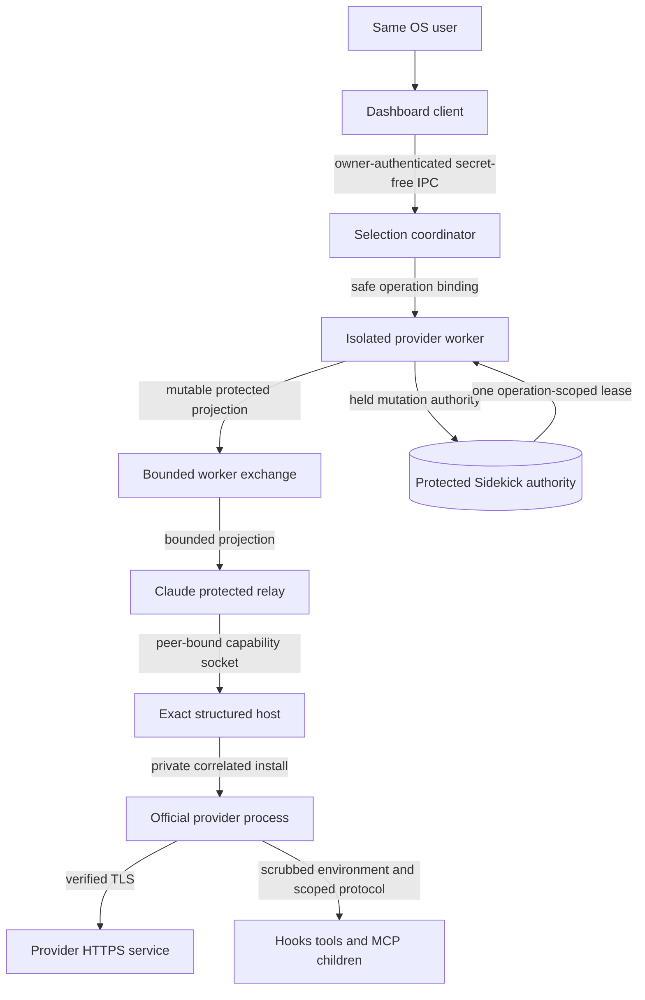

The dashboard is not trusted with credentials. The coordinator identifies a
target by stable account ID. Only the credential/provider adapter can acquire
a lease, and only after identity/generation/capability validation.

The relay transiently transports a mutable protected projection but has no
credential resolver or persistence authority. Generic CLI composition handles
only opaque provider-owned ports and secret-free receipts.

### 13.2 Secret lifetime

A credential lease:

- is acquired at the last responsible provider boundary;
- is scoped to one provider, account, generation, operation, and expiry;
- remains memory-only;
- is never included in object representations or exception text;
- is not written to argv, selection state, journal, control metadata, or
  diagnostics;
- is sent only to the exact official runtime/control channel that requires it;
- is released and, where the runtime permits, zeroized after installation or
  failure; and
- cannot be reused by a stale callback or selection epoch.

Python and provider runtimes cannot guarantee that every immutable string copy
is physically overwritten. The design minimizes materialization and lifetime,
uses existing protected-value boundaries, and never overstates zeroization.

Every worker, relay, participant, and child-encoder copy is mutable and cleared
at its owning boundary. No protected value is materialized as an immutable
CLI-owned string.

### 13.3 IPC security

The local control endpoint is same-user only:

- created beneath the qualified Sidekick runtime path;
- parent directory and socket/pipe permissions deny other users;
- server verifies peer credentials where the platform exposes them;
- every client performs protocol/version handshake;
- messages use strict schemas and bounded frame/body sizes;
- operation, participant, and correlation IDs are opaque and length-bounded;
- requests are rate- and concurrency-bounded;
- invalid, truncated, oversized, replayed, or out-of-order messages fail
  closed; and
- responses contain typed redacted state only.

Possession of the socket path alone is not authentication. WSL integration
does not expose the control endpoint on a public TCP listener or to another
distribution by default.

Claude participant capability sockets are detached from the generic framed
control transport after one kernel-proven ancillary attachment. The server
accepts exactly one non-inheritable socket descriptor for that request, binds
it to participant and process-start identity plus connection generation, and
rejects missing, duplicate, truncated, wrong-type, stale, or replayed
attachments. Protected frames never travel in control JSON.

### 13.4 Provider transport

All provider traffic uses HTTPS with verified TLS and the existing bounded
timeout, response-size, retry, and server-wait policies. Credential-bearing
mutations are never retried unless the provider operation has an explicit
idempotency or readback basis.

The Claude structured control channel is local to the exact child process
Sidekick launched. The Codex external-auth channel is the authenticated
resident app-server relationship. Neither accepts an account ID supplied by an
untrusted tool child as authority to fetch a token.

The Codex participant relay is a local app-server control-plane boundary, not
a model endpoint. It necessarily sees forwarded JSON-RPC frames and may hold a
queued `turn/start` in memory, so it is same-user, owner-only, size-bounded,
version-gated, and body-log-free. It forwards message IDs and ordering without
semantic rewriting except for the typed admission gate. The Responses request
and bearer travel from the official resident app-server directly to OpenAI;
the relay never constructs either.

### 13.5 Child process isolation

Setup-token or leased access authority must not flow into Bash, hook, or MCP
stdio children. The qualified Claude host enables provider scrubbing and adds
Sidekick boundary tests. Codex child/runtime configuration follows the
provider's account update and secret-isolation contract.

A child receives only the minimum non-secret context required for its work.
The coordinator socket and protected credential paths are not deliberately
exported to child environments.

The generated shell integration is owner-only, contains no token/account
selection, and invokes only the absolute qualified Sidekick command. Status
verifies its exact managed marker/hash and shell source relationship. The
provider launcher builds a bounded environment: it rejects higher-precedence
credential or endpoint sources that could defeat the selected authority and
does not leak a credential into generic subprocess environment inheritance.

### 13.6 Logging and diagnostics

Logs, status, traces, crash reports, and UI may include:

- provider ID;
- stable opaque saved-account ID or synthetic test label;
- epoch and credential generation identifier designed for safe comparison;
- operation phase and typed outcome;
- participant count/capability, not prompt contents; and
- bounded timestamps/durations.

They may not include:

- real email, organization, or user label in diagnostic bundles by default;
- token prefixes, hashes derived without a designated safe fingerprint
  scheme, headers, cookies, or provider response bodies;
- credential paths or environment contents;
- prompts, responses, reasoning, tool inputs/outputs, or hook payloads; or
- raw upstream error bodies.

Provider errors are translated through the existing typed and redacted error
vocabulary before persistence or display.

### 13.7 Threat and mitigation table

| Threat | Required mitigation |
| --- | --- |
| Other local user requests a switch | Owner-only endpoint, peer identity, strict permissions |
| Stale client submits under old epoch | Connection generation plus epoch check before turn admission |
| Token leaks through logs/errors | Protected value types, redaction at adapter boundary, secret-pattern tests |
| Token leaks to child tool | Provider/host environment scrubbing and synthetic canary tests |
| Token enters control or CLI | Separate protected socket and opaque port |
| Wrong Claude host gets lease | Bind peer, operation, target, epoch, nonce |
| Credential file race | Official sole writer, qualified locks, stable double reads |
| Wrong saved account receives callback | Provider/account/generation/epoch correlation |
| Mixed-account stream | Turn lease binds entire stream and retries to one epoch |
| Shell hook or PATH recursion invokes the wrong binary | Exact managed source, absolute Sidekick path, provider realpath and recursion rejection |
| Project/CLI config re-enables Codex WebSockets | Immutable qualified overlay, unsafe-override refusal, effective-config proof |
| Relay leaks a queued prompt | Owner-only process, memory-only bounded queue, no body logging, canary tests |
| Unknown provider update frame | Exact version/hash/schema gate, fail closed |
| Journal replays commit | Operation ID, baseline epoch compare-and-swap, provider readback |
| Native masks setup commit | Composite provider recovery decision |

### 13.8 Provider legal and support boundary

Official Anthropic guidance says third-party developers should use API keys or
cloud providers and places restrictions on routing consumer subscription
credentials. The selected structured-host design keeps the official Claude
engine as the model transport, but setup/mixed release still requires written
Anthropic clarification or approval plus product/legal review of how Sidekick
presents and controls saved setup tokens.

The OAuth boundary also follows [OAuth 2.0 Security Best Current Practice][rfc9700]
and [OAuth for Native Apps][rfc8252]: Sidekick delegates interactive login,
PKCE, refresh, and durable credential writes to official provider processes.
[OAuth token revocation][rfc7009] remains a provider/user credential-lifecycle
operation; selecting or rolling back an account is not token revocation.

OpenAI labels Codex external auth experimental. Sidekick must describe it as a
version-gated local integration, not a stable public compatibility promise.

These are release gates. They are not justification to implement an unsafe
credential copy, hidden restart, or false success.

## 14. Failures, Diagnostics, and Platform Lifecycle

### 14.1 Failure presentation

Every selection attempt has one visible lifecycle in the fixed status area:

```text
validating -> waiting for active work -> switching -> selected and ready
                                                        |
                                                        +-> later adopted
```

The first line is the bounded selection operation. “Later adopted” is
asynchronous participant evidence and does not hold an idle selection open.

or a typed terminal state with an exact recovery action. The dashboard does
not clear the previous proven selection merely because a target fails.

Examples:

| Failure | Dashboard contract |
| --- | --- |
| Setup token expired | Account remains visible; regenerate explicitly; old selection stays usable |
| Codex private home unreadable | Account remains visible; repair permissions/state; no external row |
| Provider version unsupported | Switching disabled with installed/required capability reason |
| Participant still active | Show waiting/degraded; never stop its turn |
| Participant unreachable | Keep it required; show waiting and liveness evidence |
| Participant died after commit | Show target plus degraded lost-participant result; never claim full success |
| Codex realtime active | Show selection waiting for natural completion; do not offer forced stop |
| Ambiguous provider commit | Gate new turns and show recovery-required; never guess |
| WSL supervisor unavailable | Show platform/control-plane failure after UI intent dispatches |

### 14.2 Doctor and status surfaces

Read-only diagnostics must report, per provider:

- finalized saved account ID in redacted/stable form and epoch;
- provider runtime relation: matching, generation drift, unmatched ambient,
  unavailable, or unsupported;
- live integrated, ready, adopted, unreachable, confirmed-dead-after-commit,
  and unmanaged participant counts;
- session enrollment and protected effective-config status;
- current transition phase and redacted outcome;
- provider capability/version-gate result;
- maintenance scheduler and last per-account result; and
- local service/platform readiness.

Diagnostics must distinguish:

- account authority health;
- maintenance/scheduler health;
- selection coordinator health;
- provider runtime convergence;
- interactive dashboard health; and
- platform service installation.

One healthy layer must never be reported as proof that the others work.

### 14.3 WSL correction

WSL is Linux from the running process's provider/runtime perspective and a
distinct platform integration target for installation/startup. The status
path must not reject an already-running Linux process merely because no
Windows-side distribution argument was supplied.

The platform contract is:

- detect Linux first from the runtime OS;
- detect WSL from bounded kernel/environment evidence;
- resolve the current distribution through qualified WSL metadata when
  already inside it;
- require an explicit distribution only for a Windows-side command that must
  choose among distributions;
- keep Linux-side same-user IPC inside the distribution;
- validate the configured systemd user service; and
- validate any Windows rescue/start integration separately.

Microsoft documents Linux environments per distribution, Windows-side
distribution selection, and WSL systemd behavior in its [WSL overview][wsl-about],
[basic command reference][wsl-basic], and [systemd guide][wsl-systemd]. The
exact Sidekick platform adapter remains the repository authority; external
docs do not replace controlled tests.

### 14.4 Linux lifecycle

Native Linux uses the current per-user systemd service model. Installation,
start, status, restart for operator recovery, and uninstall belong to explicit
daemon commands. Account selection itself never restarts the service or a
provider client.

The service starts without importing provider-heavy modules unnecessarily,
creates owner-only runtime state, recovers the finalized epoch, and accepts
participants only after protocol/version validation.

### 14.5 macOS lifecycle

macOS uses a per-user LaunchAgent in the login-user context so Keychain and
provider access remain in the correct user session. LaunchAgent lifecycle is
separate from selecting an account.

Native Claude Keychain/cache convergence must be exact-version tested. The
structured participant epoch provides deterministic inference switching for
integrated sessions when native cache timing alone cannot provide a bound.
Unknown timing never becomes a fabricated success.

Apple's [launchd agent guide][apple-launchd] supplies the platform service model;
Sidekick's launchd adapter and controlled tests define the product behavior.

### 14.6 Uninstallation and recovery commands

Uninstallation removes only Sidekick-owned service definitions, runtime
socket/state, and integration hooks that it installed. It does not delete
saved provider authorities or alter the currently active provider login unless
the user invokes a separate explicit credential operation.

Recovery commands are typed and idempotent. They inspect provider readback and
the journal before making changes. There is no “force success,” arbitrary lock
deletion, or automatic process termination path.

## 15. Repository Ownership

### 15.1 Owning boundaries

| Concern | Repository owner | Design responsibility |
| --- | --- | --- |
| Provider-neutral identifiers and phase models | `src/sidekick_usages/core/selection/` | Infrastructure-free IDs, epochs, phases, turn states, typed outcomes, UTC invariants |
| Resident selection coordination | `src/sidekick_usages/daemon/selection/` | Participant registry, new-turn gates, queued admission, live transaction, reconnection lifecycle |
| Protected authority transition policy | `src/sidekick_usages/credentials/` | Authority prevalidation, serialized provider commit/restore policy, protected leases |
| Claude lease | `credentials/claude/authority/` | Exact target lease |
| Claude schemas and runtime capability | `src/sidekick_usages/providers/claude/` | Native propagation proof, Remote Control evidence, structured protocol and version gate |
| Claude data | `providers/claude/structured/` | Protected delivery |
| Codex schemas and runtime capability | `src/sidekick_usages/providers/codex/` | Private homes, app-server auth, HTTP-only provider proof, callbacks and cache behavior |
| Durable schemas and transactions | `src/sidekick_usages/persistence/` | Selection/journal schemas, atomic writes, recovery, migration, qualified paths |
| Resident platform service and maintenance | `src/sidekick_usages/daemon.py`, `daemon/`, `maintenance.py` | Same-user endpoint, lifecycle, worker supervision, due work |
| Semantic dashboard read model | `src/sidekick_usages/usage/dashboard/` | Saved rows, provider/session status, deterministic projection |
| Interactive terminal composition | `src/sidekick_usages/cli/dashboard/` | Prompt-toolkit containers, focus, keys, fixed footer, typed rendering |
| Session command and shell integration | `src/sidekick_usages/cli/` | Public launch commands, reversible integration UX, TTY/signal/argv boundary |
| Bootstrap routing | `src/sidekick_usages/cli/runtime/` | Interactive versus one-shot selection; no interactive painting |
| Usage/activity | `src/sidekick_usages/usage/` | Cached-first isolated collection and totals |
| App path discovery | `src/sidekick_usages/paths.py` | Sole qualified application/runtime path authority |
| Wall clock | `src/sidekick_usages/clock.py` | Aware wall-clock acquisition; monotonic waits remain injected at runtime boundary |

### 15.2 Dependency rules

- `core/` cannot import CLI, provider, persistence, HTTP, filesystem, settings,
  process, or OS path discovery.
- Daemon selection coordination depends on typed credential/provider/session
  ports, not concrete Claude/Codex modules.
- `credentials/` cannot own participant connections, prompt queues, terminal
  lifecycle, or turn admission.
- Provider-specific protocol and schema remain inside their provider package.
- Generic CLI composition renders typed results; it does not acquire or decode
  credentials or execute provider login. Only the provider-owned structured
  decoder inside the host consumes its one-use protected lease.
- Persistence owns files and migrations; provider adapters do not invent
  application paths.
- HTTP retry policy remains in `http/`; selection does not add ad hoc retries.
- The dashboard read model cannot represent a non-saved status as an account.
- The daemon control protocol cannot carry protected credential values.

### 15.3 Reuse before abstraction

Planning must first search and extend current owners:

- Claude activation/exchange transactions and foreground probe;
- Codex broker, external-auth installation, receipts, and private authorities;
- selection schemas, supervisor activation, and control protocol;
- dashboard models, focus, session/controller, renderer, and application;
- qualified locks, atomic persistence, strict serialization, and paths; and
- cached-first usage collection and deterministic aggregation.

A duplicate provider client, selection store, lock type, error vocabulary,
clock, path owner, or compatibility layer is a design violation. Shared
machinery is extracted only after at least three concrete uses or an existing
repository boundary already owns it.

### 15.4 Implementation discipline

The later implementation must match existing neighboring syntax, naming,
module shape, typed error vocabulary, and concise Sphinx-style docstrings.
Production, test, comment, and docstring lines remain at most 79 characters.
Public callables have explicit parameter and return types; the implementation
does not add `Any`, unjustified casts/suppressions, speculative hooks, duplicate
compatibility layers, dead code, or generic helpers without a current owner.

Stateful lifecycle behavior belongs in small cohesive classes when object
identity and invariants make that clearer: the participant registry,
transaction coordinator, structured host, participant relay, and terminal
application are natural object owners. Pure validation/projection remains a
function when no durable state or lifecycle exists. “Use OOP” does not justify
inheritance hierarchies, service locators, factories, or interfaces with only
one speculative implementation.

Before creating a helper, model, constant, protocol, service, or dependency,
the implementation must search its owning package and read neighboring files.
Existing repository functionality is extended when it owns the same concept.
A maintained library is adopted when it materially reduces local protocol,
terminal, persistence, or platform code and fits the security/type/license
boundary. Local code is justified only when no maintained dependency satisfies
the exact provider, no-interruption, or secret-handling contract. The
build-versus-adopt result for consequential infrastructure is recorded in
tracked documentation.

## 16. Verification and Acceptance Gates

### 16.1 Verification strategy

Tests use synthetic authorities, fake provider ports, controlled clocks,
temporary qualified paths, fake subprocesses, and local protocol fixtures.
Automated tests never require real credentials, mutate a provider login, call
public provider networks, or read the user's application-data locations.

The suite contains the fewest load-bearing tests that prove the acceptance
contracts. A test must fail for a meaningful user-visible, state, security, or
provider-boundary regression. Parameterization and model/schedule exploration
cover equivalent cases without copy-paste. Tests that repeat a stronger public
boundary test, assert private implementation trivia, exist only for coverage,
or exercise irrelevant enum/getter/constructor behavior are not added. When a
new public test supersedes an old one, the redundant test is removed in the
same change. Exact output assertions are reserved for deliberate product
contracts such as account counts, typed outcomes, and terminal ownership.

Verification uses the narrowest sufficient set of these layers; the numbered
list is a coverage map, not a requirement to create a separate test at every
layer for every behavior:

1. infrastructure-free state and invariant tests;
2. provider adapter and exact-schema contract tests;
3. persistence transaction and crash-recovery tests;
4. coordinator concurrency/model tests;
5. prompt-toolkit layout/controller tests;
6. public-command PTY and resize tests;
7. platform service fixtures;
8. full repository quality, architecture, packaging, and wheel gates; and
9. separately authorized controlled provider-live qualification using
   disposable accounts and exact supported binaries.

No mocked unit test may be cited as proof of installed provider behavior.
Controlled provider-live results record exact binary versions, platform,
session/process identity, test account class, and redacted proof.

### 16.2 Terminal and rendering acceptance

One parameterized public-PTY test exercises these critical viewport pairs,
not the Cartesian product of widths and heights:

```text
(52, 24), (79, 40), (80, 48), (100, 49), (120, 60)
```

One case resizes in place across the compact/full threshold. These pairs cover
the minimum, narrow-wrap boundary, reproduced short-terminal boundary, and a
large terminal without adding redundant viewport cases.

Every supported combination must prove:

1. exactly one masthead in visible output and complete scrollback;
2. no partial earlier robot or duplicated product copy;
3. a visible fixed operation/status area and key footer;
4. a full or compact masthead chosen from actual height;
5. a scrollable body with the focused saved row visible;
6. stable-ID focus preserved across SIGWINCH/terminal resize;
7. no cursor escape or alternate-screen residue after normal/failing exit;
8. no wrapping that corrupts panel boundaries at the minimum width;
9. deterministic account order after concurrent refresh;
10. repaint occurs without requiring font zoom or an initial resize; and
11. one-shot/non-TTY output remains finite and free of interactive escapes.

The test must invoke the public route, not only the renderer, because the
double-paint bug crosses bootstrap and application ownership.

### 16.3 Row and interaction acceptance

1. Panel counts equal persisted saved accounts exactly.
2. Four Claude and two Codex saved fixtures render six focusable rows, not
   eight.
3. Unmatched ambient logins render only nonfocusable provider status.
4. Identity-matched generation drift remains on its saved row.
5. Initial focus chooses the provider-proven selected saved account.
6. When no selection is proven, focus chooses the first saved row.
7. Up/Down traverse all and only saved rows.
8. Tab/Shift-Tab move between providers with saved rows.
9. Enter on every focusable row yields a typed visible outcome.
10. Enter on the selected healthy row yields `ALREADY_SELECTED`.
11. Refresh never steals focus or changes selection.
12. Removing a saved account through an explicit separate operation chooses a
    deterministic adjacent focus.
13. Empty-provider and empty-product states retain usable global commands.

### 16.4 Coordinator state-machine acceptance

Model-based tests cover every allowed transition and reject every illegal
transition. They prove:

- provider epochs increase monotonically;
- one provider switch does not change the other provider's epoch;
- a turn lease cannot change account, generation, or epoch;
- a retry cannot escape its original turn lease;
- admission closes before provider commit;
- a late participant cannot enter through epoch N;
- same-target repeated selection coalesces or observes one operation;
- different-target concurrent selection receives a typed conflict;
- stale acknowledgement/callback/receipt cannot finalize;
- queue order and at-most-once submission survive selection;
- readiness and actual adoption remain distinct;
- ready finalization precedes admission and later real-turn adoption;
- an idle participant consumes no quota for readiness;
- a confirmed-dead participant may be pruned only before provider commit;
- a live unreachable participant blocks commit or success;
- a same-process reconnect must match participant/process-start identity;
- participant loss after commit produces forward recovery and at best a typed
  degraded target, never fabricated success;
- failure before commit reopens N;
- ambiguous commit gates new turns until readback; and
- recovery never rolls a credential generation backward.

Property or schedule-exploration tests cover meaningful interleavings among
turn completion, prompt submission, provider callback, participant disconnect,
coordinator crash, and participant re-registration.

### 16.5 Session enrollment acceptance

One concise public-command/PTY matrix proves both provider launchers and shell
integration:

- explicit `session claude` and `session codex` preserve argv, CWD, TTY size,
  signals, process lifetime, and exit status;
- install/status/uninstall are idempotent and touch only marked Sidekick shell
  content; provider binaries and provider settings remain byte-identical;
- ordinary shell functions route to the explicit launchers, while an explicit
  provider-binary bypass stays alive and appears as unmanaged;
- recursion, unsafe auth/endpoint/provider overrides, unsupported builds, and
  ambiguous shell edits fail before provider execution with typed guidance;
- Claude starts one qualified structured engine and registers before its first
  account-bearing request;
- Codex starts one stock remote TUI through a stable participant relay and the
  qualified neutral shared app-server;
- integrated Claude `/login` selects a saved row through the epoch protocol,
  while uncoordinated Claude/Codex login/logout mutation is refused before
  changing shared runtime auth; and
- project/user configuration cannot override the protected Codex provider,
  auth, neutral-home, or HTTP-only keys, while existing neutral-home and
  allowed project settings survive.

These are load-bearing boundary scenarios, not a request for one test per
argument, shell, config key, or internal helper.

### 16.6 Global continuity acceptance

Controlled end-to-end qualification opens three Claude sessions and three
Codex sessions in different terminals and current working directories. Across
each supported switch it proves:

1. provider client PID/process-start identity remains unchanged;
2. terminal and IPC connection remain open;
3. conversation/thread/session identity remains unchanged;
4. current working directory remains unchanged;
5. tools, hooks, background terminals, and child context remain usable;
6. the streaming epoch-N turn completes normally under account A;
7. a prompt submitted during the boundary is queued locally;
8. that prompt is sent exactly once after readiness;
9. its first provider attempt uses account B/epoch N+1;
10. no cancellation, replay, disconnect, relaunch, resume, or crash occurs;
11. inactive integrated sessions are ready without spending quota; and
12. their first later real turn records B/N+1 adoption.

### 16.7 Claude acceptance

Claude uses exactly three consolidated load-bearing journeys:

1. **Native and mixed continuity.** Two already-open native sessions and one
   structured participant drain old work, preserve queued prompts exactly
   once, run setup A to setup B to exact committed refreshable C, preserve PID
   and conversation, prove native-first ordering, and record each exact
   account/generation on its next genuine turn.
2. **Security and forward recovery.** One wrong or replayed protected binding
   and one partial target acknowledgement prove no secret in control,
   persistence, argv, files, logs, diagnostics, exceptions, or CLI-owned
   immutable strings; no old credential is sent; and recovery moves forward or
   remains visibly gated without interrupting any work. The same journey proves
   participant/channel registration commits both registries or neither, every
   failed attachment closes its received descriptor, and disconnect/reconnect
   leaves neither a live required participant without its exact channel nor an
   orphan channel.
3. **Exact-build host qualification.** One release harness exercises
   representative streaming, permission/question, tool/hook/MCP/background
   state, queued input, resize, restoration, positive and negative private
   probes, and unqualified-build refusal without changing the engine or
   conversation.

The first two extend existing cross-owner journeys. The third is controlled
release evidence, not a broad unit-test tree. There are no Claude
test-per-field matrices, helper tests, snapshot suites, duplicate provider
journeys, process-helper tests, new fake modules, or coverage-padding cases.

Refreshable/native enablement requires the first journey's exact live next-
turn identity proof. Setup/mixed enablement requires all three journeys plus
the security, recovery, and written Anthropic gates in Sections 13 and 17.

### 16.8 Codex acceptance

The exact supported build must prove:

- the resident runtime loads the expected custom provider definition;
- `requires_openai_auth` remains enabled;
- `responses_websocket_enabled()` is false;
- no Responses WebSocket opens during qualified interactive turns;
- account B installs through the existing external-auth path;
- local lease claims prove B's provider identity/generation inside one
  serialized operation;
- strict null-`loginId` completion precedes an external-auth
  `account/updated` with B's expected plan;
- `account/read` proves a non-null usable ChatGPT account and expected plan,
  but is never asserted to echo B's provider account ID;
- the first later HTTP attempt calls current auth resolution and uses B;
- all retries for an old turn finish under A before commit;
- no `turn/start` races the authority boundary;
- `previous_response_id`, thread ID, rollout, protocol ordering, approvals,
  tools, and background terminals remain valid;
- active MCP/tool work drains before commit;
- provider-triggered idle plugin/skill/MCP invalidation is transparent;
- an active realtime conversation completes naturally under A while selection
  remains pending and receives no stop/cancel/close action;
- a new realtime conversation cannot start through the closed gate;
- an unqualified realtime capability blocks prevalidation before auth mutation;
- a stale refresh callback cannot install an older epoch;
- the matching private `CODEX_HOME` alone answers B's callback; and
- unknown/changed app-server schemas fail closed with sessions alive.

### 16.9 Freshness and usage acceptance

- Selected and unselected refreshable accounts both receive due maintenance.
- The official provider process remains the only durable credential writer.
- Setup tokens receive validation/usage work but never a false refresh result.
- One rejected, malformed, unreadable, or transient account does not cancel
  other accounts.
- Concurrent completion always projects persisted saved order.
- Cached results include observation time and never masquerade as current.
- Identity relation and generation freshness remain separate.
- Maintaining an unselected account never adopts it into the shared runtime.
- Selecting an account never disables maintenance of the outgoing account.

### 16.10 Persistence and security acceptance

- Every write is owner-only, strict-schema, atomic, and recoverable.
- Crash injection at every durable step reaches the recovery decision table.
- Selection/journal/control/status artifacts pass credential and PII scans.
- Malformed, oversized, replayed, stale, and out-of-order IPC frames fail
  closed.
- Peer identity and connection generation prevent cross-user/stale clients.
- Process-ID reuse cannot impersonate a participant.
- crash recovery does not assume a missing required participant is dead.
- Authority lease scope rejects wrong provider/account/generation/epoch.
- Lock-order tests detect inversions; timeouts do not delete live owners.
- Provider error bodies are redacted before crossing adapter boundaries.
- Synthetic secret canaries never appear in representations or failure text.

### 16.11 Platform acceptance

- Native Linux systemd user install/start/status/stop/uninstall fixtures pass.
- WSL Linux-side status works without an unnecessary distribution argument.
- Windows-side WSL rescue/start requires and resolves an explicit distribution.
- WSL IPC remains distribution-local and owner-only.
- macOS LaunchAgent runs in the login-user context.
- macOS native/structured convergence uses an exact qualified bound.
- Account selection itself triggers no service or provider restart on any
  platform.

### 16.12 Repository quality gates

The later implementation is not complete until all relevant commands pass:

```text
uv run pytest tests/<owner>/test_<behavior>.py
uv run pytest --cov=sidekick_usages
uv run ruff format --check src/ tests/ packaging/
uv run ruff check src/ tests/ packaging/
uv run ty check src/ tests/ packaging/
uv run python packaging/check_architecture.py
uv run pre-commit run --all-files
npm ci
npm audit --audit-level=moderate
npm run lint:markdown
uv build
uv run python packaging/smoke_wheel.py --build
```

CI must pass Python 3.14 on Linux, macOS Arm, macOS Intel, and Windows where
the existing project supports it. Provider-live qualification is a separately
controlled release artifact and never runs in ordinary CI.

## 17. Delivery Dependencies and Migration

This is the dependency order that the separate tracked plan must preserve.

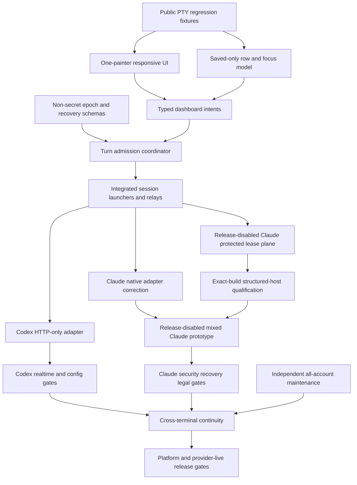

The tracked plan must preserve these dependency constraints:

1. Capture failing public PTY behavior before changing terminal ownership.
2. Repair the visible dashboard without claiming provider switching works.
3. Remove external pseudo-rows before wiring Enter to provider operations.
4. Introduce strict non-secret epoch/recovery state before cross-session
   coordination.
5. Build turn admission and synthetic concurrency proof before provider
   mutation adapters.
6. Add explicit session launchers, the reversible shell integration, and the
   Codex participant relay before claiming any ordinary terminal is integrated.
7. Reuse and narrow Claude native activation before adding the private
   structured path.
8. Add the protected worker-to-participant route, initial/late binding, sealed
   membership, and provider-owned composite recovery before host parity work.
9. Keep the Claude protected plane and mixed host release-disabled until all
   exact-build, next-turn, parity, security, recovery, and written Anthropic
   gates pass.
10. Reuse Codex external auth and disable Responses model WebSockets before
   calling
   the next-turn proof sufficient.
11. Qualify Codex realtime admission/natural completion before universal
   continuity claims.
12. Complete each provider's exact-version gate before mixed/provider-live
   tests.
13. Reprove independent maintenance and usage after selection integration.
14. Migrate current state only after schema, recovery, and rollback fixtures
    pass.
15. Run controlled provider-live tests only with explicit authority and
    disposable accounts.
16. Update operator docs and completion evidence only after every release gate
    passes.

### 17.1 Current-machine migration acceptance

The migration must prove before and after, using redacted metadata only:

- four Claude saved IDs and their persisted order remain;
- two Codex saved IDs/private-home relations remain;
- credential capability classifications remain unchanged;
- protected authority files are not rewritten merely for schema migration;
- panel counts are four and two;
- no external pseudo-account state is migrated;
- the selected record relates only to a real saved ID;
- all accounts remain refresh/usage eligible according to capability; and
- rollback can restore the previous Sidekick schema/presentation state without
  rolling provider credentials backward.

Shell enrollment is a separate explicit migration. Its dry run lists exact
files and marked edits; installation and removal prove provider binaries,
provider settings, protected authorities, and unrelated shell content are
unchanged.

### 17.2 Compatibility rollout

The capability gate is per provider and mechanism:

- dashboard repair and saved-only rows can ship independently;
- Claude refreshable selection enables only after native propagation tests;
- Claude protected lease and structured-host work remains unavailable behind
  a disabled capability while it is qualified;
- Claude setup/mixed selection enables only after the three consolidated
  journeys prove exact-build auth, parity, genuine-turn identity, security,
  and forward recovery, and written Anthropic product/legal resolution exists;
- ordinary-command seamless guarantees enable only for shells/IDEs whose
  explicit enrollment status is proven;
- Codex selection enables only after HTTP-only model transport, external-auth,
  participant-relay, realtime, and MCP/cache tests; and
- unsupported switching never hides usage/maintenance that remains safe.

The UI shows an account's exact selection capability. It does not hide the
account, add an external stand-in, or let Enter silently do nothing.
While setup/mixed selection is disabled, Enter returns a visible typed
unavailable or degraded result and does not mutate native or structured auth.

## 18. Build-versus-Adopt Decisions

### 18.1 Adopt and extend maintained foundations

- Use prompt-toolkit containers, scrolling, key bindings, invalidation, and
  resize support rather than a local terminal-layout engine.
- Reuse the current Sidekick Claude protected-profile, official exchange,
  stable-read, restore, and native-proof transactions.
- Reuse current Sidekick Codex private homes, official refresh ownership,
  resident app-server, external auth, callbacks, and projection receipts.
- Reuse the existing pinned `websockets` transport and strict app-server
  JSON-RPC codec/schema owners for the participant relay; do not implement
  WebSocket framing or a second JSON protocol stack.
- Reuse strict persistence, serialization, HTTP, lock, path, and clock owners.
- Reuse the existing worker exchange, control peer proof, selector/event loops,
  and structured-engine fake for the Claude protected route.
- Reuse cached-first concurrent usage loading and deterministic ordering.

Do not add the Python or TypeScript Agent SDK merely because it is maintained.
Neither publishes the required auth-specific setter or stock TUI. Adoption
requires a bounded proof that it removes existing owned machinery without
creating a second compatibility layer.

### 18.2 Implement locally

- Provider-neutral epoch, turn admission, participant readiness, and recovery
  orchestration, because it is Sidekick product policy.
- Explicit session commands, reversible shell integration, and the narrow
  Codex participant control relay, because they are the enrollment/admission
  boundary and are not model-routing replacements.
- One credentials-owned Claude selected-access-lease service and one provider-
  owned protected participant-data-plane owner. These are distinct existing
  ownership boundaries, not generic token or transport frameworks.
- Claude structured interactive hosting and private update qualification,
  because no reviewed dependency meets the exact continuity and security
  contract.
- Codex HTTP-only provider configuration and adoption proof around existing
  external auth, because the mechanism is exact-version and small.
- Saved-only dashboard projection and height-aware composition, because they
  belong to current repository owners.

### 18.3 Lessons adopted from pinned projects

Pinned projects show useful topologies, not drop-in security authorities:

- `rynfar/meridian` resolves a global active profile at request time,
  invalidates selection affinity on switch, and polls all profiles;
- `ndycode/codex-multi-auth` demonstrates cross-process pins, affinity
  generations, same-conversation switching tests, and all-account refresh;
- `Ducksss/codex-profiles` demonstrates isolated named Codex homes and the
  value of leaving credentials to the official client;
- `burakdede/aisw` demonstrates official login capture, isolated homes, and
  same-identity reconciliation;
- `steipete/CodexBar` separates saved accounts from visible runtime
  projections and uses provider-specific adapters;
- `realiti4/claude-swap` and `GG-Santos/ccswitch` corroborate setup-token
  enrollment and usage-probe mechanics.

Sidekick adopts stable IDs, per-request epoch/affinity, cache invalidation, and
all-account polling concepts. It does not adopt their direct OAuth refresh,
credential-file replacement, universal proxy, or unqualified process-restart
behavior.

## 19. Rejected Designs

### 19.1 Keep external login as a selectable row

Rejected because it invents an account, corrupts counts, focuses a no-op,
confuses identity with generation, and caused the current apparent input
failure. Ambient state remains nonfocusable provider status.

### 19.2 Remove external rows but keep one height-blind Window

Rejected because it only postpones footer clipping until another account or a
shorter terminal appears. The layout must use rows and a scrollable body.

### 19.3 Keep cached bootstrap paint and improve cursor rewind

Rejected because normal-screen scrolling can destroy the original cursor
origin. Interactive terminal output has one lifecycle owner.

### 19.4 Treat a selected ID as runtime convergence

Rejected because a persisted pointer changes no provider process or cached
transport. Selection requires provider readiness and later next-turn proof.

### 19.5 Copy or swap provider credential files

Rejected because it races official refresh writers, can roll credentials
backward, bypasses provider transactions, and does not solve environment or
transport caches. Official provider processes remain sole durable writers.

### 19.6 Block every open Claude terminal

Rejected because foreground process presence is not Remote Control proof and
ordinary open native sessions already support next-request reread.

### 19.7 Treat setup tokens as broken or refreshable

Both are rejected. Setup tokens are valid inference/usage authorities without
refresh tokens. They require an in-process inference-authority mechanism and
explicit regeneration after expiry.

### 19.8 Change setup-token environment for future processes only

Rejected because it does not change an already-running process or its memoized
OAuth authority. Seamless setup-token switching requires enrollment from
launch and an acknowledged in-process boundary.

### 19.9 Restart or resume Claude/Codex

Rejected because it changes process/connection state, may lose tools and
pending protocol callbacks, and directly violates the continuity contract.

### 19.10 Accept Codex account notifications with WebSockets enabled

Rejected because `account/updated` does not invalidate or generation-check an
already-authenticated Responses WebSocket in 0.146.0.

### 19.11 Replace the Codex app server or reconnect every TUI

Rejected because it discards resident connection/thread/tool/background state
and is unnecessary once direct HTTP attempts resolve current shared auth.

### 19.12 Add a Codex Responses proxy

Rejected as unnecessary complexity. It would own auth routing, streaming,
incremental Responses state, retries, and `previous_response_id` behavior that
the exact HTTP-only provider already handles inside Codex.

### 19.13 Use a universal Claude gateway by default

Rejected as the primary path because it expands Sidekick into a full
credential-bearing streaming proxy and has provider-contract risk. The
structured official-engine host is the narrower preferred setup-token path.

### 19.14 Kill unreachable or incompatible participants

Rejected. An unreachable or unmanaged participant yields degraded truthful
status. Selection does not terminate it to manufacture convergence.

### 19.15 Assume ordinary provider launches are integrated

Rejected. A dashboard cannot retroactively change a parent shell or attach a
private control protocol to an arbitrary existing process. Explicit session
entrypoints and opt-in shell/IDE integration define enrollment; bypasses remain
alive and are reported as unmanaged.

### 19.16 Let user or project config override Codex transport keys

Rejected. A project-local `model_provider` or CLI override could re-enable a
cached account-A Responses WebSocket or redirect credentials. A qualified
Sidekick-owned effective overlay pins only correctness-critical session keys
and preserves unrelated settings.

### 19.17 Stop or reconnect Codex realtime during selection

Rejected. Realtime process state has no 0.146.0 resume/reattach contract.
Existing realtime work completes naturally under its admitted epoch; selection
waits visibly or fails before provider commit.

## 20. Risks and Revalidation Triggers

| Risk or trigger | Consequence | Required response |
| --- | --- | --- |
| Claude private control changes | Setup-token update may corrupt protocol or no-op | Exact build gate; disable switching on mismatch |
| Private response as adoption | False ready | Keep proofs distinct |
| Structured host lacks interactive parity | Session behavior regresses despite auth switching | Block release; return design for review |
| Anthropic credential-use terms change or remain incompatible | Setup-token control may not be shippable | Legal/product gate; do not substitute hidden proxy |
| Claude native reread differs by platform/version | Some open native sessions may lag | Exact platform qualification and honest degraded status |
| Remote Control lacks a reliable status surface | Cannot prove special incompatibility | Do not infer it from foreground presence |
| Codex external auth schema changes | Auth installation/readback may fail | Exact schema gate; retain old session/auth |
| Codex re-enables WS or caches HTTP auth | Next turn can use stale account | Capability/source test; disable selection |
| Codex account update invalidates active runtime work | Tool/MCP operation could be disrupted | Drain active work and qualify idle refresh |
| Project/CLI config shadows Codex session provider | Stale or redirected auth transport | Protected launch overlay, override rejection, effective-config proof |
| Codex realtime cannot reach a terminal boundary | Selection cannot commit without interruption | Keep A active and show typed pending/degraded status |
| Access lease outlives selection | Stale callback/update can install old auth | Account/generation/epoch scope and expiry |
| Participant disconnects mid-commit | Global proof becomes incomplete | Readback plus degraded recovery; never kill/restart |
| Native masks setup commit | Wrong epoch reopens | Composite recovery |
| Late host misses lease | Host cannot ready | Seal and bind forward |
| Shell integration is absent, stale, or bypassed | Some provider processes are unmanaged | Explicit status, reversible enrollment, no false convergence |
| Coordinator crashes after provider write | Journal and provider may disagree | Provider-first recovery decision table |
| Terminal becomes extremely small | Content can be unreachable | Compact header, scroll body, fixed typed footer |
| Saved identity is absent/ambiguous | Wrong row could be selected | Fail closed; never match by display label |
| WSL distribution detection regresses | UI works but dispatch cannot reach supervisor | Separate platform status and acceptance |
| Third-party project behavior changes | Community evidence becomes stale | Pinned commits remain historical only |

The following events require re-review of this design, not merely a patch:

- provider removes or materially changes the selected authority mechanism;
- Claude setup-token switching requires process replacement;
- Codex cannot disable Responses WebSockets while using current OpenAI auth;
- preserving interactive behavior requires Sidekick to terminate or reconnect
  sessions;
- supported shells/IDEs cannot enter the explicit launcher without replacing
  a provider binary or weakening argument/config isolation;
- Codex introduces an auth-bearing transport whose natural terminal boundary
  cannot be gated without stopping it;
- provider terms prohibit the chosen local use;
- a new supported platform changes the same-user/credential boundary; or
- persistence would need a token or provider payload in selection state.

Provider-version changes that preserve the contract still require capability
requalification and updated evidence before enablement.

## 21. Source Matrix

### 21.1 Decision register

This register makes every controlling decision explicit. The tracked plan may
not silently reopen or weaken one.

| ID | Decision | Controlling evidence |
| --- | --- | --- |
| D-001 | Selectable rows are exactly persisted accounts | Current external-row/no-op QA and account-state inspection |
| D-002 | Ambient unmatched login is nonfocusable provider status | Saved/runtime state separation and identity research |
| D-003 | Prompt-toolkit is the sole interactive terminal painter | Short-viewport PTY reproduction and current bootstrap/launch/application source |
| D-004 | Layout uses width and height with scroll body and fixed footer | 49-line/hidden-footer reproduction and prompt-toolkit ownership |
| D-005 | Focus uses provider plus stable saved-account ID | Refresh/resize correctness and deterministic ordering |
| D-006 | Every focused Enter returns typed action or refusal | Current silent external-row `None` failure |
| D-007 | Provider identity relates an account; generation proves freshness | Current Codex drift/external projection and pinned reconciliation patterns |
| D-008 | One non-secret epoch coordinator gates all integrated sessions | Cross-terminal continuity, concurrency, and crash-recovery analysis |
| D-009 | In-flight work finishes old; later prompts queue for new | Explicit no-interruption requirement and provider request boundaries |
| D-010 | Refreshable Claude uses official native login and reread | User-observed `/login` convergence, current Sidekick transaction, installed 2.1.220 |
| D-011 | Ordinary Claude foreground presence is not a conflict | Foreground probe cannot prove Remote Control |
| D-012 | Claude structured prototype is release-disabled | Private update |
| D-013 | Setup/mixed shipping is NO-GO pending all gates | SDK evidence |
| D-014 | Unmanaged processes stay alive and are reported honestly | OS environment/process boundary and no-restart requirement |
| D-015 | Codex uses resident external auth plus direct HTTP-only Responses | Official config and exact 0.146 per-attempt auth source |
| D-016 | Codex active tool/MCP work drains before account update | Exact account-update cache/runtime invalidation source |
| D-017 | Selection never controls all-account maintenance | Live saved-authority evidence and established per-account ownership |
| D-018 | Official providers remain sole durable credential writers | Current credential architecture and provider source |
| D-019 | Recovery trusts a provider composite decision | Setup semantics |
| D-020 | WSL readiness is a separate platform gate | Read-only daemon status failure after independent UI root cause |
| D-021 | Private/experimental provider mechanisms are exact-version gated | Claude installed private control and experimental Codex external auth |
| D-022 | No proxy, restart, reconnect, file swap, or silent fallback | Continuity, security, provider-source, and complexity analysis |
| D-023 | Explicit session commands plus reversible shell hooks define enrollment | OS parent-environment boundary and launcher research |
| D-024 | Codex stock TUIs use stable participant relays to one resident app-server | Remote endpoint immutability and global turn-gate requirement |
| D-025 | Codex installation proof combines local lease identity, serialized operation, ordered events, and usable account readback | Current strict broker source and 0.146 null `loginId`/account schema |
| D-026 | Ready finalization precedes asynchronous real-turn adoption | Idle sessions spend no quota and adoption can occur hours later |
| D-027 | Participant recovery distinguishes dead, live-unreachable, and post-commit loss | Global-success invariant and forward-only credential recovery |
| D-028 | Codex realtime finishes on its admitted epoch and blocks commit while active | Exact 0.146 in-process realtime state and no resume/reattach API |
| D-029 | Tests are the smallest load-bearing public/state/security set | Repository test policy and maintenance requirement |
| D-030 | Existing owners and maintained dependencies precede new abstractions | Repository reuse policy and maintenance requirement |
| D-031 | Integrated provider login/logout commands cannot bypass global selection | Shared-runtime consistency, saved-only rows, and provider credential ownership |
| D-032 | Install, READY, and adoption are distinct | Private response |
| D-033 | Membership stays sealed during distribution | Late bind |

### 21.2 Current repository evidence

| Topic | Current source or tracked record | Finding carried into design |
| --- | --- | --- |
| Bootstrap paint | `src/sidekick_usages/cli/runtime/bootstrap.py` | Interactive route requests cached startup paint |
| Cached frame and rewind | `src/sidekick_usages/cli/dashboard/launch.py` | Full frame write followed by relative cursor-up |
| Prompt-toolkit root | `src/sidekick_usages/cli/dashboard/application.py` | Second painter, one non-wrapping window, width-only rendering |
| External model | `src/sidekick_usages/usage/dashboard/models.py` | External runtime state is represented as an account-row variant |
| External projection | `src/sidekick_usages/usage/dashboard/service.py` | External row appended and generation/identity relation collapsed |
| Initial focus | `src/sidekick_usages/usage/dashboard/focus.py` | External-active state anchors focus on pseudo-row |
| Silent action | `src/sidekick_usages/cli/dashboard/controller.py` and session owner | External Enter can return no intent/result |
| Claude foreground proof | `src/sidekick_usages/providers/claude/activation/foreground.py` | Proves foreground process, not Remote Control |
| Claude conflict policy | `src/sidekick_usages/providers/claude/activation/service.py` | Maps ordinary foreground process to disconnect-required |
| Claude official exchange | `src/sidekick_usages/credentials/claude/exchange/` | Existing provider-owned native login foundation |
| Claude activation transaction | `src/sidekick_usages/credentials/claude/activation/` | Existing identity/generation/native propagation proof |
| Codex resident broker | `src/sidekick_usages/providers/codex/broker/` | Shared app-server and refresh callback foundation |
| Codex external auth | `src/sidekick_usages/providers/codex/broker/external_auth/installation.py` | Local token-claim identity check, serialized request, ordered null-`loginId` completion/update, plan readback, and locally bound receipt |
| Codex account observation | `src/sidekick_usages/providers/codex/account/service.py` | Readback proves non-null ChatGPT mode and plan, not provider account ID |
| Current selection | `src/sidekick_usages/core/selection/` and `persistence/supervisor/` | Selected-runtime proof exists but not full epoch/participant convergence |
| Prior design | [2026-07-23 design][old-design] | Historical design now superseded where listed at the top |
| Prior completion | [2026-07-23 completion][old-completion] | Historical implementation claim; current QA controls actual behavior |

### 21.3 Primary provider evidence

| Topic | Primary source | Design conclusion |
| --- | --- | --- |
| Claude setup tokens and precedence | [Claude authentication][claude-auth] | Setup token is inference-scoped, accepted via `CLAUDE_CODE_OAUTH_TOKEN`, and not a refreshable bundle |
| Claude environment and isolation | [Claude environment variables][claude-env] | Token precedence, `CLAUDE_CONFIG_DIR`, and child credential scrubbing are provider-defined |
| Claude usage data | [Claude status line][claude-statusline] and [costs/usage][claude-costs] | Provider exposes 5-hour/7-day usage after responses; usage is independent of selection |
| Claude sessions | [Claude sessions][claude-sessions] | Conversation/session behavior belongs to the official runtime |
| Agent SDK | [Overview][claude-agent-sdk] | Host primitives; no auth/TUI |
| SDK input | [Streaming][claude-agent-streaming] | Long-lived engine |
| Claude 2.1.220 | [Release][claude-2-1-220] | Exact private evidence |
| TS SDK 0.3.220 | [Release][claude-ts-0-3-220] | Public SDK evidence |
| Python SDK 0.2.128 | [Release][claude-py-0-2-128] | Public SDK evidence |
| Continuity | [Changelog][claude-pinned-changelog] | Not broadcast proof |
| Claude gateway | [Claude gateway guide][claude-gateway] | Stable model routing is technically documented but expands the trust boundary |
| Claude credential restrictions | [Claude legal guidance][claude-legal] | Third-party consumer-credential routing requires a release/legal gate |
| Claude installed behavior | Exact local 2.1.220 static inspection | Native mtime reread and private structured update/memo-clear capability |
| Codex auth and private homes | [Codex auth][codex-auth], [environment variables][codex-env], and exact source | One private `CODEX_HOME` can remain provider-owned per saved account |
| Codex app-server auth | [Codex app-server][codex-app-server] | External token installation/readback/refresh callback exist but are experimental |
| Codex shared auth | [Thread manager][codex-thread-manager] | Loaded threads share a process-wide `AuthManager` |
| Codex remote TUI connection | [Remote client][codex-remote-client] | One endpoint is fixed for the TUI connection lifetime; selection must keep it open |
| Codex WebSocket reuse | [WebSocket path][codex-websocket] | Open socket reuse does not compare selection/auth generation |
| Codex HTTP provider | [Configuration reference][codex-config], [provider source][codex-provider-source], and [HTTP path][codex-http-client] | Direct Responses HTTP can resolve current auth per attempt with WebSockets disabled |
| Codex config precedence | [Precedence][codex-config-precedence] and [scope][codex-config-scope] | CLI overrides are highest; project config cannot own provider/auth keys; exact 0.146 behavior still requires qualification |
| Codex cache/MCP impact | [Account invalidation source][codex-account-invalidation] | Active account-scoped work must drain; idle invalidation must be transparent |
| Codex realtime | [Realtime state][codex-realtime] | Process-owned state has no resume/reattach path and must finish naturally on its admitted epoch |

### 21.4 Pinned-project research

Community source corroborates topology and failure patterns. It does not
override official provider contracts or Sidekick's security boundary.

| Project and pin | Evidence used | Decision impact |
| --- | --- | --- |
| [`realiti4/claude-swap@9f35426`][claude-swap-tree] | [Setup-token enrollment][claude-swap-enroll], [usage request][claude-swap-usage], [official session launch][claude-swap-session] | Setup tokens and usage are workable; file/direct-refresh patterns are not adopted |
| [`GG-Santos/ccswitch@b5a2dd6`][ccswitch-tree] | [Messages probe][ccswitch-probe], [usage headers][ccswitch-usage], [credential switch][ccswitch-switch] | Corroborates usage response behavior; direct refresh/write ownership is rejected |
| [`steipete/CodexBar@78523f4`][codexbar-tree] | [Claude adapter boundary][codexbar-claude], [saved schema][codexbar-schema], [reconciliation][codexbar-reconcile], [visible projection][codexbar-projection] | Separate provider adapters, identity, and saved/runtime projection |
| [`burakdede/aisw@be32800`][aisw-tree] | [Official login capture][aisw-login], [isolated homes][aisw-homes], [identity resolver][aisw-identity] | Official-client ownership and same-identity reconciliation |
| [`Ducksss/codex-profiles@b0df2dd`][codex-profiles-tree] | [Named homes/launch][codex-profiles-launch], [official login][codex-profiles-login], [security contract][codex-profiles-security] | Isolated homes and official-client credential ownership |
| [`rynfar/meridian@be10fc3`][meridian-tree] | [Per-request profile][meridian-profile], [switch invalidation][meridian-switch], [integration test][meridian-test], [all-profile polling][meridian-refresh] | Global epoch/affinity and selection-independent maintenance concepts |
| [`ndycode/codex-multi-auth@89ca969`][codex-multi-tree] | [Cross-process affinity][codex-multi-affinity], [pin precedence][codex-multi-pin], [same-conversation test][codex-multi-test], [all-account refresh][codex-multi-refresh] | Cross-process gating, generation invalidation, and continuity tests |

### 21.5 Complete web research bibliography

This bibliography preserves every website source used to form or corroborate
the controlling design. Pinned source links are immutable where a project tag
or commit was available. Moving official documentation is identified by its
publisher and current canonical URL.

#### Anthropic official documentation and repositories

1. [Claude Code authentication](https://code.claude.com/docs/en/authentication)
2. [Claude Code environment variables](https://code.claude.com/docs/en/env-vars)
3. [Claude Code CLI reference](https://code.claude.com/docs/en/cli-usage)
4. [Claude Code status line](https://code.claude.com/docs/en/statusline)
5. [Claude Code costs and usage](https://code.claude.com/docs/en/costs)
6. [Claude Code troubleshooting and errors](https://code.claude.com/docs/en/errors)
7. [Claude Code legal and compliance](https://code.claude.com/docs/en/legal-and-compliance)
8. [Claude Code LLM gateway configuration](https://code.claude.com/docs/en/llm-gateway)
9. [Claude Code sessions](https://code.claude.com/docs/en/sessions)
10. [Agent SDK overview](https://code.claude.com/docs/en/agent-sdk)
11. [Agent SDK overview detail](https://code.claude.com/docs/en/agent-sdk/overview)
12. [Agent SDK permissions](https://code.claude.com/docs/en/agent-sdk/permissions)
13. [Agent SDK streaming input](https://code.claude.com/docs/en/agent-sdk/streaming-vs-single-mode)
14. [Agent SDK streaming output](https://code.claude.com/docs/en/agent-sdk/streaming-output)
15. [Agent SDK approvals and user input](https://code.claude.com/docs/en/agent-sdk/user-input)
16. [Agent SDK hooks](https://code.claude.com/docs/en/agent-sdk/hooks)
17. [Agent SDK MCP](https://code.claude.com/docs/en/agent-sdk/mcp)
18. [Agent SDK sessions](https://code.claude.com/docs/en/agent-sdk/sessions)
19. [Agent SDK TypeScript](https://code.claude.com/docs/en/agent-sdk/typescript)
20. [Agent SDK Python](https://code.claude.com/docs/en/agent-sdk/python)
21. [Agent SDK slash commands](https://code.claude.com/docs/en/agent-sdk/slash-commands)
22. [Claude Code quickstart](https://code.claude.com/docs/en/quickstart)
23. [Claude Code commands](https://code.claude.com/docs/en/commands)
24. [Claude Code headless mode](https://code.claude.com/docs/en/headless)
25. [Claude Code MCP](https://code.claude.com/docs/en/mcp)
26. [Claude Code Remote Control](https://code.claude.com/docs/en/remote-control)
27. [Claude Code tools reference](https://code.claude.com/docs/en/tools-reference)
28. [Claude Code 2.1.220 release](https://github.com/anthropics/claude-code/releases/tag/v2.1.220)
29. [Claude Code 2.1.220 checksums](https://github.com/anthropics/claude-code/releases/download/v2.1.220/SHASUMS256.txt)
30. [Claude Code pinned commit](https://github.com/anthropics/claude-code/commit/7ef6eec9d9ba84ea6f233f26c45f1df5c5991843)
31. [Claude Code pinned changelog](https://github.com/anthropics/claude-code/blob/7ef6eec9d9ba84ea6f233f26c45f1df5c5991843/CHANGELOG.md)
32. [Claude Code continuity fixes](https://github.com/anthropics/claude-code/blob/7ef6eec9d9ba84ea6f233f26c45f1df5c5991843/CHANGELOG.md#L839-L859)
33. [Claude Code `/login` override clearing](https://github.com/anthropics/claude-code/blob/7ef6eec9d9ba84ea6f233f26c45f1df5c5991843/CHANGELOG.md#L2039-L2044)
34. [Claude Code concurrent refresh](https://github.com/anthropics/claude-code/blob/7ef6eec9d9ba84ea6f233f26c45f1df5c5991843/CHANGELOG.md#L2809-L2814)
35. [Claude Code npm metadata](https://registry.npmjs.org/%40anthropic-ai%2Fclaude-code/2.1.220)
36. [Claude Code npm tarball](https://registry.npmjs.org/@anthropic-ai/claude-code/-/claude-code-2.1.220.tgz)
37. [TypeScript Agent SDK 0.3.220 release](https://github.com/anthropics/claude-agent-sdk-typescript/releases/tag/v0.3.220)
38. [TypeScript Agent SDK pinned commit](https://github.com/anthropics/claude-agent-sdk-typescript/commit/71c804dc8f4a61c1dca6fe10d4b95a6b65d1396b)
39. [TypeScript Agent SDK pinned changelog](https://github.com/anthropics/claude-agent-sdk-typescript/blob/71c804dc8f4a61c1dca6fe10d4b95a6b65d1396b/CHANGELOG.md)
40. [TypeScript Agent SDK live settings](https://github.com/anthropics/claude-agent-sdk-typescript/blob/71c804dc8f4a61c1dca6fe10d4b95a6b65d1396b/CHANGELOG.md#L299-L303)
41. [TypeScript Agent SDK usage status](https://github.com/anthropics/claude-agent-sdk-typescript/blob/71c804dc8f4a61c1dca6fe10d4b95a6b65d1396b/CHANGELOG.md#L263-L266)
42. [TypeScript Agent SDK npm metadata](https://registry.npmjs.org/%40anthropic-ai%2Fclaude-agent-sdk/0.3.220)
43. [TypeScript Agent SDK npm tarball](https://registry.npmjs.org/@anthropic-ai/claude-agent-sdk/-/claude-agent-sdk-0.3.220.tgz)
44. [Python Agent SDK 0.2.128 release](https://github.com/anthropics/claude-agent-sdk-python/releases/tag/v0.2.128)
45. [Python Agent SDK pinned commit](https://github.com/anthropics/claude-agent-sdk-python/commit/f8b9ec923982082a02c485924e0f60367949c3a1)
46. [Python Agent SDK PyPI metadata](https://pypi.org/pypi/claude-agent-sdk/0.2.128/json)
47. [Python Agent SDK pinned client](https://github.com/anthropics/claude-agent-sdk-python/blob/f8b9ec923982082a02c485924e0f60367949c3a1/src/claude_agent_sdk/client.py)
48. [Python Agent SDK pinned types](https://github.com/anthropics/claude-agent-sdk-python/blob/f8b9ec923982082a02c485924e0f60367949c3a1/src/claude_agent_sdk/types.py)
49. [Python Agent SDK pinned query](https://github.com/anthropics/claude-agent-sdk-python/blob/f8b9ec923982082a02c485924e0f60367949c3a1/src/claude_agent_sdk/_internal/query.py)
50. [Python Agent SDK subprocess transport](https://github.com/anthropics/claude-agent-sdk-python/blob/f8b9ec923982082a02c485924e0f60367949c3a1/src/claude_agent_sdk/_internal/transport/subprocess_cli.py)
51. [Claude Code documentation changelog](https://code.claude.com/docs/en/changelog)
52. [Claude Code Action security guidance](https://github.com/anthropics/claude-code-action/blob/main/docs/security.md)
53. [Python Agent SDK pinned changelog](https://github.com/anthropics/claude-agent-sdk-python/blob/f8b9ec923982082a02c485924e0f60367949c3a1/CHANGELOG.md)
54. [Python Agent SDK pinned README](https://github.com/anthropics/claude-agent-sdk-python/blob/f8b9ec923982082a02c485924e0f60367949c3a1/README.md)
55. [Claude Code release login continuity](https://github.com/anthropics/claude-code/blob/7ef6eec9d9ba84ea6f233f26c45f1df5c5991843/CHANGELOG.md#L173-L179)
56. [Claude Code release login and token fixes](https://github.com/anthropics/claude-code/blob/7ef6eec9d9ba84ea6f233f26c45f1df5c5991843/CHANGELOG.md#L2020-L2044)
57. [Claude Code release login behavior](https://github.com/anthropics/claude-code/blob/7ef6eec9d9ba84ea6f233f26c45f1df5c5991843/CHANGELOG.md#L2069-L2077)
58. [Claude Code concurrent refresh range](https://github.com/anthropics/claude-code/blob/7ef6eec9d9ba84ea6f233f26c45f1df5c5991843/CHANGELOG.md#L2809-L2815)
59. [Claude Code rotation continuity](https://github.com/anthropics/claude-code/blob/7ef6eec9d9ba84ea6f233f26c45f1df5c5991843/CHANGELOG.md#L3667-L3673)
60. [Claude Code release provenance](https://github.com/anthropics/claude-code/blob/7ef6eec9d9ba84ea6f233f26c45f1df5c5991843/CHANGELOG.md#L96-L101)

These current primary sources establish that public SDKs provide structured
host primitives but neither an auth-specific runtime setter nor stock-TUI
embedding. The private 2.1.220 response remains prototype evidence, and the
Anthropic product/legal release gate remains unresolved.

#### OpenAI official documentation

1. [Codex authentication](https://learn.chatgpt.com/docs/auth)
2. [Codex credential storage](https://learn.chatgpt.com/docs/auth#credential-storage)
3. [Codex authentication and network environment variables](https://learn.chatgpt.com/docs/config-file/environment-variables#authentication-and-network)
4. [`CODEX_HOME` core locations](https://learn.chatgpt.com/docs/config-file/environment-variables#core-locations)
5. [Maintain Codex account auth in CI/CD](https://learn.chatgpt.com/docs/auth/ci-cd-auth)
6. [Codex app server](https://developers.openai.com/codex/app-server)
7. [Codex configuration reference](https://developers.openai.com/codex/config-reference)
8. [Codex access tokens](https://learn.chatgpt.com/docs/enterprise/access-tokens)
9. [Codex configuration precedence](https://learn.chatgpt.com/docs/config-file/config-basic#configuration-precedence)
10. [Codex configuration scope](https://learn.chatgpt.com/docs/config-file/config-reference#configtoml)

#### Platform documentation

1. [Microsoft WSL systemd support](https://learn.microsoft.com/windows/wsl/systemd)
2. [Microsoft WSL overview](https://learn.microsoft.com/windows/wsl/about)
3. [Microsoft WSL basic commands](https://learn.microsoft.com/windows/wsl/basic-commands)
4. [Apple creating launch daemons and agents](https://developer.apple.com/library/archive/documentation/MacOSX/Conceptual/BPSystemStartup/Chapters/CreatingLaunchdJobs.html)

#### Community corroboration

1. [Hermes Agent issue 15080](https://github.com/NousResearch/hermes-agent/issues/15080)
2. [Claude Code status-line guide discussion](https://gist.github.com/jtbr/4f99671d1cee06b44106456958caba8b?permalink_comment_id=6007492)
3. [Claude status-line Messages probe](https://gist.github.com/hangox/09cdf644683f7301973d4b48b63a329d)

#### Protocol endpoints and standards

1. [Anthropic OAuth usage endpoint](https://api.anthropic.com/api/oauth/usage)
2. [Anthropic Messages endpoint](https://api.anthropic.com/v1/messages)
3. [ChatGPT Codex Responses base](https://chatgpt.com/backend-api/codex)
4. [OAuth 2.0 Security Best Current Practice](https://datatracker.ietf.org/doc/html/rfc9700)
5. [OAuth 2.0 for Native Apps](https://datatracker.ietf.org/doc/html/rfc8252)
6. [OAuth 2.0 Token Revocation](https://datatracker.ietf.org/doc/html/rfc7009)
7. [POSIX `rename()`](https://pubs.opengroup.org/onlinepubs/9799919799/functions/rename.html)
8. [POSIX `fsync()`](https://pubs.opengroup.org/onlinepubs/009695399/functions/fsync.html)
9. [POSIX `exec`](https://pubs.opengroup.org/onlinepubs/9799919799/functions/exec.html)
10. [POSIX general concepts](https://pubs.opengroup.org/onlinepubs/9799919799/basedefs/V1_chap04.html)

#### Pinned multi-account project bibliography

1. [`realiti4/claude-swap` repository](https://github.com/realiti4/claude-swap)
2. [`realiti4/claude-swap` API metadata](https://api.github.com/repos/realiti4/claude-swap)
3. [`claude-swap` pinned tree](https://github.com/realiti4/claude-swap/tree/9f35426af3846763e79a304dd53d4ce2f40a07a6)
4. [`claude-swap` setup-token enrollment](https://github.com/realiti4/claude-swap/blob/9f35426af3846763e79a304dd53d4ce2f40a07a6/src/claude_swap/switcher.py#L2429-L2508)
5. [`claude-swap` usage request](https://github.com/realiti4/claude-swap/blob/9f35426af3846763e79a304dd53d4ce2f40a07a6/src/claude_swap/oauth.py#L330-L340)
6. [`claude-swap` session launch](https://github.com/realiti4/claude-swap/blob/9f35426af3846763e79a304dd53d4ce2f40a07a6/src/claude_swap/session.py#L497-L615)
7. [`claude-swap` refresh behavior](https://github.com/realiti4/claude-swap/blob/9f35426af3846763e79a304dd53d4ce2f40a07a6/src/claude_swap/oauth.py#L560-L630)
8. [`GG-Santos/ccswitch` repository](https://github.com/GG-Santos/ccswitch)
9. [`ccswitch` API metadata](https://api.github.com/repos/GG-Santos/ccswitch)
10. [`ccswitch` pinned tree](https://github.com/GG-Santos/ccswitch/tree/b5a2dd64da30f891cf82e1f1cf595f09f03de9b0)
11. [`ccswitch` Messages probe](https://github.com/GG-Santos/ccswitch/blob/b5a2dd64da30f891cf82e1f1cf595f09f03de9b0/ccswitch/usage.py#L1-L15)
12. [`ccswitch` usage headers](https://github.com/GG-Santos/ccswitch/blob/b5a2dd64da30f891cf82e1f1cf595f09f03de9b0/ccswitch/usage.py#L143-L211)
13. [`ccswitch` credential action](https://github.com/GG-Santos/ccswitch/blob/b5a2dd64da30f891cf82e1f1cf595f09f03de9b0/ccswitch/actions.py#L45-L80)
14. [`ccswitch` direct OAuth behavior](https://github.com/GG-Santos/ccswitch/blob/b5a2dd64da30f891cf82e1f1cf595f09f03de9b0/ccswitch/oauth.py#L1-L24)
15. [`ccswitch` credential storage](https://github.com/GG-Santos/ccswitch/blob/b5a2dd64da30f891cf82e1f1cf595f09f03de9b0/ccswitch/creds.py#L98-L119)
16. [`ccswitch` local encryption](https://github.com/GG-Santos/ccswitch/blob/b5a2dd64da30f891cf82e1f1cf595f09f03de9b0/ccswitch/crypto.py#L1-L24)
17. [`steipete/CodexBar` repository](https://github.com/steipete/CodexBar)
18. [`CodexBar` API metadata](https://api.github.com/repos/steipete/CodexBar)
19. [`CodexBar` pinned tree](https://github.com/steipete/CodexBar/tree/78523f4ad890893851219c5f5d41139a60a3139a)
20. [`CodexBar` Claude adapter](https://github.com/steipete/CodexBar/blob/78523f4ad890893851219c5f5d41139a60a3139a/Sources/CodexBarCore/Providers/Claude/ClaudeSwap/ClaudeSwapAccountReader.swift#L18-L68)
21. [`CodexBar` saved-account schema](https://github.com/steipete/CodexBar/blob/78523f4ad890893851219c5f5d41139a60a3139a/Sources/CodexBarCore/CodexManagedAccounts.swift#L4-L110)
22. [`CodexBar` account reconciliation](https://github.com/steipete/CodexBar/blob/78523f4ad890893851219c5f5d41139a60a3139a/Sources/CodexBarCore/Providers/Codex/CodexAccountReconciliation.swift#L61-L88)
23. [`CodexBar` visible projection](https://github.com/steipete/CodexBar/blob/78523f4ad890893851219c5f5d41139a60a3139a/Sources/CodexBarCore/Providers/Codex/CodexVisibleAccountProjection.swift#L101-L204)
24. [`CodexBar` scoped-home documentation](https://github.com/steipete/CodexBar/blob/78523f4ad890893851219c5f5d41139a60a3139a/docs/cli.md#L346-L354)
25. [`burakdede/aisw` repository](https://github.com/burakdede/aisw)
26. [`aisw` API metadata](https://api.github.com/repos/burakdede/aisw)
27. [`aisw` pinned tree](https://github.com/burakdede/aisw/tree/be32800cabc9dc2648cf8f5dc7c4e862216bafd1)
28. [`aisw` official login capture](https://github.com/burakdede/aisw/blob/be32800cabc9dc2648cf8f5dc7c4e862216bafd1/src/auth/codex.rs#L288-L377)
29. [`aisw` isolated homes](https://github.com/burakdede/aisw/blob/be32800cabc9dc2648cf8f5dc7c4e862216bafd1/src/auth/codex.rs#L679-L742)
30. [`aisw` identity resolver](https://github.com/burakdede/aisw/blob/be32800cabc9dc2648cf8f5dc7c4e862216bafd1/src/auth/identity.rs#L304-L395)
31. [`Ducksss/codex-profiles` repository](https://github.com/Ducksss/codex-profiles)
32. [`codex-profiles` API metadata](https://api.github.com/repos/Ducksss/codex-profiles)
33. [`codex-profiles` pinned tree](https://github.com/Ducksss/codex-profiles/tree/b0df2dd0ab955eb712436f234bbab984cc017992)
34. [`codex-profiles` named homes and launch](https://github.com/Ducksss/codex-profiles/blob/b0df2dd0ab955eb712436f234bbab984cc017992/bin/codex-profile#L135-L180)
35. [`codex-profiles` official login](https://github.com/Ducksss/codex-profiles/blob/b0df2dd0ab955eb712436f234bbab984cc017992/bin/codex-profile#L928-L953)
36. [`codex-profiles` security contract](https://github.com/Ducksss/codex-profiles/blob/b0df2dd0ab955eb712436f234bbab984cc017992/SECURITY.md#L21-L71)
37. [`rynfar/meridian` repository](https://github.com/rynfar/meridian)
38. [`meridian` API metadata](https://api.github.com/repos/rynfar/meridian)
39. [`meridian` pinned tree](https://github.com/rynfar/meridian/tree/be10fc36b9b0a3c0011843aefb40bbee56baf478)
40. [`meridian` per-request profile](https://github.com/rynfar/meridian/blob/be10fc36b9b0a3c0011843aefb40bbee56baf478/src/proxy/profiles.ts#L86-L227)
41. [`meridian` switch invalidation](https://github.com/rynfar/meridian/blob/be10fc36b9b0a3c0011843aefb40bbee56baf478/src/proxy/server.ts#L3770-L3806)
42. [`meridian` integration test](https://github.com/rynfar/meridian/blob/be10fc36b9b0a3c0011843aefb40bbee56baf478/src/__tests__/profile-switch-integration.test.ts#L154-L186)
43. [`meridian` all-profile polling](https://github.com/rynfar/meridian/blob/be10fc36b9b0a3c0011843aefb40bbee56baf478/src/proxy/server.ts#L4562-L4577)
44. [`meridian` Claude broker configuration](https://github.com/rynfar/meridian/blob/be10fc36b9b0a3c0011843aefb40bbee56baf478/docs/agents.md#L253-L275)
45. [`meridian` direct refresh behavior](https://github.com/rynfar/meridian/blob/be10fc36b9b0a3c0011843aefb40bbee56baf478/src/proxy/tokenRefresh.ts#L240-L364)
46. [`ndycode/codex-multi-auth` repository](https://github.com/ndycode/codex-multi-auth)
47. [`codex-multi-auth` API metadata](https://api.github.com/repos/ndycode/codex-multi-auth)
48. [`codex-multi-auth` pinned tree](https://github.com/ndycode/codex-multi-auth/tree/89ca9696d0f46cce48b28fdaa64a62d4bb521874)
49. [`codex-multi-auth` proxy architecture](https://github.com/ndycode/codex-multi-auth/blob/89ca9696d0f46cce48b28fdaa64a62d4bb521874/docs/architecture.md#L55-L84)
50. [`codex-multi-auth` cross-process affinity](https://github.com/ndycode/codex-multi-auth/blob/89ca9696d0f46cce48b28fdaa64a62d4bb521874/lib/runtime-rotation-proxy.ts#L930-L950)
51. [`codex-multi-auth` pin precedence](https://github.com/ndycode/codex-multi-auth/blob/89ca9696d0f46cce48b28fdaa64a62d4bb521874/lib/runtime/rotation-account-selection.ts#L55-L86)
52. [`codex-multi-auth` same-conversation test](https://github.com/ndycode/codex-multi-auth/blob/89ca9696d0f46cce48b28fdaa64a62d4bb521874/test/issue-474-pin-end-to-end.test.ts#L215-L307)
53. [`codex-multi-auth` refresh guardian](https://github.com/ndycode/codex-multi-auth/blob/89ca9696d0f46cce48b28fdaa64a62d4bb521874/lib/refresh-guardian.ts#L260-L310)
54. [`codex-multi-auth` direct refresh/forwarding](https://github.com/ndycode/codex-multi-auth/blob/89ca9696d0f46cce48b28fdaa64a62d4bb521874/lib/runtime-rotation-proxy.ts#L1063-L1150)
55. [`ccswitch` daemon scheduling](https://github.com/GG-Santos/ccswitch/blob/b5a2dd64da30f891cf82e1f1cf595f09f03de9b0/ccswitch/daemon.py#L1-L13)
56. [`codex-multi-auth` documented limits](https://github.com/ndycode/codex-multi-auth/blob/89ca9696d0f46cce48b28fdaa64a62d4bb521874/README.md#L342-L347)
57. [`codex-multi-auth` proactive refresh](https://github.com/ndycode/codex-multi-auth/blob/89ca9696d0f46cce48b28fdaa64a62d4bb521874/lib/proactive-refresh.ts#L141-L199)
58. [`codex-multi-auth` runtime refresh guardian](https://github.com/ndycode/codex-multi-auth/blob/89ca9696d0f46cce48b28fdaa64a62d4bb521874/lib/runtime/refresh-guardian.ts#L28-L58)
59. [`codex-multi-auth` affinity metadata](https://github.com/ndycode/codex-multi-auth/blob/89ca9696d0f46cce48b28fdaa64a62d4bb521874/lib/runtime/rotation-storage-meta.ts#L6-L31)
60. [`meridian` profile CLI](https://github.com/rynfar/meridian/blob/be10fc36b9b0a3c0011843aefb40bbee56baf478/src/proxy/profileCli.ts#L439-L463)
61. [`meridian` account query](https://github.com/rynfar/meridian/blob/be10fc36b9b0a3c0011843aefb40bbee56baf478/src/proxy/query.ts#L342-L375)
62. [`CodexBar` Claude account projection](https://github.com/steipete/CodexBar/blob/78523f4ad890893851219c5f5d41139a60a3139a/Sources/CodexBarCore/Providers/Claude/ClaudeSwap/ClaudeSwapAccountProjection.swift#L3-L35)

#### Additional official Codex sources used by protocol analysis

1. [Current app-server README](https://github.com/openai/codex/blob/main/codex-rs/app-server/README.md)
2. [Current hosted app-server documentation](https://learn.chatgpt.com/docs/app-server)
3. [Release commit auth storage](https://github.com/openai/codex/blob/e363b08c9175ac1cbe5893615dd2cb9ddf95043b/codex-rs/login/src/auth/storage.rs)
4. [Release commit auth manager](https://github.com/openai/codex/blob/e363b08c9175ac1cbe5893615dd2cb9ddf95043b/codex-rs/login/src/auth/manager.rs)
5. [Release commit personal access token](https://github.com/openai/codex/blob/e363b08c9175ac1cbe5893615dd2cb9ddf95043b/codex-rs/login/src/auth/personal_access_token.rs)
6. [Release commit login server](https://github.com/openai/codex/blob/e363b08c9175ac1cbe5893615dd2cb9ddf95043b/codex-rs/login/src/server.rs)

The pinned project source links used in the comparison are included both in
the table above and in the reference definitions at the end of this document.

#### OpenAI Codex 0.146.0 release and authority source

1. [Release tag `rust-v0.146.0`](https://github.com/openai/codex/releases/tag/rust-v0.146.0)
2. [`CODEX_HOME` resolution](https://github.com/openai/codex/blob/rust-v0.146.0/codex-rs/utils/home-dir/src/lib.rs#L5-L61)
3. [Credential-store mode](https://github.com/openai/codex/blob/rust-v0.146.0/codex-rs/config/src/types.rs#L104-L117)
4. [Auth payload and file storage](https://github.com/openai/codex/blob/rust-v0.146.0/codex-rs/login/src/auth/storage.rs#L38-L61)
5. [Keyring home namespacing](https://github.com/openai/codex/blob/rust-v0.146.0/codex-rs/login/src/auth/storage.rs#L233-L245)
6. [Token data and identity claims](https://github.com/openai/codex/blob/rust-v0.146.0/codex-rs/login/src/token_data.rs#L10-L41)
7. [Login persistence](https://github.com/openai/codex/blob/rust-v0.146.0/codex-rs/login/src/server.rs#L862-L902)
8. [Guarded same-account reload](https://github.com/openai/codex/blob/rust-v0.146.0/codex-rs/login/src/auth/manager.rs#L2115-L2171)
9. [Refresh and persistence](https://github.com/openai/codex/blob/rust-v0.146.0/codex-rs/login/src/auth/manager.rs#L2368-L2460)
10. [Proactive refresh timing](https://github.com/openai/codex/blob/rust-v0.146.0/codex-rs/login/src/auth/manager.rs#L2511-L2533)
11. [App-server account API](https://github.com/openai/codex/blob/rust-v0.146.0/codex-rs/app-server/README.md#auth-endpoints)
12. [Account response schema](https://github.com/openai/codex/blob/rust-v0.146.0/codex-rs/app-server-protocol/schema/json/v2/GetAccountResponse.json)
13. [Rate-limit response schema](https://github.com/openai/codex/blob/rust-v0.146.0/codex-rs/app-server-protocol/schema/json/v2/GetAccountRateLimitsResponse.json)
14. [Token-usage response schema](https://github.com/openai/codex/blob/rust-v0.146.0/codex-rs/app-server-protocol/schema/json/v2/GetAccountTokenUsageResponse.json)
15. [Account read processor](https://github.com/openai/codex/blob/rust-v0.146.0/codex-rs/app-server/src/request_processors/account_processor.rs#L1000-L1124)
16. [Shared app-server auth manager and transports](https://github.com/openai/codex/blob/rust-v0.146.0/codex-rs/app-server/src/lib.rs#L711-L752)
17. [Account login/update processor](https://github.com/openai/codex/blob/rust-v0.146.0/codex-rs/app-server/src/request_processors/account_processor.rs#L691-L839)
18. [Global notification broadcast](https://github.com/openai/codex/blob/rust-v0.146.0/codex-rs/app-server/src/outgoing_message.rs#L590-L615)
19. [Thread-manager shared auth and store](https://github.com/openai/codex/blob/rust-v0.146.0/codex-rs/core/src/thread_manager.rs#L273-L414)
20. [Thread auth injection](https://github.com/openai/codex/blob/rust-v0.146.0/codex-rs/core/src/thread_manager.rs#L752-L797)
21. [Thread schema](https://github.com/openai/codex/blob/rust-v0.146.0/codex-rs/app-server-protocol/src/protocol/v2/thread_data.rs#L167-L233)
22. [`thread/resume` contract](https://github.com/openai/codex/blob/rust-v0.146.0/codex-rs/app-server-protocol/src/protocol/v2/thread.rs#L305-L408)
23. [Model-client session/turn scopes](https://github.com/openai/codex/blob/rust-v0.146.0/codex-rs/core/src/client.rs#L196-L287)
24. [Current per-attempt auth resolution](https://github.com/openai/codex/blob/rust-v0.146.0/codex-rs/core/src/client.rs#L948-L969)
25. [Responses WebSocket cache](https://github.com/openai/codex/blob/rust-v0.146.0/codex-rs/core/src/client.rs#L489-L520)
26. [Responses WebSocket reuse decision](https://github.com/openai/codex/blob/rust-v0.146.0/codex-rs/core/src/client.rs#L1297-L1365)
27. [Model-provider configuration fields](https://github.com/openai/codex/blob/rust-v0.146.0/codex-rs/model-provider-info/src/lib.rs#L86-L144)
28. [ChatGPT-auth provider base selection](https://github.com/openai/codex/blob/rust-v0.146.0/codex-rs/model-provider-info/src/lib.rs#L244-L262)
29. [Built-in OpenAI provider base URL/auth/WS capabilities](https://github.com/openai/codex/blob/rust-v0.146.0/codex-rs/model-provider-info/src/lib.rs#L332-L367)
30. [Responses WebSocket provider-capability gate](https://github.com/openai/codex/blob/rust-v0.146.0/codex-rs/core/src/client.rs#L935-L946)
31. [`openai_base_url` config wiring](https://github.com/openai/codex/blob/rust-v0.146.0/codex-rs/core/src/config/mod.rs#L3622-L3644)
32. [Provider HTTP/WS URL construction](https://github.com/openai/codex/blob/rust-v0.146.0/codex-rs/codex-api/src/provider.rs#L52-L103)
33. [Per-attempt HTTP auth/provider resolution](https://github.com/openai/codex/blob/rust-v0.146.0/codex-rs/core/src/client.rs#L1395-L1458)
34. [WebSocket handshake auth](https://github.com/openai/codex/blob/rust-v0.146.0/codex-rs/codex-api/src/endpoint/responses_websocket.rs#L367-L405)
35. [WebSocket incremental request state](https://github.com/openai/codex/blob/rust-v0.146.0/codex-rs/core/src/client.rs#L1173-L1252)
36. [WebSocket pump close handling](https://github.com/openai/codex/blob/rust-v0.146.0/codex-rs/codex-api/src/endpoint/responses_websocket.rs#L62-L125)
37. [Cached WebSocket closed check](https://github.com/openai/codex/blob/rust-v0.146.0/codex-rs/codex-api/src/endpoint/responses_websocket.rs#L224-L226)
38. [Account-change plugin/MCP invalidation](https://github.com/openai/codex/blob/rust-v0.146.0/codex-rs/app-server/src/request_processors/account_processor.rs#L211-L265)
39. [External-auth manager commit](https://github.com/openai/codex/blob/rust-v0.146.0/codex-rs/login/src/auth/manager.rs#L2562-L2581)
40. [Process-ephemeral auth store](https://github.com/openai/codex/blob/rust-v0.146.0/codex-rs/login/src/auth/storage.rs#L455-L524)
41. [Remote app-server client connection](https://github.com/openai/codex/blob/rust-v0.146.0/codex-rs/app-server-client/src/remote.rs#L150-L205)
42. [Remote app-server disconnect behavior](https://github.com/openai/codex/blob/rust-v0.146.0/codex-rs/app-server-client/src/remote.rs#L430-L483)
43. [Per-connection initialization state](https://github.com/openai/codex/blob/rust-v0.146.0/codex-rs/app-server/src/message_processor.rs#L126-L197)
44. [Initialize processor and response](https://github.com/openai/codex/blob/rust-v0.146.0/codex-rs/app-server/src/request_processors/initialize_processor.rs#L44-L169)
45. [Connection-owned thread state](https://github.com/openai/codex/blob/rust-v0.146.0/codex-rs/app-server/src/thread_state.rs#L276-L338)
46. [Connection subscription removal](https://github.com/openai/codex/blob/rust-v0.146.0/codex-rs/app-server/src/thread_state.rs#L472-L590)
47. [Cold thread resume and attachment](https://github.com/openai/codex/blob/rust-v0.146.0/codex-rs/app-server/src/request_processors/thread_processor.rs#L3093-L3250)
48. [Resume response and bootstrap replay](https://github.com/openai/codex/blob/rust-v0.146.0/codex-rs/app-server/src/request_processors/thread_lifecycle.rs#L647-L747)
49. [Pending server-request callback state](https://github.com/openai/codex/blob/rust-v0.146.0/codex-rs/app-server/src/outgoing_message.rs#L96-L119)
50. [Pending callback replay/cancellation](https://github.com/openai/codex/blob/rust-v0.146.0/codex-rs/app-server/src/outgoing_message.rs#L353-L443)
51. [Notification envelope](https://github.com/openai/codex/blob/rust-v0.146.0/codex-rs/app-server-protocol/src/protocol/common.rs#L1758-L1769)
52. [Notification timestamping](https://github.com/openai/codex/blob/rust-v0.146.0/codex-rs/app-server/src/outgoing_message.rs#L723-L736)
53. [Background-terminal app-server contract](https://github.com/openai/codex/blob/rust-v0.146.0/codex-rs/app-server/README.md#L1024-L1060)
54. [In-process terminal store](https://github.com/openai/codex/blob/rust-v0.146.0/codex-rs/core/src/unified_exec/mod.rs#L133-L159)
55. [Realtime app-server contract](https://github.com/openai/codex/blob/rust-v0.146.0/codex-rs/app-server/README.md#L178-L182)
56. [In-process realtime conversation state](https://github.com/openai/codex/blob/rust-v0.146.0/codex-rs/core/src/realtime_conversation.rs#L448-L518)
57. [Detached daemon app-server launch](https://github.com/openai/codex/blob/rust-v0.146.0/codex-rs/app-server-daemon/src/backend/pid.rs#L459-L480)
58. [Daemon managed-install resolution](https://github.com/openai/codex/blob/rust-v0.146.0/codex-rs/app-server-daemon/src/managed_install.rs)
59. [systemd process-kill ownership](https://www.freedesktop.org/software/systemd/man/latest/systemd.kill.html#KillMode=)

## 22. Design Review Checklist

### 22.1 Requirement coverage

| Requirement | Normative location |
| --- | --- |
| Persist every needed scratch finding in tracked form | Sections 2, 3, 21 |
| Include website research and citations | Sections 9-11, 14, 18, 21 |
| Explain missing accounts/tokens | Sections 3.1, 11 |
| Remove unapproved external account rows | Sections 3.4, 7.3, 19.1 |
| Repair apparently dead account selection | Sections 3.5, 7.4-7.5 |
| Repair duplicate logo and hidden keys | Sections 3.2-3.3, 7 |
| Render dynamically by width and height | Section 7.2 and 16.2 |
| Explain the two ownership questions | Sections 3.2 and 5.2 |
| Preserve Claude setup-token and native accounts | Sections 9 and 11 |
| Reuse native Claude cross-terminal convergence | Sections 9.2-9.3 |
| Preserve `/login`-style global saved-account selection | Sections 5.4 and 9.2 |
| Prototype setup-token switching without replacement | Sections 9.4-9.8 |
| Gate mixed Claude shipping explicitly | Sections 9.7, 13.8, 16.7, 17.2 |
| Preserve all Codex sessions without restart | Section 10 |
| Prevent stale Codex WebSocket auth | Sections 10.2-10.3 |
| Keep every account fresh and reportable | Section 11 |
| Define real terminal/session enrollment | Sections 5.4 and 16.5 |
| Update every integrated open terminal/session | Sections 5.4-5.5 and 8 |
| Never interrupt or crash a session | Sections 1, 4.3, 8, 10.7, 16.6 |
| Persist non-secret state and recover safely | Sections 6 and 12 |
| Harden security and lease handling | Section 13 |
| Keep tests concise, critical, and nonredundant | Sections 15.4 and 16.1 |
| Preserve style, types, docstrings, reuse, and 79 columns | Section 15.4 |
| Address independent WSL failure | Sections 3.8 and 14.3 |
| Include Mermaid architecture and flows | Sections 3, 5, 6, 7, 8, 9, 10, 13, 17 |
| Provide decisions, risks, alternatives, and gates | Sections 18-21 |
| Separate implementation from release | Status, Sections 9, 16.7, 17.2 |

### 22.2 Internal consistency checks

The design is internally consistent only when all of these remain true:

- “one owner” means one terminal painter, not one credential authority;
- saved-account count never includes ambient/runtime status;
- Claude native selection is not blocked by ordinary open terminals;
- setup-token selection never claims refresh or full profile state;
- the Claude protected lease plane remains distinct from secret-free control;
- a private install receipt is not READY or next-turn adoption proof;
- a structured setup-token participant is enrolled from process launch;
- an ordinary provider process is integrated only through an explicit session
  launcher or proven shell/IDE forwarding path;
- mixed Claude transitions cannot leave a stale environment override;
- native baseline alone cannot prove setup-target rollback;
- membership stays sealed through protected distribution and provider proof;
- Codex external-auth notification is not sufficient with WebSockets enabled;
- Codex account readback does not independently prove provider account ID;
- Codex direct HTTP uses the current shared auth for every attempt;
- Codex model Responses WebSockets are disabled while the TUI control
  connection stays open;
- systemd supervisor replacement never kills the official Codex daemon;
- neutral Codex config comes from the exact owned user file, not lifecycle
  CLI flags;
- provider-owned Codex runtime files never become credential-bundle members;
- active Codex realtime remains on its admitted epoch and is never stopped by
  selection;
- active work drains without being cancelled;
- readiness does not require a quota-consuming inference;
- readiness finalizes before asynchronous first-real-turn adoption;
- actual first-turn adoption remains observable after readiness;
- live-unreachable participants cannot be pruned into false success;
- maintenance includes selected and unselected accounts;
- rollback never copies or restores an older credential generation;
- unsupported versions fail closed with the session alive; and
- setup/mixed enablement remains blocked until all release gates pass.

### 22.3 User review gate

The approved design and separate tracked plan must pass source, link,
structure, security, contradiction, and implementation-readiness review after
this amendment. Implementation remains limited to the approved feature branch.
Neither approval nor a synthetic green test authorizes setup/mixed product
enablement, live credential mutation, provider login, controlled provider-live
work, push, or deployment. Those actions retain their explicit release and
authority gates.

[old-design]: ./2026-07-23-interactive-global-account-selection-design.md
[old-completion]: ../completion/2026-07-23-interactive-global-account-selection.md
[claude-auth]: https://code.claude.com/docs/en/authentication
[claude-env]: https://code.claude.com/docs/en/env-vars
[claude-statusline]: https://code.claude.com/docs/en/statusline
[claude-costs]: https://code.claude.com/docs/en/costs
[claude-sessions]: https://code.claude.com/docs/en/sessions
[claude-agent-sdk]: https://code.claude.com/docs/en/agent-sdk
[claude-agent-streaming]: https://code.claude.com/docs/en/agent-sdk/streaming-vs-single-mode
[claude-2-1-220]: https://github.com/anthropics/claude-code/releases/tag/v2.1.220
[claude-ts-0-3-220]: https://github.com/anthropics/claude-agent-sdk-typescript/releases/tag/v0.3.220
[claude-py-0-2-128]: https://github.com/anthropics/claude-agent-sdk-python/releases/tag/v0.2.128
[claude-pinned-changelog]: https://github.com/anthropics/claude-code/blob/7ef6eec9d9ba84ea6f233f26c45f1df5c5991843/CHANGELOG.md
[claude-gateway]: https://code.claude.com/docs/en/llm-gateway
[claude-legal]: https://code.claude.com/docs/en/legal-and-compliance
[codex-auth]: https://learn.chatgpt.com/docs/auth
[codex-env]: https://learn.chatgpt.com/docs/config-file/environment-variables
[codex-app-server]: https://developers.openai.com/codex/app-server#auth-endpoints
[codex-config]: https://developers.openai.com/codex/config-reference
[codex-config-precedence]: https://learn.chatgpt.com/docs/config-file/config-basic#configuration-precedence
[codex-config-scope]: https://learn.chatgpt.com/docs/config-file/config-reference#configtoml
[codex-thread-manager]: https://github.com/openai/codex/blob/rust-v0.146.0/codex-rs/core/src/thread_manager.rs#L273-L414
[codex-remote-client]: https://github.com/openai/codex/blob/rust-v0.146.0/codex-rs/app-server-client/src/remote.rs#L150-L205
[codex-websocket]: https://github.com/openai/codex/blob/rust-v0.146.0/codex-rs/core/src/client.rs#L1297-L1365
[codex-provider-source]: https://github.com/openai/codex/blob/rust-v0.146.0/codex-rs/model-provider-info/src/lib.rs#L86-L367
[codex-http-client]: https://github.com/openai/codex/blob/rust-v0.146.0/codex-rs/core/src/client.rs#L1395-L1458
[codex-account-processor]: https://github.com/openai/codex/blob/rust-v0.146.0/codex-rs/app-server/src/request_processors/account_processor.rs#L691-L839
[codex-account-invalidation]: https://github.com/openai/codex/blob/rust-v0.146.0/codex-rs/app-server/src/request_processors/account_processor.rs#L211-L265
[codex-realtime]: https://github.com/openai/codex/blob/rust-v0.146.0/codex-rs/core/src/realtime_conversation.rs#L448-L518
[codex-daemon-launch]: https://github.com/openai/codex/blob/rust-v0.146.0/codex-rs/app-server-daemon/src/backend/pid.rs#L459-L480
[codex-daemon-install]: https://github.com/openai/codex/blob/rust-v0.146.0/codex-rs/app-server-daemon/src/managed_install.rs
[systemd-kill-mode]: https://www.freedesktop.org/software/systemd/man/latest/systemd.kill.html#KillMode=
[wsl-systemd]: https://learn.microsoft.com/windows/wsl/systemd
[wsl-about]: https://learn.microsoft.com/windows/wsl/about
[wsl-basic]: https://learn.microsoft.com/windows/wsl/basic-commands
[apple-launchd]: https://developer.apple.com/library/archive/documentation/MacOSX/Conceptual/BPSystemStartup/Chapters/CreatingLaunchdJobs.html
[rfc9700]: https://datatracker.ietf.org/doc/html/rfc9700
[rfc8252]: https://datatracker.ietf.org/doc/html/rfc8252
[rfc7009]: https://datatracker.ietf.org/doc/html/rfc7009
[posix-rename]: https://pubs.opengroup.org/onlinepubs/9799919799/functions/rename.html
[posix-fsync]: https://pubs.opengroup.org/onlinepubs/009695399/functions/fsync.html
[posix-exec]: https://pubs.opengroup.org/onlinepubs/9799919799/functions/exec.html
[claude-swap-tree]: https://github.com/realiti4/claude-swap/tree/9f35426af3846763e79a304dd53d4ce2f40a07a6
[claude-swap-enroll]: https://github.com/realiti4/claude-swap/blob/9f35426af3846763e79a304dd53d4ce2f40a07a6/src/claude_swap/switcher.py#L2429-L2508
[claude-swap-usage]: https://github.com/realiti4/claude-swap/blob/9f35426af3846763e79a304dd53d4ce2f40a07a6/src/claude_swap/oauth.py#L330-L340
[claude-swap-session]: https://github.com/realiti4/claude-swap/blob/9f35426af3846763e79a304dd53d4ce2f40a07a6/src/claude_swap/session.py#L497-L615
[ccswitch-tree]: https://github.com/GG-Santos/ccswitch/tree/b5a2dd64da30f891cf82e1f1cf595f09f03de9b0
[ccswitch-probe]: https://github.com/GG-Santos/ccswitch/blob/b5a2dd64da30f891cf82e1f1cf595f09f03de9b0/ccswitch/usage.py#L1-L15
[ccswitch-usage]: https://github.com/GG-Santos/ccswitch/blob/b5a2dd64da30f891cf82e1f1cf595f09f03de9b0/ccswitch/usage.py#L143-L211
[ccswitch-switch]: https://github.com/GG-Santos/ccswitch/blob/b5a2dd64da30f891cf82e1f1cf595f09f03de9b0/ccswitch/actions.py#L45-L80
[codexbar-tree]: https://github.com/steipete/CodexBar/tree/78523f4ad890893851219c5f5d41139a60a3139a
[codexbar-claude]: https://github.com/steipete/CodexBar/blob/78523f4ad890893851219c5f5d41139a60a3139a/Sources/CodexBarCore/Providers/Claude/ClaudeSwap/ClaudeSwapAccountReader.swift#L18-L68
[codexbar-schema]: https://github.com/steipete/CodexBar/blob/78523f4ad890893851219c5f5d41139a60a3139a/Sources/CodexBarCore/CodexManagedAccounts.swift#L4-L110
[codexbar-reconcile]: https://github.com/steipete/CodexBar/blob/78523f4ad890893851219c5f5d41139a60a3139a/Sources/CodexBarCore/Providers/Codex/CodexAccountReconciliation.swift#L61-L88
[codexbar-projection]: https://github.com/steipete/CodexBar/blob/78523f4ad890893851219c5f5d41139a60a3139a/Sources/CodexBarCore/Providers/Codex/CodexVisibleAccountProjection.swift#L101-L204
[aisw-tree]: https://github.com/burakdede/aisw/tree/be32800cabc9dc2648cf8f5dc7c4e862216bafd1
[aisw-login]: https://github.com/burakdede/aisw/blob/be32800cabc9dc2648cf8f5dc7c4e862216bafd1/src/auth/codex.rs#L288-L377
[aisw-homes]: https://github.com/burakdede/aisw/blob/be32800cabc9dc2648cf8f5dc7c4e862216bafd1/src/auth/codex.rs#L679-L742
[aisw-identity]: https://github.com/burakdede/aisw/blob/be32800cabc9dc2648cf8f5dc7c4e862216bafd1/src/auth/identity.rs#L304-L395
[codex-profiles-tree]: https://github.com/Ducksss/codex-profiles/tree/b0df2dd0ab955eb712436f234bbab984cc017992
[codex-profiles-launch]: https://github.com/Ducksss/codex-profiles/blob/b0df2dd0ab955eb712436f234bbab984cc017992/bin/codex-profile#L135-L180
[codex-profiles-login]: https://github.com/Ducksss/codex-profiles/blob/b0df2dd0ab955eb712436f234bbab984cc017992/bin/codex-profile#L928-L953
[codex-profiles-security]: https://github.com/Ducksss/codex-profiles/blob/b0df2dd0ab955eb712436f234bbab984cc017992/SECURITY.md#L21-L60
[meridian-tree]: https://github.com/rynfar/meridian/tree/be10fc36b9b0a3c0011843aefb40bbee56baf478
[meridian-profile]: https://github.com/rynfar/meridian/blob/be10fc36b9b0a3c0011843aefb40bbee56baf478/src/proxy/profiles.ts#L86-L227
[meridian-switch]: https://github.com/rynfar/meridian/blob/be10fc36b9b0a3c0011843aefb40bbee56baf478/src/proxy/server.ts#L3770-L3806
[meridian-test]: https://github.com/rynfar/meridian/blob/be10fc36b9b0a3c0011843aefb40bbee56baf478/src/__tests__/profile-switch-integration.test.ts#L154-L186
[meridian-refresh]: https://github.com/rynfar/meridian/blob/be10fc36b9b0a3c0011843aefb40bbee56baf478/src/proxy/server.ts#L4562-L4577
[codex-multi-tree]: https://github.com/ndycode/codex-multi-auth/tree/89ca9696d0f46cce48b28fdaa64a62d4bb521874
[codex-multi-affinity]: https://github.com/ndycode/codex-multi-auth/blob/89ca9696d0f46cce48b28fdaa64a62d4bb521874/lib/runtime-rotation-proxy.ts#L930-L950
[codex-multi-pin]: https://github.com/ndycode/codex-multi-auth/blob/89ca9696d0f46cce48b28fdaa64a62d4bb521874/lib/runtime/rotation-account-selection.ts#L55-L86
[codex-multi-test]: https://github.com/ndycode/codex-multi-auth/blob/89ca9696d0f46cce48b28fdaa64a62d4bb521874/test/issue-474-pin-end-to-end.test.ts#L215-L307
[codex-multi-refresh]: https://github.com/ndycode/codex-multi-auth/blob/89ca9696d0f46cce48b28fdaa64a62d4bb521874/lib/refresh-guardian.ts#L260-L310
